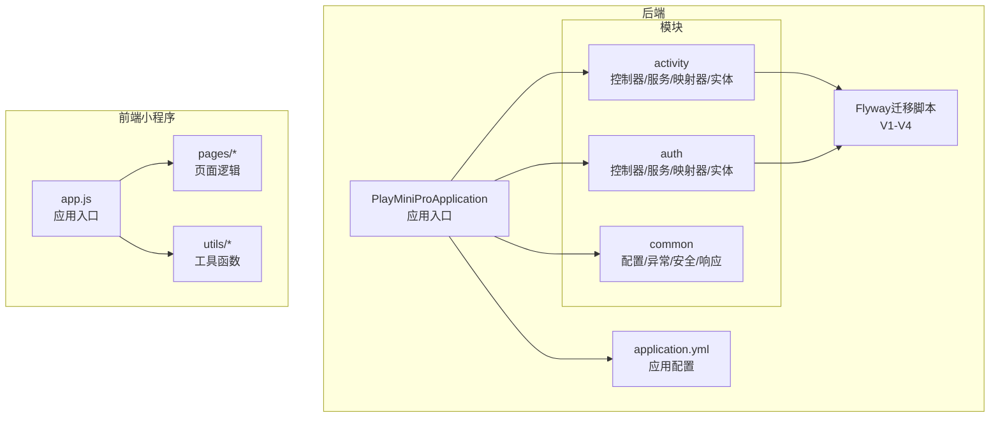
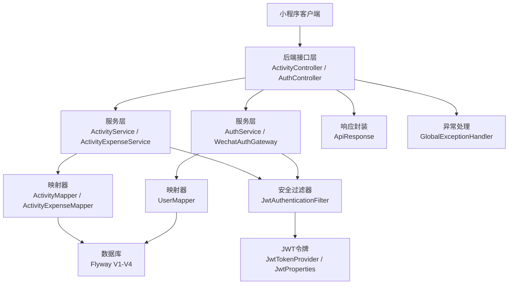
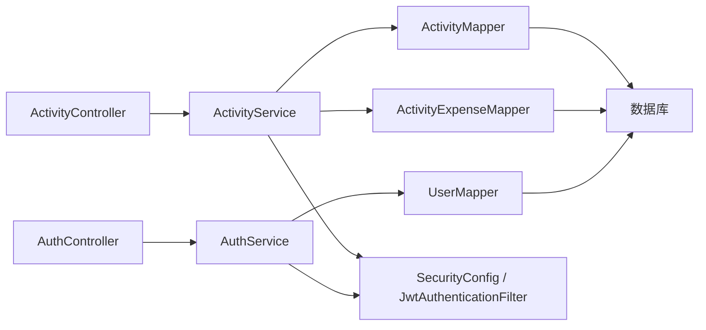

# 测试策略

<cite>
**本文引用的文件**
- [PlayMiniProApplication.java](file://backend/src/main/java/com/playminipro/PlayMiniProApplication.java)
- [ActivityController.java](file://backend/src/main/java/com/playminipro/activity/controller/ActivityController.java)
- [AuthController.java](file://backend/src/main/java/com/playminipro/auth/controller/AuthController.java)
- [ActivityService.java](file://backend/src/main/java/com/playminipro/activity/service/ActivityService.java)
- [ActivityExpenseService.java](file://backend/src/main/java/com/playminipro/activity/service/ActivityExpenseService.java)
- [AuthService.java](file://backend/src/main/java/com/playminipro/auth/service/AuthService.java)
- [WechatAuthGateway.java](file://backend/src/main/java/com/playminipro/auth/service/WechatAuthGateway.java)
- [ActivityMapper.java](file://backend/src/main/java/com/playminipro/activity/mapper/ActivityMapper.java)
- [ActivityExpenseMapper.java](file://backend/src/main/java/com/playminipro/activity/mapper/ActivityExpenseMapper.java)
- [UserMapper.java](file://backend/src/main/java/com/playminipro/auth/mapper/UserMapper.java)
- [ActivityEntity.java](file://backend/src/main/java/com/playminipro/activity/entity/ActivityEntity.java)
- [ActivityExpenseEntity.java](file://backend/src/main/java/com/playminipro/activity/entity/ActivityExpenseEntity.java)
- [UserEntity.java](file://backend/src/main/java/com/playminipro/auth/entity/UserEntity.java)
- [SecurityConfig.java](file://backend/src/main/java/com/playminipro/common/config/SecurityConfig.java)
- [JwtProperties.java](file://backend/src/main/java/com/playminipro/common/config/JwtProperties.java)
- [WechatProperties.java](file://backend/src/main/java/com/playminipro/common/config/WechatProperties.java)
- [GlobalExceptionHandler.java](file://backend/src/main/java/com/playminipro/common/exception/GlobalExceptionHandler.java)
- [BusinessException.java](file://backend/src/main/java/com/playminipro/common/exception/BusinessException.java)
- [ApiResponse.java](file://backend/src/main/java/com/playminipro/common/response/ApiResponse.java)
- [application.yml](file://backend/src/main/resources/application.yml)
- [V1__init_core_tables.sql](file://backend/src/main/resources/db/migration/V1__init_core_tables.sql)
- [V2__add_user_phone_number.sql](file://backend/src/main/resources/db/migration/V2__add_user_phone_number.sql)
- [V3__add_activity_expenses.sql](file://backend/src/main/resources/db/migration/V3__add_activity_expenses.sql)
- [V4__add_activity_notification_events.sql](file://backend/src/main/resources/db/migration/V4__add_activity_notification_events.sql)
- [docker-compose.yml](file://backend/docker-compose.yml)
- [pom.xml](file://backend/pom.xml)
- [app.js](file://frontend/app.js)
- [index.js（活动列表页）](file://frontend/pages/activities/index.js)
- [index.js（创建活动页）](file://frontend/pages/create/index.js)
- [index.js（活动详情页）](file://frontend/pages/detail/index.js)
- [index.js（账单页）](file://frontend/pages/bills/index.js)
- [auth.js](file://frontend/utils/auth.js)
- [request.js](file://frontend/utils/request.js)
- [activity-insights.js](file://frontend/utils/activity-insights.js)
</cite>

## 目录
1. [引言](#引言)
2. [项目结构](#项目结构)
3. [核心组件](#核心组件)
4. [架构总览](#架构总览)
5. [详细组件分析](#详细组件分析)
6. [依赖分析](#依赖分析)
7. [性能考虑](#性能考虑)
8. [故障排查指南](#故障排查指南)
9. [结论](#结论)
10. [附录](#附录)

## 引言
本测试策略面向PlayMiniPro项目，目标是建立覆盖单元测试、集成测试、端到端测试的完整测试体系，确保服务稳定性、数据一致性与用户体验。策略涵盖：
- 单元测试：服务层、工具类、边界与异常场景，基于JUnit与Mockito
- 集成测试：API接口、数据库、第三方服务（微信）
- 端到端测试：小程序核心业务流程
- 测试数据管理：准备、清理、隔离
- 持续集成：自动化执行与报告
- 性能测试：压力、并发、内存泄漏
- 覆盖率与质量标准、缺陷管理流程

## 项目结构
后端采用Spring Boot应用，模块按领域划分（activity、auth），公共模块包含配置、异常处理、安全与响应封装；前端为小程序页面与工具函数。

图表来源
- [PlayMiniProApplication.java:1-50](file://backend/src/main/java/com/playminipro/PlayMiniProApplication.java#L1-L50)
- [application.yml:1-200](file://backend/src/main/resources/application.yml#L1-L200)
- [V1__init_core_tables.sql:1-200](file://backend/src/main/resources/db/migration/V1__init_core_tables.sql#L1-L200)
- [V2__add_user_phone_number.sql:1-200](file://backend/src/main/resources/db/migration/V2__add_user_phone_number.sql#L1-L200)
- [V3__add_activity_expenses.sql:1-200](file://backend/src/main/resources/db/migration/V3__add_activity_expenses.sql#L1-L200)
- [V4__add_activity_notification_events.sql:1-200](file://backend/src/main/resources/db/migration/V4__add_activity_notification_events.sql#L1-L200)
- [app.js:1-200](file://frontend/app.js#L1-L200)

章节来源
- [PlayMiniProApplication.java:1-120](file://backend/src/main/java/com/playminipro/PlayMiniProApplication.java#L1-L120)
- [application.yml:1-200](file://backend/src/main/resources/application.yml#L1-L200)

## 核心组件
- 应用入口与启动：负责加载配置、扫描组件、初始化Web环境
- 控制器层：ActivityController、AuthController对外暴露REST接口
- 服务层：ActivityService、ActivityExpenseService、AuthService、WechatAuthGateway实现业务逻辑
- 映射器与实体：MyBatis Mapper与实体对象，承载数据模型
- 安全与异常：SecurityConfig、JwtProperties、WechatProperties、GlobalExceptionHandler、BusinessException、ApiResponse
- 数据库：Flyway迁移脚本定义核心表结构与演进
- 前端：小程序页面与工具函数，负责请求封装、鉴权与业务交互

章节来源
- [ActivityController.java:1-200](file://backend/src/main/java/com/playminipro/activity/controller/ActivityController.java#L1-L200)
- [AuthController.java:1-200](file://backend/src/main/java/com/playminipro/auth/controller/AuthController.java#L1-L200)
- [ActivityService.java:1-200](file://backend/src/main/java/com/playminipro/activity/service/ActivityService.java#L1-L200)
- [ActivityExpenseService.java:1-200](file://backend/src/main/java/com/playminipro/activity/service/ActivityExpenseService.java#L1-L200)
- [AuthService.java:1-200](file://backend/src/main/java/com/playminipro/auth/service/AuthService.java#L1-L200)
- [WechatAuthGateway.java:1-200](file://backend/src/main/java/com/playminipro/auth/service/WechatAuthGateway.java#L1-L200)
- [ActivityMapper.java:1-200](file://backend/src/main/java/com/playminipro/activity/mapper/ActivityMapper.java#L1-L200)
- [ActivityExpenseMapper.java:1-200](file://backend/src/main/java/com/playminipro/activity/mapper/ActivityExpenseMapper.java#L1-L200)
- [UserMapper.java:1-200](file://backend/src/main/java/com/playminipro/auth/mapper/UserMapper.java#L1-L200)
- [ActivityEntity.java:1-200](file://backend/src/main/java/com/playminipro/activity/entity/ActivityEntity.java#L1-L200)
- [ActivityExpenseEntity.java:1-200](file://backend/src/main/java/com/playminipro/activity/entity/ActivityExpenseEntity.java#L1-L200)
- [UserEntity.java:1-200](file://backend/src/main/java/com/playminipro/auth/entity/UserEntity.java#L1-L200)
- [SecurityConfig.java:1-200](file://backend/src/main/java/com/playminipro/common/config/SecurityConfig.java#L1-L200)
- [JwtProperties.java:1-200](file://backend/src/main/java/com/playminipro/common/config/JwtProperties.java#L1-L200)
- [WechatProperties.java:1-200](file://backend/src/main/java/com/playminipro/common/config/WechatProperties.java#L1-L200)
- [GlobalExceptionHandler.java:1-200](file://backend/src/main/java/com/playminipro/common/exception/GlobalExceptionHandler.java#L1-L200)
- [BusinessException.java:1-200](file://backend/src/main/java/com/playminipro/common/exception/BusinessException.java#L1-L200)
- [ApiResponse.java:1-200](file://backend/src/main/java/com/playminipro/common/response/ApiResponse.java#L1-L200)

## 架构总览
后端通过Spring MVC提供REST接口，安全层使用JWT过滤器与配置，异常统一由全局处理器处理；前端通过工具函数发起HTTP请求，页面逻辑调用后端接口完成业务闭环。

图表来源
- [ActivityController.java:1-200](file://backend/src/main/java/com/playminipro/activity/controller/ActivityController.java#L1-L200)
- [AuthController.java:1-200](file://backend/src/main/java/com/playminipro/auth/controller/AuthController.java#L1-L200)
- [ActivityService.java:1-200](file://backend/src/main/java/com/playminipro/activity/service/ActivityService.java#L1-L200)
- [ActivityExpenseService.java:1-200](file://backend/src/main/java/com/playminipro/activity/service/ActivityExpenseService.java#L1-L200)
- [AuthService.java:1-200](file://backend/src/main/java/com/playminipro/auth/service/AuthService.java#L1-L200)
- [WechatAuthGateway.java:1-200](file://backend/src/main/java/com/playminipro/auth/service/WechatAuthGateway.java#L1-L200)
- [ActivityMapper.java:1-200](file://backend/src/main/java/com/playminipro/activity/mapper/ActivityMapper.java#L1-L200)
- [ActivityExpenseMapper.java:1-200](file://backend/src/main/java/com/playminipro/activity/mapper/ActivityExpenseMapper.java#L1-L200)
- [UserMapper.java:1-200](file://backend/src/main/java/com/playminipro/auth/mapper/UserMapper.java#L1-L200)
- [SecurityConfig.java:1-200](file://backend/src/main/java/com/playminipro/common/config/SecurityConfig.java#L1-L200)
- [JwtProperties.java:1-200](file://backend/src/main/java/com/playminipro/common/config/JwtProperties.java#L1-L200)
- [ApiResponse.java:1-200](file://backend/src/main/java/com/playminipro/common/response/ApiResponse.java#L1-L200)
- [GlobalExceptionHandler.java:1-200](file://backend/src/main/java/com/playminipro/common/exception/GlobalExceptionHandler.java#L1-L200)

## 详细组件分析

### 单元测试策略
- 测试框架：JUnit 5 + Mockito
- 覆盖范围：
  - 服务层：ActivityService、ActivityExpenseService、AuthService、WechatAuthGateway
  - 工具类：请求封装、鉴权工具等（如request.js、auth.js）
  - 边界与异常：空输入、超长参数、负数金额、非法状态、业务规则触发
- 关键测试点：
  - 服务方法的输入校验、业务规则、事务边界
  - Mapper与实体的映射关系、查询条件构造
  - 安全过滤器对JWT的解析与放行逻辑
  - 全局异常处理器对业务异常与系统异常的分类处理
- Mock策略：
  - 使用Mockito对Mapper、外部网关（微信）、线程池进行Mock
  - 对异常分支进行抛出模拟，验证错误码与消息封装

章节来源
- [ActivityService.java:1-200](file://backend/src/main/java/com/playminipro/activity/service/ActivityService.java#L1-L200)
- [ActivityExpenseService.java:1-200](file://backend/src/main/java/com/playminipro/activity/service/ActivityExpenseService.java#L1-L200)
- [AuthService.java:1-200](file://backend/src/main/java/com/playminipro/auth/service/AuthService.java#L1-L200)
- [WechatAuthGateway.java:1-200](file://backend/src/main/java/com/playminipro/auth/service/WechatAuthGateway.java#L1-L200)
- [ActivityMapper.java:1-200](file://backend/src/main/java/com/playminipro/activity/mapper/ActivityMapper.java#L1-L200)
- [ActivityExpenseMapper.java:1-200](file://backend/src/main/java/com/playminipro/activity/mapper/ActivityExpenseMapper.java#L1-L200)
- [UserMapper.java:1-200](file://backend/src/main/java/com/playminipro/auth/mapper/UserMapper.java#L1-L200)
- [SecurityConfig.java:1-200](file://backend/src/main/java/com/playminipro/common/config/SecurityConfig.java#L1-L200)
- [JwtProperties.java:1-200](file://backend/src/main/java/com/playminipro/common/config/JwtProperties.java#L1-L200)
- [GlobalExceptionHandler.java:1-200](file://backend/src/main/java/com/playminipro/common/exception/GlobalExceptionHandler.java#L1-L200)
- [BusinessException.java:1-200](file://backend/src/main/java/com/playminipro/common/exception/BusinessException.java#L1-L200)
- [ApiResponse.java:1-200](file://backend/src/main/java/com/playminipro/common/response/ApiResponse.java#L1-L200)

### 集成测试方案
- 接口测试：
  - 使用REST Assured或SpringBootTest启动完整上下文，验证ActivityController与AuthController的端点
  - 覆盖成功路径、鉴权失败、参数校验失败、业务异常等场景
- 数据库集成：
  - 使用Testcontainers或嵌入式数据库（H2/PostgreSQL镜像）在测试中拉起实例
  - 基于Flyway在测试前迁移V1-V4，断言数据一致性与约束
- 第三方服务集成：
  - 微信登录：Mock WechatAuthGateway返回值，或使用WireMock模拟微信接口
  - 验证授权码换取会话、手机号解密、登录态维护

章节来源
- [ActivityController.java:1-200](file://backend/src/main/java/com/playminipro/activity/controller/ActivityController.java#L1-L200)
- [AuthController.java:1-200](file://backend/src/main/java/com/playminipro/auth/controller/AuthController.java#L1-L200)
- [WechatAuthGateway.java:1-200](file://backend/src/main/java/com/playminipro/auth/service/WechatAuthGateway.java#L1-L200)
- [V1__init_core_tables.sql:1-200](file://backend/src/main/resources/db/migration/V1__init_core_tables.sql#L1-L200)
- [V2__add_user_phone_number.sql:1-200](file://backend/src/main/resources/db/migration/V2__add_user_phone_number.sql#L1-L200)
- [V3__add_activity_expenses.sql:1-200](file://backend/src/main/resources/db/migration/V3__add_activity_expenses.sql#L1-L200)
- [V4__add_activity_notification_events.sql:1-200](file://backend/src/main/resources/db/migration/V4__add_activity_notification_events.sql#L1-L200)

### 端到端测试流程
- 小程序测试框架：使用开发者工具内置测试能力或小程序云测平台
- 核心业务流程：
  - 用户登录（微信授权）→ 创建活动 → 发布活动 → 成员加入 → 记录支出 → 查看账单 → 结算与归档
- 断言点：
  - 页面元素渲染、路由跳转、网络请求返回码与数据结构
  - 登录态持久化、本地存储更新、错误提示展示
- 自动化步骤：
  - 初始化测试账号、预置数据、录制交互序列、回放并断言

章节来源
- [app.js:1-200](file://frontend/app.js#L1-L200)
- [index.js（活动列表页）:1-200](file://frontend/pages/activities/index.js#L1-L200)
- [index.js（创建活动页）:1-200](file://frontend/pages/create/index.js#L1-L200)
- [index.js（活动详情页）:1-200](file://frontend/pages/detail/index.js#L1-L200)
- [index.js（账单页）:1-200](file://frontend/pages/bills/index.js#L1-L200)
- [auth.js:1-200](file://frontend/utils/auth.js#L1-L200)
- [request.js:1-200](file://frontend/utils/request.js#L1-L200)

### 测试数据管理策略
- 准备：
  - 使用Flyway SQL脚本初始化基础数据与约束
  - 在测试前插入必要种子数据（用户、活动、成员、支出）
- 清理：
  - 测试后回滚或删除新增记录，避免跨用例污染
- 隔离：
  - 为每个测试用例分配独立Schema或临时表空间（若数据库支持）
  - 使用随机化字段（如用户名后缀、活动标题后缀）降低冲突概率

章节来源
- [V1__init_core_tables.sql:1-200](file://backend/src/main/resources/db/migration/V1__init_core_tables.sql#L1-L200)
- [V2__add_user_phone_number.sql:1-200](file://backend/src/main/resources/db/migration/V2__add_user_phone_number.sql#L1-L200)
- [V3__add_activity_expenses.sql:1-200](file://backend/src/main/resources/db/migration/V3__add_activity_expenses.sql#L1-L200)
- [V4__add_activity_notification_events.sql:1-200](file://backend/src/main/resources/db/migration/V4__add_activity_notification_events.sql#L1-L200)

### 持续集成测试流程
- CI流水线：
  - 代码提交触发构建，运行单元测试与集成测试
  - 启动数据库容器与后端服务，执行端到端测试
  - 生成测试报告（JUnit XML、HTML报告），上传Artifacts
- 自动化执行：
  - Maven Surefire/Failsafe插件执行测试
  - Docker Compose拉起后端与数据库，等待健康检查
- 报告与门禁：
  - 覆盖率阈值（语句/分支）作为质量门禁
  - 失败用例自动标注与通知

章节来源
- [pom.xml:1-400](file://backend/pom.xml#L1-L400)
- [docker-compose.yml:1-200](file://backend/docker-compose.yml#L1-L200)

### 性能测试指南
- 压力测试：
  - 使用JMeter或Gatling对关键接口（创建活动、加入活动、记账、结算）施压
  - 关注P95/P99延迟、错误率、吞吐量
- 并发测试：
  - 模拟多用户同时记账、同时发起微信登录，观察锁竞争与死锁风险
- 内存泄漏检测：
  - 使用JProfiler或VisualVM监控GC曲线、堆栈增长
  - 关注长时间运行任务（定时取消活动）的资源释放
- 数据库性能：
  - 分析慢查询日志，优化Mapper查询与索引

章节来源
- [ActivityController.java:1-200](file://backend/src/main/java/com/playminipro/activity/controller/ActivityController.java#L1-L200)
- [AuthController.java:1-200](file://backend/src/main/java/com/playminipro/auth/controller/AuthController.java#L1-L200)
- [ActivityMapper.java:1-200](file://backend/src/main/java/com/playminipro/activity/mapper/ActivityMapper.java#L1-L200)
- [ActivityExpenseMapper.java:1-200](file://backend/src/main/java/com/playminipro/activity/mapper/ActivityExpenseMapper.java#L1-L200)
- [UserMapper.java:1-200](file://backend/src/main/java/com/playminipro/auth/mapper/UserMapper.java#L1-L200)

### 测试覆盖率与质量标准
- 覆盖率要求：
  - 服务层：语句覆盖率≥80%，分支覆盖率≥70%
  - 映射器：行覆盖率≥70%
  - 安全与异常：100%路径覆盖（含异常分支）
- 质量标准：
  - 缺陷严重等级与修复时限明确（阻塞性问题当日修复）
  - 每次迭代至少一次回归测试
- 缺陷管理：
  - 使用缺陷跟踪系统记录，关联测试用例与失败日志
  - 每个缺陷需提供最小可复现步骤与期望结果

## 依赖分析
后端模块间依赖清晰，控制器依赖服务层，服务层依赖映射器与外部网关，安全配置贯穿请求链路；前端通过工具函数与后端交互。

图表来源
- [ActivityController.java:1-200](file://backend/src/main/java/com/playminipro/activity/controller/ActivityController.java#L1-L200)
- [AuthController.java:1-200](file://backend/src/main/java/com/playminipro/auth/controller/AuthController.java#L1-L200)
- [ActivityService.java:1-200](file://backend/src/main/java/com/playminipro/activity/service/ActivityService.java#L1-L200)
- [AuthService.java:1-200](file://backend/src/main/java/com/playminipro/auth/service/AuthService.java#L1-L200)
- [ActivityMapper.java:1-200](file://backend/src/main/java/com/playminipro/activity/mapper/ActivityMapper.java#L1-L200)
- [ActivityExpenseMapper.java:1-200](file://backend/src/main/java/com/playminipro/activity/mapper/ActivityExpenseMapper.java#L1-L200)
- [UserMapper.java:1-200](file://backend/src/main/java/com/playminipro/auth/mapper/UserMapper.java#L1-L200)
- [SecurityConfig.java:1-200](file://backend/src/main/java/com/playminipro/common/config/SecurityConfig.java#L1-L200)

章节来源
- [ActivityController.java:1-200](file://backend/src/main/java/com/playminipro/activity/controller/ActivityController.java#L1-L200)
- [AuthController.java:1-200](file://backend/src/main/java/com/playminipro/auth/controller/AuthController.java#L1-L200)
- [ActivityService.java:1-200](file://backend/src/main/java/com/playminipro/activity/service/ActivityService.java#L1-L200)
- [AuthService.java:1-200](file://backend/src/main/java/com/playminipro/auth/service/AuthService.java#L1-L200)
- [ActivityMapper.java:1-200](file://backend/src/main/java/com/playminipro/activity/mapper/ActivityMapper.java#L1-L200)
- [ActivityExpenseMapper.java:1-200](file://backend/src/main/java/com/playminipro/activity/mapper/ActivityExpenseMapper.java#L1-L200)
- [UserMapper.java:1-200](file://backend/src/main/java/com/playminipro/auth/mapper/UserMapper.java#L1-L200)
- [SecurityConfig.java:1-200](file://backend/src/main/java/com/playminipro/common/config/SecurityConfig.java#L1-L200)

## 性能考虑
- 接口层：控制请求体大小与分页参数，避免一次性传输大量数据
- 服务层：批量操作Mapper，减少数据库往返；对热点数据引入缓存（需评估一致性）
- 安全层：JWT令牌签发与校验应避免高并发下的CPU瓶颈
- 数据库：为高频查询字段建立索引，定期分析慢查询

## 故障排查指南
- 常见问题定位：
  - 接口报错：查看GlobalExceptionHandler是否捕获并封装异常，确认BusinessException类型与消息
  - 鉴权失败：检查JwtAuthenticationFilter是否正确解析Header中的Authorization，核对JwtProperties配置
  - 数据不一致：核对Flyway版本与SQL脚本，确认测试数据迁移顺序
- 日志与监控：
  - 开启DEBUG级别日志辅助定位
  - 使用APM工具追踪慢请求与异常堆栈

章节来源
- [GlobalExceptionHandler.java:1-200](file://backend/src/main/java/com/playminipro/common/exception/GlobalExceptionHandler.java#L1-L200)
- [BusinessException.java:1-200](file://backend/src/main/java/com/playminipro/common/exception/BusinessException.java#L1-L200)
- [JwtProperties.java:1-200](file://backend/src/main/java/com/playminipro/common/config/JwtProperties.java#L1-L200)
- [SecurityConfig.java:1-200](file://backend/src/main/java/com/playminipro/common/config/SecurityConfig.java#L1-L200)

## 结论
通过分层测试策略与自动化流水线，PlayMiniPro可在开发早期发现缺陷、保障数据一致性与用户体验。建议优先完善单元与集成测试，逐步扩展端到端测试覆盖面，并持续优化性能与稳定性。

## 附录
- 测试用例模板与最佳实践可参考各模块控制器与服务的职责边界，围绕“输入-处理-输出-异常”四要素设计用例
- 持续集成建议使用GitHub Actions或Jenkins，结合Docker Compose与数据库容器，确保环境一致性