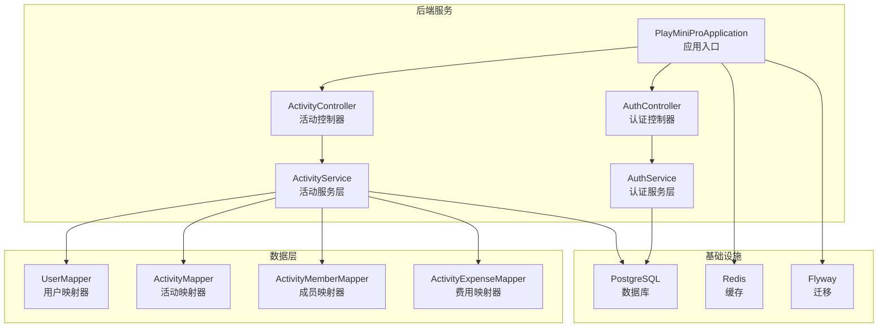
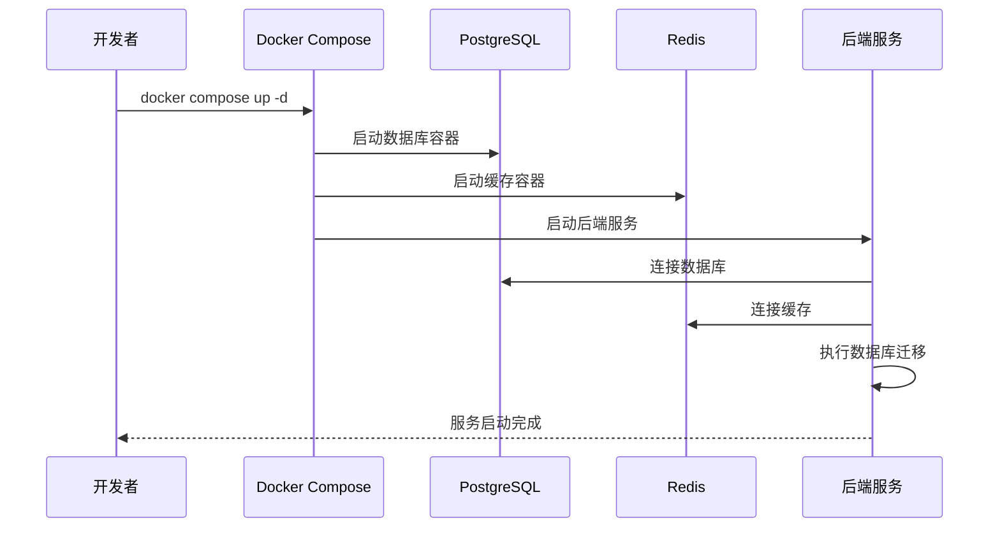
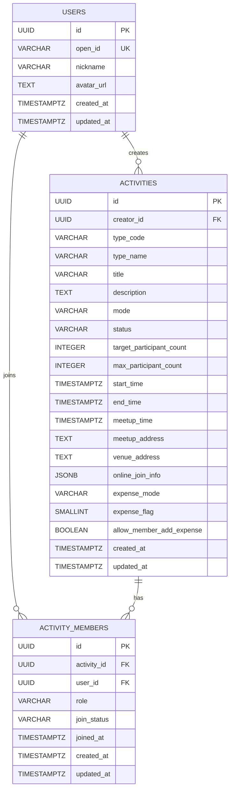
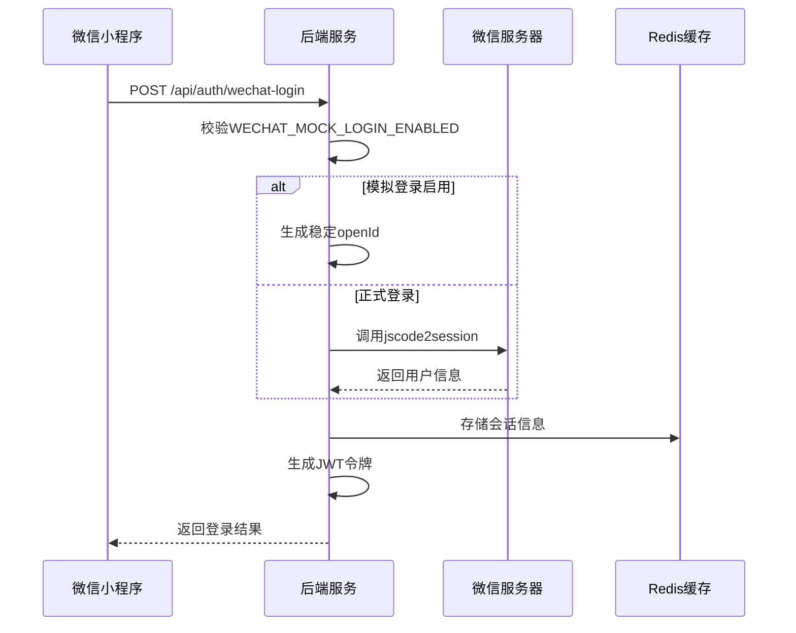

# 快速开始

<cite>
**本文引用的文件**
- [后端说明](file://backend/README.md)
- [后端POM配置](file://backend/pom.xml)
- [后端应用配置](file://backend/src/main/resources/application.yml)
- [后端Docker编排](file://backend/docker-compose.yml)
- [生产Docker编排](file://deploy/docker-compose.prod.yml)
- [后端Dockerfile](file://backend/Dockerfile)
- [本地密钥样例](file://deploy_bundle/backend/local-secrets.yml)
- [前端说明](file://frontend/README.md)
- [前端项目配置](file://frontend/project.config.json)
- [V1 初始化表结构SQL](file://backend/src/main/resources/db/migration/V1__init_core_tables.sql)
- [V2 用户手机号SQL](file://backend/src/main/resources/db/migration/V2__add_user_phone_number.sql)
- [JWT属性配置类](file://backend/src/main/java/com/playminipro/common/config/JwtProperties.java)
- [微信属性配置类](file://backend/src/main/java/com/playminipro/common/config/WechatProperties.java)
- [应用入口类](file://backend/src/main/java/com/playminipro/PlayMiniProApplication.java)
- [生产部署说明](file://deploy/README.md)
- [部署包生产部署说明](file://deploy_bundle/deploy/README.md)
- [根.gitignore](file://.gitignore)
</cite>

## 目录
1. [简介](#简介)
2. [项目结构](#项目结构)
3. [环境准备](#环境准备)
4. [开发工具设置](#开发工具设置)
5. [项目启动流程](#项目启动流程)
6. [环境变量配置](#环境变量配置)
7. [数据库初始化](#数据库初始化)
8. [本地联调指南](#本地联调指南)
9. [常见问题排查](#常见问题排查)
10. [性能与最佳实践](#性能与最佳实践)
11. [结论](#结论)

## 简介
PlayMiniPro是一个基于Java 21 + Spring Boot 3的微信小程序后端项目，采用PostgreSQL + Redis作为数据存储，使用MyBatis进行数据访问，Flyway进行数据库版本管理。项目提供最小可联调能力，包括微信登录、活动管理、账单管理等核心功能。

## 项目结构
项目采用前后端分离架构，主要包含以下模块：



**图表来源**
- [应用入口类:11-20](file://backend/src/main/java/com/playminipro/PlayMiniProApplication.java#L11-L20)
- [后端应用配置:1-53](file://backend/src/main/resources/application.yml#L1-L53)

**章节来源**
- [后端说明:1-11](file://backend/README.md#L1-L11)
- [后端POM配置:1-102](file://backend/pom.xml#L1-L102)

## 环境准备

### Java环境要求
- **版本要求**: Java 21+
- **验证命令**: `java -version`
- **推荐IDE**: IntelliJ IDEA或Eclipse

### Node.js环境（用于前端）
- **用途**: 微信开发者工具本地编译
- **验证命令**: `node --version`
- **安装方式**: 官方下载安装包

### 数据库环境
- **PostgreSQL**: 版本16，端口5433
- **Redis**: 版本7，端口6379
- **Docker方式**: 推荐使用Docker Compose一键启动

### 开发工具
- **后端**: IntelliJ IDEA Ultimate或Community Edition
- **前端**: 微信开发者工具
- **数据库**: DBeaver或pgAdmin

**章节来源**
- [后端POM配置:20-24](file://backend/pom.xml#L20-L24)
- [后端Docker编排:1-36](file://backend/docker-compose.yml#L1-L36)

## 开发工具设置

### IntelliJ IDEA配置
1. **导入项目**: File → Open → 选择backend目录
2. **SDK设置**: File → Project Structure → Project Settings → Project SDK
3. **Maven设置**: Build Tools → Maven → 勾选Import Maven projects automatically
4. **插件安装**: 
   - Lombok
   - MyBatis Log Plugin
   - Rainbow Brackets

### 微信开发者工具配置
1. **打开项目**: 选择frontend目录
2. **项目设置**: 
   - AppID: wxb8fd5841e5f0a83d
   - 编译类型: 小程序
3. **本地编译**: Shift+F12

**章节来源**
- [前端项目配置:23-24](file://frontend/project.config.json#L23-L24)
- [前端说明:11-16](file://frontend/README.md#L11-L16)

## 项目启动流程

### 方式一：Docker Compose一键启动（推荐）



**图表来源**
- [后端Docker编排:1-36](file://backend/docker-compose.yml#L1-L36)
- [后端应用配置:10-18](file://backend/src/main/resources/application.yml#L10-L18)

### 方式二：本地环境启动

#### 启动数据库服务
```bash
# 启动PostgreSQL和Redis
docker compose up -d

# 验证服务状态
docker compose ps
```

#### 启动后端服务
```bash
# 进入后端目录
cd backend

# 启动Spring Boot应用
mvn spring-boot:run
```

#### 启动前端服务
```bash
# 在微信开发者工具中打开frontend目录
# 或使用命令行编译
npm run build  # 如果有构建脚本
```

**章节来源**
- [后端说明:21-33](file://backend/README.md#L21-L33)
- [后端Docker编排:1-36](file://backend/docker-compose.yml#L1-L36)

## 环境变量配置

### 开发环境变量
| 变量名 | 默认值 | 说明 |
|--------|--------|------|
| DB_URL | jdbc:postgresql://localhost:5433/play_minipro | 数据库连接URL |
| DB_USERNAME | play | 数据库用户名 |
| DB_PASSWORD | play1234 | 数据库密码 |
| JWT_SECRET | play-minipro-dev-secret-play-minipro-dev-secret-2026 | JWT密钥 |
| REDIS_HOST | localhost | Redis主机地址 |
| REDIS_PORT | 6379 | Redis端口号 |
| REDIS_PASSWORD | 空 | Redis密码 |
| WECHAT_MINI_APP_ID | wxb8fd5841e5f0a83d | 微信小程序AppID |
| WECHAT_MINI_APP_SECRET | 空 | 微信小程序AppSecret |
| WECHAT_MOCK_LOGIN_ENABLED | true | 是否启用模拟登录 |

### 生产环境变量
生产环境通过.env文件进行配置，需要替换为真实密钥：

```bash
# 数据库配置
POSTGRES_DB=play_minipro
POSTGRES_USER=your_username
POSTGRES_PASSWORD=your_password

# 应用配置
JWT_SECRET=your_jwt_secret_key
WECHAT_MINI_APP_ID=your_app_id
WECHAT_MINI_APP_SECRET=your_app_secret
WECHAT_MOCK_LOGIN_ENABLED=false
```

**章节来源**
- [后端应用配置:10-49](file://backend/src/main/resources/application.yml#L10-L49)
- [生产Docker编排:43-54](file://deploy/docker-compose.prod.yml#L43-L54)

## 数据库初始化

### 数据库表结构
项目使用Flyway进行数据库版本管理，包含以下核心表：



**图表来源**
- [V1 初始化表结构SQL:3-57](file://backend/src/main/resources/db/migration/V1__init_core_tables.sql#L3-L57)

### 数据库迁移脚本
项目包含4个迁移脚本，按顺序执行：

1. **V1__init_core_tables.sql**: 初始化核心表结构
2. **V2__add_user_phone_number.sql**: 添加用户手机号字段
3. **V3__add_activity_expenses.sql**: 添加活动费用相关表
4. **V4__add_activity_notification_events.sql**: 添加活动通知事件表

**章节来源**
- [V1 初始化表结构SQL:1-58](file://backend/src/main/resources/db/migration/V1__init_core_tables.sql#L1-L58)
- [V2 用户手机号SQL:1-2](file://backend/src/main/resources/db/migration/V2__add_user_phone_number.sql#L1-L2)

## 本地联调指南

### 微信登录流程


**图表来源**
- [后端说明:53-79](file://backend/README.md#L53-L79)

### 接口鉴权
除登录和健康检查外，所有接口都需要携带Authorization头：

```
Authorization: Bearer <token>
```

### 创建活动接口
支持按文档中的创建活动请求体进行联调，后端已接收核心字段并入库。

**章节来源**
- [后端说明:53-91](file://backend/README.md#L53-L91)

## 常见问题排查

### 数据库连接问题
**症状**: 启动时出现数据库连接失败
**解决方法**:
1. 检查PostgreSQL容器状态
```bash
docker compose ps | grep postgres
```
2. 验证数据库端口占用
```bash
netstat -an | grep 5433
```
3. 检查数据库凭据配置
```yaml
# application.yml中的数据库配置
datasource:
  url: ${DB_URL:jdbc:postgresql://localhost:5433/play_minipro}
  username: ${DB_USERNAME:play}
  password: ${DB_PASSWORD:play1234}
```

### Redis连接问题
**症状**: JWT校验失败或会话异常
**解决方法**:
1. 检查Redis容器状态
```bash
docker compose ps | grep redis
```
2. 验证Redis连接配置
```yaml
# application.yml中的Redis配置
data:
  redis:
    host: ${REDIS_HOST:localhost}
    port: ${REDIS_PORT:6379}
    password: ${REDIS_PASSWORD:}
```

### 端口冲突问题
**症状**: 服务启动失败，提示端口被占用
**解决方法**:
1. 查找占用端口的进程
```bash
# Windows
netstat -ano | findstr :8080
# Linux/Mac
lsof -i :8080
```
2. 修改application.yml中的端口配置
```yaml
server:
  port: 8081  # 修改为其他端口
```

### JWT密钥问题
**症状**: 登录后无法访问受保护接口
**解决方法**:
1. 检查JWT密钥配置
```yaml
app:
  jwt:
    secret: ${JWT_SECRET:play-minipro-dev-secret-play-minipro-dev-secret-2026}
    expire-seconds: ${JWT_EXPIRE_SECONDS:604800}
```
2. 确保前后端使用相同的JWT密钥

### 微信登录问题
**症状**: 微信登录失败或返回错误
**解决方法**:
1. 检查微信小程序配置
```yaml
app:
  wechat:
    app-id: ${WECHAT_MINI_APP_ID:wxb8fd5841e5f0a83d}
    app-secret: ${WECHAT_MINI_APP_SECRET:}
    mock-login-enabled: ${WECHAT_MOCK_LOGIN_ENABLED:true}
```
2. 配置真实的微信AppSecret和AppID
3. 设置环境变量WECHAT_MINI_APP_SECRET

**章节来源**
- [后端应用配置:10-49](file://backend/src/main/resources/application.yml#L10-L49)
- [后端说明:43-79](file://backend/README.md#L43-L79)

## 性能与最佳实践

### 开发环境优化
1. **数据库性能**: 使用Flyway进行版本管理，避免手动修改表结构
2. **缓存策略**: Redis用于会话存储，建议合理设置过期时间
3. **日志配置**: 开发环境下使用info级别日志，便于调试

### 生产环境部署
1. **容器化部署**: 使用Docker Compose进行服务编排
2. **环境隔离**: 开发、测试、生产环境使用不同的配置文件
3. **安全配置**: 生产环境必须设置强密码和密钥

### 监控与维护
1. **健康检查**: 通过/actuator/health监控服务状态
2. **数据库备份**: 定期备份PostgreSQL数据
3. **日志轮转**: 配置日志文件轮转，避免磁盘空间不足

**章节来源**
- [后端说明:19-20](file://backend/README.md#L19-L20)
- [生产Docker编排:1-61](file://deploy/docker-compose.prod.yml#L1-L61)

## 结论
通过以上步骤，您应该能够在30分钟内成功运行PlayMiniPro项目。建议按照以下顺序进行：

1. **环境准备**: 安装Java 21+、Node.js、Docker
2. **项目启动**: 使用Docker Compose一键启动所有服务
3. **数据库初始化**: 确认Flyway迁移执行成功
4. **本地联调**: 测试微信登录和核心接口
5. **问题排查**: 根据常见问题排查指南解决遇到的问题

如果在启动过程中遇到任何问题，请参考"常见问题排查"章节或查看相应的源码文件获取更详细的配置信息。