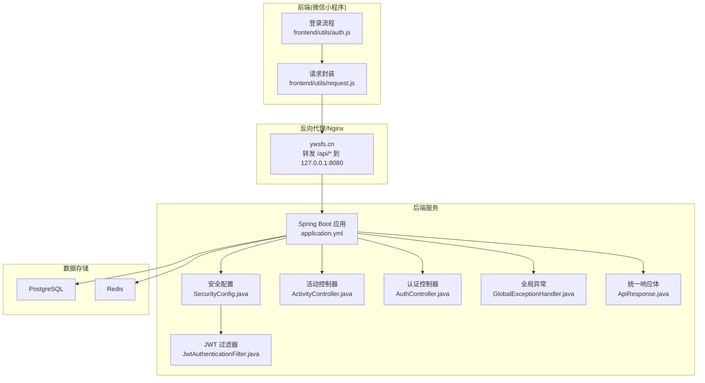
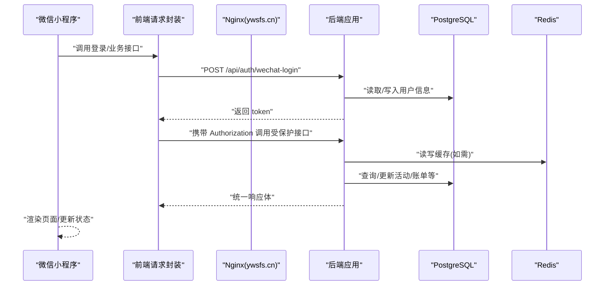
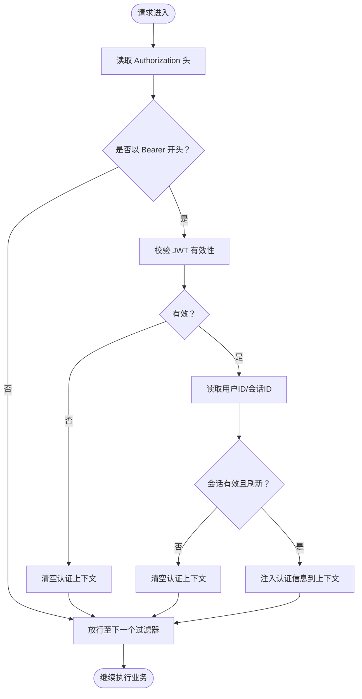
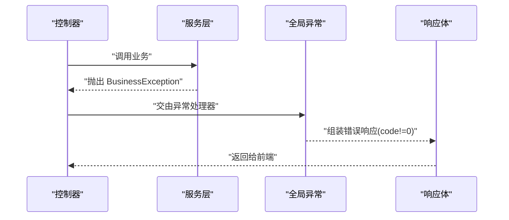
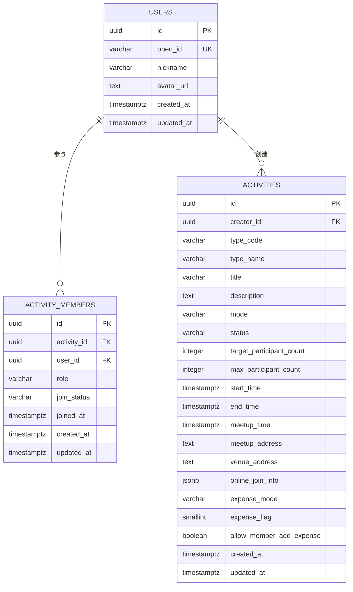
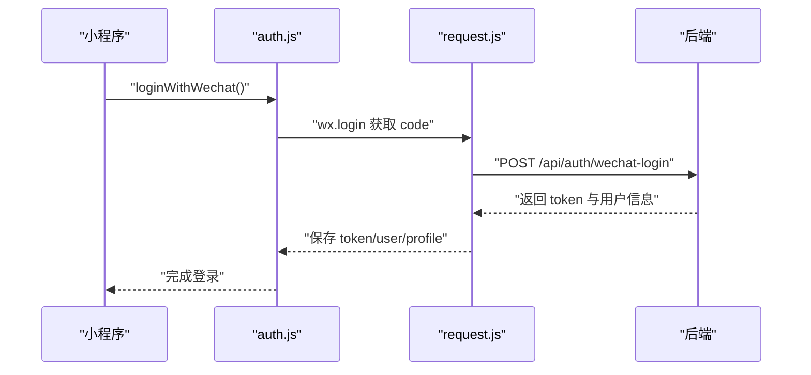
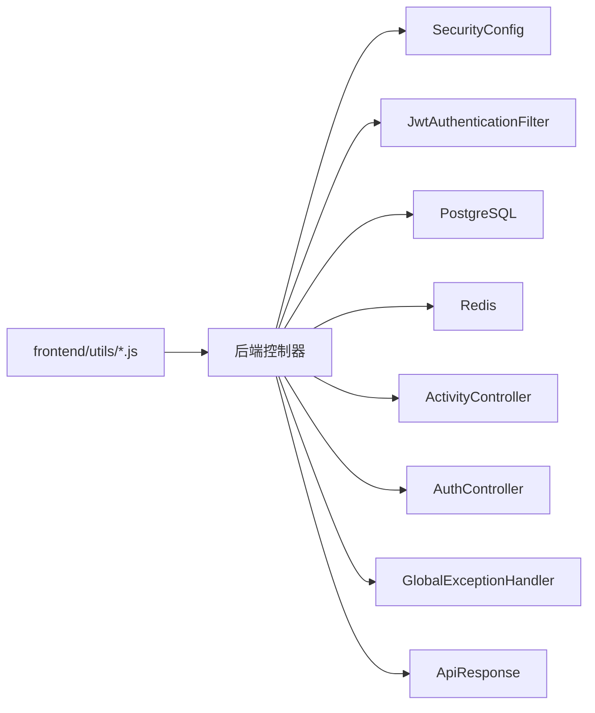

# 故障排除

<cite>
**本文引用的文件**
- [application.yml](file://backend/src/main/resources/application.yml)
- [docker-compose.yml](file://backend/docker-compose.yml)
- [docker-compose.prod.yml](file://deploy/docker-compose.prod.yml)
- [V1__init_core_tables.sql](file://backend/src/main/resources/db/migration/V1__init_core_tables.sql)
- [SecurityConfig.java](file://backend/src/main/java/com/playminipro/common/config/SecurityConfig.java)
- [JwtAuthenticationFilter.java](file://backend/src/main/java/com/playminipro/common/security/JwtAuthenticationFilter.java)
- [GlobalExceptionHandler.java](file://backend/src/main/java/com/playminipro/common/exception/GlobalExceptionHandler.java)
- [ApiResponse.java](file://backend/src/main/java/com/playminipro/common/response/ApiResponse.java)
- [AuthController.java](file://backend/src/main/java/com/playminipro/auth/controller/AuthController.java)
- [ActivityController.java](file://backend/src/main/java/com/playminipro/activity/controller/ActivityController.java)
- [request.js](file://frontend/utils/request.js)
- [auth.js](file://frontend/utils/auth.js)
- [08-部署发布指南.md](file://doc/08-部署发布指南.md)
</cite>

## 目录
1. [简介](#简介)
2. [项目结构](#项目结构)
3. [核心组件](#核心组件)
4. [架构总览](#架构总览)
5. [详细组件分析](#详细组件分析)
6. [依赖分析](#依赖分析)
7. [性能考虑](#性能考虑)
8. [故障排除指南](#故障排除指南)
9. [结论](#结论)
10. [附录](#附录)

## 简介
本指南面向开发者与运维人员，系统化梳理 PlayMiniPro 在开发与生产环境中的常见问题与排障路径，覆盖环境配置、数据库连接、API 调用异常、前端页面加载失败、网络跨域与 HTTPS、性能瓶颈（慢查询、内存、并发）、应急响应与升级机制、以及预防性维护与监控告警配置。所有建议均基于仓库现有实现与配置文件。

## 项目结构
后端采用 Spring Boot + MyBatis，使用 PostgreSQL 与 Redis；前端为微信小程序，通过统一请求封装访问后端 API；部署通过 Docker Compose 管理服务编排。

图表来源
- [application.yml:1-53](file://backend/src/main/resources/application.yml#L1-L53)
- [docker-compose.yml:1-36](file://backend/docker-compose.yml#L1-L36)
- [docker-compose.prod.yml:1-61](file://deploy/docker-compose.prod.yml#L1-L61)
- [SecurityConfig.java:1-55](file://backend/src/main/java/com/playminipro/common/config/SecurityConfig.java#L1-L55)
- [JwtAuthenticationFilter.java:1-56](file://backend/src/main/java/com/playminipro/common/security/JwtAuthenticationFilter.java#L1-L56)
- [ActivityController.java:1-112](file://backend/src/main/java/com/playminipro/activity/controller/ActivityController.java#L1-L112)
- [AuthController.java:1-27](file://backend/src/main/java/com/playminipro/auth/controller/AuthController.java#L1-L27)
- [GlobalExceptionHandler.java:1-41](file://backend/src/main/java/com/playminipro/common/exception/GlobalExceptionHandler.java#L1-L41)
- [ApiResponse.java:1-51](file://backend/src/main/java/com/playminipro/common/response/ApiResponse.java#L1-L51)
- [request.js:1-107](file://frontend/utils/request.js#L1-L107)
- [auth.js:1-56](file://frontend/utils/auth.js#L1-L56)

章节来源
- [application.yml:1-53](file://backend/src/main/resources/application.yml#L1-L53)
- [docker-compose.yml:1-36](file://backend/docker-compose.yml#L1-L36)
- [docker-compose.prod.yml:1-61](file://deploy/docker-compose.prod.yml#L1-L61)

## 核心组件
- 统一响应体：后端所有接口返回统一结构，便于前端解析与错误处理。
- 全局异常处理器：集中捕获业务异常、参数校验异常与未预期异常，返回标准化错误码与消息。
- 安全与跨域：禁用 CSRF，启用无状态会话，开放 CORS 允许任意来源与方法。
- JWT 认证过滤：从请求头提取 Bearer Token，校验并注入认证上下文。
- 数据源与缓存：PostgreSQL 与 Redis，Flyway 自动迁移。
- 前端请求封装：支持切换环境、自动附加 Authorization 头、统一错误处理与过期清理。

章节来源
- [ApiResponse.java:1-51](file://backend/src/main/java/com/playminipro/common/response/ApiResponse.java#L1-L51)
- [GlobalExceptionHandler.java:1-41](file://backend/src/main/java/com/playminipro/common/exception/GlobalExceptionHandler.java#L1-L41)
- [SecurityConfig.java:1-55](file://backend/src/main/java/com/playminipro/common/config/SecurityConfig.java#L1-L55)
- [JwtAuthenticationFilter.java:1-56](file://backend/src/main/java/com/playminipro/common/security/JwtAuthenticationFilter.java#L1-L56)
- [application.yml:1-53](file://backend/src/main/resources/application.yml#L1-L53)
- [request.js:1-107](file://frontend/utils/request.js#L1-L107)

## 架构总览
后端通过 Actuator 暴露健康检查，Nginx 将 /api 与 /actuator 请求转发至后端容器。前端通过微信登录获取 code，调用后端换取 token 并发起受保护接口。

图表来源
- [08-部署发布指南.md:1-324](file://doc/08-部署发布指南.md#L1-L324)
- [AuthController.java:1-27](file://backend/src/main/java/com/playminipro/auth/controller/AuthController.java#L1-L27)
- [ActivityController.java:1-112](file://backend/src/main/java/com/playminipro/activity/controller/ActivityController.java#L1-L112)
- [request.js:1-107](file://frontend/utils/request.js#L1-L107)

## 详细组件分析

### 安全与认证组件
- 安全策略：禁用 CSRF、表单与 HTTP Basic 登录，无状态会话；公开 /actuator/health 与 /error，放行 /api/auth/**。
- CORS：允许任意来源、头与方法，凭证关闭。
- JWT 过滤：从 Authorization 头提取 Bearer Token，校验后注入认证上下文；异常或会话失效时清空上下文并放行。

图表来源
- [SecurityConfig.java:1-55](file://backend/src/main/java/com/playminipro/common/config/SecurityConfig.java#L1-L55)
- [JwtAuthenticationFilter.java:1-56](file://backend/src/main/java/com/playminipro/common/security/JwtAuthenticationFilter.java#L1-L56)

章节来源
- [SecurityConfig.java:1-55](file://backend/src/main/java/com/playminipro/common/config/SecurityConfig.java#L1-L55)
- [JwtAuthenticationFilter.java:1-56](file://backend/src/main/java/com/playminipro/common/security/JwtAuthenticationFilter.java#L1-L56)

### 异常处理与统一响应
- 统一响应体：code=0 表示成功，非 0 为错误；data 为业务数据。
- 全局异常：业务异常返回 4000 与具体错误码；参数校验失败映射为 4000；其他异常返回 5000。
- 前端错误处理：当后端返回非 2xx 或 code 非 0 时，构造错误对象；若 401/403 清除本地认证状态。

图表来源
- [GlobalExceptionHandler.java:1-41](file://backend/src/main/java/com/playminipro/common/exception/GlobalExceptionHandler.java#L1-L41)
- [ApiResponse.java:1-51](file://backend/src/main/java/com/playminipro/common/response/ApiResponse.java#L1-L51)

章节来源
- [GlobalExceptionHandler.java:1-41](file://backend/src/main/java/com/playminipro/common/exception/GlobalExceptionHandler.java#L1-L41)
- [ApiResponse.java:1-51](file://backend/src/main/java/com/playminipro/common/response/ApiResponse.java#L1-L51)
- [request.js:1-107](file://frontend/utils/request.js#L1-L107)

### 数据库与缓存
- 数据源：PostgreSQL，Flyway 自动迁移脚本初始化核心表。
- 缓存：Redis，超时 3s。
- 迁移脚本：创建 users、activities、activity_members 表及必要索引。

图表来源
- [V1__init_core_tables.sql:1-58](file://backend/src/main/resources/db/migration/V1__init_core_tables.sql#L1-L58)

章节来源
- [application.yml:1-53](file://backend/src/main/resources/application.yml#L1-L53)
- [V1__init_core_tables.sql:1-58](file://backend/src/main/resources/db/migration/V1__init_core_tables.sql#L1-L58)

### 前端请求与登录流程
- 环境切换：支持 local 与 prod，默认 prod；可设置自定义基础地址。
- 认证头：若存在 token 且接口需要鉴权，则自动附加 Authorization: Bearer。
- 登录：调用后端 /api/auth/wechat-login，保存 token 与用户信息；401/403 时清除本地状态。

图表来源
- [auth.js:1-56](file://frontend/utils/auth.js#L1-L56)
- [request.js:1-107](file://frontend/utils/request.js#L1-L107)
- [AuthController.java:1-27](file://backend/src/main/java/com/playminipro/auth/controller/AuthController.java#L1-L27)

章节来源
- [request.js:1-107](file://frontend/utils/request.js#L1-L107)
- [auth.js:1-56](file://frontend/utils/auth.js#L1-L56)
- [AuthController.java:1-27](file://backend/src/main/java/com/playminipro/auth/controller/AuthController.java#L1-L27)

## 依赖分析
- 后端依赖：Spring Security（无状态认证、CORS）、MyBatis（数据库访问）、Flyway（迁移）、Actuator（健康检查）。
- 前端依赖：微信 JS-SDK（wx.login、wx.request），本地存储 token 与用户信息。
- 部署依赖：Docker Compose 管理 PostgreSQL、Redis、后端服务；Nginx 将 /api 与 /actuator 转发至后端。

图表来源
- [ActivityController.java:1-112](file://backend/src/main/java/com/playminipro/activity/controller/ActivityController.java#L1-L112)
- [AuthController.java:1-27](file://backend/src/main/java/com/playminipro/auth/controller/AuthController.java#L1-L27)
- [SecurityConfig.java:1-55](file://backend/src/main/java/com/playminipro/common/config/SecurityConfig.java#L1-L55)
- [JwtAuthenticationFilter.java:1-56](file://backend/src/main/java/com/playminipro/common/security/JwtAuthenticationFilter.java#L1-L56)
- [GlobalExceptionHandler.java:1-41](file://backend/src/main/java/com/playminipro/common/exception/GlobalExceptionHandler.java#L1-L41)
- [ApiResponse.java:1-51](file://backend/src/main/java/com/playminipro/common/response/ApiResponse.java#L1-L51)
- [request.js:1-107](file://frontend/utils/request.js#L1-L107)

章节来源
- [docker-compose.yml:1-36](file://backend/docker-compose.yml#L1-L36)
- [docker-compose.prod.yml:1-61](file://deploy/docker-compose.prod.yml#L1-L61)

## 性能考虑
- 数据库慢查询
  - 使用索引：activities 与 activity_members 已建立索引，关注查询条件是否命中索引。
  - 迁移脚本：确认表结构与索引存在，避免遗漏迁移导致查询变慢。
- 内存与并发
  - 无状态会话与轻量过滤器链减少线程上下文负担；Redis 读写超时 3s，注意网络抖动影响。
  - Actuator 暴露健康检查，可用于快速判断服务健康度。
- 日志与可观测性
  - application.yml 中设置日志级别为 info，便于在生产中开启必要日志。
  - 建议增加慢查询 SQL 监控与 Redis 命中率监控，结合 Nginx 访问日志定位瓶颈。

章节来源
- [V1__init_core_tables.sql:1-58](file://backend/src/main/resources/db/migration/V1__init_core_tables.sql#L1-L58)
- [application.yml:1-53](file://backend/src/main/resources/application.yml#L1-L53)
- [docker-compose.yml:1-36](file://backend/docker-compose.yml#L1-L36)
- [docker-compose.prod.yml:1-61](file://deploy/docker-compose.prod.yml#L1-L61)

## 故障排除指南

### 一、环境配置问题
- 开发环境
  - 数据库：确认本地 PostgreSQL 与 Redis 正常运行，端口映射与健康检查通过。
  - 环境变量：application.yml 中 DB_URL、DB_USERNAME、DB_PASSWORD、REDIS_* 等是否正确。
  - 本地 secrets：application.yml 引入 ./local-secrets.yml，确保密钥文件存在。
- 生产环境
  - Docker Compose：确认 postgres 与 redis 健康，后端容器依赖健康后再启动。
  - 环境变量：WECHAT_MINI_APP_ID、WECHAT_MINI_APP_SECRET、JWT_SECRET、REDIS_PASSWORD 等。
  - Nginx：/api 与 /actuator 转发到 127.0.0.1:8080，域名 ywsfs.cn 已在小程序后台配置。

章节来源
- [docker-compose.yml:1-36](file://backend/docker-compose.yml#L1-L36)
- [docker-compose.prod.yml:1-61](file://deploy/docker-compose.prod.yml#L1-L61)
- [application.yml:1-53](file://backend/src/main/resources/application.yml#L1-L53)
- [08-部署发布指南.md:1-324](file://doc/08-部署发布指南.md#L1-L324)

### 二、数据库连接问题
- 症状
  - 应用启动报连接失败、Flyway 迁移失败、业务接口报数据库异常。
- 排查步骤
  - 检查数据库服务健康：compose 健康检查、端口映射、凭据。
  - 确认 JDBC URL 与凭据：DB_URL、DB_USERNAME、DB_PASSWORD。
  - 查看迁移脚本：V1 初始化表与索引是否存在。
  - 查看容器日志：docker logs 后端容器最近日志。
- 解决方案
  - 修正环境变量与 secrets 文件；确保数据库已初始化；重试启动。

章节来源
- [docker-compose.yml:1-36](file://backend/docker-compose.yml#L1-L36)
- [docker-compose.prod.yml:1-61](file://deploy/docker-compose.prod.yml#L1-L61)
- [application.yml:1-53](file://backend/src/main/resources/application.yml#L1-L53)
- [V1__init_core_tables.sql:1-58](file://backend/src/main/resources/db/migration/V1__init_core_tables.sql#L1-L58)

### 三、API 调用异常
- 统一响应与错误码
  - 成功：code=0；失败：4000（参数/业务）、5000（未预期异常）。
- 常见问题
  - 参数校验失败：前端请求体不符合后端 DTO 校验，返回字段名+提示。
  - 业务异常：服务抛出 BusinessException，返回具体错误码与消息。
  - 未预期异常：捕获后返回 5000。
- 前端处理
  - 当 statusCode 为 401/403 或后端返回非 0 code 时，清除本地 token 与用户信息。
- 排查步骤
  - 检查请求体与路径参数；核对 DTO 字段；查看后端日志与异常栈。
  - 使用 curl 或 Postman 直接调用接口，复现问题。

章节来源
- [ApiResponse.java:1-51](file://backend/src/main/java/com/playminipro/common/response/ApiResponse.java#L1-L51)
- [GlobalExceptionHandler.java:1-41](file://backend/src/main/java/com/playminipro/common/exception/GlobalExceptionHandler.java#L1-L41)
- [request.js:1-107](file://frontend/utils/request.js#L1-L107)

### 四、前端页面加载失败
- 症状
  - 首页白屏、登录失败、接口 401/403。
- 排查步骤
  - 确认环境：是否仍指向 ywsfs.cn；是否设置了自定义地址。
  - 检查 token：本地存储是否存在 token；是否过期。
  - 网络：Nginx 是否转发 /api 到后端；域名是否在小程序后台合法列表。
- 解决方案
  - 清除本地 token 与用户信息；确认域名与 HTTPS；重新登录。

章节来源
- [request.js:1-107](file://frontend/utils/request.js#L1-L107)
- [auth.js:1-56](file://frontend/utils/auth.js#L1-L56)
- [08-部署发布指南.md:1-324](file://doc/08-部署发布指南.md#L1-L324)

### 五、网络问题（跨域、HTTPS、CDN）
- 跨域
  - 后端 CORS 允许任意来源与方法；如遇跨域失败，检查前端请求是否来自允许域名。
- HTTPS
  - 生产使用 ywsfs.cn；小程序后台需配置合法域名；证书由服务器 Nginx 提供。
- CDN
  - 项目未见 CDN 配置；如需静态资源加速，请在 Nginx 层面或云厂商控制台配置。
- 排查步骤
  - 使用浏览器/抓包工具确认请求是否到达后端；检查 3xx/4xx 状态码与响应头。

章节来源
- [SecurityConfig.java:1-55](file://backend/src/main/java/com/playminipro/common/config/SecurityConfig.java#L1-L55)
- [08-部署发布指南.md:1-324](file://doc/08-部署发布指南.md#L1-L324)

### 六、认证与授权问题
- 症状
  - 登录成功但后续接口 401/403；JWT 校验失败；会话被踢出。
- 排查步骤
  - 检查 Authorization 头格式是否为 Bearer；后端 JWT 过滤器是否生效。
  - 校验 JWT_SECRET 一致性；核对会话有效期与刷新逻辑。
  - 前端是否在收到 401/403 时清除本地状态。
- 解决方案
  - 保持 JWT_SECRET 一致；修正前端过期处理；确保后端会话服务正常。

章节来源
- [JwtAuthenticationFilter.java:1-56](file://backend/src/main/java/com/playminipro/common/security/JwtAuthenticationFilter.java#L1-L56)
- [request.js:1-107](file://frontend/utils/request.js#L1-L107)
- [application.yml:42-49](file://backend/src/main/resources/application.yml#L42-L49)

### 七、性能问题排查
- 慢查询
  - 关注 activities 与 activity_members 的查询条件是否命中索引；优化 WHERE/JOIN/ORDER BY。
  - 使用数据库慢查询日志与执行计划分析。
- 内存与并发
  - 观察 Actuator /actuator/health；结合 Nginx 与 JVM 监控指标定位峰值。
  - 控制并发请求与批量操作，避免一次性大事务。
- Redis
  - 注意 3s 超时，网络波动可能导致读写失败；必要时调整超时或增加重试。

章节来源
- [V1__init_core_tables.sql:1-58](file://backend/src/main/resources/db/migration/V1__init_core_tables.sql#L1-L58)
- [application.yml:1-53](file://backend/src/main/resources/application.yml#L1-L53)
- [docker-compose.yml:1-36](file://backend/docker-compose.yml#L1-L36)
- [docker-compose.prod.yml:1-61](file://deploy/docker-compose.prod.yml#L1-L61)

### 八、应急响应与升级机制
- 发布顺序建议
  - 后端：本地打包 → 上传 JAR/部署文件 → 服务器重建并强制重创建 → 健康检查 → 前端联调 → 上传体验版 → 真机验证。
- 升级回滚
  - 保留上次构建产物与部署文件；如异常立即回滚至上一版本。
- 常见问题
  - 仅重启容器未重建镜像：需加上 --build 与 --force-recreate。
  - 登录失败：检查小程序后台合法域名、AppSecret、mock 登录开关与前端域名。

章节来源
- [08-部署发布指南.md:245-324](file://doc/08-部署发布指南.md#L245-L324)

### 九、预防性维护与监控告警
- 基础监控
  - Actuator 健康检查：/actuator/health；Nginx 访问日志。
- 数据库
  - 定期备份；索引维护；慢查询分析。
- 缓存
  - 监控命中率与过期策略；避免热 key。
- 日志
  - 设置合适日志级别；集中化收集与检索；关键错误码打点。
- 安全
  - 定期轮换 JWT_SECRET；限制敏感环境变量暴露范围。

章节来源
- [application.yml:33-40](file://backend/src/main/resources/application.yml#L33-L40)
- [08-部署发布指南.md:1-324](file://doc/08-部署发布指南.md#L1-L324)

## 结论
本指南提供了从环境配置、数据库、API、前端到网络与性能的系统化排障路径，并结合现有代码与配置文件给出可操作的诊断步骤与解决方案。建议团队在日常运维中落实监控告警与发布流程规范，以降低故障发生概率并缩短恢复时间。

## 附录
- 常用命令速查
  - 本地打包后端：mvn -q -DskipTests package
  - 上传 JAR：scp -i 秘钥 ... ubuntu@49.232.163.23:...
  - 登录服务器：ssh -i 秘钥 ubuntu@49.232.163.23
  - 重建后端容器：docker compose ... up -d --build --force-recreate backend
  - 健康检查：curl https://ywsfs.cn/actuator/health

章节来源
- [08-部署发布指南.md:290-324](file://doc/08-部署发布指南.md#L290-L324)