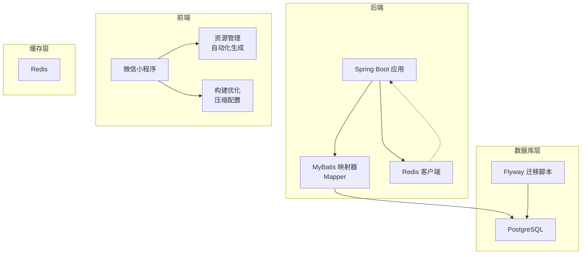
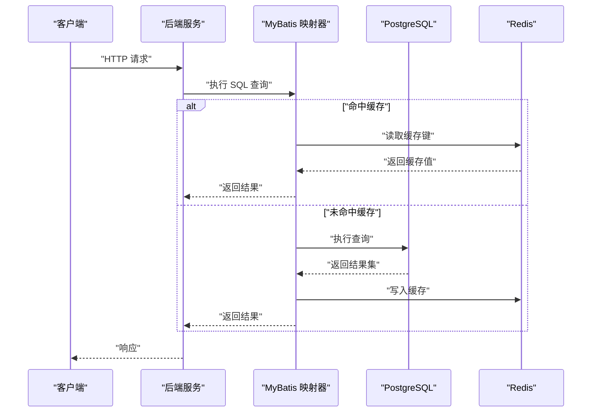
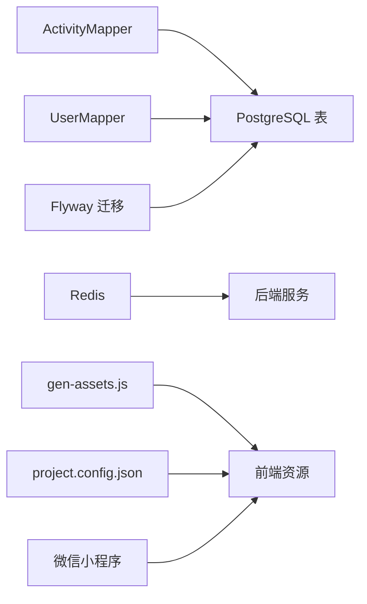

# 性能优化

<cite>
**本文引用的文件**
- [application.yml](file://backend/src/main/resources/application.yml)
- [docker-compose.yml](file://backend/docker-compose.yml)
- [docker-compose.prod.yml](file://deploy/docker-compose.prod.yml)
- [V1__init_core_tables.sql](file://backend/src/main/resources/db/migration/V1__init_core_tables.sql)
- [V2__add_user_phone_number.sql](file://backend/src/main/resources/db/migration/V2__add_user_phone_number.sql)
- [V3__add_activity_expenses.sql](file://backend/src/main/resources/db/migration/V3__add_activity_expenses.sql)
- [V4__add_activity_notification_events.sql](file://backend/src/main/resources/db/migration/V4__add_activity_notification_events.sql)
- [ActivityMapper.java](file://backend/src/main/java/com/playminipro/activity/mapper/ActivityMapper.java)
- [ActivityExpenseMapper.java](file://backend/src/main/java/com/playminipro/activity/mapper/ActivityExpenseMapper.java)
- [ActivityMemberMapper.java](file://backend/src/main/java/com/playminipro/activity/mapper/ActivityMemberMapper.java)
- [UserMapper.java](file://backend/src/main/java/com/playminipro/auth/mapper/UserMapper.java)
- [ActivityEntity.java](file://backend/src/main/java/com/playminipro/activity/entity/ActivityEntity.java)
- [ActivityExpenseEntity.java](file://backend/src/main/java/com/playminipro/activity/entity/ActivityExpenseEntity.java)
- [ActivityMemberEntity.java](file://backend/src/main/java/com/playminipro/activity/entity/ActivityMemberEntity.java)
- [UserEntity.java](file://backend/src/main/java/com/playminipro/auth/entity/UserEntity.java)
- [ActivityInsightService.java](file://backend/src/main/java/com/playminipro/activity/service/ActivityInsightService.java)
- [gen-assets.js](file://gen-assets.js)
- [project.config.json](file://frontend/project.config.json)
- [project.config.json](file://deploy_bundle/frontend/project.config.json)
</cite>

## 更新摘要
**所做更改**
- 新增前端性能优化章节，涵盖图像压缩优化和文本精简优化策略
- 添加前端构建配置优化说明，包括WXML压缩和JS语法验证
- 更新性能优化策略，将前端性能提升纳入整体优化框架
- 新增前端资源管理和自动化生成流程说明

## 目录
1. [简介](#简介)
2. [项目结构](#项目结构)
3. [核心组件](#核心组件)
4. [架构总览](#架构总览)
5. [详细组件分析](#详细组件分析)
6. [前端性能优化](#前端性能优化)
7. [依赖关系分析](#依赖关系分析)
8. [性能考量](#性能考量)
9. [故障排查指南](#故障排查指南)
10. [结论](#结论)
11. [附录](#附录)

## 简介
本文件面向PlayMiniPro项目的数据库性能优化，聚焦PostgreSQL与Redis在Spring Boot + MyBatis环境下的协同工作方式，系统性给出查询优化、索引设计、执行计划分析、连接池配置、缓存策略、JSONB查询优化、慢查询分析、性能监控、并发与事务控制、读写分离与分库分表思路，以及性能测试与持续监控方案。**新增**前端性能优化策略，包括图像压缩优化、文本精简优化等，为前端性能提升提供指导。内容基于仓库中现有的应用配置、数据库迁移脚本与Mapper/实体定义进行归纳总结，并提供可操作的优化建议。

## 项目结构
后端采用Spring Boot + MyBatis集成，数据库通过Flyway进行版本化迁移，容器编排使用Docker Compose，生产环境同时运行PostgreSQL与Redis服务，后端通过JDBC连接PostgreSQL并使用Spring Data Redis访问Redis。**前端采用微信小程序架构，包含自动化资源生成和构建优化配置**。

**图示来源**
- [docker-compose.yml:1-36](file://backend/docker-compose.yml#L1-L36)
- [docker-compose.prod.yml:1-61](file://deploy/docker-compose.prod.yml#L1-L61)
- [application.yml](file://backend/src/main/resources/application.yml)
- [gen-assets.js:1-35](file://gen-assets.js#L1-L35)

**章节来源**
- [docker-compose.yml:1-36](file://backend/docker-compose.yml#L1-L36)
- [docker-compose.prod.yml:1-61](file://deploy/docker-compose.prod.yml#L1-L61)
- [application.yml](file://backend/src/main/resources/application.yml)
- [gen-assets.js:1-35](file://gen-assets.js#L1-L35)

## 核心组件
- 数据库连接与连接池：由Spring Boot自动配置，默认使用HikariCP作为连接池，具体参数可通过配置文件调整。
- MyBatis映射器：负责SQL执行与结果映射，是查询优化与索引设计的主要落点。
- Redis缓存：用于热点数据的快速读取与会话等状态存储，减少数据库压力。
- Flyway迁移：统一管理数据库结构演进，确保索引与约束按版本上线。
- **前端资源管理：自动化图像生成和压缩，构建时文本精简优化**。

**章节来源**
- [application.yml](file://backend/src/main/resources/application.yml)
- [docker-compose.yml:1-36](file://backend/docker-compose.yml#L1-L36)
- [docker-compose.prod.yml:1-61](file://deploy/docker-compose.prod.yml#L1-L61)
- [gen-assets.js:1-35](file://gen-assets.js#L1-L35)

## 架构总览
后端服务通过JDBC驱动连接PostgreSQL，使用MyBatis执行SQL；同时通过Spring Data Redis访问Redis。**前端通过自动化脚本生成和优化资源，在构建时进行压缩和精简**。生产环境通过Docker Compose编排，确保数据库与缓存健康检查与依赖顺序。

**图示来源**
- [docker-compose.yml:1-36](file://backend/docker-compose.yml#L1-L36)
- [docker-compose.prod.yml:1-61](file://deploy/docker-compose.prod.yml#L1-L61)

## 详细组件分析

### 数据库连接池与配置
- 默认连接池：HikariCP（Spring Boot自动配置）。
- 关键参数位置：application.yml中的数据源配置段。
- 建议关注：
  - 最大连接数：根据并发峰值与数据库承载能力设定。
  - 连接超时：合理设置获取连接超时时间，避免排队过长。
  - 空闲超时与生命周期：防止连接泄漏与资源占用。
  - 连接复用策略：保持连接活跃，减少频繁创建销毁。

**章节来源**
- [application.yml](file://backend/src/main/resources/application.yml)

### 查询优化与执行计划分析
- SQL编写要点：
  - 使用明确的WHERE条件与排序字段，避免全表扫描。
  - 避免SELECT *，仅取必要列。
  - 合理使用LIMIT，限制结果集大小。
- 执行计划分析：
  - 使用EXPLAIN/EXPLAIN ANALYZE观察执行路径，优先考虑索引扫描而非顺序扫描。
  - 关注回表次数与排序成本。
- 具体到项目：
  - Mapper中存在显式JSONB字段处理与CAST转换，需结合索引策略与查询模式优化。

**章节来源**
- [ActivityMapper.java:31-57](file://backend/src/main/java/com/playminipro/activity/mapper/ActivityMapper.java#L31-L57)

### 索引设计
- 基于迁移脚本的表结构与字段，建议如下索引策略：
  - 主键索引：默认已建立，无需额外关注。
  - 经常用于过滤与JOIN的字段：如用户ID、活动ID、状态、时间范围等。
  - 复合索引：针对多条件组合查询，避免回表。
  - JSONB字段：若存在高频查询，可考虑生成索引或GIN索引以支持高效检索。
- 注意：
  - 索引越多，写入成本越高，需权衡读写比例。
  - 定期评估索引使用率，清理不常用索引。

**章节来源**
- [V1__init_core_tables.sql](file://backend/src/main/resources/db/migration/V1__init_core_tables.sql)
- [V2__add_user_phone_number.sql](file://backend/src/main/resources/db/migration/V2__add_user_phone_number.sql)
- [V3__add_activity_expenses.sql](file://backend/src/main/resources/db/migration/V3__add_activity_expenses.sql)
- [V4__add_activity_notification_events.sql](file://backend/src/main/resources/db/migration/V4__add_activity_notification_events.sql)

### JSONB查询优化
- 查询模式：
  - 若JSONB字段包含结构化数据且需要高频检索，建议：
    - 对关键键位建立GIN索引，提升contains/->>/->等操作性能。
    - 将热点键位提取为独立列并建立普通索引，配合复合索引优化。
  - 在Mapper中对JSONB字段进行CAST与类型转换时，尽量减少隐式转换开销。
- 实践建议：
  - 避免在JSONB上做大量字符串匹配与正则，优先结构化拆分。
  - 对于只读场景，可考虑将JSONB序列化为静态列，降低查询复杂度。

**章节来源**
- [ActivityMapper.java:31-57](file://backend/src/main/java/com/playminipro/activity/mapper/ActivityMapper.java#L31-L57)
- [ActivityEntity.java](file://backend/src/main/java/com/playminipro/activity/entity/ActivityEntity.java)

### 缓存策略与协同工作机制
- 缓存目标：
  - 热点活动详情、用户基本信息、会话令牌等。
- 协同机制：
  - 读路径：先查Redis，命中则直接返回；未命中再查数据库并写入缓存。
  - 写路径：更新数据库后，删除或失效相关缓存键，保证一致性。
  - 过期策略：为不同业务设置合理的TTL，避免缓存雪崩。
- 生产环境Redis配置：
  - 通过环境变量注入主机、端口与密码，确保安全与可维护性。

**章节来源**
- [docker-compose.prod.yml:19-50](file://deploy/docker-compose.prod.yml#L19-L50)

### 并发控制、事务隔离与死锁预防
- 并发控制：
  - 使用连接池并发限制，避免数据库过载。
  - 对高并发写入场景，采用批量提交与幂等设计。
- 事务隔离：
  - 默认隔离级别通常为READ COMMITTED，满足大多数业务。
  - 对强一致要求的场景，谨慎使用更高隔离级别，评估性能影响。
- 死锁预防：
  - 固定顺序更新多个记录，避免循环等待。
  - 缩短事务时间，减少锁持有周期。
  - 对热点行加锁时，尽量合并操作，减少锁竞争。

### 读写分离与分库分表
- 适用场景：
  - 读远大于写的报表型查询、超大规模数据的冷热分离。
- 实施思路：
  - 读写分离：主库写入，从库读取；通过路由规则将查询定向至只读副本。
  - 分库分表：按用户ID或时间维度进行水平切分；需统一路由与聚合逻辑。
- 注意事项：
  - 强一致读写分离需引入分布式事务或最终一致性策略。
  - 分片键选择要兼顾负载均衡与查询效率。

### 慢查询分析与性能监控
- 慢查询定位：
  - 开启慢查询日志阈值，结合数据库性能视图与执行计划分析。
  - 在应用侧埋点记录SQL耗时，区分Mapper层与数据库层瓶颈。
- 监控指标：
  - 连接池指标：活跃连接数、等待时间、获取超时次数。
  - 数据库指标：每秒事务数、锁等待、缓冲区命中率、索引使用率。
  - 缓存指标：命中率、过期率、内存使用率。
- 工具建议：
  - 数据库：pg_stat_statements、EXPLAIN/EXPLAIN ANALYZE。
  - 应用：Spring Boot Actuator、Micrometer指标导出。

### 性能测试与持续监控
- 基准测试：
  - 使用JMeter/Locust模拟并发请求，覆盖核心路径（登录、活动列表、详情、费用统计）。
  - 逐步放大并发与数据规模，观察延迟与错误率拐点。
- 持续监控：
  - 集成Prometheus/Grafana，采集数据库与应用指标。
  - 建立告警阈值，对连接池饱和、慢查询、缓存异常进行预警。

## 前端性能优化

### 图像压缩优化
**新增**前端性能优化策略，重点关注图像资源的压缩和优化：

- **自动化图像生成**：
  - 使用sharp库进行程序化图像生成，支持多种格式转换和压缩
  - 自动化生成城市背景、图标等重复使用的图像资源
  - 减少手动图像处理的工作量和一致性问题

- **图像格式优化**：
  - WebP格式优先，提供更好的压缩比和质量平衡
  - JPEG格式用于照片类图像，设置合适的质量参数
  - PNG格式用于需要透明度的图标和图形元素

- **尺寸和分辨率优化**：
  - 按实际显示需求生成合适尺寸的图像
  - 使用响应式图像策略，避免过度加载大尺寸资源
  - 实现图像懒加载，提升首屏加载速度

- **缓存策略**：
  - 利用CDN缓存静态图像资源
  - 设置合适的缓存头，平衡新鲜度和性能
  - 实现图像版本化，避免缓存污染

**章节来源**
- [gen-assets.js:1-35](file://gen-assets.js#L1-L35)

### 文本精简优化
**新增**前端文本资源的精简和优化策略：

- **构建时压缩**：
  - 启用WXML压缩功能，减少模板文件体积
  - JavaScript代码压缩和混淆，去除注释和空白字符
  - CSS样式压缩，合并重复规则和简化选择器

- **代码分割**：
  - 按页面和功能模块进行代码分割
  - 实现按需加载，避免一次性加载所有资源
  - 利用异步组件实现延迟加载

- **资源内联**：
  - 小型资源内联到HTML中，减少HTTP请求
  - 关键CSS内联，提升首屏渲染速度
  - 重要JavaScript内联，减少阻塞

- **静态资源优化**：
  - 移除未使用的CSS和JavaScript代码
  - 压缩图片和字体文件
  - 使用Gzip或Brotli压缩传输

**章节来源**
- [project.config.json:1-25](file://frontend/project.config.json#L1-L25)
- [project.config.json:1-25](file://deploy_bundle/frontend/project.config.json#L1-L25)

### 构建配置优化
**新增**前端构建系统的性能优化配置：

- **编译设置优化**：
  - 启用ES6支持和PostCSS处理
  - 启用代码压缩和混淆
  - 禁用不必要的插件和转换

- **打包选项配置**：
  - 配置包选项，排除不需要的文件
  - 设置忽略规则，避免打包大型依赖
  - 优化npm包关系列表

- **开发工具配置**：
  - 启用增强模式，提供更好的开发体验
  - 配置Babel设置，优化转译过程
  - 启用编译器插件，提升构建效率

**章节来源**
- [project.config.json:1-25](file://frontend/project.config.json#L1-L25)

### 资源管理自动化
**新增**前端资源管理的自动化流程：

- **资产生成脚本**：
  - 使用Node.js脚本自动生成重复性资源
  - 支持批量处理和格式转换
  - 集成到CI/CD流程中

- **版本控制策略**：
  - 实现资源版本化管理
  - 支持增量更新和全量替换
  - 避免缓存冲突和版本混乱

- **质量保证**：
  - JS语法验证，确保代码质量
  - 自动化测试集成
  - 性能基准测试

**章节来源**
- [gen-assets.js:1-35](file://gen-assets.js#L1-L35)

## 依赖关系分析
后端服务依赖数据库与缓存，数据库通过Flyway迁移脚本初始化与演进，缓存用于加速读取路径。**前端通过自动化脚本生成和优化资源，构建时进行压缩和精简**。

**图示来源**
- [ActivityMapper.java:31-57](file://backend/src/main/java/com/playminipro/activity/mapper/ActivityMapper.java#L31-L57)
- [UserMapper.java](file://backend/src/main/java/com/playminipro/auth/mapper/UserMapper.java)
- [docker-compose.yml:1-36](file://backend/docker-compose.yml#L1-L36)
- [V1__init_core_tables.sql](file://backend/src/main/resources/db/migration/V1__init_core_tables.sql)
- [gen-assets.js:1-35](file://gen-assets.js#L1-L35)
- [project.config.json:1-25](file://frontend/project.config.json#L1-L25)

**章节来源**
- [ActivityMapper.java:31-57](file://backend/src/main/java/com/playminipro/activity/mapper/ActivityMapper.java#L31-L57)
- [UserMapper.java](file://backend/src/main/java/com/playminipro/auth/mapper/UserMapper.java)
- [V1__init_core_tables.sql](file://backend/src/main/resources/db/migration/V1__init_core_tables.sql)
- [gen-assets.js:1-35](file://gen-assets.js#L1-L35)

## 性能考量
- 查询层面：
  - 优先使用索引覆盖查询，减少回表。
  - 控制JOIN数量与深度，避免笛卡尔积。
- 索引层面：
  - 针对高选择性与高频过滤字段建立索引。
  - 对JSONB键位建立GIN索引，提升结构化查询性能。
- 缓存层面：
  - 采用多级缓存（本地+远程），降低数据库压力。
  - 设置合理的过期策略与淘汰算法。
- 连接池层面：
  - 根据QPS与RT动态调整最大连接数与空闲超时。
  - 监控连接池队列长度，避免尖峰导致的排队。
- 事务层面：
  - 缩短事务时间，避免长时间持锁。
  - 对批量写入采用批处理与幂等设计。
- **前端层面**：
  - **图像压缩和格式优化，减少网络传输体积**
  - **文本精简和构建压缩，提升加载和执行速度**
  - **资源懒加载和按需加载，优化首屏性能**
  - **自动化资源生成，确保资源质量和一致性**

## 故障排查指南
- 连接池问题：
  - 现象：获取连接超时、队列堆积。
  - 措施：检查最大连接数、超时配置与慢查询；优化SQL与索引。
- 缓存穿透/击穿：
  - 现象：大量未命中导致数据库压力骤增。
  - 措施：布隆过滤器、热点数据永不过期、互斥锁更新。
- 死锁与锁争用：
  - 现象：事务频繁失败、RT升高。
  - 措施：固定更新顺序、缩短事务、减少锁粒度。
- 慢查询：
  - 现象：特定接口RT异常升高。
  - 措施：EXPLAIN分析、补充索引、重写SQL或引入缓存。
- **前端性能问题**：
  - **现象：页面加载缓慢、资源请求过多**
  - **措施：检查图像压缩效果、构建配置、资源懒加载实现**
  - **验证：使用开发者工具分析网络请求和性能指标**

**章节来源**
- [application.yml](file://backend/src/main/resources/application.yml)
- [docker-compose.yml:1-36](file://backend/docker-compose.yml#L1-L36)
- [gen-assets.js:1-35](file://gen-assets.js#L1-L35)

## 结论
通过对连接池、索引、查询、缓存与监控的系统性优化，以及**新增的前端性能优化策略**，可显著提升PlayMiniPro在高并发场景下的稳定性与吞吐量。**前端优化包括图像压缩、文本精简、构建配置优化等措施，通过自动化资源生成和优化配置，进一步提升整体性能表现**。建议以"查询优化—索引设计—缓存协同—前端优化—监控告警"为主线，持续迭代数据库与应用性能，确保系统在增长过程中保持良好体验。

## 附录
- 快速检查清单
  - 是否为高频查询字段建立了合适索引？
  - JSONB查询是否使用了GIN索引或结构化拆分？
  - 连接池参数是否与当前QPS匹配？
  - 缓存命中率与过期策略是否合理？
  - 是否开启慢查询与执行计划分析？
  - 是否具备并发压测与持续监控方案？
  - **前端图像资源是否经过压缩优化？**
  - **构建配置是否启用文本精简和压缩？**
  - **自动化资源生成脚本是否正常运行？**
  - **JS语法验证和性能测试是否集成到开发流程中？**