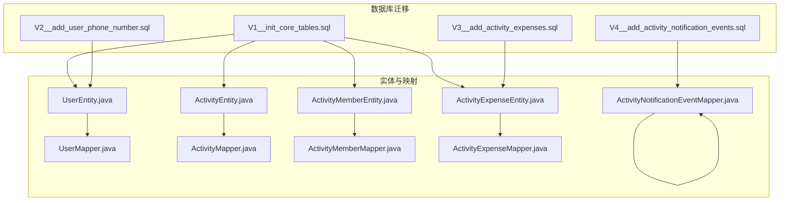
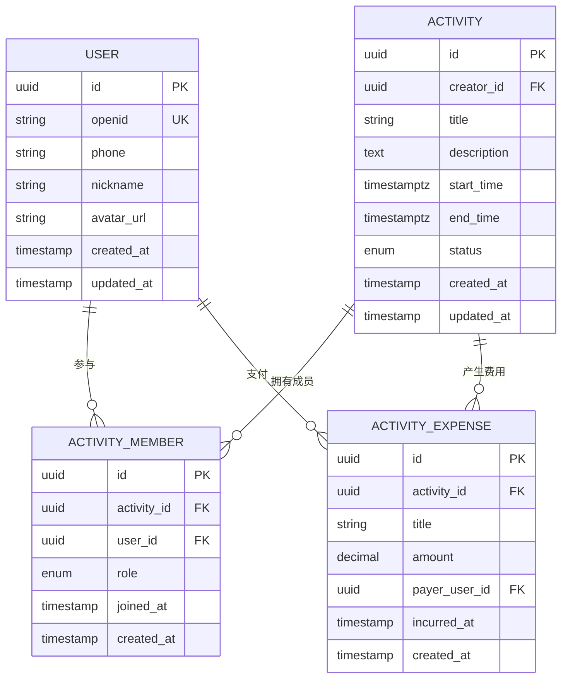
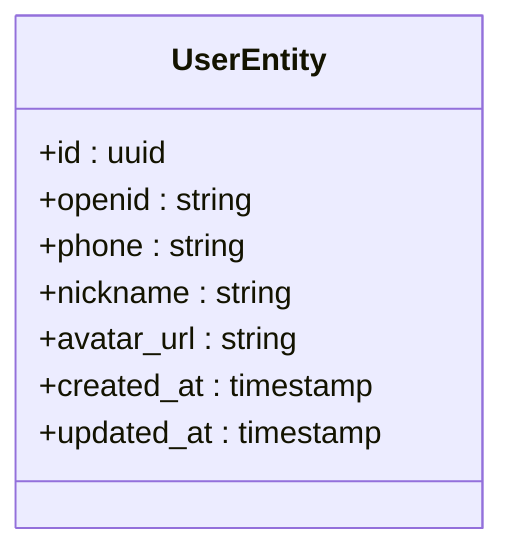
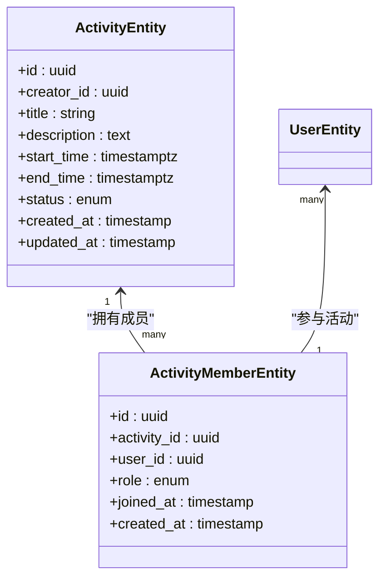
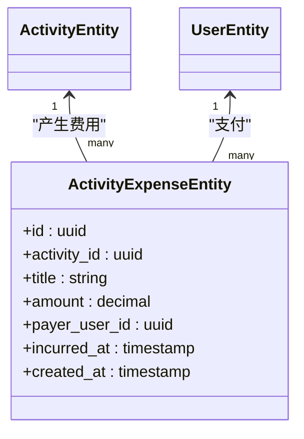
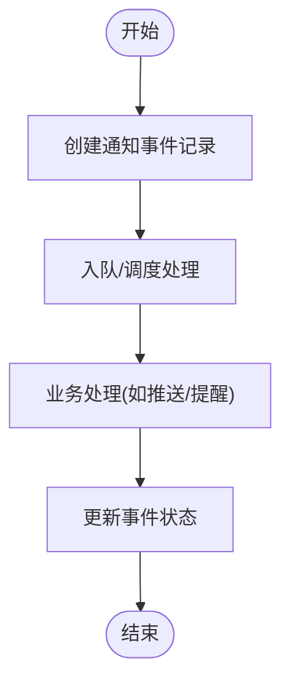
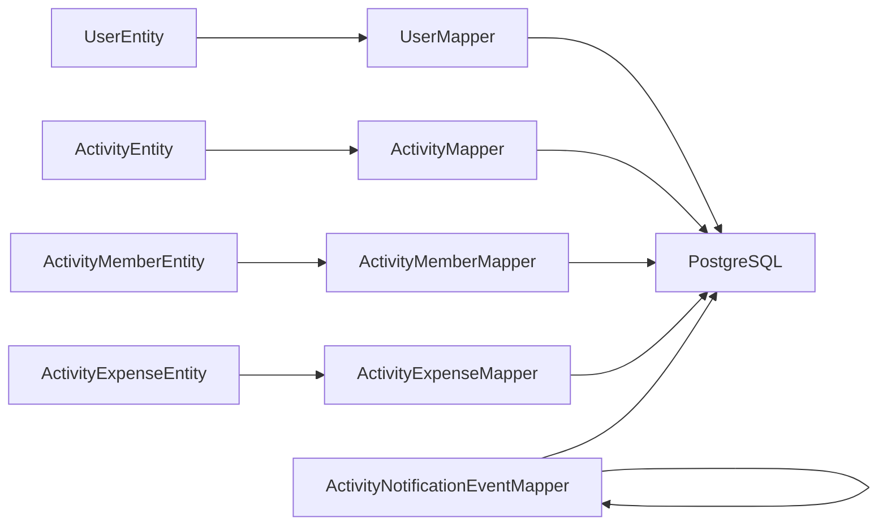

# 数据库架构

<cite>
**本文引用的文件**
- [V1__init_core_tables.sql](file://backend/src/main/resources/db/migration/V1__init_core_tables.sql)
- [V2__add_user_phone_number.sql](file://backend/src/main/resources/db/migration/V2__add_user_phone_number.sql)
- [V3__add_activity_expenses.sql](file://backend/src/main/resources/db/migration/V3__add_activity_expenses.sql)
- [V4__add_activity_notification_events.sql](file://backend/src/main/resources/db/migration/V4__add_activity_notification_events.sql)
- [UserEntity.java](file://backend/src/main/java/com/playminipro/auth/entity/UserEntity.java)
- [ActivityEntity.java](file://backend/src/main/java/com/playminipro/activity/entity/ActivityEntity.java)
- [ActivityMemberEntity.java](file://backend/src/main/java/com/playminipro/activity/entity/ActivityMemberEntity.java)
- [ActivityExpenseEntity.java](file://backend/src/main/java/com/playminipro/activity/entity/ActivityExpenseEntity.java)
- [ActivityNotificationEventMapper.java](file://backend/src/main/java/com/playminipro/activity/mapper/ActivityNotificationEventMapper.java)
- [UserMapper.java](file://backend/src/main/java/com/playminipro/auth/mapper/UserMapper.java)
- [ActivityMapper.java](file://backend/src/main/java/com/playminipro/activity/mapper/ActivityMapper.java)
- [ActivityMemberMapper.java](file://backend/src/main/java/com/playminipro/activity/mapper/ActivityMemberMapper.java)
- [ActivityExpenseMapper.java](file://backend/src/main/java/com/playminipro/activity/mapper/ActivityExpenseMapper.java)
- [application.yml](file://backend/src/main/resources/application.yml)
</cite>

## 目录
1. [引言](#引言)
2. [项目结构](#项目结构)
3. [核心组件](#核心组件)
4. [架构总览](#架构总览)
5. [详细组件分析](#详细组件分析)
6. [依赖分析](#依赖分析)
7. [性能考量](#性能考量)
8. [故障排查指南](#故障排查指南)
9. [结论](#结论)
10. [附录](#附录)

## 引言
本文件系统性梳理PlayMiniPro项目的数据库架构，围绕基于PostgreSQL的核心表设计展开，重点覆盖用户(UserEntity)、活动(ActivityEntity)、成员关系(ActivityMemberEntity)、费用(ActivityExpenseEntity)以及通知事件等关键实体。文档从表结构、字段类型、主外键约束、表间关系、范式与反范式权衡、性能优化策略等方面进行深入解析，并提供ER图与表关系图，帮助开发者快速理解数据模型的整体架构。

## 项目结构
数据库初始化与演进通过Flyway迁移脚本管理，初始版本包含核心表，后续版本逐步扩展用户手机号、活动费用与通知事件支持。Java实体类与MyBatis Mapper共同构成ORM层，负责对象与关系型数据的映射。

**图表来源**
- [V1__init_core_tables.sql:1-200](file://backend/src/main/resources/db/migration/V1__init_core_tables.sql#L1-L200)
- [V2__add_user_phone_number.sql:1-100](file://backend/src/main/resources/db/migration/V2__add_user_phone_number.sql#L1-L100)
- [V3__add_activity_expenses.sql:1-150](file://backend/src/main/resources/db/migration/V3__add_activity_expenses.sql#L1-L150)
- [V4__add_activity_notification_events.sql:1-120](file://backend/src/main/resources/db/migration/V4__add_activity_notification_events.sql#L1-L120)
- [UserEntity.java:1-200](file://backend/src/main/java/com/playminipro/auth/entity/UserEntity.java#L1-L200)
- [ActivityEntity.java:1-200](file://backend/src/main/java/com/playminipro/activity/entity/ActivityEntity.java#L1-L200)
- [ActivityMemberEntity.java:1-200](file://backend/src/main/java/com/playminipro/activity/entity/ActivityMemberEntity.java#L1-L200)
- [ActivityExpenseEntity.java:1-200](file://backend/src/main/java/com/playminipro/activity/entity/ActivityExpenseEntity.java#L1-L200)
- [ActivityNotificationEventMapper.java:1-120](file://backend/src/main/java/com/playminipro/activity/mapper/ActivityNotificationEventMapper.java#L1-L120)
- [UserMapper.java:1-120](file://backend/src/main/java/com/playminipro/auth/mapper/UserMapper.java#L1-L120)
- [ActivityMapper.java:1-120](file://backend/src/main/java/com/playminipro/activity/mapper/ActivityMapper.java#L1-L120)
- [ActivityMemberMapper.java:1-120](file://backend/src/main/java/com/playminipro/activity/mapper/ActivityMemberMapper.java#L1-L120)
- [ActivityExpenseMapper.java:1-120](file://backend/src/main/java/com/playminipro/activity/mapper/ActivityExpenseMapper.java#L1-L120)

**章节来源**
- [V1__init_core_tables.sql:1-200](file://backend/src/main/resources/db/migration/V1__init_core_tables.sql#L1-L200)
- [V2__add_user_phone_number.sql:1-100](file://backend/src/main/resources/db/migration/V2__add_user_phone_number.sql#L1-L100)
- [V3__add_activity_expenses.sql:1-150](file://backend/src/main/resources/db/migration/V3__add_activity_expenses.sql#L1-L150)
- [V4__add_activity_notification_events.sql:1-120](file://backend/src/main/resources/db/migration/V4__add_activity_notification_events.sql#L1-L120)

## 核心组件
- 用户(UserEntity)：承载用户身份信息，支持微信登录与手机号扩展。
- 活动(ActivityEntity)：记录活动基本信息、状态、时间与创建者等。
- 成员关系(ActivityMemberEntity)：维护用户与活动之间的参与关系及角色。
- 费用(ActivityExpenseEntity)：记录活动相关的支出明细与分摊。
- 通知事件(ActivityNotificationEventMapper关联的事件表)：用于异步通知与审计追踪。

这些组件通过迁移脚本在PostgreSQL中落库，并由对应的实体类与Mapper进行持久化操作。

**章节来源**
- [UserEntity.java:1-200](file://backend/src/main/java/com/playminipro/auth/entity/UserEntity.java#L1-L200)
- [ActivityEntity.java:1-200](file://backend/src/main/java/com/playminipro/activity/entity/ActivityEntity.java#L1-L200)
- [ActivityMemberEntity.java:1-200](file://backend/src/main/java/com/playminipro/activity/entity/ActivityMemberEntity.java#L1-L200)
- [ActivityExpenseEntity.java:1-200](file://backend/src/main/java/com/playminipro/activity/entity/ActivityExpenseEntity.java#L1-L200)
- [ActivityNotificationEventMapper.java:1-120](file://backend/src/main/java/com/playminipro/activity/mapper/ActivityNotificationEventMapper.java#L1-L120)

## 架构总览
下图展示核心实体与表之间的ER关系，体现一对多与多对多的实现方式（通过中间表ActivityMemberEntity）。

**图表来源**
- [V1__init_core_tables.sql:1-200](file://backend/src/main/resources/db/migration/V1__init_core_tables.sql#L1-L200)
- [V3__add_activity_expenses.sql:1-150](file://backend/src/main/resources/db/migration/V3__add_activity_expenses.sql#L1-L150)
- [UserEntity.java:1-200](file://backend/src/main/java/com/playminipro/auth/entity/UserEntity.java#L1-L200)
- [ActivityEntity.java:1-200](file://backend/src/main/java/com/playminipro/activity/entity/ActivityEntity.java#L1-L200)
- [ActivityMemberEntity.java:1-200](file://backend/src/main/java/com/playminipro/activity/entity/ActivityMemberEntity.java#L1-L200)
- [ActivityExpenseEntity.java:1-200](file://backend/src/main/java/com/playminipro/activity/entity/ActivityExpenseEntity.java#L1-L200)

## 详细组件分析

### 用户表(UserEntity)与迁移脚本
- 设计理念：以uuid为主键确保分布式唯一性；openid作为微信登录标识的唯一索引，便于快速查找；phone字段在后续版本中引入，支持手机号绑定。
- 字段与类型：id(uuid, PK)、openid(string, UK)、phone(string)、nickname(string)、avatar_url(string)、created_at/timestamp。
- 约束与索引：PK(id)，UK(openid)，可选索引(phone)。
- 迁移演进：V1初始化核心字段；V2新增phone列并建立索引。

**图表来源**
- [V1__init_core_tables.sql:1-200](file://backend/src/main/resources/db/migration/V1__init_core_tables.sql#L1-L200)
- [V2__add_user_phone_number.sql:1-100](file://backend/src/main/resources/db/migration/V2__add_user_phone_number.sql#L1-L100)
- [UserEntity.java:1-200](file://backend/src/main/java/com/playminipro/auth/entity/UserEntity.java#L1-L200)

**章节来源**
- [V1__init_core_tables.sql:1-200](file://backend/src/main/resources/db/migration/V1__init_core_tables.sql#L1-L200)
- [V2__add_user_phone_number.sql:1-100](file://backend/src/main/resources/db/migration/V2__add_user_phone_number.sql#L1-L100)
- [UserEntity.java:1-200](file://backend/src/main/java/com/playminipro/auth/entity/UserEntity.java#L1-L200)

### 活动表(ActivityEntity)与成员关系表(ActivityMemberEntity)
- 设计理念：活动表存储活动元数据与状态；成员关系表通过中间表实现用户与活动的多对多关系，同时记录成员角色与加入时间。
- 字段与类型：ACTIVITY包含id(PK)、creator_id(FK)、title、description、start_time/end_time、status、created_at/updated_at；ACTIVITY_MEMBER包含id(PK)、activity_id(FK)、user_id(FK)、role、joined_at、created_at。
- 约束与索引：ACTIVITY外键指向USER(id)；ACTIVITY_MEMBER(activity_id,user_id)组合唯一或通过业务保证唯一性；可对activity_id、user_id建立索引提升查询性能。
- 关系映射：一对多(一个活动有多个成员)；多对多(一个用户可参与多个活动)。

**图表来源**
- [V1__init_core_tables.sql:1-200](file://backend/src/main/resources/db/migration/V1__init_core_tables.sql#L1-L200)
- [ActivityEntity.java:1-200](file://backend/src/main/java/com/playminipro/activity/entity/ActivityEntity.java#L1-L200)
- [ActivityMemberEntity.java:1-200](file://backend/src/main/java/com/playminipro/activity/entity/ActivityMemberEntity.java#L1-L200)

**章节来源**
- [V1__init_core_tables.sql:1-200](file://backend/src/main/resources/db/migration/V1__init_core_tables.sql#L1-L200)
- [ActivityEntity.java:1-200](file://backend/src/main/java/com/playminipro/activity/entity/ActivityEntity.java#L1-L200)
- [ActivityMemberEntity.java:1-200](file://backend/src/main/java/com/playminipro/activity/entity/ActivityMemberEntity.java#L1-L200)

### 费用表(ActivityExpenseEntity)
- 设计理念：记录活动中的具体支出，包含标题、金额、付款人与发生时间；通过外键关联活动与用户，形成“活动-费用-付款人”的清晰关系。
- 字段与类型：id(PK)、activity_id(FK)、title、amount、payer_user_id(FK)、incurred_at、created_at。
- 约束与索引：外键约束保证活动与付款人的存在；可对activity_id、payer_user_id、incurred_at建立索引以优化统计与查询。
- 关系映射：一对多(一个活动有多笔费用)；多对一(多笔费用指向同一活动与付款人)。

**图表来源**
- [V3__add_activity_expenses.sql:1-150](file://backend/src/main/resources/db/migration/V3__add_activity_expenses.sql#L1-L150)
- [ActivityExpenseEntity.java:1-200](file://backend/src/main/java/com/playminipro/activity/entity/ActivityExpenseEntity.java#L1-L200)

**章节来源**
- [V3__add_activity_expenses.sql:1-150](file://backend/src/main/resources/db/migration/V3__add_activity_expenses.sql#L1-L150)
- [ActivityExpenseEntity.java:1-200](file://backend/src/main/java/com/playminipro/activity/entity/ActivityExpenseEntity.java#L1-L200)

### 通知事件表与迁移演进
- 设计理念：通过独立的通知事件表记录活动相关的异步通知与审计信息，避免与核心业务表耦合，便于扩展与监控。
- 字段与类型：包含事件标识、活动关联、事件类型、触发时间、处理状态等字段（具体字段以迁移脚本为准）。
- 约束与索引：外键约束与必要索引以支撑高频查询与定时任务扫描。
- 迁移演进：V4引入通知事件表，配合业务服务实现解耦的通知机制。

**图表来源**
- [V4__add_activity_notification_events.sql:1-120](file://backend/src/main/resources/db/migration/V4__add_activity_notification_events.sql#L1-L120)

**章节来源**
- [V4__add_activity_notification_events.sql:1-120](file://backend/src/main/resources/db/migration/V4__add_activity_notification_events.sql#L1-L120)

## 依赖分析
- 实体到表的映射：UserEntity、ActivityEntity、ActivityMemberEntity、ActivityExpenseEntity分别对应数据库中的用户、活动、成员关系与费用表。
- ORM层依赖：各Mapper文件负责SQL映射与参数绑定，依赖于实体类的字段定义与注解。
- 配置依赖：数据库连接与Flyway迁移由application.yml配置，确保迁移脚本按序执行。

**图表来源**
- [UserEntity.java:1-200](file://backend/src/main/java/com/playminipro/auth/entity/UserEntity.java#L1-L200)
- [ActivityEntity.java:1-200](file://backend/src/main/java/com/playminipro/activity/entity/ActivityEntity.java#L1-L200)
- [ActivityMemberEntity.java:1-200](file://backend/src/main/java/com/playminipro/activity/entity/ActivityMemberEntity.java#L1-L200)
- [ActivityExpenseEntity.java:1-200](file://backend/src/main/java/com/playminipro/activity/entity/ActivityExpenseEntity.java#L1-L200)
- [ActivityNotificationEventMapper.java:1-120](file://backend/src/main/java/com/playminipro/activity/mapper/ActivityNotificationEventMapper.java#L1-L120)
- [UserMapper.java:1-120](file://backend/src/main/java/com/playminipro/auth/mapper/UserMapper.java#L1-L120)
- [ActivityMapper.java:1-120](file://backend/src/main/java/com/playminipro/activity/mapper/ActivityMapper.java#L1-L120)
- [ActivityMemberMapper.java:1-120](file://backend/src/main/java/com/playminipro/activity/mapper/ActivityMemberMapper.java#L1-L120)
- [ActivityExpenseMapper.java:1-120](file://backend/src/main/java/com/playminipro/activity/mapper/ActivityExpenseMapper.java#L1-L120)

**章节来源**
- [UserMapper.java:1-120](file://backend/src/main/java/com/playminipro/auth/mapper/UserMapper.java#L1-L120)
- [ActivityMapper.java:1-120](file://backend/src/main/java/com/playminipro/activity/mapper/ActivityMapper.java#L1-L120)
- [ActivityMemberMapper.java:1-120](file://backend/src/main/java/com/playminipro/activity/mapper/ActivityMemberMapper.java#L1-L120)
- [ActivityExpenseMapper.java:1-120](file://backend/src/main/java/com/playminipro/activity/mapper/ActivityExpenseMapper.java#L1-L120)
- [application.yml:1-200](file://backend/src/main/resources/application.yml#L1-L200)

## 性能考量
- 索引策略
  - 用户表：对openid建立唯一索引以加速登录查找；对phone建立普通索引以支持手机号绑定场景。
  - 活动表：对creator_id建立索引以支持“我的活动”查询；对start_time/end_time建立复合索引以优化时间范围查询。
  - 成员关系表：对activity_id与user_id分别建立索引，保障活动成员查询与用户参与活动列表的性能。
  - 费用表：对activity_id与payer_user_id建立索引，支撑活动费用汇总与个人垫付统计。
- 查询模式
  - 常见查询包括：用户参与的活动列表、活动详情与成员列表、活动费用明细与汇总、按时间范围筛选活动等。建议针对这些查询路径建立合适的索引与物化视图（如需要）。
- 写入优化
  - 批量插入成员关系与费用时，采用批量提交减少事务开销。
  - 使用分区表（按时间）对活动与费用进行分区，提升归档与清理效率。
- 统计与报表
  - 可在夜间或低峰期生成聚合表（如活动费用汇总、用户消费排行），降低在线查询压力。
- 版本演进
  - Flyway迁移脚本顺序执行，新增索引与约束需在不影响线上业务的前提下进行，建议使用在线DDL工具或分批灰度。

[本节为通用性能指导，不直接分析具体文件]

## 故障排查指南
- 迁移失败
  - 症状：启动时报错提示迁移失败或重复执行。
  - 排查：检查Flyway元数据表状态，确认迁移脚本是否已执行；核对application.yml中的数据库连接配置。
- 外键约束冲突
  - 症状：插入成员或费用时报外键错误。
  - 排查：确认关联的用户与活动是否存在；检查ActivityMemberEntity的activity_id与user_id组合是否违反唯一性。
- 查询性能问题
  - 症状：活动详情或费用列表加载缓慢。
  - 排查：确认相关索引是否存在；分析慢查询日志，评估是否需要添加复合索引或物化视图。
- 通知事件堆积
  - 症状：通知未及时送达或积压严重。
  - 排查：检查通知事件表的状态字段与处理队列；核对V4迁移脚本创建的索引与约束。

**章节来源**
- [application.yml:1-200](file://backend/src/main/resources/application.yml#L1-L200)
- [V1__init_core_tables.sql:1-200](file://backend/src/main/resources/db/migration/V1__init_core_tables.sql#L1-L200)
- [V3__add_activity_expenses.sql:1-150](file://backend/src/main/resources/db/migration/V3__add_activity_expenses.sql#L1-L150)
- [V4__add_activity_notification_events.sql:1-120](file://backend/src/main/resources/db/migration/V4__add_activity_notification_events.sql#L1-L120)

## 结论
PlayMiniPro的数据库设计遵循清晰的ER模型，通过用户、活动、成员关系、费用与通知事件五张核心表实现完整的活动组织与财务分摊能力。迁移脚本确保了Schema的有序演进，ORM层提供了稳定的对象映射。在性能方面，建议结合查询模式完善索引与物化视图，并通过分区与夜间聚合减轻在线查询压力。整体架构具备良好的扩展性与可维护性。

[本节为总结性内容，不直接分析具体文件]

## 附录
- 迁移脚本清单
  - V1：初始化核心表(User、Activity、ActivityMember)
  - V2：为用户表增加手机号字段
  - V3：为活动表增加费用相关表
  - V4：新增活动通知事件表
- 实体与表的对应关系
  - UserEntity → 用户表
  - ActivityEntity → 活动表
  - ActivityMemberEntity → 成员关系表
  - ActivityExpenseEntity → 费用表
  - ActivityNotificationEventMapper → 通知事件表

**章节来源**
- [V1__init_core_tables.sql:1-200](file://backend/src/main/resources/db/migration/V1__init_core_tables.sql#L1-L200)
- [V2__add_user_phone_number.sql:1-100](file://backend/src/main/resources/db/migration/V2__add_user_phone_number.sql#L1-L100)
- [V3__add_activity_expenses.sql:1-150](file://backend/src/main/resources/db/migration/V3__add_activity_expenses.sql#L1-L150)
- [V4__add_activity_notification_events.sql:1-120](file://backend/src/main/resources/db/migration/V4__add_activity_notification_events.sql#L1-L120)