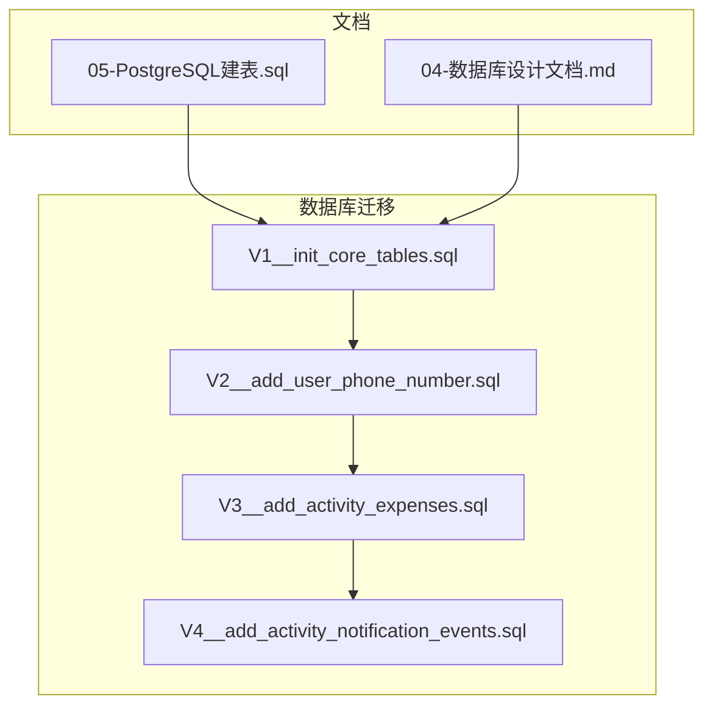
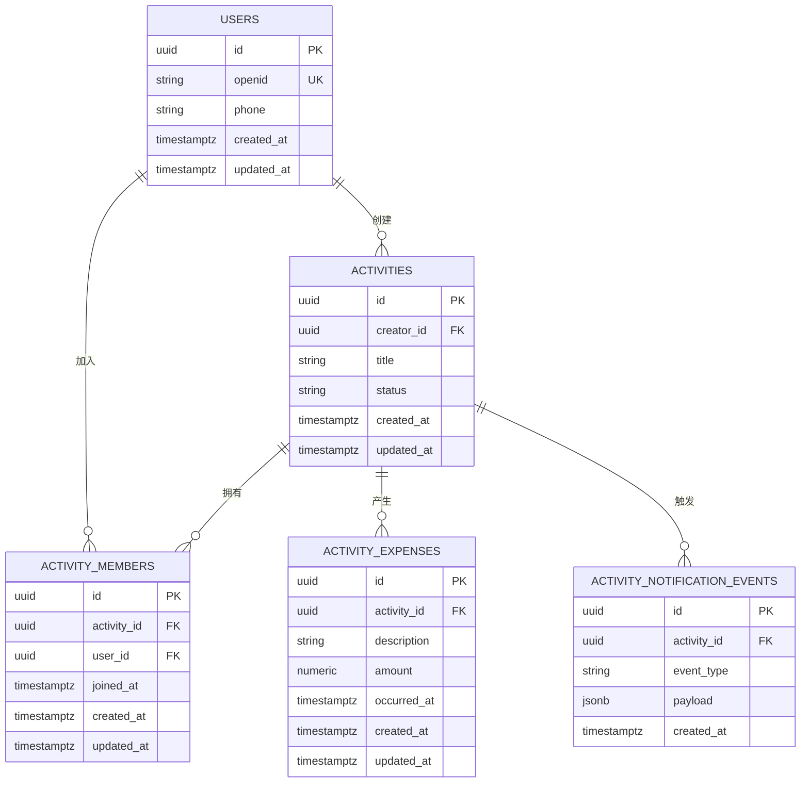
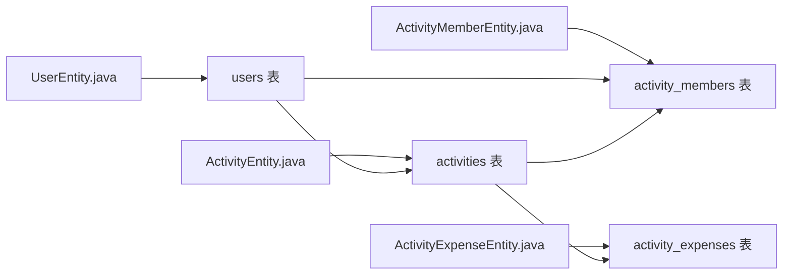

# 数据库约束与索引

<cite>
**本文引用的文件**
- [V1__init_core_tables.sql](file://backend/src/main/resources/db/migration/V1__init_core_tables.sql)
- [V2__add_user_phone_number.sql](file://backend/src/main/resources/db/migration/V2__add_user_phone_number.sql)
- [V3__add_activity_expenses.sql](file://backend/src/main/resources/db/migration/V3__add_activity_expenses.sql)
- [V4__add_activity_notification_events.sql](file://backend/src/main/resources/db/migration/V4__add_activity_notification_events.sql)
- [05-PostgreSQL建表.sql](file://doc/05-PostgreSQL建表.sql)
- [04-数据库设计文档.md](file://doc/04-数据库设计文档.md)
- [ActivityEntity.java](file://backend/src/main/java/com/playminipro/activity/entity/ActivityEntity.java)
- [ActivityExpenseEntity.java](file://backend/src/main/java/com/playminipro/activity/entity/ActivityExpenseEntity.java)
- [ActivityMemberEntity.java](file://backend/src/main/java/com/playminipro/activity/entity/ActivityMemberEntity.java)
- [UserEntity.java](file://backend/src/main/java/com/playminipro/auth/entity/UserEntity.java)
</cite>

## 目录
1. [简介](#简介)
2. [项目结构](#项目结构)
3. [核心组件](#核心组件)
4. [架构总览](#架构总览)
5. [详细组件分析](#详细组件分析)
6. [依赖分析](#依赖分析)
7. [性能考虑](#性能考虑)
8. [故障排查指南](#故障排查指南)
9. [结论](#结论)
10. [附录](#附录)

## 简介
本文件聚焦于PlayMiniPro项目的数据库约束与索引设计，系统性梳理以下内容：
- 约束类型与作用：CHECK约束、UNIQUE约束、FOREIGN KEY约束在数据完整性保障中的角色与意义
- 索引策略：主键索引、复合索引、部分索引的选择标准与实践
- PostgreSQL特性：JSONB字段、UUID类型、时间戳精度等在项目中的使用与影响
- 迁移过程中的约束变更管理：版本化迁移脚本的组织与演进
- 性能优化建议与常见约束问题的解决方案

## 项目结构
数据库相关代码主要分布在两处：
- Flyway迁移脚本：位于db/migration目录，按版本顺序定义表结构、约束与索引
- 文档资料：doc目录下的建表SQL与数据库设计文档，补充说明表关系与字段语义

**图表来源**
- [V1__init_core_tables.sql](file://backend/src/main/resources/db/migration/V1__init_core_tables.sql)
- [V2__add_user_phone_number.sql](file://backend/src/main/resources/db/migration/V2__add_user_phone_number.sql)
- [V3__add_activity_expenses.sql](file://backend/src/main/resources/db/migration/V3__add_activity_expenses.sql)
- [V4__add_activity_notification_events.sql](file://backend/src/main/resources/db/migration/V4__add_activity_notification_events.sql)
- [05-PostgreSQL建表.sql](file://doc/05-PostgreSQL建表.sql)
- [04-数据库设计文档.md](file://doc/04-数据库设计文档.md)

**章节来源**
- [V1__init_core_tables.sql](file://backend/src/main/resources/db/migration/V1__init_core_tables.sql)
- [V2__add_user_phone_number.sql](file://backend/src/main/resources/db/migration/V2__add_user_phone_number.sql)
- [V3__add_activity_expenses.sql](file://backend/src/main/resources/db/migration/V3__add_activity_expenses.sql)
- [V4__add_activity_notification_events.sql](file://backend/src/main/resources/db/migration/V4__add_activity_notification_events.sql)
- [05-PostgreSQL建表.sql](file://doc/05-PostgreSQL建表.sql)
- [04-数据库设计文档.md](file://doc/04-数据库设计文档.md)

## 核心组件
- 用户表（users）：存储用户基础信息，包含手机号扩展字段
- 活动表（activities）：活动基本信息与状态
- 活动成员表（activity_members）：活动参与者关联
- 活动支出表（activity_expenses）：活动费用明细
- 活动通知事件表（activity_notification_events）：活动相关的通知事件记录

上述表均通过Flyway迁移脚本进行版本化管理，确保数据库结构随应用版本同步演进。

**章节来源**
- [V1__init_core_tables.sql](file://backend/src/main/resources/db/migration/V1__init_core_tables.sql)
- [V2__add_user_phone_number.sql](file://backend/src/main/resources/db/migration/V2__add_user_phone_number.sql)
- [V3__add_activity_expenses.sql](file://backend/src/main/resources/db/migration/V3__add_activity_expenses.sql)
- [V4__add_activity_notification_events.sql](file://backend/src/main/resources/db/migration/V4__add_activity_notification_events.sql)

## 架构总览
数据库层采用PostgreSQL作为持久化存储，结合Flyway进行迁移管理。Java实体类映射到对应表结构，遵循“约束先行、索引配套”的设计原则，以保障数据一致性与查询性能。

**图表来源**
- [V1__init_core_tables.sql](file://backend/src/main/resources/db/migration/V1__init_core_tables.sql)
- [V2__add_user_phone_number.sql](file://backend/src/main/resources/db/migration/V2__add_user_phone_number.sql)
- [V3__add_activity_expenses.sql](file://backend/src/main/resources/db/migration/V3__add_activity_expenses.sql)
- [V4__add_activity_notification_events.sql](file://backend/src/main/resources/db/migration/V4__add_activity_notification_events.sql)
- [05-PostgreSQL建表.sql](file://doc/05-PostgreSQL建表.sql)

## 详细组件分析

### 用户表（users）
- 主键：id（UUID）
- 唯一约束：openid
- 时间戳：created_at、updated_at（timestamptz）
- 扩展字段：phone（来自V2迁移）

约束与索引要点：
- 唯一性保障openid不重复，避免微信授权标识冲突
- UUID主键提升分布式场景下的并发安全性
- 建议在高频查询字段上建立索引（如openid），以优化登录与查询性能

**章节来源**
- [V1__init_core_tables.sql](file://backend/src/main/resources/db/migration/V1__init_core_tables.sql)
- [V2__add_user_phone_number.sql](file://backend/src/main/resources/db/migration/V2__add_user_phone_number.sql)
- [UserEntity.java](file://backend/src/main/java/com/playminipro/auth/entity/UserEntity.java)

### 活动表（activities）
- 主键：id（UUID）
- 外键：creator_id → users.id
- 字段：title、status、时间戳
- 约束：CHECK可限定status枚举值集合；UNIQUE可限制标题在特定范围内的唯一性（视业务需要）

索引策略：
- 主键索引自动存在
- 对creator_id建立索引，支持“我的活动”查询
- 对status建立索引，加速状态筛选
- 复合索引：creator_id+status可覆盖“某人某状态活动列表”

**章节来源**
- [V1__init_core_tables.sql](file://backend/src/main/resources/db/migration/V1__init_core_tables.sql)
- [ActivityEntity.java](file://backend/src/main/java/com/playminipro/activity/entity/ActivityEntity.java)

### 活动成员表（activity_members）
- 主键：id（UUID）
- 外键：activity_id → activities.id，user_id → users.id
- 时间戳：joined_at、created_at、updated_at
- 约束：UNIQUE(activity_id,user_id)确保用户仅能加入一次

索引策略：
- 主键索引自动存在
- 复合索引：(activity_id,user_id)与UNIQUE约束相辅相成，保证去重与高效查找
- 单列索引：activity_id用于“活动成员列表”，user_id用于“用户参与的活动列表”

**章节来源**
- [V1__init_core_tables.sql](file://backend/src/main/resources/db/migration/V1__init_core_tables.sql)
- [ActivityMemberEntity.java](file://backend/src/main/java/com/playminipro/activity/entity/ActivityMemberEntity.java)

### 活动支出表（activity_expenses）
- 主键：id（UUID）
- 外键：activity_id → activities.id
- 字段：description、amount、occurred_at
- 约束：CHECK(amount > 0)确保金额为正数；CHECK可限制occurred_at不早于活动开始或晚于结束（视业务规则）

索引策略：
- 主键索引自动存在
- activity_id索引支持“活动费用列表”
- occurred_at索引支持按时间范围查询
- 复合索引：(activity_id,occurred_at)可优化“活动时间线”查询

**章节来源**
- [V3__add_activity_expenses.sql](file://backend/src/main/resources/db/migration/V3__add_activity_expenses.sql)
- [ActivityExpenseEntity.java](file://backend/src/main/java/com/playminipro/activity/entity/ActivityExpenseEntity.java)

### 活动通知事件表（activity_notification_events）
- 主键：id（UUID）
- 外键：activity_id → activities.id
- 字段：event_type（字符串）、payload（JSONB）
- 约束：CHECK可限定event_type枚举集合；UNIQUE可限制同事件类型的幂等性（视业务需要）

索引策略：
- 主键索引自动存在
- activity_id索引支持“活动事件列表”
- 可基于payload字段的常用键建立GIN索引（如payload包含频繁查询的键），提升JSONB查询性能
- 部分索引：仅对特定event_type建立索引，减少索引体积并提高命中率

**章节来源**
- [V4__add_activity_notification_events.sql](file://backend/src/main/resources/db/migration/V4__add_activity_notification_events.sql)

### PostgreSQL特有功能
- JSONB字段：payload使用JSONB类型，便于灵活存储事件载荷，并支持高效的查询与索引
- UUID类型：统一使用UUID作为主键，提升跨服务与分布式场景下的唯一性与安全性
- 时间戳精度：使用timestamptz（带时区的时间戳），避免夏令时与时区差异带来的数据错乱

**章节来源**
- [V1__init_core_tables.sql](file://backend/src/main/resources/db/migration/V1__init_core_tables.sql)
- [V3__add_activity_expenses.sql](file://backend/src/main/resources/db/migration/V3__add_activity_expenses.sql)
- [V4__add_activity_notification_events.sql](file://backend/src/main/resources/db/migration/V4__add_activity_notification_events.sql)

### 约束对数据完整性的作用
- CHECK约束：强制业务域值范围（如金额>0、状态枚举），从源头防止脏数据进入
- UNIQUE约束：保证关键标识（openid、活动成员组合）唯一，避免重复与逻辑冲突
- FOREIGN KEY约束：维护引用完整性，防止悬挂引用与级联删除风险（需结合业务策略）

**章节来源**
- [V1__init_core_tables.sql](file://backend/src/main/resources/db/migration/V1__init_core_tables.sql)
- [V3__add_activity_expenses.sql](file://backend/src/main/resources/db/migration/V3__add_activity_expenses.sql)
- [V4__add_activity_notification_events.sql](file://backend/src/main/resources/db/migration/V4__add_activity_notification_events.sql)

### 索引对查询性能的影响
- 主键索引：自动存在，保障行定位与连接效率
- 复合索引：针对多条件过滤与排序场景，显著降低扫描成本
- 部分索引：仅对热点子集建立索引，减少存储与写入开销
- JSONB索引：对JSONB字段的键查询与条件过滤提供加速

**章节来源**
- [V1__init_core_tables.sql](file://backend/src/main/resources/db/migration/V1__init_core_tables.sql)
- [V3__add_activity_expenses.sql](file://backend/src/main/resources/db/migration/V3__add_activity_expenses.sql)
- [V4__add_activity_notification_events.sql](file://backend/src/main/resources/db/migration/V4__add_activity_notification_events.sql)

### 数据库迁移过程中的约束变更管理
- 版本化迁移：每个版本独立脚本，明确记录约束与索引的添加、修改与删除
- 向后兼容：新增约束时，先在测试环境验证，再逐步推广至生产
- 回滚策略：为破坏性变更准备回滚脚本，确保变更可逆
- 审计与校验：在CI/CD中增加迁移执行后的完整性检查步骤

**章节来源**
- [V1__init_core_tables.sql](file://backend/src/main/resources/db/migration/V1__init_core_tables.sql)
- [V2__add_user_phone_number.sql](file://backend/src/main/resources/db/migration/V2__add_user_phone_number.sql)
- [V3__add_activity_expenses.sql](file://backend/src/main/resources/db/migration/V3__add_activity_expenses.sql)
- [V4__add_activity_notification_events.sql](file://backend/src/main/resources/db/migration/V4__add_activity_notification_events.sql)

## 依赖分析
- 实体类与表结构映射：Java实体类字段与数据库列保持一致，确保ORM层约束与数据库约束协同工作
- 外键依赖链：users → activities → activity_members/activities_expenses/activities_notification_events，形成清晰的层次关系
- 索引依赖：外键列与高选择性列优先建立索引，减少全表扫描

**图表来源**
- [UserEntity.java](file://backend/src/main/java/com/playminipro/auth/entity/UserEntity.java)
- [ActivityEntity.java](file://backend/src/main/java/com/playminipro/activity/entity/ActivityEntity.java)
- [ActivityMemberEntity.java](file://backend/src/main/java/com/playminipro/activity/entity/ActivityMemberEntity.java)
- [ActivityExpenseEntity.java](file://backend/src/main/java/com/playminipro/activity/entity/ActivityExpenseEntity.java)

**章节来源**
- [UserEntity.java](file://backend/src/main/java/com/playminipro/auth/entity/UserEntity.java)
- [ActivityEntity.java](file://backend/src/main/java/com/playminipro/activity/entity/ActivityEntity.java)
- [ActivityMemberEntity.java](file://backend/src/main/java/com/playminipro/activity/entity/ActivityMemberEntity.java)
- [ActivityExpenseEntity.java](file://backend/src/main/java/com/playminipro/activity/entity/ActivityExpenseEntity.java)

## 性能考虑
- 写入性能：减少不必要的索引数量，避免频繁更新导致的索引维护开销
- 查询性能：根据查询模式构建复合索引与部分索引，结合EXPLAIN ANALYZE进行评估
- JSONB查询：对高频查询键建立GIN索引，避免全量JSON解析
- 时间戳：统一使用带时区的时间戳，避免转换成本与歧义

[本节为通用指导，无需列出具体文件来源]

## 故障排查指南
- 唯一性冲突：当插入重复openid或重复活动成员时，数据库会抛出唯一约束异常。应在外层捕获并返回友好提示
- 外键约束失败：当引用不存在的用户或活动时，插入会失败。应校验上游数据有效性
- CHECK约束失败：当金额为负或状态不在允许集合时，插入/更新会被拒绝。应校验输入参数
- JSONB解析错误：当payload格式非法或键不存在时，查询可能失败。应确保写入前的数据校验与索引维护

**章节来源**
- [V1__init_core_tables.sql](file://backend/src/main/resources/db/migration/V1__init_core_tables.sql)
- [V3__add_activity_expenses.sql](file://backend/src/main/resources/db/migration/V3__add_activity_expenses.sql)
- [V4__add_activity_notification_events.sql](file://backend/src/main/resources/db/migration/V4__add_activity_notification_events.sql)

## 结论
PlayMiniPro的数据库设计以“约束先行、索引配套”为核心理念，通过Flyway版本化管理确保结构演进可控。PostgreSQL的UUID、JSONB与带时区时间戳等特性提升了数据模型的表达力与一致性。建议在后续迭代中持续关注查询模式变化，动态调整索引策略，并完善约束变更的自动化校验流程。

[本节为总结性内容，无需列出具体文件来源]

## 附录
- 建表SQL与ER图参考：见文档目录中的建表SQL与数据库设计文档
- 迁移脚本路径：backend/src/main/resources/db/migration 下的版本化脚本

**章节来源**
- [05-PostgreSQL建表.sql](file://doc/05-PostgreSQL建表.sql)
- [04-数据库设计文档.md](file://doc/04-数据库设计文档.md)