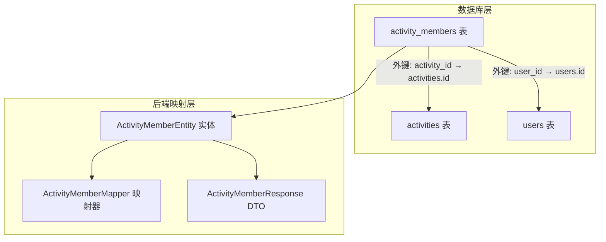
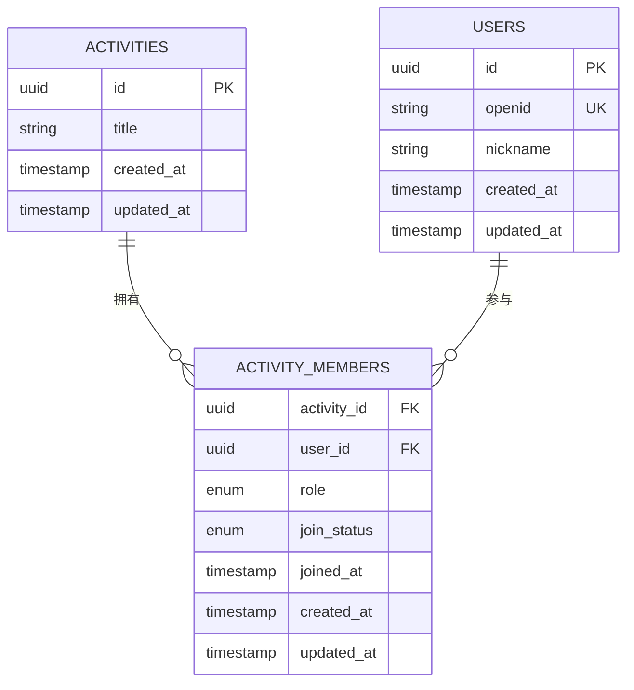
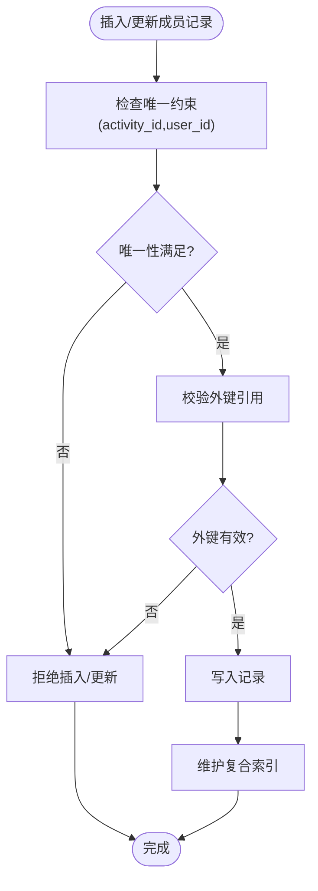
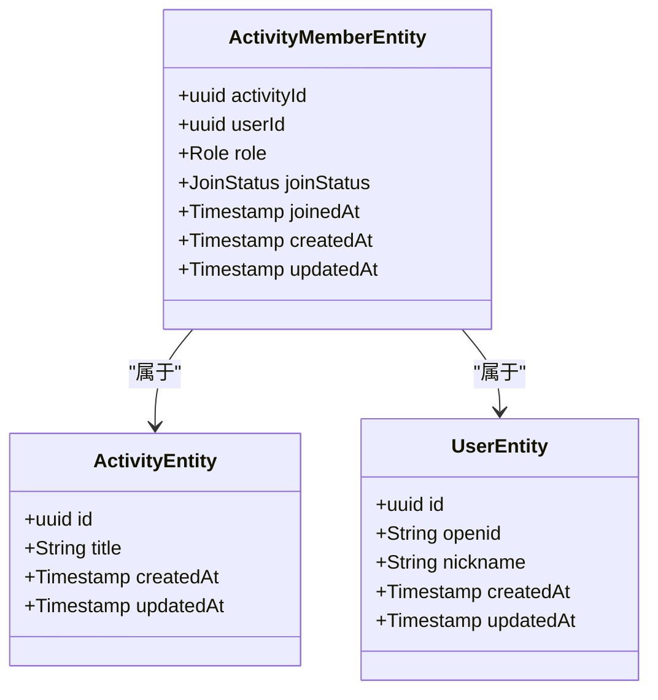

# 成员关系表(activity_members)

<cite>
**本文档引用的文件**
- [V1__init_core_tables.sql](file://backend/src/main/resources/db/migration/V1__init_core_tables.sql)
- [ActivityMemberEntity.java](file://backend/src/main/java/com/playminipro/activity/entity/ActivityMemberEntity.java)
- [ActivityMemberMapper.java](file://backend/src/main/java/com/playminipro/activity/mapper/ActivityMemberMapper.java)
- [ActivityMemberResponse.java](file://backend/src/main/java/com/playminipro/activity/dto/ActivityMemberResponse.java)
- [ActivityEntity.java](file://backend/src/main/java/com/playminipro/activity/entity/ActivityEntity.java)
- [UserEntity.java](file://backend/src/main/java/com/playminipro/auth/entity/UserEntity.java)
- [05-PostgreSQL建表.sql](file://doc/05-PostgreSQL建表.sql)
</cite>

## 目录
1. [简介](#简介)
2. [项目结构](#项目结构)
3. [核心组件](#核心组件)
4. [架构概览](#架构概览)
5. [详细组件分析](#详细组件分析)
6. [依赖分析](#依赖分析)
7. [性能考虑](#性能考虑)
8. [故障排除指南](#故障排除指南)
9. [结论](#结论)

## 简介
本文件针对PlayMiniPro项目中的成员关系表(activity_members)进行深入的数据模型分析。该表采用多对多关系设计，用于建立活动与用户之间的关联，支持活动成员管理、权限控制和状态跟踪。本文将从数据库层面的约束设计、Java实体映射、查询优化策略以及业务场景应用等维度进行全面解析。

## 项目结构
activity_members表位于数据库迁移脚本中，并通过JPA实体类在后端进行映射。其核心关联涉及以下文件：
- 数据库初始化脚本：定义表结构、主键、唯一约束、索引及外键约束
- Java实体类：映射activity_members表到对象模型
- Mapper接口：提供数据库访问方法
- DTO响应类：封装对外输出的成员信息

**图表来源**
- [V1__init_core_tables.sql:1-200](file://backend/src/main/resources/db/migration/V1__init_core_tables.sql#L1-L200)
- [ActivityMemberEntity.java:1-200](file://backend/src/main/java/com/playminipro/activity/entity/ActivityMemberEntity.java#L1-L200)
- [ActivityMemberMapper.java:1-200](file://backend/src/main/java/com/playminipro/activity/mapper/ActivityMemberMapper.java#L1-L200)
- [ActivityMemberResponse.java:1-200](file://backend/src/main/java/com/playminipro/activity/dto/ActivityMemberResponse.java#L1-L200)

**章节来源**
- [V1__init_core_tables.sql:1-200](file://backend/src/main/resources/db/migration/V1__init_core_tables.sql#L1-L200)
- [ActivityMemberEntity.java:1-200](file://backend/src/main/java/com/playminipro/activity/entity/ActivityMemberEntity.java#L1-L200)

## 核心组件
- 表名：activity_members
- 主要字段：
  - activity_id：活动标识，外键引用activities表
  - user_id：用户标识，外键引用users表
  - role：成员角色，区分活动创建者与普通成员
  - join_status：加入状态，包含已加入、退出、待审核等状态
  - joined_at：加入时间戳
  - created_at：记录创建时间戳
  - updated_at：记录更新时间戳
- 约束与索引：
  - 唯一约束：(activity_id, user_id)，确保用户在同一活动中仅能参与一次
  - 复合索引：idx_activity_members_user_status、idx_activity_members_activity_status
  - 外键约束：分别指向activities表和users表
  - 级联删除策略：当活动或用户被删除时，对应的成员关系记录将被级联删除

**章节来源**
- [V1__init_core_tables.sql:1-200](file://backend/src/main/resources/db/migration/V1__init_core_tables.sql#L1-L200)
- [ActivityMemberEntity.java:1-200](file://backend/src/main/java/com/playminipro/activity/entity/ActivityMemberEntity.java#L1-L200)

## 架构概览
activity_members作为活动与用户之间的关联表，承担以下职责：
- 维护多对多关系：一个活动可有多个成员，一个用户可参与多个活动
- 权限与角色管理：通过role字段区分活动创建者与普通成员
- 状态跟踪：通过join_status记录成员的加入、退出或待审核状态
- 时间戳管理：记录加入时间、创建与更新时间，便于审计与统计

**图表来源**
- [V1__init_core_tables.sql:1-200](file://backend/src/main/resources/db/migration/V1__init_core_tables.sql#L1-L200)
- [ActivityEntity.java:1-200](file://backend/src/main/java/com/playminipro/activity/entity/ActivityEntity.java#L1-L200)
- [UserEntity.java:1-200](file://backend/src/main/java/com/playminipro/auth/entity/UserEntity.java#L1-L200)

## 详细组件分析

### 数据库表结构与约束
- 唯一约束：(activity_id, user_id)确保用户在同一活动中的唯一性，防止重复参与
- 外键约束：
  - activity_id → activities.id：保证活动存在性
  - user_id → users.id：保证用户存在性
- 级联删除：当activities或users被删除时，activity_members中对应记录自动清理，避免悬挂引用
- 复合索引：
  - idx_activity_members_user_status：优化按用户和状态查询
  - idx_activity_members_activity_status：优化按活动和状态查询

**图表来源**
- [V1__init_core_tables.sql:1-200](file://backend/src/main/resources/db/migration/V1__init_core_tables.sql#L1-L200)

**章节来源**
- [V1__init_core_tables.sql:1-200](file://backend/src/main/resources/db/migration/V1__init_core_tables.sql#L1-L200)

### 角色字段(role)设计
- 活动创建者(creator)：通常由活动发起人自动获得，具备最高权限，可修改活动详情、管理成员、执行结算等操作
- 普通成员(member)：默认角色，可参与活动、查看活动信息、提交费用分摊等
- 设计原则：通过role字段在业务逻辑中区分不同权限，避免在代码中硬编码判断条件，提升扩展性

**章节来源**
- [ActivityMemberEntity.java:1-200](file://backend/src/main/java/com/playminipro/activity/entity/ActivityMemberEntity.java#L1-L200)
- [ActivityMemberResponse.java:1-200](file://backend/src/main/java/com/playminipro/activity/dto/ActivityMemberResponse.java#L1-L200)

### 加入状态(join_status)设计
- 已加入(joined)：用户正式成为活动成员，享有完整权限
- 退出(quit)：用户主动或被动退出活动，不再享有成员权限
- 待审核(waiting)：用户申请加入但尚未被批准，处于等待状态
- 状态流转：通常由业务流程控制，如管理员批准、用户取消申请、系统自动处理等

**章节来源**
- [ActivityMemberEntity.java:1-200](file://backend/src/main/java/com/playminipro/activity/entity/ActivityMemberEntity.java#L1-L200)
- [ActivityMemberResponse.java:1-200](file://backend/src/main/java/com/playminipro/activity/dto/ActivityMemberResponse.java#L1-L200)

### 时间戳字段的业务价值
- joined_at：记录用户实际加入活动的时间点，用于统计参与时长、计算费用分摊周期等
- created_at/updated_at：提供审计追踪能力，便于问题排查与数据变更追溯
- 业务用途：活动统计、财务结算、合规审计等场景均依赖这些时间戳

**章节来源**
- [ActivityMemberEntity.java:1-200](file://backend/src/main/java/com/playminipro/activity/entity/ActivityMemberEntity.java#L1-L200)

### 查询优化与索引策略
- idx_activity_members_user_status：针对用户维度的状态查询进行优化，如查询某用户的待审核活动列表
- idx_activity_members_activity_status：针对活动维度的状态查询进行优化，如查询某活动的已加入成员列表
- 复合索引设计：结合业务高频查询模式，减少全表扫描，提升查询性能

**章节来源**
- [V1__init_core_tables.sql:1-200](file://backend/src/main/resources/db/migration/V1__init_core_tables.sql#L1-L200)

### 典型数据示例
- 示例1：用户A加入活动X（状态为已加入）
  - activity_id：活动X的标识
  - user_id：用户A的标识
  - role：member
  - join_status：joined
  - joined_at：用户A实际加入时间
- 示例2：用户B申请加入活动Y（状态为待审核）
  - activity_id：活动Y的标识
  - user_id：用户B的标识
  - role：member
  - join_status：waiting
- 示例3：用户C退出活动X（状态为退出）
  - activity_id：活动X的标识
  - user_id：用户C的标识
  - role：member
  - join_status：quit

**章节来源**
- [ActivityMemberEntity.java:1-200](file://backend/src/main/java/com/playminipro/activity/entity/ActivityMemberEntity.java#L1-L200)

### 成员管理场景应用
- 用户加入活动：创建一条记录，状态设为waiting，等待管理员批准；批准后改为joined
- 用户退出活动：将状态改为quit，移除相关权限
- 活动解散：由于外键级联删除，活动被删除时，其所有成员关系记录自动清理
- 成员权限管理：根据role字段判断用户是否为活动创建者，从而授予相应权限

**章节来源**
- [ActivityMemberEntity.java:1-200](file://backend/src/main/java/com/playminipro/activity/entity/ActivityMemberEntity.java#L1-L200)
- [ActivityMemberMapper.java:1-200](file://backend/src/main/java/com/playminipro/activity/mapper/ActivityMemberMapper.java#L1-L200)

## 依赖分析
- 数据库层依赖：
  - activity_members依赖activities表和users表的主键
  - 外键约束确保参照完整性
- 后端映射层依赖：
  - ActivityMemberEntity映射activity_members表
  - ActivityMemberMapper提供数据访问接口
  - ActivityMemberResponse用于对外输出成员信息
- 实体间关系：
  - ActivityEntity与ActivityMemberEntity为一对多关系
  - UserEntity与ActivityMemberEntity为一对多关系

**图表来源**
- [ActivityMemberEntity.java:1-200](file://backend/src/main/java/com/playminipro/activity/entity/ActivityMemberEntity.java#L1-L200)
- [ActivityEntity.java:1-200](file://backend/src/main/java/com/playminipro/activity/entity/ActivityEntity.java#L1-L200)
- [UserEntity.java:1-200](file://backend/src/main/java/com/playminipro/auth/entity/UserEntity.java#L1-L200)

**章节来源**
- [ActivityMemberEntity.java:1-200](file://backend/src/main/java/com/playminipro/activity/entity/ActivityMemberEntity.java#L1-L200)
- [ActivityEntity.java:1-200](file://backend/src/main/java/com/playminipro/activity/entity/ActivityEntity.java#L1-L200)
- [UserEntity.java:1-200](file://backend/src/main/java/com/playminipro/auth/entity/UserEntity.java#L1-L200)

## 性能考虑
- 唯一约束：防止重复参与，减少冗余数据，降低存储与查询开销
- 复合索引：针对高频查询场景优化，显著提升查询效率
- 级联删除：简化数据清理流程，避免孤立数据产生
- 建议：定期监控查询计划，根据实际业务增长调整索引策略

## 故障排除指南
- 唯一约束冲突：当尝试重复添加同一用户到同一活动时会失败，需先检查现有状态或允许用户退出后再重新加入
- 外键约束错误：插入或更新时若引用不存在的活动或用户，数据库会拒绝操作
- 状态不一致：确保状态流转遵循业务规则，避免出现非法状态组合
- 索引失效：当查询条件未命中索引时，应检查SQL语句与索引设计是否匹配

**章节来源**
- [V1__init_core_tables.sql:1-200](file://backend/src/main/resources/db/migration/V1__init_core_tables.sql#L1-L200)

## 结论
activity_members表通过严谨的约束设计与合理的索引策略，实现了活动与用户之间高效、可靠的多对多关联。角色与状态字段的引入使得成员管理具备清晰的权限边界与业务语义，配合时间戳字段为审计与统计提供了坚实基础。整体设计兼顾了数据一致性、查询性能与业务扩展性，是PlayMiniPro成员管理体系的核心数据支撑。