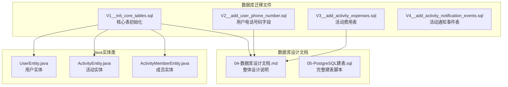
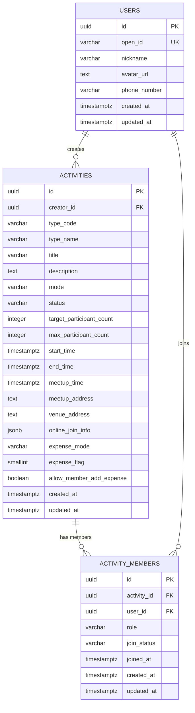
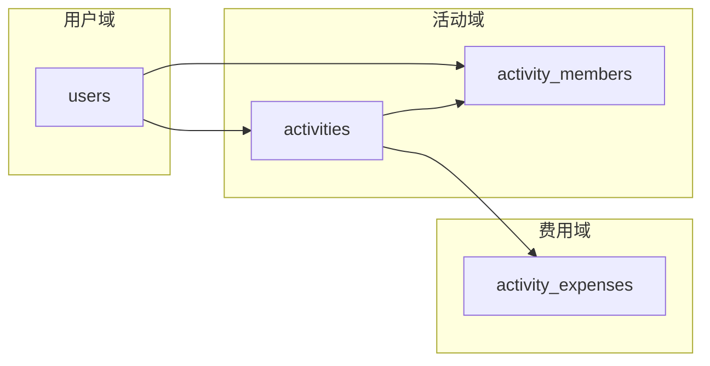
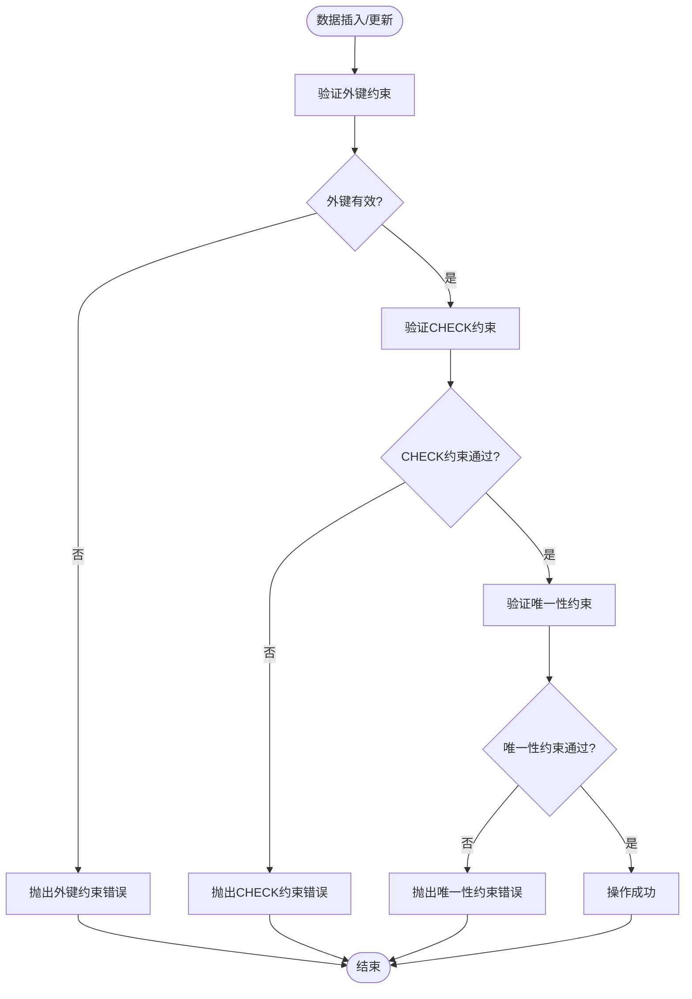

# 核心数据表

<cite>
**本文档引用的文件**
- [V1__init_core_tables.sql](file://backend/src/main/resources/db/migration/V1__init_core_tables.sql)
- [V2__add_user_phone_number.sql](file://backend/src/main/resources/db/migration/V2__add_user_phone_number.sql)
- [V3__add_activity_expenses.sql](file://backend/src/main/resources/db/migration/V3__add_activity_expenses.sql)
- [05-PostgreSQL建表.sql](file://doc/05-PostgreSQL建表.sql)
- [04-数据库设计文档.md](file://doc/04-数据库设计文档.md)
- [UserEntity.java](file://backend/src/main/java/com/playminipro/auth/entity/UserEntity.java)
- [ActivityEntity.java](file://backend/src/main/java/com/playminipro/activity/entity/ActivityEntity.java)
- [ActivityMemberEntity.java](file://backend/src/main/java/com/playminipro/activity/entity/ActivityMemberEntity.java)
- [application.yml](file://backend/src/main/resources/application.yml)
</cite>

## 目录
1. [简介](#简介)
2. [项目结构](#项目结构)
3. [核心组件](#核心组件)
4. [架构概览](#架构概览)
5. [详细组件分析](#详细组件分析)
6. [依赖关系分析](#依赖关系分析)
7. [性能考虑](#性能考虑)
8. [故障排除指南](#故障排除指南)
9. [结论](#结论)

## 简介

PlayMiniPro是一个基于微信小程序的活动组织平台，专注于朋友间的聚会活动管理。本文档深入分析了项目的核心数据表结构设计，包括用户表(users)、活动表(activities)和成员关系表(activity_members)，并详细解释了表结构设计原理、约束条件、索引策略以及表间关系。

该系统采用PostgreSQL作为数据库引擎，利用其强大的数据类型支持和约束机制来确保数据完整性。通过UUID主键设计、JSONB字段使用和严格的CHECK约束，系统能够高效地管理复杂的活动组织场景。

## 项目结构

项目采用分层架构设计，数据库迁移文件位于`backend/src/main/resources/db/migration/`目录下，包含了完整的数据库版本化管理：



**图表来源**
- [V1__init_core_tables.sql:1-58](file://backend/src/main/resources/db/migration/V1__init_core_tables.sql#L1-L58)
- [04-数据库设计文档.md:1-537](file://doc/04-数据库设计文档.md#L1-L537)

**章节来源**
- [V1__init_core_tables.sql:1-58](file://backend/src/main/resources/db/migration/V1__init_core_tables.sql#L1-L58)
- [application.yml:1-53](file://backend/src/main/resources/application.yml#L1-L53)

## 核心组件

### 数据库连接配置

系统使用Flyway进行数据库迁移管理，默认配置如下：
- 数据库URL: jdbc:postgresql://localhost:5433/play_minipro
- 用户名: play
- 密码: play1234
- 迁移文件位置: classpath:db/migration

### 扩展支持

系统启用了pgcrypto扩展，为UUID生成提供支持：
```sql
CREATE EXTENSION IF NOT EXISTS pgcrypto;
```

**章节来源**
- [application.yml:10-22](file://backend/src/main/resources/application.yml#L10-L22)
- [V1__init_core_tables.sql:1](file://backend/src/main/resources/db/migration/V1__init_core_tables.sql#L1)

## 架构概览

系统采用三层架构设计，核心业务逻辑由三个主要表支撑：



**图表来源**
- [V1__init_core_tables.sql:3-10](file://backend/src/main/resources/db/migration/V1__init_core_tables.sql#L3-L10)
- [V1__init_core_tables.sql:12-38](file://backend/src/main/resources/db/migration/V1__init_core_tables.sql#L12-L38)
- [V1__init_core_tables.sql:43-55](file://backend/src/main/resources/db/migration/V1__init_core_tables.sql#L43-L55)

## 详细组件分析

### 用户表 (users)

#### 表结构设计

用户表是系统的基础表，存储所有用户的基本信息：

| 字段名 | 数据类型 | 约束条件 | 描述 |
|--------|----------|----------|------|
| id | UUID | PRIMARY KEY, DEFAULT gen_random_uuid() | 用户唯一标识符 |
| open_id | VARCHAR(128) | NOT NULL, UNIQUE | 微信开放平台用户标识 |
| nickname | VARCHAR(64) | NOT NULL | 用户昵称 |
| avatar_url | TEXT | NULLABLE | 头像URL地址 |
| phone_number | VARCHAR(32) | NULLABLE | 电话号码（后期添加） |
| created_at | TIMESTAMPTZ | NOT NULL, DEFAULT NOW() | 创建时间 |
| updated_at | TIMESTAMPTZ | NOT NULL, DEFAULT NOW() | 更新时间 |

#### 设计优势

1. **UUID主键设计**：
   - 提供全局唯一性，避免分布式环境下的ID冲突
   - 不暴露业务信息，增强安全性
   - 支持水平扩展，无需担心自增ID瓶颈

2. **微信集成**：
   - open_id字段专门用于微信用户识别
   - 支持多平台用户关联（union_id）

#### 索引设计

```sql
CREATE INDEX IF NOT EXISTS idx_users_union_id ON users(union_id);
```

**章节来源**
- [V1__init_core_tables.sql:3-10](file://backend/src/main/resources/db/migration/V1__init_core_tables.sql#L3-L10)
- [V2__add_user_phone_number.sql:1-2](file://backend/src/main/resources/db/migration/V2__add_user_phone_number.sql#L1-L2)
- [05-PostgreSQL建表.sql:97-108](file://doc/05-PostgreSQL建表.sql#L97-L108)

### 活动表 (activities)

#### 表结构设计

活动表存储活动的详细信息和配置：

| 字段名 | 数据类型 | 约束条件 | 描述 |
|--------|----------|----------|------|
| id | UUID | PRIMARY KEY, DEFAULT gen_random_uuid() | 活动唯一标识符 |
| creator_id | UUID | NOT NULL, REFERENCES users(id) | 创建者ID |
| type_code | VARCHAR(64) | NOT NULL | 活动类型编码 |
| type_name | VARCHAR(64) | NOT NULL | 活动类型名称 |
| title | VARCHAR(128) | NOT NULL | 活动标题 |
| description | TEXT | NULLABLE | 活动描述 |
| mode | VARCHAR(16) | NOT NULL | 活动模式（online/offline） |
| status | VARCHAR(32) | NOT NULL | 活动状态 |
| target_participant_count | INTEGER | NOT NULL | 目标参与者数量 |
| max_participant_count | INTEGER | NOT NULL | 最大参与者数量 |
| start_time | TIMESTAMPTZ | NOT NULL | 开始时间 |
| end_time | TIMESTAMPTZ | NULLABLE | 结束时间 |
| meetup_time | TIMESTAMPTZ | NULLABLE | 集合时间 |
| meetup_address | TEXT | NULLABLE | 集合地点 |
| venue_address | TEXT | NULLABLE | 场地地址 |
| online_join_info | JSONB | NULLABLE | 在线加入信息 |
| expense_mode | VARCHAR(32) | NOT NULL | 费用模式 |
| expense_flag | SMALLINT | NOT NULL, DEFAULT 0 | 费用标记 |
| allow_member_add_expense | BOOLEAN | NOT NULL, DEFAULT TRUE | 允许成员添加费用 |
| created_at | TIMESTAMPTZ | NOT NULL, DEFAULT NOW() | 创建时间 |
| updated_at | TIMESTAMPTZ | NOT NULL, DEFAULT NOW() | 更新时间 |

#### 约束设计

```sql
CONSTRAINT chk_activity_mode CHECK (mode IN ('online', 'offline'))
CONSTRAINT chk_activity_status CHECK (status IN ('draft', 'recruiting', 'full', 'pending_start', 'in_progress', 'finished', 'cancelled'))
CONSTRAINT chk_expense_mode CHECK (expense_mode IN ('none', 'aa', 'host_treat', 'designated_treat'))
CONSTRAINT chk_participant_count CHECK (max_participant_count >= target_participant_count)
```

#### JSONB字段使用场景

`online_join_info`字段使用JSONB类型存储在线活动的加入信息，包括：
- 会议链接
- 密码信息
- 加入方式说明
- 其他动态配置信息

#### 索引设计

```sql
CREATE INDEX IF NOT EXISTS idx_activities_creator_status ON activities(creator_id, status);
CREATE INDEX IF NOT EXISTS idx_activities_start_time ON activities(start_time);
```

**章节来源**
- [V1__init_core_tables.sql:12-38](file://backend/src/main/resources/db/migration/V1__init_core_tables.sql#L12-L38)
- [V3__add_activity_expenses.sql:1-12](file://backend/src/main/resources/db/migration/V3__add_activity_expenses.sql#L1-L12)
- [05-PostgreSQL建表.sql:112-141](file://doc/05-PostgreSQL建表.sql#L112-L141)

### 成员关系表 (activity_members)

#### 表结构设计

成员关系表管理用户与活动之间的参与关系：

| 字段名 | 数据类型 | 约束条件 | 描述 |
|--------|----------|----------|------|
| id | UUID | PRIMARY KEY, DEFAULT gen_random_uuid() | 成员关系唯一标识符 |
| activity_id | UUID | NOT NULL, REFERENCES activities(id) ON DELETE CASCADE | 活动ID |
| user_id | UUID | NOT NULL, REFERENCES users(id) | 用户ID |
| role | VARCHAR(16) | NOT NULL | 用户角色 |
| join_status | VARCHAR(16) | NOT NULL | 加入状态 |
| joined_at | TIMESTAMPTZ | NOT NULL, DEFAULT NOW() | 加入时间 |
| created_at | TIMESTAMPTZ | NOT NULL, DEFAULT NOW() | 创建时间 |
| updated_at | TIMESTAMPTZ | NOT NULL, DEFAULT NOW() | 更新时间 |

#### 约束设计

```sql
UNIQUE(activity_id, user_id)
CONSTRAINT chk_member_role CHECK (role IN ('creator', 'member'))
CONSTRAINT chk_join_status CHECK (join_status IN ('joined', 'quit', 'waiting'))
```

#### 级联删除策略

当活动被删除时，相关的成员关系会自动删除，确保数据一致性。

**章节来源**
- [V1__init_core_tables.sql:43-55](file://backend/src/main/resources/db/migration/V1__init_core_tables.sql#L43-L55)
- [05-PostgreSQL建表.sql:147-161](file://doc/05-PostgreSQL建表.sql#L147-L161)

## 依赖关系分析

### 外键关系设计

系统采用严格的外键约束确保数据完整性：



**图表来源**
- [V1__init_core_tables.sql:14](file://backend/src/main/resources/db/migration/V1__init_core_tables.sql#L14)
- [V1__init_core_tables.sql:45](file://backend/src/main/resources/db/migration/V1__init_core_tables.sql#L45)
- [V3__add_activity_expenses.sql:3](file://backend/src/main/resources/db/migration/V3__add_activity_expenses.sql#L3)

### 约束验证流程



**图表来源**
- [V1__init_core_tables.sql:34-37](file://backend/src/main/resources/db/migration/V1__init_core_tables.sql#L34-L37)
- [V1__init_core_tables.sql:53-54](file://backend/src/main/resources/db/migration/V1__init_core_tables.sql#L53-L54)

**章节来源**
- [V1__init_core_tables.sql:34-58](file://backend/src/main/resources/db/migration/V1__init_core_tables.sql#L34-L58)

## 性能考虑

### 索引优化策略

#### 复合索引设计

1. **活动查询优化**：
   ```sql
   CREATE INDEX IF NOT EXISTS idx_activities_creator_status ON activities(creator_id, status);
   CREATE INDEX IF NOT EXISTS idx_activities_start_time ON activities(start_time);
   ```

2. **成员查询优化**：
   ```sql
   CREATE INDEX IF NOT EXISTS idx_activity_members_user_status ON activity_members(user_id, join_status);
   CREATE INDEX IF NOT EXISTS idx_activity_members_activity_status ON activity_members(activity_id, join_status);
   ```

#### 查询性能优化建议

1. **时间范围查询**：利用start_time索引优化活动列表查询
2. **状态过滤**：通过复合索引优化按状态筛选
3. **用户参与查询**：使用用户ID和状态组合索引快速定位用户参与的活动

### 数据类型选择

1. **TIMESTAMPTZ**：统一使用带时区的时间戳，确保全球用户的一致性
2. **JSONB**：使用二进制JSON格式存储动态配置，支持高效查询和更新
3. **SMALLINT**：费用标志使用小整型，节省存储空间

**章节来源**
- [V1__init_core_tables.sql:40-41](file://backend/src/main/resources/db/migration/V1__init_core_tables.sql#L40-L41)
- [V1__init_core_tables.sql:57-58](file://backend/src/main/resources/db/migration/V1__init_core_tables.sql#L57-L58)

## 故障排除指南

### 常见约束错误

#### 外键约束错误
**错误现象**：插入或更新数据时报外键约束错误
**解决方案**：
1. 确认关联的用户ID存在
2. 检查活动ID的有效性
3. 验证数据类型匹配

#### CHECK约束错误
**错误现象**：状态值不在允许范围内
**解决方案**：
1. 检查枚举值是否正确
2. 验证业务逻辑的合理性
3. 确认数据转换的正确性

#### 唯一性约束错误
**错误现象**：重复的用户参与记录
**解决方案**：
1. 检查用户是否已参与活动
2. 验证UNIQUE约束的逻辑
3. 处理用户退出后再加入的情况

### 数据迁移问题

#### Flyway迁移失败
**错误现象**：数据库迁移执行失败
**解决方案**：
1. 检查数据库连接配置
2. 验证迁移文件的完整性
3. 查看具体的错误日志

**章节来源**
- [application.yml:20-22](file://backend/src/main/resources/application.yml#L20-L22)

## 结论

PlayMiniPro项目的核心数据表设计体现了现代数据库设计的最佳实践：

### 设计亮点

1. **UUID主键设计**：提供了全局唯一性和安全性，支持分布式部署
2. **严格约束机制**：通过外键、CHECK和唯一性约束确保数据完整性
3. **灵活的JSONB存储**：支持动态配置和扩展需求
4. **优化的索引策略**：针对高频查询场景进行了专门优化

### 业务价值

1. **活动管理**：完整的活动生命周期管理
2. **成员关系**：清晰的参与关系追踪
3. **费用控制**：灵活的费用分摊机制
4. **扩展性**：为未来功能扩展预留空间

### 技术优势

1. **PostgreSQL特性**：充分利用了现代数据库的强大功能
2. **版本化管理**：通过Flyway实现数据库的版本控制
3. **类型安全**：Java实体类与数据库表结构保持一致
4. **性能优化**：针对实际业务场景进行了专门的性能优化

这套数据表设计为PlayMiniPro项目提供了坚实的数据基础，能够支持复杂的活动组织场景，并为未来的功能扩展奠定了良好的技术基础。