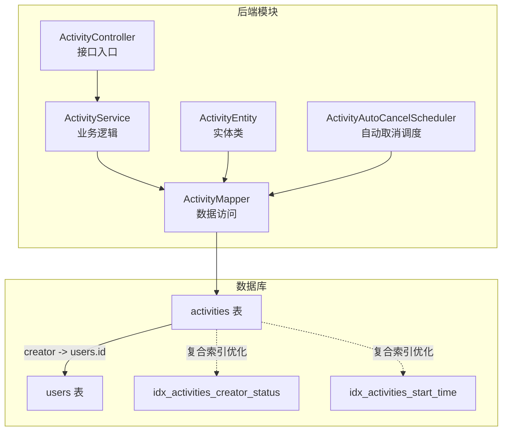
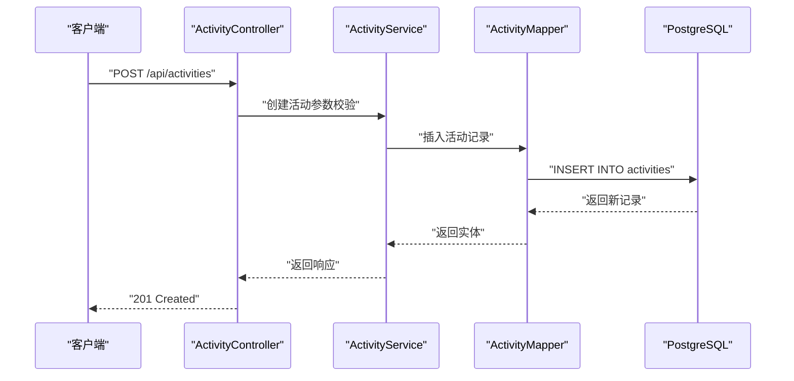
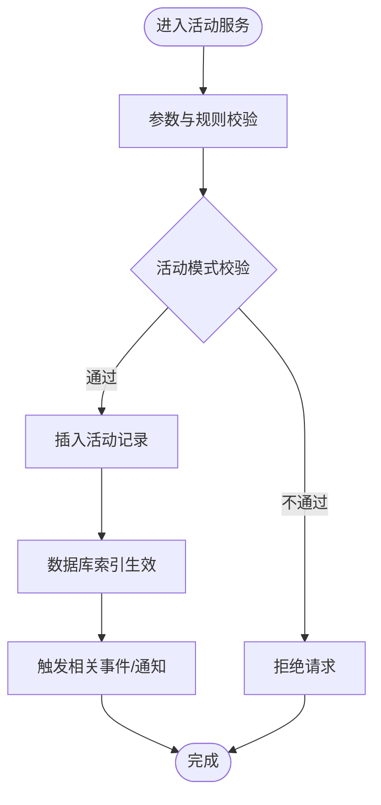
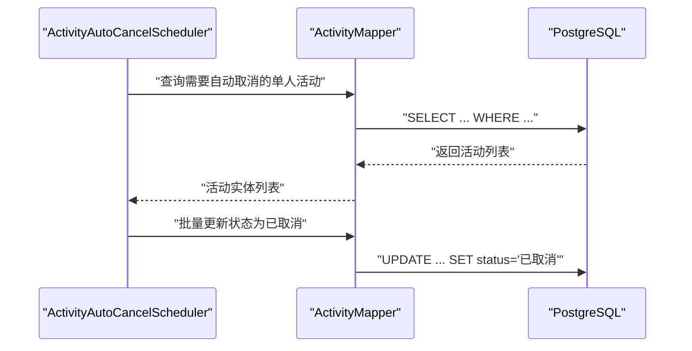
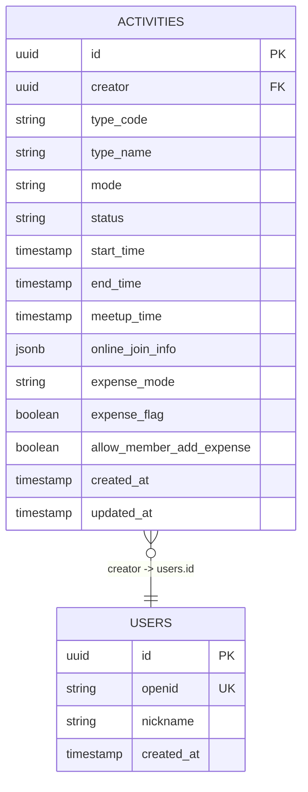
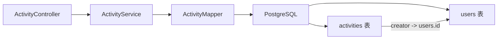

# 活动表(activities)

<cite>
**本文档引用的文件**
- [V1__init_core_tables.sql](file://backend/src/main/resources/db/migration/V1__init_core_tables.sql)
- [ActivityEntity.java](file://backend/src/main/java/com/playminipro/activity/entity/ActivityEntity.java)
- [ActivityMapper.java](file://backend/src/main/java/com/playminipro/activity/mapper/ActivityMapper.java)
- [ActivityController.java](file://backend/src/main/java/com/playminipro/activity/controller/ActivityController.java)
- [ActivityService.java](file://backend/src/main/java/com/playminipro/activity/service/ActivityService.java)
- [ActivityAutoCancelScheduler.java](file://backend/src/main/java/com/playminipro/activity/service/ActivityAutoCancelScheduler.java)
- [04-数据库设计文档.md](file://doc/04-数据库设计文档.md)
- [05-PostgreSQL建表.sql](file://doc/05-PostgreSQL建表.sql)
</cite>

## 目录
1. [简介](#简介)
2. [项目结构](#项目结构)
3. [核心组件](#核心组件)
4. [架构总览](#架构总览)
5. [详细组件分析](#详细组件分析)
6. [依赖分析](#依赖分析)
7. [性能考虑](#性能考虑)
8. [故障排除指南](#故障排除指南)
9. [结论](#结论)
10. [附录](#附录)

## 简介
本文件聚焦于PlayMiniPro项目中活动表(activities)的数据模型设计与实现，系统性阐述以下主题：
- UUID主键设计与外键关联users表的机制
- 活动类型(type_code/type_name)、活动模式(mode)、活动状态(status)等字段的设计原理与取值范围
- 时间字段(start_time、end_time、meetup_time)的时间戳设计考量
- JSONB类型的online_join_info在在线活动中的灵活数据存储优势
- 费用相关字段(expense_mode、expense_flag、allow_member_add_expense)的设计理念
- CHECK约束对活动模式、状态枚举、参与者数量的控制作用
- 复合索引(idx_activities_creator_status、idx_activities_start_time)的查询优化策略
- 完整的数据示例与典型业务场景应用

## 项目结构
活动表(activities)是后端Java服务与数据库迁移脚本共同定义的核心数据结构之一。其在后端通过实体类、映射器、控制器与服务层协同工作，并由数据库迁移脚本在PostgreSQL中落地。

**图表来源**
- [ActivityEntity.java](file://backend/src/main/java/com/playminipro/activity/entity/ActivityEntity.java)
- [ActivityMapper.java](file://backend/src/main/java/com/playminipro/activity/mapper/ActivityMapper.java)
- [ActivityController.java](file://backend/src/main/java/com/playminipro/activity/controller/ActivityController.java)
- [ActivityAutoCancelScheduler.java](file://backend/src/main/java/com/playminipro/activity/service/ActivityAutoCancelScheduler.java)
- [V1__init_core_tables.sql](file://backend/src/main/resources/db/migration/V1__init_core_tables.sql)

**章节来源**
- [ActivityEntity.java](file://backend/src/main/java/com/playminipro/activity/entity/ActivityEntity.java)
- [ActivityMapper.java](file://backend/src/main/java/com/playminipro/activity/mapper/ActivityMapper.java)
- [ActivityController.java](file://backend/src/main/java/com/playminipro/activity/controller/ActivityController.java)
- [ActivityService.java](file://backend/src/main/java/com/playminipro/activity/service/ActivityService.java)
- [ActivityAutoCancelScheduler.java](file://backend/src/main/java/com/playminipro/activity/service/ActivityAutoCancelScheduler.java)
- [V1__init_core_tables.sql](file://backend/src/main/resources/db/migration/V1__init_core_tables.sql)

## 核心组件
- 实体类：封装activities表的字段与业务语义，用于ORM映射与业务对象传递
- 映射器：定义SQL查询与更新操作，覆盖创建、查询、更新、统计等常用场景
- 控制器：对外暴露REST接口，处理活动的创建、查询、参与等请求
- 服务层：编排业务规则，如自动取消流程、费用结算等
- 数据库：通过迁移脚本创建activities表及索引，建立与users表的外键关联

**章节来源**
- [ActivityEntity.java](file://backend/src/main/java/com/playminipro/activity/entity/ActivityEntity.java)
- [ActivityMapper.java](file://backend/src/main/java/com/playminipro/activity/mapper/ActivityMapper.java)
- [ActivityController.java](file://backend/src/main/java/com/playminipro/activity/controller/ActivityController.java)
- [ActivityService.java](file://backend/src/main/java/com/playminipro/activity/service/ActivityService.java)
- [ActivityAutoCancelScheduler.java](file://backend/src/main/java/com/playminipro/activity/service/ActivityAutoCancelScheduler.java)
- [V1__init_core_tables.sql](file://backend/src/main/resources/db/migration/V1__init_core_tables.sql)

## 架构总览
活动表在系统中的数据流如下：前端通过控制器发起请求，服务层执行业务规则，映射器将实体持久化到activities表；同时通过外键与users表关联，确保创建者与用户数据一致；数据库层面通过索引提升查询效率。

**图表来源**
- [ActivityController.java](file://backend/src/main/java/com/playminipro/activity/controller/ActivityController.java)
- [ActivityService.java](file://backend/src/main/java/com/playminipro/activity/service/ActivityService.java)
- [ActivityMapper.java](file://backend/src/main/java/com/playminipro/activity/mapper/ActivityMapper.java)
- [V1__init_core_tables.sql](file://backend/src/main/resources/db/migration/V1__init_core_tables.sql)

## 详细组件分析

### 数据模型设计要点
- 主键与外键
  - 主键采用UUID类型，保证全局唯一性与分布式安全性
  - 外键creator指向users表的id，确保活动与创建者的一致性与可追溯性
- 字段设计
  - 类型字段：type_code与type_name用于标识活动类别，便于分类统计与展示
  - 模式字段：mode用于区分线下、线上或混合活动，驱动后续流程（如自动取消、通知策略）
  - 状态字段：status用于控制活动生命周期（如待开始、进行中、已结束、已取消），配合CHECK约束限制取值
  - 时间字段：start_time、end_time、meetup_time分别表示活动起止时间与集合时间，统一采用时间戳以支持时区与排序
  - 在线信息：online_join_info使用JSONB存储，灵活承载不同活动类型的在线接入参数
  - 费用字段：expense_mode控制费用模式（如AA、发起人承担等），expense_flag标记是否产生费用，allow_member_add_expense允许成员记账的开关
- 约束与索引
  - CHECK约束：限制mode、status等枚举值，保障数据一致性
  - 复合索引：idx_activities_creator_status优化按创建者与状态的筛选；idx_activities_start_time优化按开始时间的排序与范围查询

**章节来源**
- [V1__init_core_tables.sql](file://backend/src/main/resources/db/migration/V1__init_core_tables.sql)
- [ActivityEntity.java](file://backend/src/main/java/com/playminipro/activity/entity/ActivityEntity.java)

### 字段详解与取值范围
- 活动类型(type_code、type_name)
  - 设计目的：对活动进行分类，便于前端展示与后台统计
  - 取值范围：由业务字典或枚举维护，建议通过约束或应用层校验限定
- 活动模式(mode)
  - 设计目的：区分线下、线上或混合活动，驱动流程差异（如自动取消、通知策略）
  - 建议取值：例如线下、线上、混合
  - 约束：通过CHECK约束限制取值，避免脏数据
- 活动状态(status)
  - 设计目的：管理活动生命周期，支撑UI状态与业务流程
  - 建议取值：例如待开始、进行中、已结束、已取消
  - 约束：通过CHECK约束限制取值
- 时间字段(start_time、end_time、meetup_time)
  - 设计目的：统一时间戳格式，便于排序、范围查询与时区处理
  - 设计考虑：建议使用带时区的时间戳，确保跨时区一致性
- online_join_info(JSONB)
  - 设计目的：为不同活动类型提供灵活的在线接入参数存储
  - 优势：无需固定Schema，降低变更成本，支持动态扩展
- 费用相关字段
  - expense_mode：费用分摊模式（如AA、发起人承担）
  - expense_flag：是否产生费用的标记
  - allow_member_add_expense：是否允许成员添加费用

**章节来源**
- [V1__init_core_tables.sql](file://backend/src/main/resources/db/migration/V1__init_core_tables.sql)
- [ActivityEntity.java](file://backend/src/main/java/com/playminipro/activity/entity/ActivityEntity.java)

### 查询与更新流程
- 创建活动
  - 控制器接收请求并调用服务层
  - 服务层进行参数校验与规则处理
  - 映射器执行INSERT，写入activities表
- 查询活动
  - 支持按ID查询、按创建者与状态组合查询、按开始时间范围查询
  - 复合索引提升查询性能
- 更新活动
  - 支持状态变更、时间调整、在线信息更新等
  - 通过UPDATE语句更新对应字段

**图表来源**
- [ActivityService.java](file://backend/src/main/java/com/playminipro/activity/service/ActivityService.java)
- [ActivityMapper.java](file://backend/src/main/java/com/playminipro/activity/mapper/ActivityMapper.java)
- [V1__init_core_tables.sql](file://backend/src/main/resources/db/migration/V1__init_core_tables.sql)

**章节来源**
- [ActivityService.java](file://backend/src/main/java/com/playminipro/activity/service/ActivityService.java)
- [ActivityMapper.java](file://backend/src/main/java/com/playminipro/activity/mapper/ActivityMapper.java)
- [ActivityController.java](file://backend/src/main/java/com/playminipro/activity/controller/ActivityController.java)

### 自动取消流程
- 针对单人活动（mode=solo）设置自动取消策略
- 定时任务扫描满足条件的活动，将其状态更新为“已取消”
- 通过映射器查询需要自动取消的活动列表，再批量更新状态

**图表来源**
- [ActivityAutoCancelScheduler.java](file://backend/src/main/java/com/playminipro/activity/service/ActivityAutoCancelScheduler.java)
- [ActivityMapper.java](file://backend/src/main/java/com/playminipro/activity/mapper/ActivityMapper.java)
- [V1__init_core_tables.sql](file://backend/src/main/resources/db/migration/V1__init_core_tables.sql)

**章节来源**
- [ActivityAutoCancelScheduler.java](file://backend/src/main/java/com/playminipro/activity/service/ActivityAutoCancelScheduler.java)
- [ActivityMapper.java](file://backend/src/main/java/com/playminipro/activity/mapper/ActivityMapper.java)

### 数据模型图

**图表来源**
- [V1__init_core_tables.sql](file://backend/src/main/resources/db/migration/V1__init_core_tables.sql)

## 依赖分析
- 组件耦合
  - ActivityController依赖ActivityService
  - ActivityService依赖ActivityMapper
  - ActivityMapper依赖PostgreSQL数据库
  - activities表依赖users表的外键约束
- 索引依赖
  - idx_activities_creator_status与按创建者与状态的查询强相关
  - idx_activities_start_time与按开始时间的排序/范围查询强相关

**图表来源**
- [ActivityController.java](file://backend/src/main/java/com/playminipro/activity/controller/ActivityController.java)
- [ActivityService.java](file://backend/src/main/java/com/playminipro/activity/service/ActivityService.java)
- [ActivityMapper.java](file://backend/src/main/java/com/playminipro/activity/mapper/ActivityMapper.java)
- [V1__init_core_tables.sql](file://backend/src/main/resources/db/migration/V1__init_core_tables.sql)

**章节来源**
- [ActivityController.java](file://backend/src/main/java/com/playminipro/activity/controller/ActivityController.java)
- [ActivityService.java](file://backend/src/main/java/com/playminipro/activity/service/ActivityService.java)
- [ActivityMapper.java](file://backend/src/main/java/com/playminipro/activity/mapper/ActivityMapper.java)
- [V1__init_core_tables.sql](file://backend/src/main/resources/db/migration/V1__init_core_tables.sql)

## 性能考虑
- 复合索引策略
  - idx_activities_creator_status：加速按创建者与状态的过滤
  - idx_activities_start_time：加速按开始时间的排序与范围查询
- 查询优化建议
  - 使用LIMIT与分页，避免全表扫描
  - 对频繁过滤的字段（如status、mode）保持合理基数
- 写入优化
  - 批量插入与更新，减少事务开销
  - 合理使用JSONB字段，避免过度嵌套导致查询复杂度上升

[本节为通用性能指导，不直接分析具体文件]

## 故障排除指南
- 状态更新异常
  - 检查CHECK约束是否限制了非法状态值
  - 确认状态流转是否符合业务规则
- 外键关联失败
  - 确认users表中是否存在对应的creator记录
- 查询性能问题
  - 确认复合索引是否被正确使用
  - 分析执行计划，避免隐式转换导致索引失效
- 自动取消未生效
  - 检查定时任务是否正常运行
  - 确认查询单人活动的条件是否正确

**章节来源**
- [ActivityAutoCancelScheduler.java](file://backend/src/main/java/com/playminipro/activity/service/ActivityAutoCancelScheduler.java)
- [ActivityMapper.java](file://backend/src/main/java/com/playminipro/activity/mapper/ActivityMapper.java)
- [V1__init_core_tables.sql](file://backend/src/main/resources/db/migration/V1__init_core_tables.sql)

## 结论
活动表(activities)通过UUID主键与users表的外键关联，结合类型、模式、状态等字段的清晰设计，以及JSONB在线信息与费用相关字段的灵活扩展能力，形成了高内聚、低耦合且易于演进的数据模型。配合CHECK约束与复合索引，既保障了数据一致性，又提升了查询性能。自动取消等业务流程进一步体现了该模型在真实场景中的实用性与可维护性。

[本节为总结性内容，不直接分析具体文件]

## 附录

### 完整数据示例与业务场景
- 示例场景一：线下徒步活动
  - type_code/type_name：户外/徒步
  - mode：线下
  - status：待开始
  - start_time/end_time：活动起止时间
  - meetup_time：集合时间
  - expense_flag：true（产生费用）
  - expense_mode：AA
  - allow_member_add_expense：true
- 示例场景二：线上直播活动
  - type_code/type_name：知识/直播
  - mode：线上
  - status：进行中
  - start_time/end_time：直播起止时间
  - online_join_info：包含直播房间号、推流地址等JSON参数
  - expense_flag：false（无费用）
- 示例场景三：混合模式活动
  - type_code/type_name：聚会/聚餐
  - mode：混合
  - status：已结束
  - start_time/end_time：活动起止时间
  - meetup_time：集合时间
  - online_join_info：包含会议室链接等
  - expense_flag：true（产生费用）

**章节来源**
- [ActivityEntity.java](file://backend/src/main/java/com/playminipro/activity/entity/ActivityEntity.java)
- [V1__init_core_tables.sql](file://backend/src/main/resources/db/migration/V1__init_core_tables.sql)