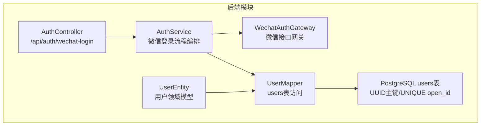
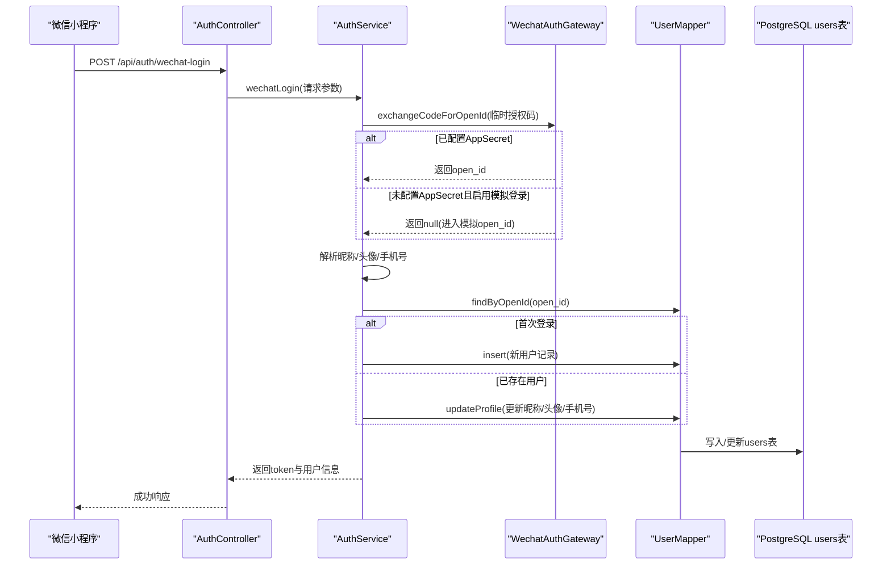
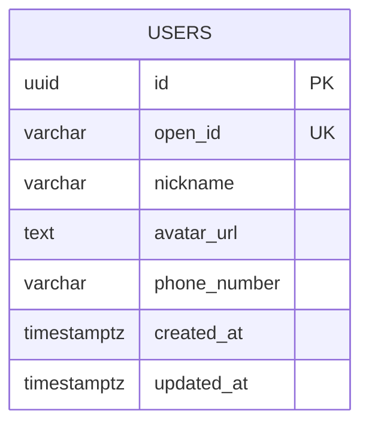
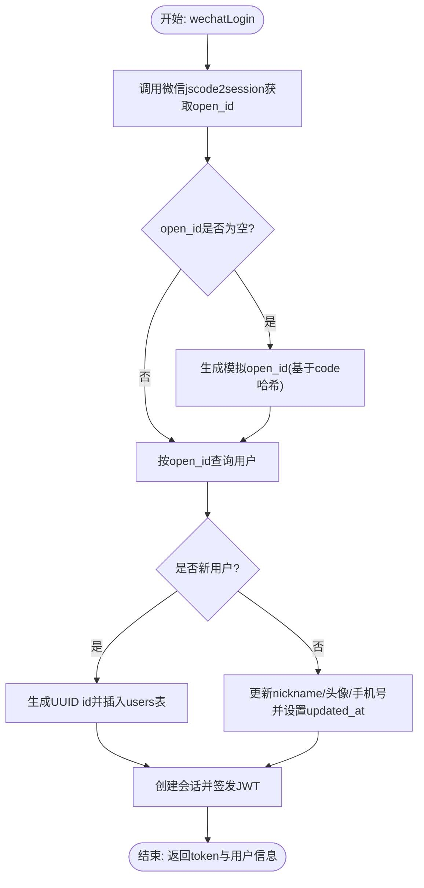
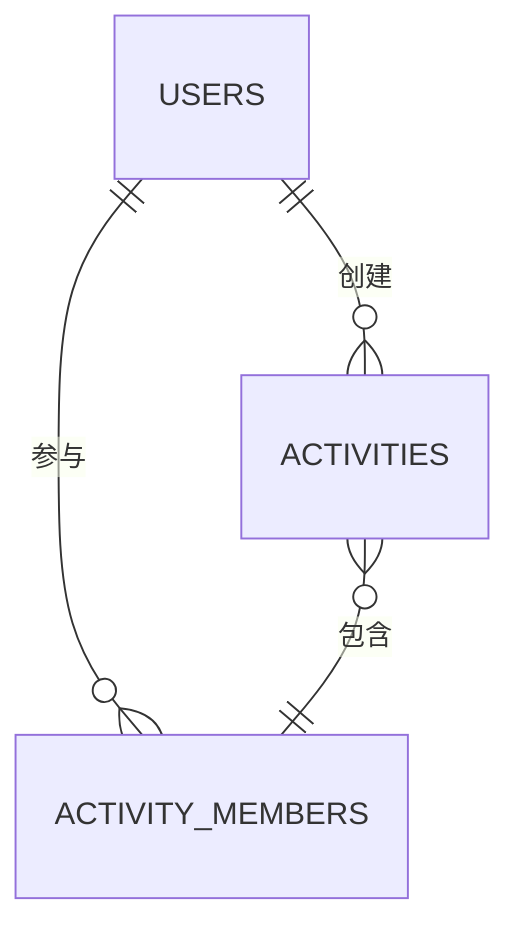
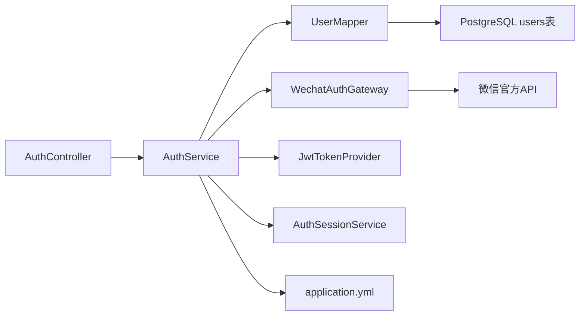

# 用户表(users)

<cite>
**本文引用的文件**
- [UserEntity.java](file://backend/src/main/java/com/playminipro/auth/entity/UserEntity.java)
- [UserMapper.java](file://backend/src/main/java/com/playminipro/auth/mapper/UserMapper.java)
- [V1__init_core_tables.sql](file://backend/src/main/resources/db/migration/V1__init_core_tables.sql)
- [AuthService.java](file://backend/src/main/java/com/playminipro/auth/service/AuthService.java)
- [WechatAuthGateway.java](file://backend/src/main/java/com/playminipro/auth/service/WechatAuthGateway.java)
- [AuthController.java](file://backend/src/main/java/com/playminipro/auth/controller/AuthController.java)
- [application.yml](file://backend/src/main/resources/application.yml)
</cite>

## 目录
1. [简介](#简介)
2. [项目结构](#项目结构)
3. [核心组件](#核心组件)
4. [架构总览](#架构总览)
5. [详细组件分析](#详细组件分析)
6. [依赖分析](#依赖分析)
7. [性能考量](#性能考量)
8. [故障排查指南](#故障排查指南)
9. [结论](#结论)
10. [附录](#附录)

## 简介
本文件聚焦于PlayMiniPro项目中的用户表(users)，系统化阐述其数据模型设计、字段语义、与微信登录的集成机制、以及在整体系统中的核心地位与关联关系。重点覆盖以下方面：
- UUID主键设计的优势与安全考量
- open_id唯一性约束的目的与微信登录集成
- nickname、avatar_url字段的数据类型选择与业务用途
- created_at、updated_at时间戳字段的自动维护机制
- 字段类型选择原理（VARCHAR长度、TEXT使用场景）
- 用户表与其他表的关联关系
- 典型用户数据示例与业务场景

## 项目结构
用户相关的核心实现分布在后端模块的认证子系统中，涉及实体类、持久层映射、服务层、网关层与控制器层，并通过Flyway迁移脚本定义数据库表结构。

**图表来源**
- [AuthController.java:1-27](file://backend/src/main/java/com/playminipro/auth/controller/AuthController.java#L1-L27)
- [AuthService.java:1-101](file://backend/src/main/java/com/playminipro/auth/service/AuthService.java#L1-L101)
- [WechatAuthGateway.java:1-171](file://backend/src/main/java/com/playminipro/auth/service/WechatAuthGateway.java#L1-L171)
- [UserMapper.java:1-41](file://backend/src/main/java/com/playminipro/auth/mapper/UserMapper.java#L1-L41)
- [UserEntity.java:1-76](file://backend/src/main/java/com/playminipro/auth/entity/UserEntity.java#L1-L76)
- [V1__init_core_tables.sql:1-58](file://backend/src/main/resources/db/migration/V1__init_core_tables.sql#L1-L58)

**章节来源**
- [AuthController.java:1-27](file://backend/src/main/java/com/playminipro/auth/controller/AuthController.java#L1-L27)
- [AuthService.java:1-101](file://backend/src/main/java/com/playminipro/auth/service/AuthService.java#L1-L101)
- [WechatAuthGateway.java:1-171](file://backend/src/main/java/com/playminipro/auth/service/WechatAuthGateway.java#L1-L171)
- [UserMapper.java:1-41](file://backend/src/main/java/com/playminipro/auth/mapper/UserMapper.java#L1-L41)
- [UserEntity.java:1-76](file://backend/src/main/java/com/playminipro/auth/entity/UserEntity.java#L1-L76)
- [V1__init_core_tables.sql:1-58](file://backend/src/main/resources/db/migration/V1__init_core_tables.sql#L1-L58)

## 核心组件
- 实体类：UserEntity封装用户领域属性，包括id、openId、nickname、avatarUrl、phoneNumber、createdAt、updatedAt等。
- 持久层：UserMapper提供按open_id查询、按id查询、插入与更新用户资料的方法；SQL中对id进行UUID类型转换并设置updated_at为NOW()。
- 数据库：V1迁移脚本定义users表结构，包含UUID主键、open_id唯一约束、nickname非空、avatar_url可空、created_at与updated_at默认值为当前时间戳。
- 认证服务：AuthService负责微信登录流程，生成或复用用户记录，维护头像与手机号，创建会话并签发JWT。
- 微信网关：WechatAuthGateway对接微信官方接口，获取open_id与手机号，支持模拟登录模式。
- 控制器：AuthController暴露/wechat-login接口，接收前端传入的授权码与用户信息。

**章节来源**
- [UserEntity.java:1-76](file://backend/src/main/java/com/playminipro/auth/entity/UserEntity.java#L1-L76)
- [UserMapper.java:1-41](file://backend/src/main/java/com/playminipro/auth/mapper/UserMapper.java#L1-L41)
- [V1__init_core_tables.sql:1-58](file://backend/src/main/resources/db/migration/V1__init_core_tables.sql#L1-L58)
- [AuthService.java:1-101](file://backend/src/main/java/com/playminipro/auth/service/AuthService.java#L1-L101)
- [WechatAuthGateway.java:1-171](file://backend/src/main/java/com/playminipro/auth/service/WechatAuthGateway.java#L1-L171)
- [AuthController.java:1-27](file://backend/src/main/java/com/playminipro/auth/controller/AuthController.java#L1-L27)

## 架构总览
下图展示从微信小程序到后端用户表的完整流程：前端发起微信登录，后端通过AuthService协调WechatAuthGateway获取open_id与手机号，再由UserMapper完成用户记录的创建或更新，并返回JWT与用户信息。

**图表来源**
- [AuthController.java:23-26](file://backend/src/main/java/com/playminipro/auth/controller/AuthController.java#L23-L26)
- [AuthService.java:41-76](file://backend/src/main/java/com/playminipro/auth/service/AuthService.java#L41-L76)
- [WechatAuthGateway.java:39-72](file://backend/src/main/java/com/playminipro/auth/service/WechatAuthGateway.java#L39-L72)
- [UserMapper.java:12-40](file://backend/src/main/java/com/playminipro/auth/mapper/UserMapper.java#L12-L40)
- [V1__init_core_tables.sql:3-10](file://backend/src/main/resources/db/migration/V1__init_core_tables.sql#L3-L10)

## 详细组件分析

### 数据模型与字段语义
- 主键与唯一标识
  - id：UUID类型作为主键，具备全局唯一性与不可猜测性，降低枚举风险，适合分布式与高并发场景。
  - open_id：VARCHAR(128)且NOT NULL UNIQUE，确保每个微信用户的open_id在系统内唯一，是微信登录的统一身份标识。
- 基本信息
  - nickname：VARCHAR(64)且NOT NULL，用于显示用户昵称，长度适中以兼顾存储与展示。
  - avatar_url：TEXT类型，允许存储较长的头像URL，满足未来可能的CDN路径或动态生成链接。
  - phoneNumber：在UserEntity中存在对应字段，实际迁移脚本中未见phone_number列，需关注后续版本一致性。
- 时间戳
  - created_at、updated_at：TIMESTAMPTZ类型，默认值NOW()，自动记录创建与更新时间，便于审计与统计。

**图表来源**
- [V1__init_core_tables.sql:3-10](file://backend/src/main/resources/db/migration/V1__init_core_tables.sql#L3-L10)

**章节来源**
- [V1__init_core_tables.sql:3-10](file://backend/src/main/resources/db/migration/V1__init_core_tables.sql#L3-L10)
- [UserEntity.java:7-19](file://backend/src/main/java/com/playminipro/auth/entity/UserEntity.java#L7-L19)

### 字段类型选择原理
- VARCHAR长度限制
  - open_id: 128字符上限，满足微信官方返回值长度范围与未来扩展空间。
  - nickname: 64字符上限，兼顾多语言字符与展示宽度。
- TEXT类型使用场景
  - avatar_url采用TEXT，便于存储较长URL或未来可能的JSON元数据。
- 时间戳类型
  - 使用TIMESTAMPTZ（带时区）确保跨时区一致性与排序正确性。
- UUID主键
  - 使用pgcrypto扩展生成UUID，避免自增主键的可预测性与并发写入热点问题。

**章节来源**
- [V1__init_core_tables.sql:1-10](file://backend/src/main/resources/db/migration/V1__init_core_tables.sql#L1-L10)

### 微信登录集成机制
- 授权码换取open_id
  - AuthService调用WechatAuthGateway.exchangeCodeForOpenId，若未配置AppSecret且开启模拟登录，则走模拟逻辑。
- 新用户创建
  - 若findByOpenId未命中，AuthService生成UUID作为id，填充nickname、avatarUrl、phoneNumber（若有），并通过UserMapper.insert写入users表。
- 资料更新
  - 若用户已存在，仅更新nickname、avatarUrl、phoneNumber，并将updated_at设为当前时间。
- 会话与令牌
  - 创建会话并签发JWT，返回给前端用于后续接口鉴权。

**图表来源**
- [AuthService.java:41-76](file://backend/src/main/java/com/playminipro/auth/service/AuthService.java#L41-L76)
- [WechatAuthGateway.java:39-72](file://backend/src/main/java/com/playminipro/auth/service/WechatAuthGateway.java#L39-L72)
- [UserMapper.java:12-40](file://backend/src/main/java/com/playminipro/auth/mapper/UserMapper.java#L12-L40)

**章节来源**
- [AuthService.java:41-76](file://backend/src/main/java/com/playminipro/auth/service/AuthService.java#L41-L76)
- [WechatAuthGateway.java:39-72](file://backend/src/main/java/com/playminipro/auth/service/WechatAuthGateway.java#L39-L72)
- [UserMapper.java:12-40](file://backend/src/main/java/com/playminipro/auth/mapper/UserMapper.java#L12-L40)

### 与系统其他表的关联关系
- 用户与活动
  - activities.creator_id指向users.id，表示活动由用户创建。
- 用户与活动成员
  - activity_members.user_id指向users.id，表示用户参与活动。
- 外键约束
  - activity_members.activity_id与user_id组合唯一，防止重复加入同一活动。

**图表来源**
- [V1__init_core_tables.sql:12-58](file://backend/src/main/resources/db/migration/V1__init_core_tables.sql#L12-L58)

**章节来源**
- [V1__init_core_tables.sql:12-58](file://backend/src/main/resources/db/migration/V1__init_core_tables.sql#L12-L58)

### 典型用户数据示例与业务场景
- 示例数据
  - id: 550e8400-e29b-41d4-a716-aa4011111111
  - open_id: wx_openid_00123456789abcdef
  - nickname: 张三
  - avatar_url: https://example.com/avatar/zhangsan.png
  - phone_number: 13800000000（若已授权获取）
  - created_at: 2025-01-01 12:00:00+08
  - updated_at: 2025-01-02 14:30:00+08
- 典型业务场景
  - 微信一键登录：根据open_id判断是否新用户，新用户自动注册并发放JWT。
  - 用户资料编辑：更新昵称、头像URL与手机号（若已授权）。
  - 活动创建与参与：用户ID作为外键关联活动与成员表，支撑活动生命周期管理。

**章节来源**
- [AuthService.java:57-70](file://backend/src/main/java/com/playminipro/auth/service/AuthService.java#L57-L70)
- [UserMapper.java:12-40](file://backend/src/main/java/com/playminipro/auth/mapper/UserMapper.java#L12-L40)
- [V1__init_core_tables.sql:12-58](file://backend/src/main/resources/db/migration/V1__init_core_tables.sql#L12-L58)

## 依赖分析
- 组件耦合
  - AuthController依赖AuthService；AuthService依赖UserMapper、WechatAuthGateway、JwtTokenProvider与AuthSessionService。
  - UserMapper直接依赖users表；UserEntity作为数据载体。
- 外部依赖
  - WechatAuthGateway依赖微信官方API与配置项（AppId/AppSecret/Mock开关）。
  - 应用配置通过application.yml注入数据源、Redis、JWT与微信参数。

**图表来源**
- [AuthController.java:19-26](file://backend/src/main/java/com/playminipro/auth/controller/AuthController.java#L19-L26)
- [AuthService.java:23-39](file://backend/src/main/java/com/playminipro/auth/service/AuthService.java#L23-L39)
- [WechatAuthGateway.java:31-37](file://backend/src/main/java/com/playminipro/auth/service/WechatAuthGateway.java#L31-L37)
- [application.yml:42-49](file://backend/src/main/resources/application.yml#L42-L49)

**章节来源**
- [AuthController.java:19-26](file://backend/src/main/java/com/playminipro/auth/controller/AuthController.java#L19-L26)
- [AuthService.java:23-39](file://backend/src/main/java/com/playminipro/auth/service/AuthService.java#L23-L39)
- [WechatAuthGateway.java:31-37](file://backend/src/main/java/com/playminipro/auth/service/WechatAuthGateway.java#L31-L37)
- [application.yml:42-49](file://backend/src/main/resources/application.yml#L42-L49)

## 性能考量
- UUID主键
  - 优点：全局唯一、无序写入减少热点；缺点：索引碎片化风险略高于自增主键，可通过合适的索引策略与分片缓解。
- open_id唯一索引
  - 查询效率高，保障微信登录幂等性与去重。
- 时间戳默认值
  - 无需应用层赋值，减少往返与开销。
- 连接池与序列化
  - application.yml中配置了数据源、Jackson时区与时戳格式，有助于减少序列化与网络传输成本。

**章节来源**
- [V1__init_core_tables.sql:3-10](file://backend/src/main/resources/db/migration/V1__init_core_tables.sql#L3-L10)
- [application.yml:23-27](file://backend/src/main/resources/application.yml#L23-L27)

## 故障排查指南
- 微信登录失败
  - 检查WechatProperties中的AppId与AppSecret是否正确配置；若未配置且未启用模拟登录，将抛出“微信AppSecret未配置”错误。
  - 若微信返回open_id为空或错误码非0，将抛出“微信登录失败”异常。
- 获取手机号失败
  - 若未提供phone_code或微信返回为空，将抛出“微信手机号获取失败”异常；模拟登录模式下返回固定号码。
- 用户记录异常
  - open_id重复：由于open_id唯一约束，重复open_id会导致插入失败；应先确认微信登录流程是否正确。
  - 更新未生效：确认UserMapper.updateProfile是否被调用且updated_at被设置为NOW()。

**章节来源**
- [WechatAuthGateway.java:40-72](file://backend/src/main/java/com/playminipro/auth/service/WechatAuthGateway.java#L40-L72)
- [WechatAuthGateway.java:78-111](file://backend/src/main/java/com/playminipro/auth/service/WechatAuthGateway.java#L78-L111)
- [AuthService.java:42-76](file://backend/src/main/java/com/playminipro/auth/service/AuthService.java#L42-L76)
- [UserMapper.java:26-40](file://backend/src/main/java/com/playminipro/auth/mapper/UserMapper.java#L26-L40)

## 结论
users表作为PlayMiniPro系统的用户中心，采用UUID主键与open_id唯一约束，结合微信登录流程实现了高可用、可扩展的身份体系。通过明确的字段类型选择与自动时间戳维护，既保证了数据一致性，也为后续功能扩展提供了坚实基础。与activities与activity_members的外键关联，使用户在活动生态中扮演核心角色。

## 附录
- 关键配置项参考
  - JWT密钥与过期时间：application.yml中的app.jwt.*配置
  - 微信小程序AppId/AppSecret与模拟登录开关：application.yml中的app.wechat.*配置
- 开发建议
  - 在生产环境务必配置真实AppSecret与Mock开关关闭；
  - 对头像URL进行有效性校验与缓存策略设计；
  - 定期清理长时间未活跃的会话与临时授权码。

**章节来源**
- [application.yml:42-49](file://backend/src/main/resources/application.yml#L42-L49)