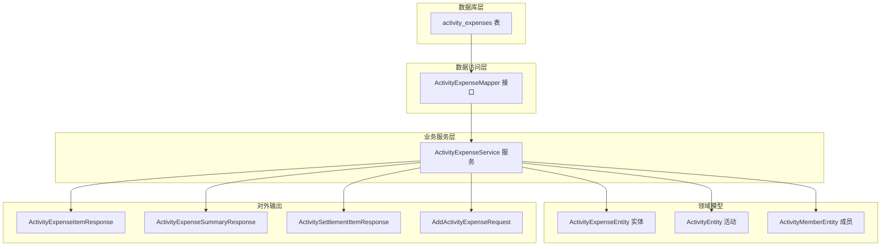
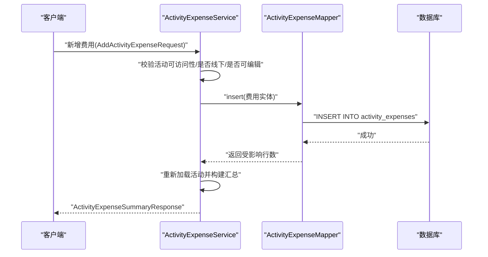
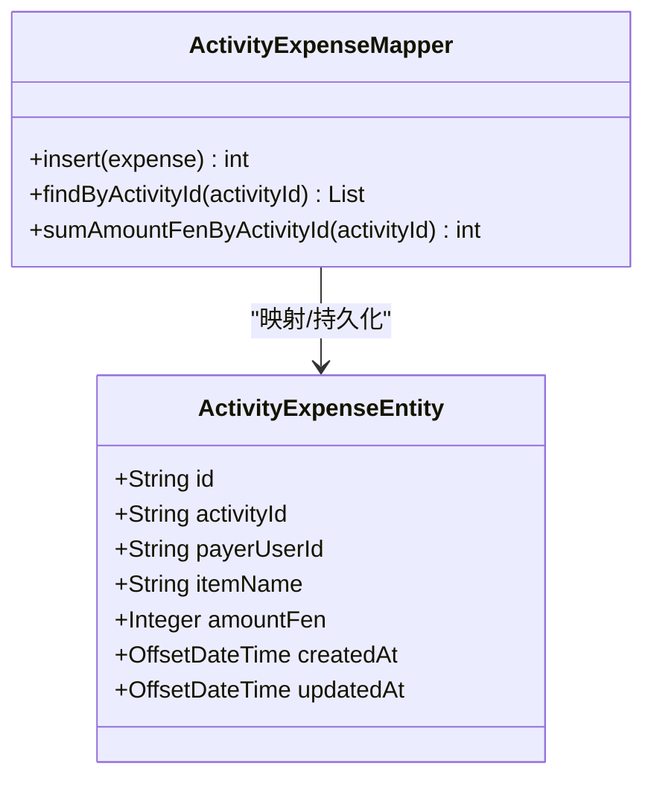
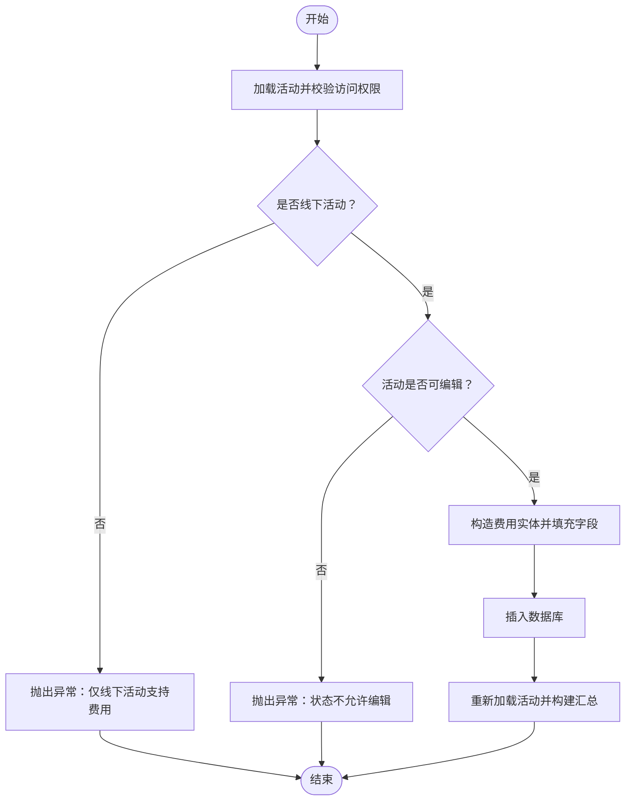
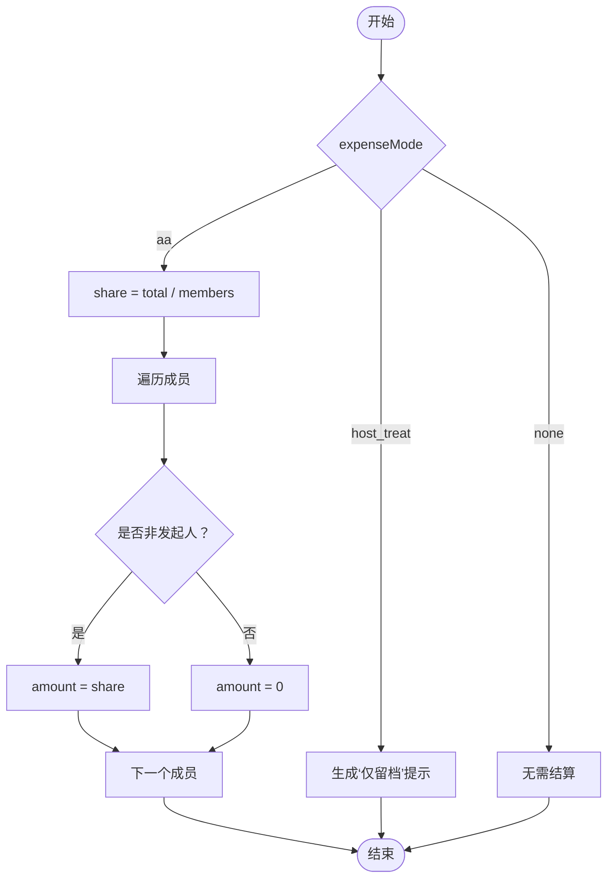
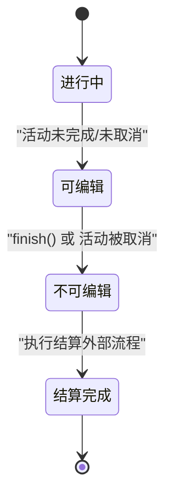
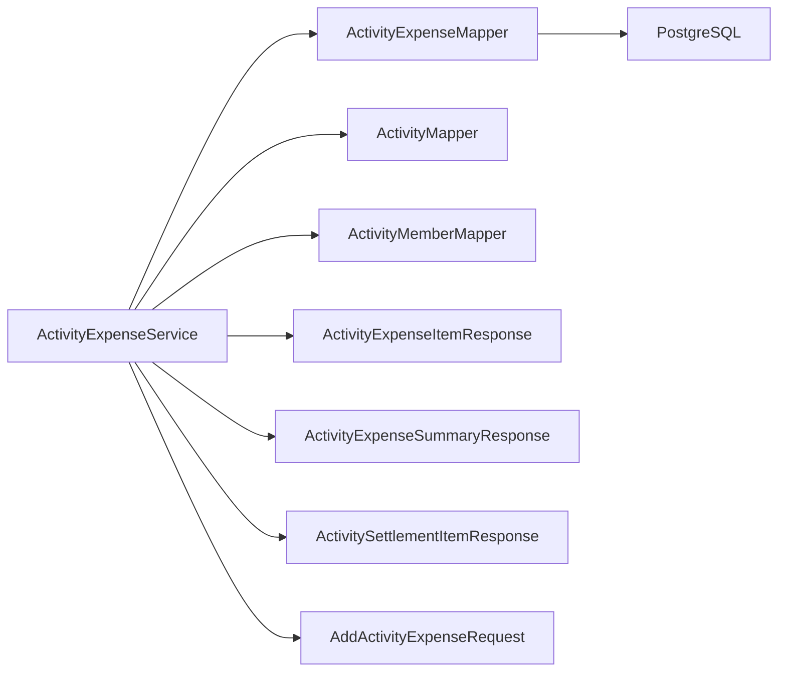

# 费用管理表

<cite>
**本文引用的文件**
- [V3__add_activity_expenses.sql](file://backend/src/main/resources/db/migration/V3__add_activity_expenses.sql)
- [ActivityExpenseEntity.java](file://backend/src/main/java/com/playminipro/activity/entity/ActivityExpenseEntity.java)
- [ActivityExpenseMapper.java](file://backend/src/main/java/com/playminipro/activity/mapper/ActivityExpenseMapper.java)
- [ActivityExpenseService.java](file://backend/src/main/java/com/playminipro/activity/service/ActivityExpenseService.java)
- [ActivityExpenseItemResponse.java](file://backend/src/main/java/com/playminipro/activity/dto/ActivityExpenseItemResponse.java)
- [ActivityExpenseSummaryResponse.java](file://backend/src/main/java/com/playminipro/activity/dto/ActivityExpenseSummaryResponse.java)
- [AddActivityExpenseRequest.java](file://backend/src/main/java/com/playminipro/activity/dto/AddActivityExpenseRequest.java)
- [ActivitySettlementItemResponse.java](file://backend/src/main/java/com/playminipro/activity/dto/ActivitySettlementItemResponse.java)
- [ActivityEntity.java](file://backend/src/main/java/com/playminipro/activity/entity/ActivityEntity.java)
- [ActivityMemberEntity.java](file://backend/src/main/java/com/playminipro/activity/entity/ActivityMemberEntity.java)
</cite>

## 目录
1. [引言](#引言)
2. [项目结构](#项目结构)
3. [核心组件](#核心组件)
4. [架构总览](#架构总览)
5. [详细组件分析](#详细组件分析)
6. [依赖分析](#依赖分析)
7. [性能考量](#性能考量)
8. [故障排查指南](#故障排查指南)
9. [结论](#结论)
10. [附录：最佳实践与常见场景](#附录最佳实践与常见场景)

## 引言
本文件围绕 PlayMiniPro 项目的“活动费用表（activity_expenses）”进行系统化文档化，重点覆盖以下方面：
- 活动费用表的设计与约束
- 费用记录的完整生命周期管理（创建、查询、结算）
- 费用分摊算法与费用模式（AA 制、代付、发起人请客等）
- 费用明细的 JSONB 扩展性设计思路（当前实现与扩展建议）
- 状态管理机制与权限控制
- 费用与活动、成员之间的关联关系
- 计算准确性保障机制
- 最佳实践与常见使用场景

## 项目结构
与费用管理相关的核心文件分布如下：
- 数据库迁移脚本：定义 activity_expenses 表结构与索引
- 实体类：ActivityExpenseEntity 映射数据库字段
- Mapper：封装插入、查询与汇总统计
- Service：业务编排、权限校验、状态流转、分摊计算
- DTO：对外输出的费用明细、汇总与结算条目
- 请求体：新增费用的入参校验
- 关联实体：ActivityEntity、ActivityMemberEntity 提供活动与成员上下文

图表来源
- [V3__add_activity_expenses.sql:1-12](file://backend/src/main/resources/db/migration/V3__add_activity_expenses.sql#L1-L12)
- [ActivityExpenseMapper.java:10-41](file://backend/src/main/java/com/playminipro/activity/mapper/ActivityExpenseMapper.java#L10-L41)
- [ActivityExpenseService.java:21-167](file://backend/src/main/java/com/playminipro/activity/service/ActivityExpenseService.java#L21-L167)
- [ActivityExpenseEntity.java:5-35](file://backend/src/main/java/com/playminipro/activity/entity/ActivityExpenseEntity.java#L5-L35)
- [ActivityEntity.java:5-91](file://backend/src/main/java/com/playminipro/activity/entity/ActivityEntity.java#L5-L91)
- [ActivityMemberEntity.java:3-25](file://backend/src/main/java/com/playminipro/activity/entity/ActivityMemberEntity.java#L3-L25)
- [ActivityExpenseItemResponse.java:3-10](file://backend/src/main/java/com/playminipro/activity/dto/ActivityExpenseItemResponse.java#L3-L10)
- [ActivityExpenseSummaryResponse.java:5-19](file://backend/src/main/java/com/playminipro/activity/dto/ActivityExpenseSummaryResponse.java#L5-L19)
- [ActivitySettlementItemResponse.java:3-10](file://backend/src/main/java/com/playminipro/activity/dto/ActivitySettlementItemResponse.java#L3-L10)
- [AddActivityExpenseRequest.java:8-12](file://backend/src/main/java/com/playminipro/activity/dto/AddActivityExpenseRequest.java#L8-L12)

章节来源
- [V3__add_activity_expenses.sql:1-12](file://backend/src/main/resources/db/migration/V3__add_activity_expenses.sql#L1-L12)
- [ActivityExpenseEntity.java:1-35](file://backend/src/main/java/com/playminipro/activity/entity/ActivityExpenseEntity.java#L1-L35)
- [ActivityExpenseMapper.java:1-41](file://backend/src/main/java/com/playminipro/activity/mapper/ActivityExpenseMapper.java#L1-L41)
- [ActivityExpenseService.java:1-167](file://backend/src/main/java/com/playminipro/activity/service/ActivityExpenseService.java#L1-L167)
- [ActivityExpenseItemResponse.java:1-10](file://backend/src/main/java/com/playminipro/activity/dto/ActivityExpenseItemResponse.java#L1-L10)
- [ActivityExpenseSummaryResponse.java:1-19](file://backend/src/main/java/com/playminipro/activity/dto/ActivityExpenseSummaryResponse.java#L1-L19)
- [AddActivityExpenseRequest.java:1-12](file://backend/src/main/java/com/playminipro/activity/dto/AddActivityExpenseRequest.java#L1-L12)
- [ActivitySettlementItemResponse.java:1-10](file://backend/src/main/java/com/playminipro/activity/dto/ActivitySettlementItemResponse.java#L1-L10)
- [ActivityEntity.java:1-91](file://backend/src/main/java/com/playminipro/activity/entity/ActivityEntity.java#L1-L91)
- [ActivityMemberEntity.java:1-25](file://backend/src/main/java/com/playminipro/activity/entity/ActivityMemberEntity.java#L1-L25)

## 核心组件
- 表结构与约束
  - 主键：id（UUID）
  - 外键：activity_id 引用 activities(id)，级联删除；payer_user_id 引用 users(id)
  - 字段：item_name（费用名称，最大长度限制）、amount_fen（金额，单位分，>0）
  - 时间戳：created_at、updated_at，默认值为当前时间
  - 索引：activity_id + created_at（降序），用于按时间倒序查询
- 实体映射：ActivityExpenseEntity 对应表字段，包含 id、activityId、payerUserId、itemName、amountFen、createdAt、updatedAt
- 数据访问：ActivityExpenseMapper 提供插入、按活动查询明细、按活动求和
- 业务服务：ActivityExpenseService 负责权限校验、状态检查、汇总构建、分摊计算与结算提示生成
- DTO 输出：明细项、汇总、结算条目与新增请求体

章节来源
- [V3__add_activity_expenses.sql:1-12](file://backend/src/main/resources/db/migration/V3__add_activity_expenses.sql#L1-L12)
- [ActivityExpenseEntity.java:5-35](file://backend/src/main/java/com/playminipro/activity/entity/ActivityExpenseEntity.java#L5-L35)
- [ActivityExpenseMapper.java:10-41](file://backend/src/main/java/com/playminipro/activity/mapper/ActivityExpenseMapper.java#L10-L41)
- [ActivityExpenseService.java:21-167](file://backend/src/main/java/com/playminipro/activity/service/ActivityExpenseService.java#L21-L167)
- [ActivityExpenseItemResponse.java:3-10](file://backend/src/main/java/com/playminipro/activity/dto/ActivityExpenseItemResponse.java#L3-L10)
- [ActivityExpenseSummaryResponse.java:5-19](file://backend/src/main/java/com/playminipro/activity/dto/ActivityExpenseSummaryResponse.java#L5-L19)
- [AddActivityExpenseRequest.java:8-12](file://backend/src/main/java/com/playminipro/activity/dto/AddActivityExpenseRequest.java#L8-L12)

## 架构总览
费用管理采用经典的分层架构：
- 控制器层：由 ActivityController 调用 ActivityExpenseService
- 业务服务层：ActivityExpenseService 组织权限校验、状态检查、分摊计算与汇总构建
- 数据访问层：ActivityExpenseMapper 借助 MyBatis 执行 SQL
- 领域模型：ActivityExpenseEntity、ActivityEntity、ActivityMemberEntity
- 输出模型：ActivityExpenseItemResponse、ActivityExpenseSummaryResponse、ActivitySettlementItemResponse、AddActivityExpenseRequest

图表来源
- [ActivityExpenseService.java:42-58](file://backend/src/main/java/com/playminipro/activity/service/ActivityExpenseService.java#L42-L58)
- [ActivityExpenseMapper.java:13-20](file://backend/src/main/java/com/playminipro/activity/mapper/ActivityExpenseMapper.java#L13-L20)
- [V3__add_activity_expenses.sql:1-12](file://backend/src/main/resources/db/migration/V3__add_activity_expenses.sql#L1-L12)

## 详细组件分析

### 表结构与约束（activity_expenses）
- 字段设计
  - id：主键，UUID
  - activity_id：外键，引用 activities(id)，ON DELETE CASCADE
  - payer_user_id：外键，引用 users(id)
  - item_name：字符串，限制长度，用于费用名称
  - amount_fen：整型，单位为分，>0 的约束确保正数
  - created_at/updated_at：时间戳，默认当前时间
- 约束与索引
  - CHECK 约束：amount_fen > 0
  - 复合索引：(activity_id, created_at DESC)，便于按时间倒序查询明细
- 设计要点
  - 使用整型分表示数，避免浮点误差
  - 通过外键与级联删除保证数据一致性
  - 按创建时间倒序展示，符合“最新优先”的用户习惯

章节来源
- [V3__add_activity_expenses.sql:1-12](file://backend/src/main/resources/db/migration/V3__add_activity_expenses.sql#L1-L12)

### 实体与数据访问（ActivityExpenseEntity 与 ActivityExpenseMapper）
- 实体映射
  - 字段一一对应表结构，包含时间戳字段便于审计
- Mapper 方法
  - 插入：将费用实体写入 activity_expenses
  - 查询明细：按 activity_id 查询并连接用户昵称，按创建时间倒序
  - 汇总：按 activity_id 求和 amount_fen

图表来源
- [ActivityExpenseEntity.java:5-35](file://backend/src/main/java/com/playminipro/activity/entity/ActivityExpenseEntity.java#L5-L35)
- [ActivityExpenseMapper.java:10-41](file://backend/src/main/java/com/playminipro/activity/mapper/ActivityExpenseMapper.java#L10-L41)

章节来源
- [ActivityExpenseEntity.java:1-35](file://backend/src/main/java/com/playminipro/activity/entity/ActivityExpenseEntity.java#L1-L35)
- [ActivityExpenseMapper.java:1-41](file://backend/src/main/java/com/playminipro/activity/mapper/ActivityExpenseMapper.java#L1-L41)

### 业务服务（ActivityExpenseService）
- 权限与状态校验
  - 校验活动存在且用户为成员
  - 校验仅线下活动支持费用
  - 校验活动未完成或取消，否则禁止编辑
  - 校验操作者为活动发起人
- 新增费用
  - 构造实体，填充 activityId、payerUserId、itemName、amountFen
  - 写入数据库并返回最新汇总
- 结算与汇总
  - 构建汇总：joinedCount、totalAmountFen、费用明细列表
  - 生成结算提示文本（根据 expenseMode）
  - 计算分摊金额（AA 模式下按人数整除）

图表来源
- [ActivityExpenseService.java:79-106](file://backend/src/main/java/com/playminipro/activity/service/ActivityExpenseService.java#L79-L106)
- [ActivityExpenseService.java:42-58](file://backend/src/main/java/com/playminipro/activity/service/ActivityExpenseService.java#L42-L58)

章节来源
- [ActivityExpenseService.java:21-167](file://backend/src/main/java/com/playminipro/activity/service/ActivityExpenseService.java#L21-L167)

### 分摊算法与费用模式
- 支持的费用模式
  - none：无需结算
  - aa：AA 制，结束时按实际参与人数均摊
  - host_treat：发起人请客，记账留档
  - designated_treat：指定人请客（当前表结构不直接体现该模式，可通过扩展实现）
- 分摊逻辑
  - AA 模式：总金额整除参与人数，非发起人向发起人转账
  - 发起人请客：结算提示明确“仅留档”
  - 其他模式：按需扩展
- 注意事项
  - 当前实现使用整除，可能产生余数；如需精确分配，可在上层处理余数（例如从发起人或某成员多收/少收一分）

图表来源
- [ActivityExpenseService.java:130-166](file://backend/src/main/java/com/playminipro/activity/service/ActivityExpenseService.java#L130-L166)
- [ActivityEntity.java:39-86](file://backend/src/main/java/com/playminipro/activity/entity/ActivityEntity.java#L39-L86)

章节来源
- [ActivityExpenseService.java:130-166](file://backend/src/main/java/com/playminipro/activity/service/ActivityExpenseService.java#L130-L166)
- [ActivityEntity.java:39-86](file://backend/src/main/java/com/playminipro/activity/entity/ActivityEntity.java#L39-L86)

### 费用明细的 JSONB 存储设计（现状与扩展建议）
- 现状
  - 费用明细以结构化字段保存（item_name、amount_fen、payer_user_id），查询时通过 JOIN 获取付款人昵称
- 扩展建议（JSONB）
  - 在 activity_expenses 中增加 jsonb 类型的扩展字段（如 metadata），用于存放动态属性（如分类标签、备注、图片链接、分摊详情等）
  - 优点：支持未来灵活扩展，无需频繁变更表结构
  - 注意：需配合查询函数与索引策略，避免影响现有按时间倒序查询的性能

章节来源
- [V3__add_activity_expenses.sql:1-12](file://backend/src/main/resources/db/migration/V3__add_activity_expenses.sql#L1-L12)

### 状态管理机制（从创建到结算完成）
- 活动状态
  - 通过 ActivityEntity.status 控制费用编辑与结算能力
  - finish() 将活动置为 finished，阻止后续编辑
- 费用状态
  - 费用本身无独立状态字段，其有效性受活动状态与权限控制
- 流程图

图表来源
- [ActivityExpenseService.java:61-77](file://backend/src/main/java/com/playminipro/activity/service/ActivityExpenseService.java#L61-L77)
- [ActivityEntity.java:21-21](file://backend/src/main/java/com/playminipro/activity/entity/ActivityEntity.java#L21-L21)

章节来源
- [ActivityExpenseService.java:61-77](file://backend/src/main/java/com/playminipro/activity/service/ActivityExpenseService.java#L61-L77)
- [ActivityEntity.java:21-21](file://backend/src/main/java/com/playminipro/activity/entity/ActivityEntity.java#L21-L21)

### 关联关系与准确性保障
- 关联关系
  - activity_expenses.activity_id → activities.id（ON DELETE CASCADE）
  - activity_expenses.payer_user_id → users.id
  - 查询明细时 JOIN users 获取付款人昵称
- 准确性保障
  - amount_fen 使用整型分表示数，避免浮点误差
  - 插入时强制 > 0 的 CHECK 约束
  - 按 activity_id 汇总，确保金额统计一致
  - 活动状态与权限双重校验，防止越权与重复修改

章节来源
- [V3__add_activity_expenses.sql:1-12](file://backend/src/main/resources/db/migration/V3__add_activity_expenses.sql#L1-L12)
- [ActivityExpenseMapper.java:22-40](file://backend/src/main/java/com/playminipro/activity/mapper/ActivityExpenseMapper.java#L22-L40)
- [ActivityExpenseService.java:90-106](file://backend/src/main/java/com/playminipro/activity/service/ActivityExpenseService.java#L90-L106)

## 依赖分析
- 组件耦合
  - Service 依赖 Mapper、ActivityMapper、ActivityMemberMapper
  - Mapper 依赖数据库驱动与 SQL
  - DTO 作为跨层传输对象，保持与实体解耦
- 外部依赖
  - PostgreSQL（UUID、TIMESTAMPTZ、CHECK 约束、索引）
  - MyBatis（注解式 SQL）

图表来源
- [ActivityExpenseService.java:23-35](file://backend/src/main/java/com/playminipro/activity/service/ActivityExpenseService.java#L23-L35)
- [ActivityExpenseMapper.java:10-20](file://backend/src/main/java/com/playminipro/activity/mapper/ActivityExpenseMapper.java#L10-L20)
- [ActivityExpenseItemResponse.java:3-10](file://backend/src/main/java/com/playminipro/activity/dto/ActivityExpenseItemResponse.java#L3-L10)
- [ActivityExpenseSummaryResponse.java:5-19](file://backend/src/main/java/com/playminipro/activity/dto/ActivityExpenseSummaryResponse.java#L5-L19)
- [ActivitySettlementItemResponse.java:3-10](file://backend/src/main/java/com/playminipro/activity/dto/ActivitySettlementItemResponse.java#L3-L10)
- [AddActivityExpenseRequest.java:8-12](file://backend/src/main/java/com/playminipro/activity/dto/AddActivityExpenseRequest.java#L8-L12)

章节来源
- [ActivityExpenseService.java:21-35](file://backend/src/main/java/com/playminipro/activity/service/ActivityExpenseService.java#L21-L35)
- [ActivityExpenseMapper.java:10-20](file://backend/src/main/java/com/playminipro/activity/mapper/ActivityExpenseMapper.java#L10-L20)

## 性能考量
- 查询路径
  - 按 activity_id + created_at DESC 的复合索引，满足“按时间倒序查看明细”的高频场景
- 写入路径
  - 单条插入，事务内完成，保证一致性
- 计算复杂度
  - 汇总与分摊均为 O(n_members) 或 O(1)，开销极低
- 建议
  - 若未来明细量巨大，可考虑对 amount_fen 建立辅助索引或物化视图（视查询模式而定）
  - 对于高并发场景，可评估将分摊计算下沉至数据库（窗口函数或自定义聚合）

## 故障排查指南
- 常见错误与定位
  - “活动不存在/无权限”：检查活动是否存在、用户是否为成员
  - “仅线下活动支持费用”：确认活动 mode 为 offline
  - “活动状态不允许编辑”：确认活动未 finished/cancelled
  - “发起人才能操作”：确认操作者为活动 creator
  - “金额必须大于 0”：检查入参 amount_fen
- 定位手段
  - 查看 Service 层的断言方法与异常码
  - 核对 Mapper 的 SQL 与表结构
  - 检查索引是否生效（按 activity_id 查询）

章节来源
- [ActivityExpenseService.java:79-106](file://backend/src/main/java/com/playminipro/activity/service/ActivityExpenseService.java#L79-L106)
- [ActivityExpenseMapper.java:22-40](file://backend/src/main/java/com/playminipro/activity/mapper/ActivityExpenseMapper.java#L22-L40)
- [AddActivityExpenseRequest.java:9-11](file://backend/src/main/java/com/playminipro/activity/dto/AddActivityExpenseRequest.java#L9-L11)

## 结论
activity_expenses 表以简洁、强约束的方式支撑了线下活动的费用记账与结算需求。通过严格的权限与状态控制、整型分表计价与索引优化，系统在保证准确性的同时具备良好的扩展性。AA 制分摊算法简单可靠，适合多数场景；未来可通过 JSONB 扩展字段进一步增强费用明细的灵活性。

## 附录：最佳实践与常见场景
- 最佳实践
  - 统一使用分（fen）为最小单位，避免浮点误差
  - 新增费用前严格校验活动状态与权限
  - 结束活动后及时生成结算提示与分摊清单
  - 对于 AA 制，若出现余数，约定从发起人或多收/少收一人补齐
- 常见场景
  - AA 制聚餐：记一笔总费用，结束时按人数均摊
  - 发起人请客：设置 expenseMode 为 host_treat，仅留档
  - 活动取消：费用编辑权限自动失效
  - 成员代付：费用仍由代付人承担，结算时由 AA 分摊