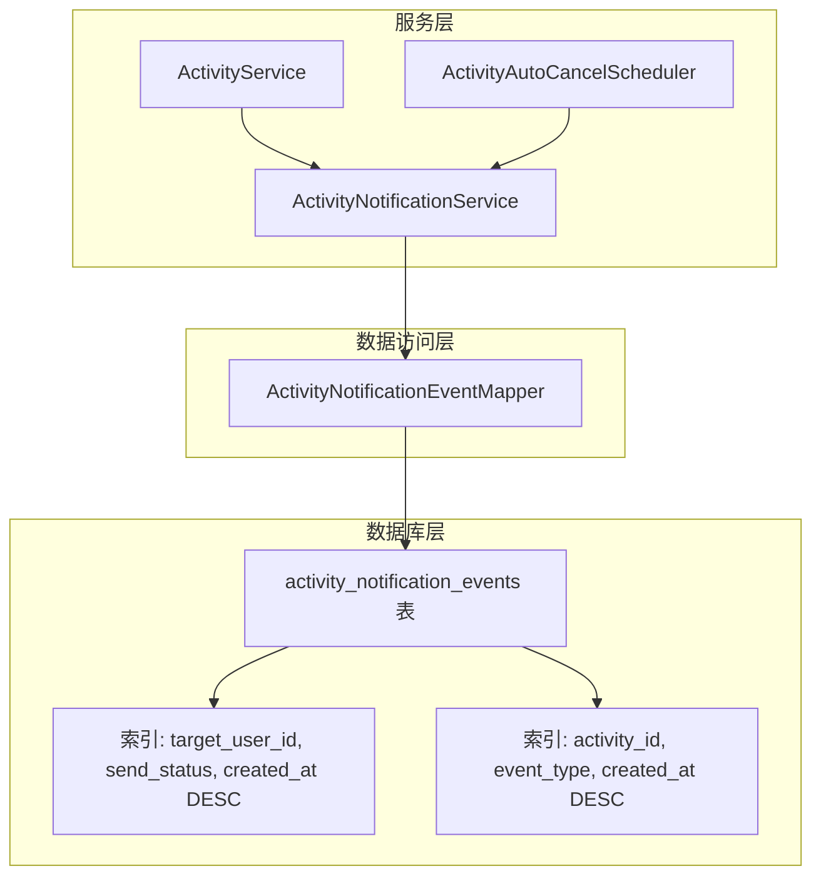
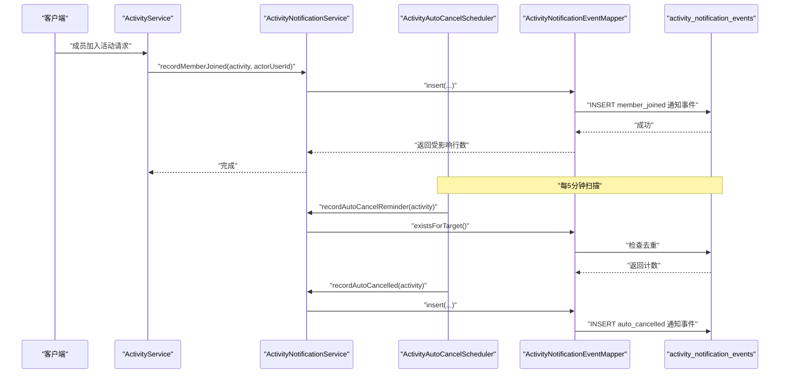
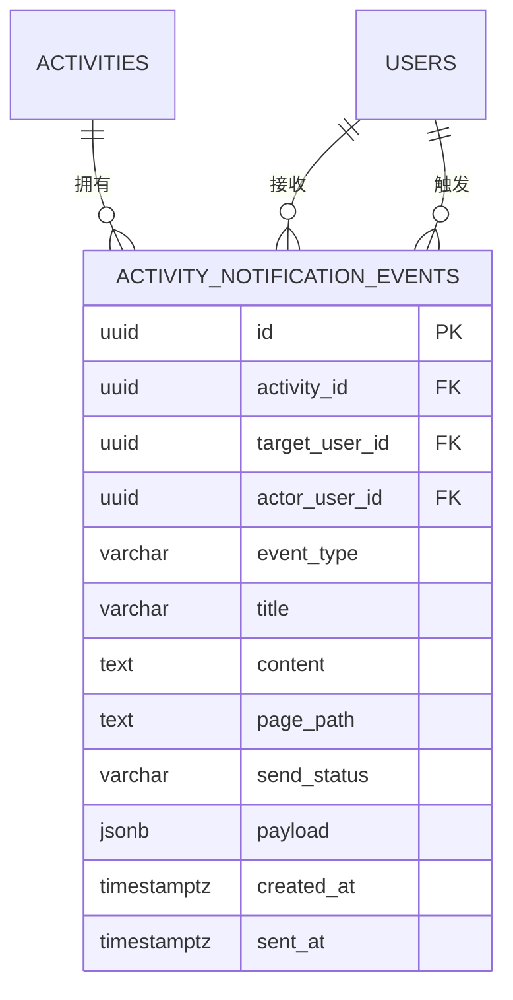
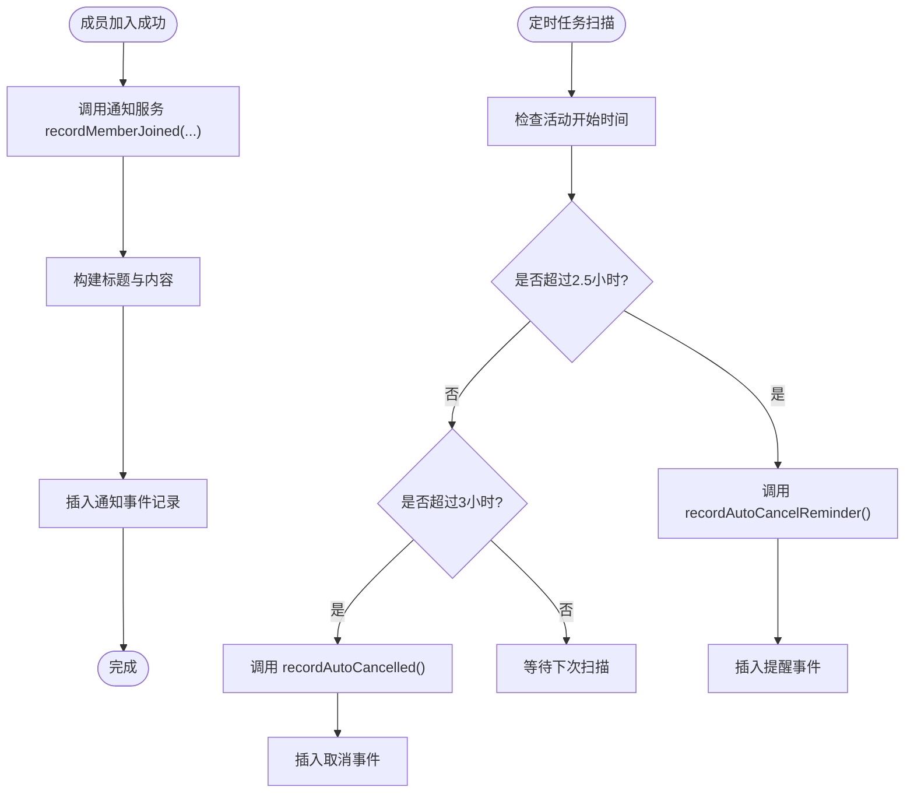
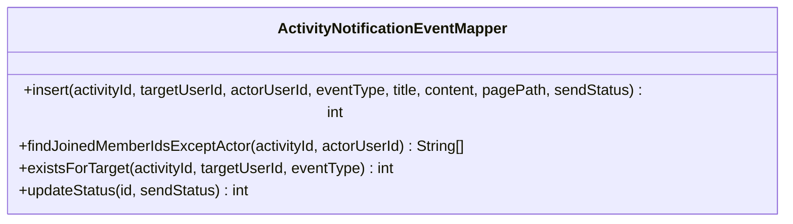
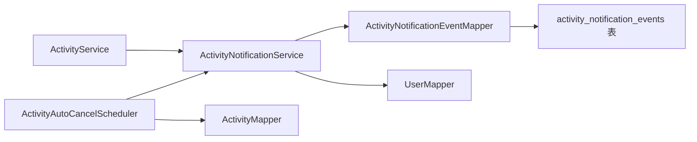

# 通知事件表

<cite>
**本文引用的文件**
- [V4__add_activity_notification_events.sql](file://backend/src/main/resources/db/migration/V4__add_activity_notification_events.sql)
- [ActivityNotificationEventMapper.java](file://backend/src/main/java/com/playminipro/activity/mapper/ActivityNotificationEventMapper.java)
- [ActivityNotificationService.java](file://backend/src/main/java/com/playminipro/activity/service/ActivityNotificationService.java)
- [ActivityService.java](file://backend/src/main/java/com/playminipro/activity/service/ActivityService.java)
- [ActivityAutoCancelScheduler.java](file://backend/src/main/java/com/playminipro/activity/service/ActivityAutoCancelScheduler.java)
- [202606021041工程改进设计与调试说明.md](file://doc/改进文档/202606021041工程改进设计与调试说明.md)
</cite>

## 更新摘要
**变更内容**
- 新增ActivityAutoCancelScheduler定时任务，支持自动取消提醒和取消功能
- 新增去重机制，避免重复发送自动取消提醒事件
- 完善通知事件生命周期，从成员加入到自动取消的完整流程
- 新增三种事件类型：member_joined、auto_cancel_reminder、auto_cancelled

## 目录
1. [简介](#简介)
2. [项目结构](#项目结构)
3. [核心组件](#核心组件)
4. [架构总览](#架构总览)
5. [详细组件分析](#详细组件分析)
6. [依赖分析](#依赖分析)
7. [性能考虑](#性能考虑)
8. [故障排查指南](#故障排查指南)
9. [结论](#结论)
10. [附录](#附录)

## 简介
本文件围绕 PlayMiniPro 项目中的活动通知事件表（activity_notification_events）进行系统化文档化说明。重点涵盖：
- 设计目的与实现机制
- 通知事件类型分类与业务场景
- 数据结构设计（含 JSONB 预留字段）
- 与活动生命周期的关联与触发逻辑
- 存储策略与清理机制
- 扩展性设计与未来增强方向

## 项目结构
通知事件能力由数据库迁移脚本创建表结构，配合 Spring Service/Mapper 层实现事件记录与状态管理，并在活动服务的关键生命周期节点触发。新增的定时任务负责处理自动取消提醒和取消流程。

**图表来源**
- [V4__add_activity_notification_events.sql:1-21](file://backend/src/main/resources/db/migration/V4__add_activity_notification_events.sql#L1-L21)
- [ActivityNotificationEventMapper.java:1-54](file://backend/src/main/java/com/playminipro/activity/mapper/ActivityNotificationEventMapper.java#L1-L54)
- [ActivityNotificationService.java:1-70](file://backend/src/main/java/com/playminipro/activity/service/ActivityNotificationService.java#L1-L70)
- [ActivityAutoCancelScheduler.java:1-40](file://backend/src/main/java/com/playminipro/activity/service/ActivityAutoCancelScheduler.java#L1-L40)

**章节来源**
- [V4__add_activity_notification_events.sql:1-21](file://backend/src/main/resources/db/migration/V4__add_activity_notification_events.sql#L1-L21)
- [ActivityNotificationEventMapper.java:1-54](file://backend/src/main/java/com/playminipro/activity/mapper/ActivityNotificationEventMapper.java#L1-L54)
- [ActivityNotificationService.java:1-70](file://backend/src/main/java/com/playminipro/activity/service/ActivityNotificationService.java#L1-L70)
- [ActivityAutoCancelScheduler.java:1-40](file://backend/src/main/java/com/playminipro/activity/service/ActivityAutoCancelScheduler.java#L1-L40)

## 核心组件
- 表结构与约束
  - 主键：UUID
  - 外键：activity_id 引用 activities(id)，target_user_id/actor_user_id 引用 users(id)
  - 关键字段：event_type、title、content、page_path、send_status、payload(JSONB)、created_at/sent_at
  - 状态检查约束：send_status 仅允许 pending/sent/skipped/failed
- Mapper 接口职责
  - 插入事件
  - 查询活动已加入成员（排除操作者）
  - 去重校验（同一目标用户同事件类型的重复检测）
  - 更新事件发送状态并回填 sent_at
- Service 层职责
  - 将业务事件转换为通知事件并持久化
  - 成员加入通知：recordMemberJoined()
  - 自动取消提醒：recordAutoCancelReminder()
  - 自动取消完成：recordAutoCancelled()
  - 当前版本用于形成可调试的事件流，后续接入微信订阅消息时在此分发调用微信 API
- 定时任务职责
  - 每5分钟扫描孤活动
  - 2.5小时后发送自动取消提醒
  - 3小时后执行自动取消并发送完成通知

**章节来源**
- [V4__add_activity_notification_events.sql:1-21](file://backend/src/main/resources/db/migration/V4__add_activity_notification_events.sql#L1-L21)
- [ActivityNotificationEventMapper.java:12-53](file://backend/src/main/java/com/playminipro/activity/mapper/ActivityNotificationEventMapper.java#L12-L53)
- [ActivityNotificationService.java:21-70](file://backend/src/main/java/com/playminipro/activity/service/ActivityNotificationService.java#L21-L70)
- [ActivityAutoCancelScheduler.java:21-39](file://backend/src/main/java/com/playminipro/activity/service/ActivityAutoCancelScheduler.java#L21-L39)

## 架构总览
通知事件在活动生命周期中被触发，写入数据库后由后续流程（如定时任务或消息队列）消费并投递至微信订阅消息平台。下图展示从活动服务到通知事件表的整体调用链路。

**图表来源**
- [ActivityService.java:202-204](file://backend/src/main/java/com/playminipro/activity/service/ActivityService.java#L202-L204)
- [ActivityNotificationService.java:25-35](file://backend/src/main/java/com/playminipro/activity/service/ActivityNotificationService.java#L25-L35)
- [ActivityNotificationEventMapper.java:12-27](file://backend/src/main/java/com/playminipro/activity/mapper/ActivityNotificationEventMapper.java#L12-L27)
- [ActivityAutoCancelScheduler.java:25-39](file://backend/src/main/java/com/playminipro/activity/service/ActivityAutoCancelScheduler.java#L25-L39)

## 详细组件分析

### 数据模型与字段设计
- 字段说明（节选）
  - id：通知事件唯一标识
  - activity_id：所属活动
  - target_user_id/actor_user_id：接收者与触发者
  - event_type：事件类型（如 member_joined、auto_cancel_reminder、auto_cancelled）
  - title/content/page_path：通知标题、内容与跳转路径
  - send_status：发送状态（pending/sent/skipped/failed），并有 CHECK 约束
  - payload：JSONB 预留字段，便于承载微信接口返回或模板参数
  - created_at/sent_at：创建与发送时间戳
- 索引设计
  - idx_activity_notification_target_status：按用户+状态+时间倒序，支持快速拉取待处理通知
  - idx_activity_notification_activity_type：按活动+事件类型+时间倒序，支持按活动与事件类型排查

**图表来源**
- [V4__add_activity_notification_events.sql:1-15](file://backend/src/main/resources/db/migration/V4__add_activity_notification_events.sql#L1-L15)

**章节来源**
- [V4__add_activity_notification_events.sql:1-21](file://backend/src/main/resources/db/migration/V4__add_activity_notification_events.sql#L1-L21)
- [202606021041工程改进设计与调试说明.md:107-124](file://doc/改进文档/202606021041工程改进设计与调试说明.md#L107-L124)

### 事件类型与业务场景
- 成员加入（member_joined）
  - 触发时机：某成员成功加入活动
  - 内容要点：包含触发者昵称与活动标题，建议跳转到活动详情页
  - 去重策略：同一目标用户在同一事件类型上避免重复发送
- 自动取消提醒（auto_cancel_reminder）
  - 场景：活动即将自动取消前的提醒（开始后2.5小时）
  - 作用：提升用户参与度，减少资源浪费
  - 去重策略：通过existsForTarget()避免重复发送
- 自动取消（auto_cancelled）
  - 场景：活动因未满足条件而自动关闭（开始后3小时）
  - 作用：向参与者同步状态变化
  - 触发条件：定时任务扫描发现活动满足自动取消条件

**章节来源**
- [ActivityNotificationService.java:25-70](file://backend/src/main/java/com/playminipro/activity/service/ActivityNotificationService.java#L25-L70)
- [ActivityAutoCancelScheduler.java:25-39](file://backend/src/main/java/com/playminipro/activity/service/ActivityAutoCancelScheduler.java#L25-L39)
- [202606021041工程改进设计与调试说明.md:113-113](file://doc/改进文档/202606021041工程改进设计与调试说明.md#L113-L113)

### 事件触发与生命周期关联
- 成员加入触发：ActivityService.join()成功后调用ActivityNotificationService.recordMemberJoined()
- 自动取消触发：ActivityAutoCancelScheduler定时扫描，根据时间阈值触发不同类型提醒
- 生命周期意义：将"状态变更/成员变动/费用相关"等事件抽象为统一的通知事件，便于后续统一投递与审计

**图表来源**
- [ActivityService.java:202-204](file://backend/src/main/java/com/playminipro/activity/service/ActivityService.java#L202-L204)
- [ActivityNotificationService.java:25-70](file://backend/src/main/java/com/playminipro/activity/service/ActivityNotificationService.java#L25-L70)
- [ActivityAutoCancelScheduler.java:25-39](file://backend/src/main/java/com/playminipro/activity/service/ActivityAutoCancelScheduler.java#L25-L39)

**章节来源**
- [ActivityService.java:202-204](file://backend/src/main/java/com/playminipro/activity/service/ActivityService.java#L202-L204)
- [ActivityNotificationService.java:25-70](file://backend/src/main/java/com/playminipro/activity/service/ActivityNotificationService.java#L25-L70)
- [ActivityAutoCancelScheduler.java:25-39](file://backend/src/main/java/com/playminipro/activity/service/ActivityAutoCancelScheduler.java#L25-L39)

### 数据访问与状态管理
- 插入事件：使用 UUID 默认值与参数化字段，保证幂等与一致性
- 查询已加入成员：排除操作者，避免给自己发通知
- 去重校验：基于 activity_id、target_user_id、event_type 的存在性检查
- 状态更新：根据 send_status 更新 sent_at 时间戳，便于统计与审计

**图表来源**
- [ActivityNotificationEventMapper.java:12-53](file://backend/src/main/java/com/playminipro/activity/mapper/ActivityNotificationEventMapper.java#L12-L53)

**章节来源**
- [ActivityNotificationEventMapper.java:12-53](file://backend/src/main/java/com/playminipro/activity/mapper/ActivityNotificationEventMapper.java#L12-L53)

### 与活动生命周期的关联
- 活动状态变更：通过事件类型区分不同状态（如 auto_cancel_reminder/auto_cancelled）
- 成员加入/退出：通过成员查询接口筛选接收者列表，结合去重逻辑避免重复通知
- 费用相关提醒：可在费用确认/结算阶段扩展新的事件类型，复用现有表结构与投递流程
- 定时任务管理：通过ActivityAutoCancelScheduler统一管理自动取消流程

**章节来源**
- [ActivityNotificationEventMapper.java:29-45](file://backend/src/main/java/com/playminipro/activity/mapper/ActivityNotificationEventMapper.java#L29-L45)
- [ActivityNotificationService.java:25-70](file://backend/src/main/java/com/playminipro/activity/service/ActivityNotificationService.java#L25-L70)
- [ActivityAutoCancelScheduler.java:25-39](file://backend/src/main/java/com/playminipro/activity/service/ActivityAutoCancelScheduler.java#L25-L39)

## 依赖分析
- 组件耦合
  - ActivityService 依赖 ActivityNotificationService
  - ActivityAutoCancelScheduler 依赖 ActivityNotificationService 和 ActivityMapper
  - ActivityNotificationService 依赖 ActivityNotificationEventMapper 与 UserMapper
  - Mapper 依赖数据库表结构与索引
- 外部依赖
  - PostgreSQL（UUID、JSONB、索引、CHECK 约束）
  - Spring Scheduling（定时任务）
  - 微信订阅消息平台（后续接入）

**图表来源**
- [ActivityService.java:202-204](file://backend/src/main/java/com/playminipro/activity/service/ActivityService.java#L202-L204)
- [ActivityNotificationService.java:16-19](file://backend/src/main/java/com/playminipro/activity/service/ActivityNotificationService.java#L16-L19)
- [ActivityAutoCancelScheduler.java:16-19](file://backend/src/main/java/com/playminipro/activity/service/ActivityAutoCancelScheduler.java#L16-L19)
- [ActivityNotificationEventMapper.java:12-27](file://backend/src/main/java/com/playminipro/activity/mapper/ActivityNotificationEventMapper.java#L12-L27)

**章节来源**
- [ActivityService.java:202-204](file://backend/src/main/java/com/playminipro/activity/service/ActivityService.java#L202-L204)
- [ActivityNotificationService.java:16-19](file://backend/src/main/java/com/playminipro/activity/service/ActivityNotificationService.java#L16-L19)
- [ActivityAutoCancelScheduler.java:16-19](file://backend/src/main/java/com/playminipro/activity/service/ActivityAutoCancelScheduler.java#L16-L19)
- [ActivityNotificationEventMapper.java:12-27](file://backend/src/main/java/com/playminipro/activity/mapper/ActivityNotificationEventMapper.java#L12-L27)

## 性能考虑
- 索引策略
  - 目标用户+状态+时间倒序索引：支持高效拉取待处理通知
  - 活动+事件类型+时间倒序索引：支持按活动与事件类型快速定位
- JSONB 使用
  - payload 字段预留微信模板参数或接口返回，避免频繁扩展表结构
- 状态机
  - send_status 的有限状态集合与 CHECK 约束，便于统计与审计
- 去重机制
  - existsForTarget()避免重复发送自动取消提醒，减少数据库压力
- 定时任务优化
  - 固定延迟300秒扫描，平衡及时性和系统负载
  - SQL层面先过滤候选活动，Java层面再精确判断
- 清理机制（建议）
  - 基于 created_at 设置保留期（如 30 天），到期后归档或删除
  - 结合 send_status 维度清理失败或已过期的通知
  - 定期统计与告警，防止通知积压

## 故障排查指南
- 常见问题
  - 重复通知：检查是否存在相同 activity_id/target_user_id/event_type 的事件
  - 未收到通知：核对 send_status 是否为 pending/sent/skipped/failed，关注 sent_at 是否正确回填
  - 无法找到接收者：确认成员状态为 joined 且非 actor_user_id
  - 自动取消提醒重复：检查existsForTarget()去重逻辑是否正常工作
- 排查步骤
  - 使用活动+事件类型索引快速定位事件
  - 使用目标用户+状态+时间索引查看待处理队列
  - 校验 CHECK 约束是否被违反
  - 检查定时任务配置和扫描频率
  - 验证去重机制是否按预期工作

**章节来源**
- [ActivityNotificationEventMapper.java:38-53](file://backend/src/main/java/com/playminipro/activity/mapper/ActivityNotificationEventMapper.java#L38-L53)
- [V4__add_activity_notification_events.sql:14-14](file://backend/src/main/resources/db/migration/V4__add_activity_notification_events.sql#L14-L14)
- [ActivityAutoCancelScheduler.java:25-39](file://backend/src/main/java/com/playminipro/activity/service/ActivityAutoCancelScheduler.java#L25-L39)

## 结论
activity_notification_events 表以轻量、可扩展的方式承接活动生命周期中的各类通知场景。通过明确的事件类型、状态机与索引策略，既满足当前"成员加入"的通知需求，也支持自动取消提醒和取消功能。新增的定时任务和去重机制进一步完善了通知系统的完整性和可靠性，为后续接入微信订阅消息、扩展费用与状态提醒提供了清晰的演进路径。

## 附录
- 事件类型参考
  - member_joined：成员加入
  - auto_cancel_reminder：自动取消提醒
  - auto_cancelled：自动取消
- 建议的后续增强
  - 引入定时任务或消息队列消费 pending 状态事件
  - 在 payload 中沉淀微信模板参数，逐步替代硬编码 title/content
  - 增加通知投递失败重试与退避策略
  - 提供通知事件的批量查询与导出能力，支撑运营审计
  - 扩展更多事件类型，如费用提醒、活动状态变更等
  - 增加通知事件的统计分析功能

**章节来源**
- [202606021041工程改进设计与调试说明.md:113-113](file://doc/改进文档/202606021041工程改进设计与调试说明.md#L113-L113)
- [ActivityNotificationService.java:21-70](file://backend/src/main/java/com/playminipro/activity/service/ActivityNotificationService.java#L21-L70)
- [ActivityAutoCancelScheduler.java:25-39](file://backend/src/main/java/com/playminipro/activity/service/ActivityAutoCancelScheduler.java#L25-L39)