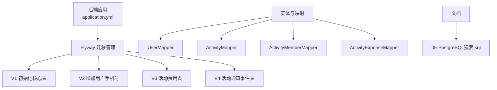
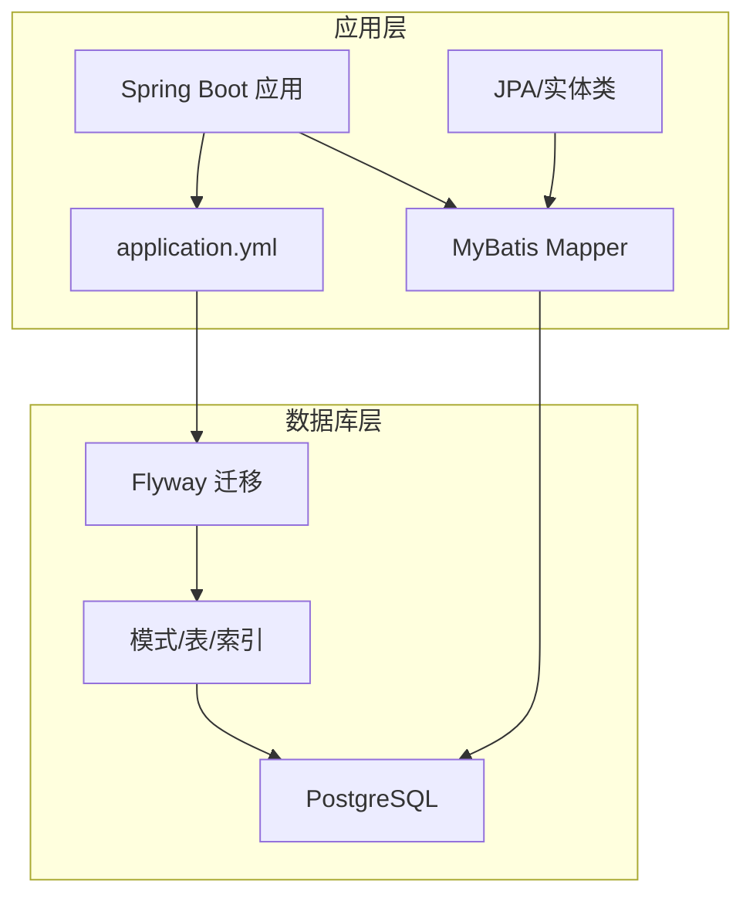
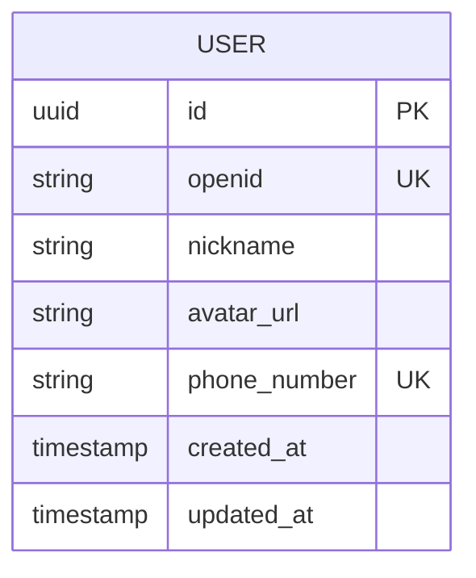
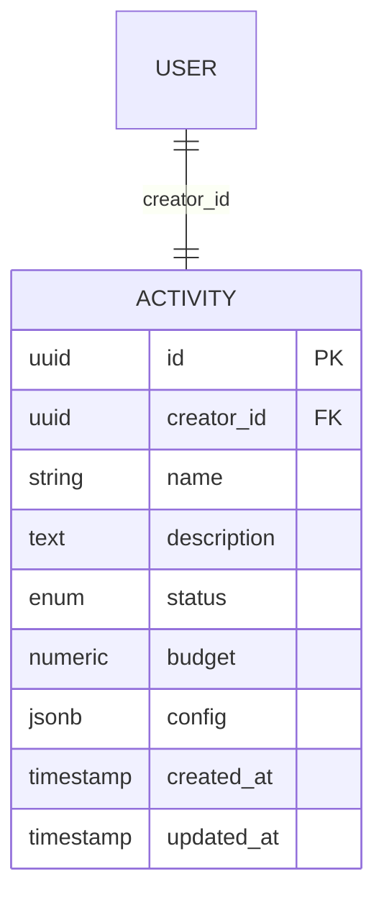
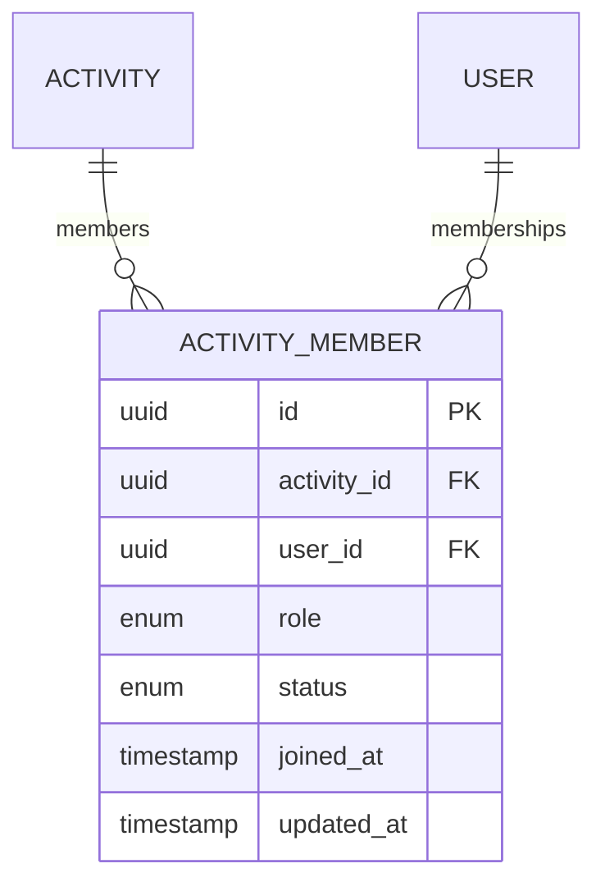
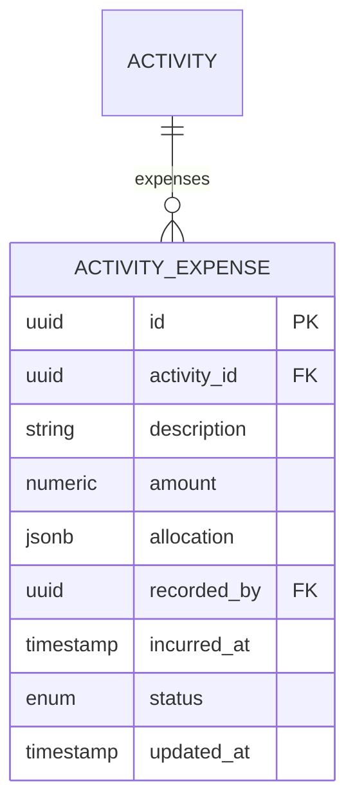
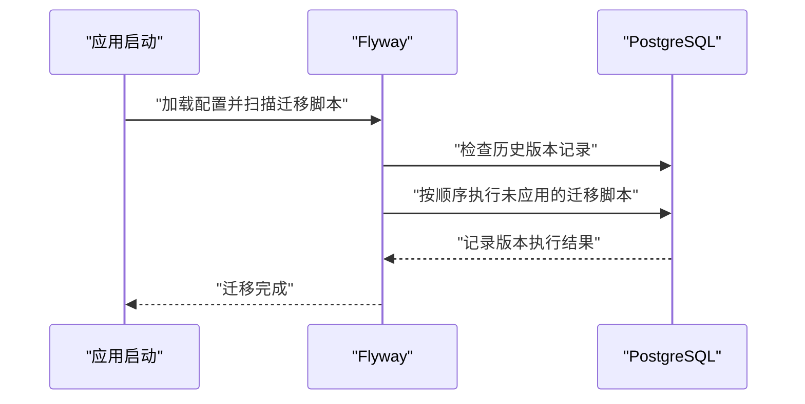
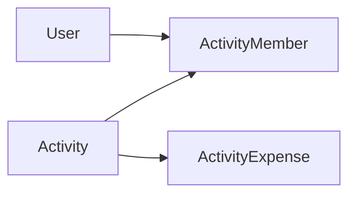

# 数据库设计

<cite>
**本文引用的文件**
- [V1__init_core_tables.sql](file://backend/src/main/resources/db/migration/V1__init_core_tables.sql)
- [V2__add_user_phone_number.sql](file://backend/src/main/resources/db/migration/V2__add_user_phone_number.sql)
- [V3__add_activity_expenses.sql](file://backend/src/main/resources/db/migration/V3__add_activity_expenses.sql)
- [V4__add_activity_notification_events.sql](file://backend/src/main/resources/db/migration/V4__add_activity_notification_events.sql)
- [application.yml](file://backend/src/main/resources/application.yml)
- [UserEntity.java](file://backend/src/main/java/com/playminipro/auth/entity/UserEntity.java)
- [ActivityEntity.java](file://backend/src/main/java/com/playminipro/activity/entity/ActivityEntity.java)
- [ActivityMemberEntity.java](file://backend/src/main/java/com/playminipro/activity/entity/ActivityMemberEntity.java)
- [ActivityExpenseEntity.java](file://backend/src/main/java/com/playminipro/activity/entity/ActivityExpenseEntity.java)
- [UserMapper.java](file://backend/src/main/java/com/playminipro/auth/mapper/UserMapper.java)
- [ActivityMapper.java](file://backend/src/main/java/com/playminipro/activity/mapper/ActivityMapper.java)
- [ActivityMemberMapper.java](file://backend/src/main/java/com/playminipro/activity/mapper/ActivityMemberMapper.java)
- [ActivityExpenseMapper.java](file://backend/src/main/java/com/playminipro/activity/mapper/ActivityExpenseMapper.java)
- [05-PostgreSQL建表.sql](file://doc/05-PostgreSQL建表.sql)
</cite>

## 目录
1. [简介](#简介)
2. [项目结构](#项目结构)
3. [核心组件](#核心组件)
4. [架构总览](#架构总览)
5. [详细组件分析](#详细组件分析)
6. [依赖分析](#依赖分析)
7. [性能考虑](#性能考虑)
8. [故障排查指南](#故障排查指南)
9. [结论](#结论)
10. [附录](#附录)

## 简介
本文件面向数据库管理员与后端开发者，系统化梳理PlayMiniPro项目的PostgreSQL数据库设计方案。内容涵盖核心表结构（用户、活动、成员关系、费用）、范式设计与约束、索引策略与性能优化、基于Flyway的迁移管理、JSONB数据类型在活动配置与用户偏好中的应用、数据完整性与并发控制、事务管理、连接池配置、查询优化与监控指标、以及备份恢复与数据安全隐私保护策略。文中所有技术细节均以仓库内现有文件为依据，并通过“章节来源”与“图表来源”进行精确溯源。

## 项目结构
数据库相关的核心资产由以下部分组成：
- 数据库迁移脚本：位于后端资源目录下，采用Flyway命名规范，按版本顺序演进。
- 应用配置：包含数据库连接、Flyway启用与迁移脚本位置等关键参数。
- 实体与映射：Java实体类与MyBatis Mapper用于ORM访问与SQL生成。
- 文档：包含PostgreSQL建表脚本与数据库设计说明文档。

图表来源
- [application.yml](file://backend/src/main/resources/application.yml)
- [V1__init_core_tables.sql](file://backend/src/main/resources/db/migration/V1__init_core_tables.sql)
- [V2__add_user_phone_number.sql](file://backend/src/main/resources/db/migration/V2__add_user_phone_number.sql)
- [V3__add_activity_expenses.sql](file://backend/src/main/resources/db/migration/V3__add_activity_expenses.sql)
- [V4__add_activity_notification_events.sql](file://backend/src/main/resources/db/migration/V4__add_activity_notification_events.sql)
- [UserMapper.java](file://backend/src/main/java/com/playminipro/auth/mapper/UserMapper.java)
- [ActivityMapper.java](file://backend/src/main/java/com/playminipro/activity/mapper/ActivityMapper.java)
- [ActivityMemberMapper.java](file://backend/src/main/java/com/playminipro/activity/mapper/ActivityMemberMapper.java)
- [ActivityExpenseMapper.java](file://backend/src/main/java/com/playminipro/activity/mapper/ActivityExpenseMapper.java)
- [05-PostgreSQL建表.sql](file://doc/05-PostgreSQL建表.sql)

章节来源
- [application.yml](file://backend/src/main/resources/application.yml)
- [V1__init_core_tables.sql](file://backend/src/main/resources/db/migration/V1__init_core_tables.sql)
- [V2__add_user_phone_number.sql](file://backend/src/main/resources/db/migration/V2__add_user_phone_number.sql)
- [V3__add_activity_expenses.sql](file://backend/src/main/resources/db/migration/V3__add_activity_expenses.sql)
- [V4__add_activity_notification_events.sql](file://backend/src/main/resources/db/migration/V4__add_activity_notification_events.sql)
- [05-PostgreSQL建表.sql](file://doc/05-PostgreSQL建表.sql)

## 核心组件
本节聚焦于四个核心业务表：用户、活动、成员关系、费用。它们共同支撑活动组织、成员管理与财务结算等核心功能。

- 用户表（User）
  - 设计理念：存储用户身份信息与基础属性；手机号字段在后续版本中引入，满足微信登录与账单通知等场景。
  - 关键字段：用户标识、昵称、头像、手机号、创建/更新时间等。
  - 主键：自增ID或UUID（依据具体实现）。
  - 外键：无外键依赖，保持低耦合。
  - 索引：建议对手机号建立唯一索引，便于快速查找与去重。
  - JSONB：当前版本未见JSONB字段，未来可用于用户偏好设置。

- 活动表（Activity）
  - 设计理念：记录活动基本信息、状态、预算与配置；支持活动类型规则集与动态配置。
  - 关键字段：活动标识、名称、描述、状态、预算、配置JSONB、创建者、创建/更新时间等。
  - 主键：自增ID或UUID。
  - 外键：关联用户表（创建者）。
  - 索引：对状态、创建者、时间戳建立复合索引，提升查询效率。
  - JSONB：活动配置（如规则、模板、动态字段）使用JSONB存储，便于灵活扩展。

- 成员关系表（ActivityMember）
  - 设计理念：维护用户与活动之间的参与关系，支持角色、加入时间、状态等。
  - 关键字段：成员标识、活动ID、用户ID、角色、加入时间、状态等。
  - 主键：组合主键（活动ID+用户ID）或自增ID。
  - 外键：分别关联活动表与用户表。
  - 索引：对活动ID、用户ID、状态建立索引，加速成员查询与状态统计。
  - JSONB：可选用于成员偏好或临时标记。

- 费用表（ActivityExpense）
  - 设计理念：记录活动中的各项支出明细，支持分摊、结算与对账。
  - 关键字段：费用标识、活动ID、描述、金额、分摊方式、记账人、发生时间、状态等。
  - 主键：自增ID或UUID。
  - 外键：关联活动表。
  - 索引：对活动ID、记账人、发生时间、状态建立索引，支持报表与对账。
  - JSONB：可选用于费用明细的扩展字段或分摊规则。

章节来源
- [UserEntity.java](file://backend/src/main/java/com/playminipro/auth/entity/UserEntity.java)
- [ActivityEntity.java](file://backend/src/main/java/com/playminipro/activity/entity/ActivityEntity.java)
- [ActivityMemberEntity.java](file://backend/src/main/java/com/playminipro/activity/entity/ActivityMemberEntity.java)
- [ActivityExpenseEntity.java](file://backend/src/main/java/com/playminipro/activity/entity/ActivityExpenseEntity.java)
- [UserMapper.java](file://backend/src/main/java/com/playminipro/auth/mapper/UserMapper.java)
- [ActivityMapper.java](file://backend/src/main/java/com/playminipro/activity/mapper/ActivityMapper.java)
- [ActivityMemberMapper.java](file://backend/src/main/java/com/playminipro/activity/mapper/ActivityMemberMapper.java)
- [ActivityExpenseMapper.java](file://backend/src/main/java/com/playminipro/activity/mapper/ActivityExpenseMapper.java)
- [05-PostgreSQL建表.sql](file://doc/05-PostgreSQL建表.sql)

## 架构总览
下图展示数据库层与应用层的交互关系，以及Flyway迁移管理在启动时的作用。

图表来源
- [application.yml](file://backend/src/main/resources/application.yml)
- [UserMapper.java](file://backend/src/main/java/com/playminipro/auth/mapper/UserMapper.java)
- [ActivityMapper.java](file://backend/src/main/java/com/playminipro/activity/mapper/ActivityMapper.java)
- [ActivityMemberMapper.java](file://backend/src/main/java/com/playminipro/activity/mapper/ActivityMemberMapper.java)
- [ActivityExpenseMapper.java](file://backend/src/main/java/com/playminipro/activity/mapper/ActivityExpenseMapper.java)

## 详细组件分析

### 用户表（User）
- 表设计要点
  - 标识与基础信息：用户唯一标识、昵称、头像等。
  - 手机号：在后续版本中引入，用于绑定与通知。
  - 时间戳：创建/更新时间，便于审计与排序。
- 约束与索引
  - 主键：自增ID或UUID。
  - 唯一性：手机号建议唯一索引。
  - 复合索引：按创建时间倒序，支持分页与最新列表。
- JSONB使用场景
  - 当前版本未见JSONB字段；未来可用于用户偏好设置（如语言、主题、通知偏好）。
- 并发与事务
  - 写入采用标准事务；更新操作建议使用乐观锁或版本号字段避免并发覆盖。
- 性能优化
  - 对高频查询字段建立索引；避免SELECT *，仅取必要列。

图表来源
- [V1__init_core_tables.sql](file://backend/src/main/resources/db/migration/V1__init_core_tables.sql)
- [V2__add_user_phone_number.sql](file://backend/src/main/resources/db/migration/V2__add_user_phone_number.sql)

章节来源
- [UserEntity.java](file://backend/src/main/java/com/playminipro/auth/entity/UserEntity.java)
- [UserMapper.java](file://backend/src/main/java/com/playminipro/auth/mapper/UserMapper.java)
- [V1__init_core_tables.sql](file://backend/src/main/resources/db/migration/V1__init_core_tables.sql)
- [V2__add_user_phone_number.sql](file://backend/src/main/resources/db/migration/V2__add_user_phone_number.sql)

### 活动表（Activity）
- 表设计要点
  - 基本信息：名称、描述、状态、预算等。
  - 配置：使用JSONB存储活动规则、模板与动态字段，便于灵活扩展。
  - 关联：外键指向用户表（创建者）。
- 约束与索引
  - 主键：自增ID或UUID。
  - 外键：创建者关联用户表。
  - 索引：状态、创建者、时间戳复合索引。
- JSONB使用场景
  - 规则集：活动类型规则、准入条件、结算流程等。
  - 模板：默认配置、字段布局、提示信息等。
- 并发与事务
  - 创建/更新采用事务；状态变更需原子性，防止竞态。
- 性能优化
  - 使用GIN索引对JSONB字段进行查询优化（如存在高频键查询）。

图表来源
- [V1__init_core_tables.sql](file://backend/src/main/resources/db/migration/V1__init_core_tables.sql)
- [ActivityEntity.java](file://backend/src/main/java/com/playminipro/activity/entity/ActivityEntity.java)

章节来源
- [ActivityEntity.java](file://backend/src/main/java/com/playminipro/activity/entity/ActivityEntity.java)
- [ActivityMapper.java](file://backend/src/main/java/com/playminipro/activity/mapper/ActivityMapper.java)
- [V1__init_core_tables.sql](file://backend/src/main/resources/db/migration/V1__init_core_tables.sql)

### 成员关系表（ActivityMember）
- 表设计要点
  - 关系标识：活动ID+用户ID构成组合主键或自增ID。
  - 角色与状态：支持不同角色（如发起者、参与者、观察者）与状态（如已加入、已退出）。
  - 时间戳：加入时间、更新时间。
- 约束与索引
  - 主键：组合主键（活动ID+用户ID）或自增ID。
  - 外键：分别关联活动表与用户表。
  - 索引：活动ID、用户ID、状态索引。
- JSONB使用场景
  - 可选用于成员偏好或临时标记。
- 并发与事务
  - 加入/退出采用事务；避免重复加入。
- 性能优化
  - 查询成员列表时按活动ID过滤，利用索引快速定位。

图表来源
- [V1__init_core_tables.sql](file://backend/src/main/resources/db/migration/V1__init_core_tables.sql)
- [ActivityMemberEntity.java](file://backend/src/main/java/com/playminipro/activity/entity/ActivityMemberEntity.java)

章节来源
- [ActivityMemberEntity.java](file://backend/src/main/java/com/playminipro/activity/entity/ActivityMemberEntity.java)
- [ActivityMemberMapper.java](file://backend/src/main/java/com/playminipro/activity/mapper/ActivityMemberMapper.java)
- [V1__init_core_tables.sql](file://backend/src/main/resources/db/migration/V1__init_core_tables.sql)

### 费用表（ActivityExpense）
- 表设计要点
  - 明细：描述、金额、分摊方式、记账人、发生时间、状态。
  - 关联：外键指向活动表。
- 约束与索引
  - 主键：自增ID或UUID。
  - 外键：活动ID关联活动表。
  - 索引：活动ID、记账人、发生时间、状态。
- JSONB使用场景
  - 可选用于费用明细的扩展字段或分摊规则。
- 并发与事务
  - 新增/修改费用采用事务；对账时使用悲观锁或行级锁。
- 性能优化
  - 按活动维度聚合统计，避免全表扫描。

图表来源
- [V3__add_activity_expenses.sql](file://backend/src/main/resources/db/migration/V3__add_activity_expenses.sql)
- [ActivityExpenseEntity.java](file://backend/src/main/java/com/playminipro/activity/entity/ActivityExpenseEntity.java)

章节来源
- [ActivityExpenseEntity.java](file://backend/src/main/java/com/playminipro/activity/entity/ActivityExpenseEntity.java)
- [ActivityExpenseMapper.java](file://backend/src/main/java/com/playminipro/activity/mapper/ActivityExpenseMapper.java)
- [V3__add_activity_expenses.sql](file://backend/src/main/resources/db/migration/V3__add_activity_expenses.sql)

### 数据迁移策略（Flyway）
- 版本管理
  - 采用V1/V2/V3/V4等版本号命名，按顺序执行。
  - 每个版本对应一次数据库结构变更，确保幂等与可追踪。
- 迁移脚本编写规范
  - 文件名必须符合Flyway命名规范（V<版本>__<描述>.sql），描述应简洁明确。
  - 脚本需具备幂等性：重复执行不破坏现有结构。
  - 建议先创建索引，再插入数据；避免在大表上创建索引导致长时间锁表。
- 回滚机制
  - Flyway默认不提供自动回滚；建议在回滚场景中手动编写降级脚本或使用备份恢复。
  - 在生产环境执行前，务必进行充分测试与备份验证。

图表来源
- [application.yml](file://backend/src/main/resources/application.yml)
- [V1__init_core_tables.sql](file://backend/src/main/resources/db/migration/V1__init_core_tables.sql)
- [V2__add_user_phone_number.sql](file://backend/src/main/resources/db/migration/V2__add_user_phone_number.sql)
- [V3__add_activity_expenses.sql](file://backend/src/main/resources/db/migration/V3__add_activity_expenses.sql)
- [V4__add_activity_notification_events.sql](file://backend/src/main/resources/db/migration/V4__add_activity_notification_events.sql)

章节来源
- [application.yml](file://backend/src/main/resources/application.yml)
- [V1__init_core_tables.sql](file://backend/src/main/resources/db/migration/V1__init_core_tables.sql)
- [V2__add_user_phone_number.sql](file://backend/src/main/resources/db/migration/V2__add_user_phone_number.sql)
- [V3__add_activity_expenses.sql](file://backend/src/main/resources/db/migration/V3__add_activity_expenses.sql)
- [V4__add_activity_notification_events.sql](file://backend/src/main/resources/db/migration/V4__add_activity_notification_events.sql)

### JSONB数据类型的使用场景与优势
- 场景
  - 活动配置：规则集、模板、动态字段等。
  - 用户偏好：语言、主题、通知偏好等（未来扩展）。
  - 费用分摊：分摊规则、扩展字段等（未来扩展）。
- 优势
  - 灵活：无需预设固定字段，支持快速迭代。
  - 高效：结合GIN索引可实现高效查询与更新。
  - 兼容：可与传统关系型字段共存，逐步迁移。
- 注意事项
  - 需要严格的Schema校验与版本兼容策略。
  - 查询时尽量限定键路径，避免全量扫描。

章节来源
- [ActivityEntity.java](file://backend/src/main/java/com/playminipro/activity/entity/ActivityEntity.java)
- [ActivityExpenseEntity.java](file://backend/src/main/java/com/playminipro/activity/entity/ActivityExpenseEntity.java)
- [05-PostgreSQL建表.sql](file://doc/05-PostgreSQL建表.sql)

### 数据完整性、并发控制与事务管理
- 完整性
  - 主键与唯一约束：确保标识唯一性与业务唯一性。
  - 外键约束：维护引用完整性（如活动与成员、费用与活动）。
  - 检查约束：对枚举值、金额范围等进行限制。
- 并发控制
  - 乐观锁：使用版本号字段避免并发覆盖。
  - 悲观锁：对关键写操作使用行级锁。
  - 事务隔离：根据业务选择合适隔离级别，平衡一致性与性能。
- 事务管理
  - 将相关写操作封装在单个事务中，失败回滚。
  - 对长事务进行拆分，减少锁持有时间。

章节来源
- [UserEntity.java](file://backend/src/main/java/com/playminipro/auth/entity/UserEntity.java)
- [ActivityEntity.java](file://backend/src/main/java/com/playminipro/activity/entity/ActivityEntity.java)
- [ActivityMemberEntity.java](file://backend/src/main/java/com/playminipro/activity/entity/ActivityMemberEntity.java)
- [ActivityExpenseEntity.java](file://backend/src/main/java/com/playminipro/activity/entity/ActivityExpenseEntity.java)

### 查询优化与监控指标
- 查询优化
  - 建立复合索引：如活动状态+创建者+时间戳。
  - 使用GIN索引：针对JSONB字段的高频键查询。
  - 分页与LIMIT：避免一次性返回大量数据。
  - 预编译语句：降低解析与计划开销。
- 监控指标
  - 连接数：活跃连接、峰值连接、等待时间。
  - 查询性能：慢查询数量、平均执行时间、执行计划缓存命中率。
  - 索引使用：索引扫描次数、失效率。
  - 存储与IO：表大小、索引大小、磁盘IO。

章节来源
- [ActivityMapper.java](file://backend/src/main/java/com/playminipro/activity/mapper/ActivityMapper.java)
- [ActivityMemberMapper.java](file://backend/src/main/java/com/playminipro/activity/mapper/ActivityMemberMapper.java)
- [ActivityExpenseMapper.java](file://backend/src/main/java/com/playminipro/activity/mapper/ActivityExpenseMapper.java)

### 数据备份恢复策略、安全与隐私
- 备份恢复
  - 定期全量备份+增量备份，保留至少7天滚动窗口。
  - 使用逻辑备份（如pg_dump）与物理备份相结合。
  - 定期演练恢复流程，验证备份可用性。
- 安全与隐私
  - 最小权限原则：应用连接使用受限账号。
  - TLS传输加密：数据库连接启用SSL。
  - 敏感字段脱敏：手机号等敏感信息在日志与接口中脱敏显示。
  - 访问审计：记录数据库关键操作，定期审查。

章节来源
- [application.yml](file://backend/src/main/resources/application.yml)

## 依赖分析
- 组件耦合
  - 活动表与成员关系表、费用表之间存在强关联，需通过外键约束维护一致性。
  - 用户表作为上游被多表引用，应谨慎删除或修改关键字段。
- 外部依赖
  - Flyway负责迁移管理，应用启动时自动执行未应用的脚本。
  - MyBatis Mapper负责SQL生成与执行，需与实体类字段保持一致。

图表来源
- [UserEntity.java](file://backend/src/main/java/com/playminipro/auth/entity/UserEntity.java)
- [ActivityEntity.java](file://backend/src/main/java/com/playminipro/activity/entity/ActivityEntity.java)
- [ActivityMemberEntity.java](file://backend/src/main/java/com/playminipro/activity/entity/ActivityMemberEntity.java)
- [ActivityExpenseEntity.java](file://backend/src/main/java/com/playminipro/activity/entity/ActivityExpenseEntity.java)

章节来源
- [UserEntity.java](file://backend/src/main/java/com/playminipro/auth/entity/UserEntity.java)
- [ActivityEntity.java](file://backend/src/main/java/com/playminipro/activity/entity/ActivityEntity.java)
- [ActivityMemberEntity.java](file://backend/src/main/java/com/playminipro/activity/entity/ActivityMemberEntity.java)
- [ActivityExpenseEntity.java](file://backend/src/main/java/com/playminipro/activity/entity/ActivityExpenseEntity.java)

## 性能考虑
- 索引策略
  - 对高频查询字段建立单列或复合索引。
  - 对JSONB字段使用GIN索引，结合查询条件优化。
- 连接池配置
  - 控制最大连接数、空闲超时、连接生命周期。
  - 针对读写分离与批量任务设置专用连接池。
- 查询优化
  - 使用EXPLAIN/ANALYZE分析执行计划。
  - 避免SELECT *，仅取必要列；合理使用LIMIT与OFFSET。
- 监控与告警
  - 建立慢查询阈值与异常连接数告警。
  - 定期分析索引使用情况与碎片化。

章节来源
- [application.yml](file://backend/src/main/resources/application.yml)
- [ActivityMapper.java](file://backend/src/main/java/com/playminipro/activity/mapper/ActivityMapper.java)
- [ActivityMemberMapper.java](file://backend/src/main/java/com/playminipro/activity/mapper/ActivityMemberMapper.java)
- [ActivityExpenseMapper.java](file://backend/src/main/java/com/playminipro/activity/mapper/ActivityExpenseMapper.java)

## 故障排查指南
- 迁移失败
  - 检查脚本语法与幂等性；确认Flyway历史表记录与目标版本一致。
  - 生产环境优先在测试环境复现问题。
- 连接异常
  - 校验连接池配置与网络连通性；查看数据库日志与慢查询。
- 查询性能差
  - 分析执行计划，评估索引使用；必要时重建索引或调整查询。
- 数据不一致
  - 检查事务边界与锁策略；核对外键约束与触发器。

章节来源
- [application.yml](file://backend/src/main/resources/application.yml)
- [V1__init_core_tables.sql](file://backend/src/main/resources/db/migration/V1__init_core_tables.sql)
- [V2__add_user_phone_number.sql](file://backend/src/main/resources/db/migration/V2__add_user_phone_number.sql)
- [V3__add_activity_expenses.sql](file://backend/src/main/resources/db/migration/V3__add_activity_expenses.sql)
- [V4__add_activity_notification_events.sql](file://backend/src/main/resources/db/migration/V4__add_activity_notification_events.sql)

## 结论
本设计以清晰的表结构与外键约束为基础，配合Flyway版本化迁移与JSONB灵活存储，兼顾了可扩展性与性能。通过合理的索引策略、事务管理与监控体系，能够有效保障数据一致性与系统稳定性。建议在生产环境中严格执行备份恢复演练与安全策略，并持续优化查询与索引，以应对业务增长带来的挑战。

## 附录
- 建表脚本参考：参见文档中的PostgreSQL建表脚本，了解更完整的DDL定义与注释说明。

章节来源
- [05-PostgreSQL建表.sql](file://doc/05-PostgreSQL建表.sql)