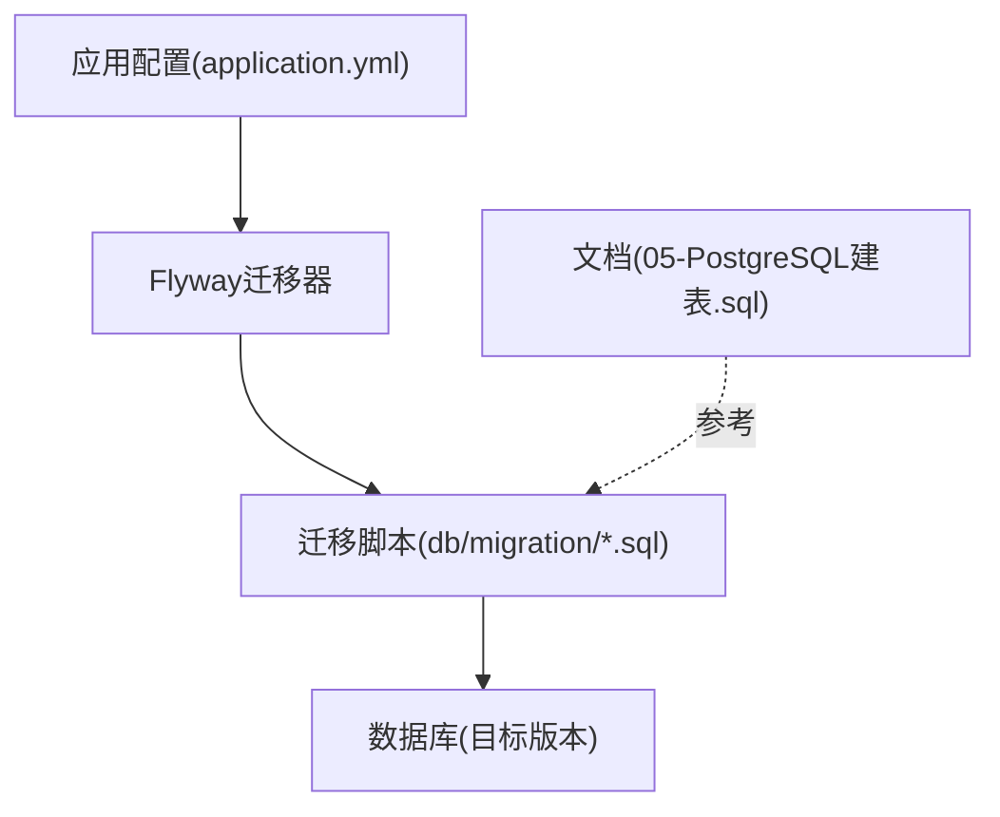
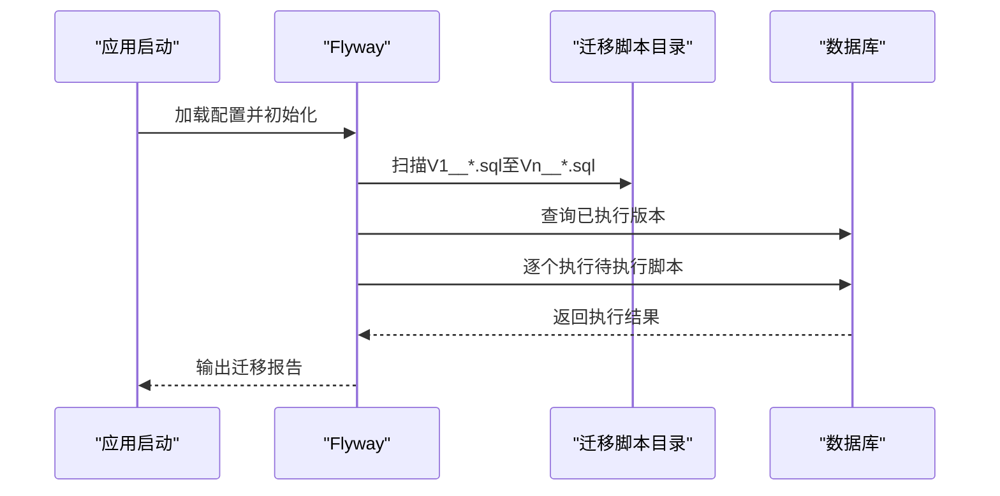
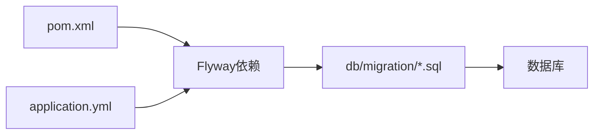

# 数据迁移

<cite>
**本文引用的文件**
- [V1__init_core_tables.sql](file://backend/src/main/resources/db/migration/V1__init_core_tables.sql)
- [V2__add_user_phone_number.sql](file://backend/src/main/resources/db/migration/V2__add_user_phone_number.sql)
- [V3__add_activity_expenses.sql](file://backend/src/main/resources/db/migration/V3__add_activity_expenses.sql)
- [V4__add_activity_notification_events.sql](file://backend/src/main/resources/db/migration/V4__add_activity_notification_events.sql)
- [application.yml](file://backend/src/main/resources/application.yml)
- [pom.xml](file://backend/pom.xml)
- [05-PostgreSQL建表.sql](file://doc/05-PostgreSQL建表.sql)
</cite>

## 目录
1. [简介](#简介)
2. [项目结构](#项目结构)
3. [核心组件](#核心组件)
4. [架构总览](#架构总览)
5. [详细组件分析](#详细组件分析)
6. [依赖分析](#依赖分析)
7. [性能考虑](#性能考虑)
8. [故障排查指南](#故障排查指南)
9. [结论](#结论)
10. [附录](#附录)

## 简介
本文件面向PlayMiniPro项目的数据库迁移与版本管理，系统化梳理基于Flyway的迁移策略与最佳实践。内容涵盖迁移脚本命名规范（Vn__描述.sql）、执行顺序与版本控制机制；逐版本变更说明（从初始核心表到功能扩展）；迁移脚本编写安全检查、回滚策略与数据一致性保障；生产环境零停机迁移、备份与回滚预案；迁移过程中的错误处理、监控与日志记录；以及开发与生产环境配置差异与注意事项。

## 项目结构
- 迁移脚本位于后端资源目录下的db/migration路径，采用Flyway标准命名：V1__、V2__等递增版本号，文件名中使用下划线分隔描述。
- 应用配置文件中包含Flyway相关属性，用于启用自动迁移与指定迁移脚本位置。
- 文档目录包含PostgreSQL建表SQL，可作为迁移前后的结构参考。

**图表来源**
- [application.yml](file://backend/src/main/resources/application.yml)
- [V1__init_core_tables.sql](file://backend/src/main/resources/db/migration/V1__init_core_tables.sql)
- [05-PostgreSQL建表.sql](file://doc/05-PostgreSQL建表.sql)

**章节来源**
- [application.yml](file://backend/src/main/resources/application.yml)
- [V1__init_core_tables.sql](file://backend/src/main/resources/db/migration/V1__init_core_tables.sql)
- [V2__add_user_phone_number.sql](file://backend/src/main/resources/db/migration/V2__add_user_phone_number.sql)
- [V3__add_activity_expenses.sql](file://backend/src/main/resources/db/migration/V3__add_activity_expenses.sql)
- [V4__add_activity_notification_events.sql](file://backend/src/main/resources/db/migration/V4__add_activity_notification_events.sql)
- [05-PostgreSQL建表.sql](file://doc/05-PostgreSQL建表.sql)

## 核心组件
- Flyway迁移器：通过应用配置启用，自动扫描并按版本顺序执行db/migration下的脚本。
- 迁移脚本集合：V1至V4，覆盖用户、活动、费用与通知事件等核心表结构的初始化与扩展。
- 配置文件：application.yml中定义Flyway行为（如迁移模式、脚本位置、编码等），确保迁移在启动时自动执行。
- Maven依赖：pom.xml中包含Flyway相关依赖，保证运行时可用。

**章节来源**
- [application.yml](file://backend/src/main/resources/application.yml)
- [pom.xml](file://backend/pom.xml)

## 架构总览
Flyway在应用启动阶段自动执行迁移，遵循以下流程：
- 启动时加载Flyway配置
- 扫描db/migration目录
- 按版本号升序执行未应用的脚本
- 记录迁移状态于flyway_schema_history表
- 完成版本升级

**图表来源**
- [application.yml](file://backend/src/main/resources/application.yml)
- [V1__init_core_tables.sql](file://backend/src/main/resources/db/migration/V1__init_core_tables.sql)
- [V2__add_user_phone_number.sql](file://backend/src/main/resources/db/migration/V2__add_user_phone_number.sql)
- [V3__add_activity_expenses.sql](file://backend/src/main/resources/db/migration/V3__add_activity_expenses.sql)
- [V4__add_activity_notification_events.sql](file://backend/src/main/resources/db/migration/V4__add_activity_notification_events.sql)

## 详细组件分析

### 版本V1：初始化核心表
- 目标：建立项目基础数据模型，包含用户、活动、成员等核心实体。
- 关键点：定义主键、外键约束、索引与默认值；确保字段类型与业务需求匹配。
- 影响范围：为后续版本提供基础表结构。

**章节来源**
- [V1__init_core_tables.sql](file://backend/src/main/resources/db/migration/V1__init_core_tables.sql)

### 版本V2：新增用户手机号字段
- 目标：扩展用户信息，支持手机号存储。
- 关键点：添加非空或可空约束视业务需要；考虑唯一性与索引优化；避免对现有数据造成破坏。
- 影响范围：影响用户模块查询与展示逻辑。

**章节来源**
- [V2__add_user_phone_number.sql](file://backend/src/main/resources/db/migration/V2__add_user_phone_number.sql)

### 版本V3：新增活动费用表
- 目标：引入费用明细与汇总能力，支撑活动财务统计。
- 关键点：设计费用项与活动的关联关系；考虑货币精度与聚合计算；确保历史数据兼容。
- 影响范围：活动模块财务相关接口与报表。

**章节来源**
- [V3__add_activity_expenses.sql](file://backend/src/main/resources/db/migration/V3__add_activity_expenses.sql)

### 版本V4：新增活动通知事件表
- 目标：记录活动生命周期内的关键事件，便于消息推送与审计。
- 关键点：事件类型枚举化；时间戳与状态字段；异步处理与幂等性设计。
- 影响范围：通知服务与运营审计。

**章节来源**
- [V4__add_activity_notification_events.sql](file://backend/src/main/resources/db/migration/V4__add_activity_notification_events.sql)

### 命名规范与版本控制
- 命名格式：V{版本号}__{简要描述}.sql，版本号严格递增，描述使用下划线分隔。
- 执行顺序：Flyway按版本号升序执行，确保依赖关系正确。
- 版本控制：每次提交一个独立版本，描述清晰，便于追踪与回滚。

**章节来源**
- [V1__init_core_tables.sql](file://backend/src/main/resources/db/migration/V1__init_core_tables.sql)
- [V2__add_user_phone_number.sql](file://backend/src/main/resources/db/migration/V2__add_user_phone_number.sql)
- [V3__add_activity_expenses.sql](file://backend/src/main/resources/db/migration/V3__add_activity_expenses.sql)
- [V4__add_activity_notification_events.sql](file://backend/src/main/resources/db/migration/V4__add_activity_notification_events.sql)

### 迁移脚本编写最佳实践
- DDL安全性检查
  - 使用条件判断（如IF NOT EXISTS）避免重复执行失败。
  - 对索引与约束操作进行存在性检查，防止重复创建。
  - 修改列属性时先评估数据风险，必要时分步执行。
- 回滚脚本
  - 为每个正向变更准备对应的逆向脚本，保持一一对应。
  - 回滚脚本需能安全删除索引、约束与列，同时恢复数据。
- 数据一致性保证
  - 在事务内执行多步变更，失败则整体回滚。
  - 对关键字段增加校验与默认值，减少脏数据风险。
  - 引入审计字段（创建时间、更新时间、操作人）便于追踪。

**章节来源**
- [V1__init_core_tables.sql](file://backend/src/main/resources/db/migration/V1__init_core_tables.sql)
- [V2__add_user_phone_number.sql](file://backend/src/main/resources/db/migration/V2__add_user_phone_number.sql)
- [V3__add_activity_expenses.sql](file://backend/src/main/resources/db/migration/V3__add_activity_expenses.sql)
- [V4__add_activity_notification_events.sql](file://backend/src/main/resources/db/migration/V4__add_activity_notification_events.sql)

### 生产环境迁移策略
- 零停机迁移
  - 优先使用在线DDL工具与无锁变更，避免长时间表锁定。
  - 将大表变更拆分为多个小版本，逐步上线。
  - 利用影子表或双写策略，降低变更风险。
- 数据备份与回滚预案
  - 迁移前进行全量备份与增量备份策略。
  - 准备回滚脚本与数据恢复流程，确保可在分钟级内回退。
- 监控与告警
  - 监控迁移执行时间、失败率与数据库连接数。
  - 设置异常告警，第一时间响应迁移问题。

**章节来源**
- [application.yml](file://backend/src/main/resources/application.yml)

### 开发与生产环境配置差异
- 开发环境
  - 自动迁移开启，便于快速迭代。
  - 日志级别较低，便于定位问题。
- 生产环境
  - 严格限制自动迁移，采用受控发布流程。
  - 严格的权限与审计，确保操作可追溯。
  - 配置独立的备份与回滚策略。

**章节来源**
- [application.yml](file://backend/src/main/resources/application.yml)

## 依赖分析
- Flyway依赖由Maven管理，确保运行时可用。
- 迁移脚本依赖数据库方言（PostgreSQL），需与目标数据库版本兼容。
- 应用配置决定迁移行为（扫描路径、编码、执行策略等）。

**图表来源**
- [pom.xml](file://backend/pom.xml)
- [application.yml](file://backend/src/main/resources/application.yml)
- [V1__init_core_tables.sql](file://backend/src/main/resources/db/migration/V1__init_core_tables.sql)

**章节来源**
- [pom.xml](file://backend/pom.xml)
- [application.yml](file://backend/src/main/resources/application.yml)

## 性能考虑
- 迁移期间的数据库负载控制：避免在业务高峰期执行大型DDL。
- 索引维护：批量导入或重建索引时注意I/O压力。
- 并发与锁：长事务与表级锁会阻塞业务请求，应尽量缩短事务时间。
- 监控指标：关注迁移耗时、锁等待、慢查询与连接池使用情况。

## 故障排查指南
- 常见问题
  - 迁移失败：检查脚本语法、权限与依赖对象是否存在。
  - 版本冲突：确认flyway_schema_history表记录与脚本版本是否一致。
  - 锁等待：排查长时间事务与热点表更新。
- 处理步骤
  - 查看应用日志与数据库日志，定位具体失败点。
  - 手动执行回滚脚本清理中间状态。
  - 重试迁移或降级到上一稳定版本。
- 监控与日志
  - 启用Flyway与数据库的详细日志输出。
  - 结合APM工具观察迁移过程中的性能波动。

**章节来源**
- [application.yml](file://backend/src/main/resources/application.yml)

## 结论
PlayMiniPro项目采用Flyway进行数据库版本管理，通过标准化的命名规范与严格的版本控制，确保了从初始核心表到功能扩展的平滑演进。建议在后续版本中持续完善回滚脚本、加强数据一致性检查，并在生产环境中严格执行受控发布流程与备份回滚预案，以实现高可靠、低风险的数据库演进。

## 附录
- 参考建表SQL：可对照迁移脚本理解各版本的表结构变化。
  
**章节来源**
- [05-PostgreSQL建表.sql](file://doc/05-PostgreSQL建表.sql)