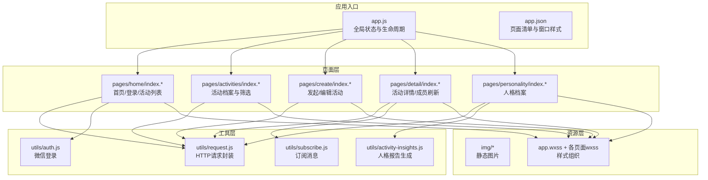
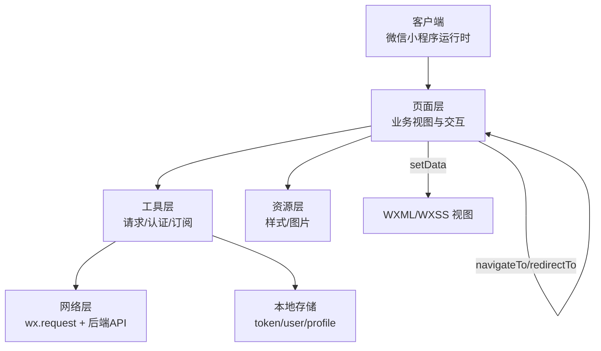
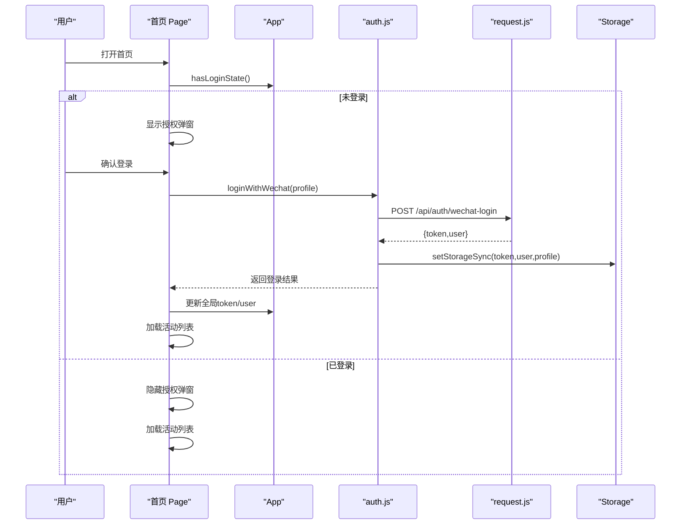
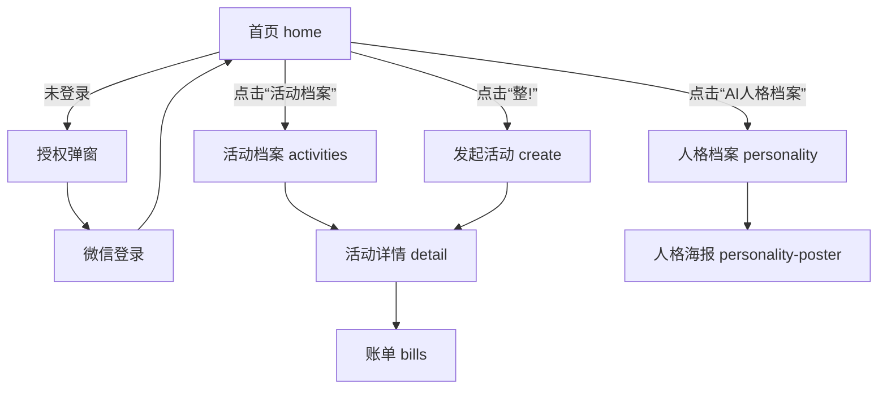
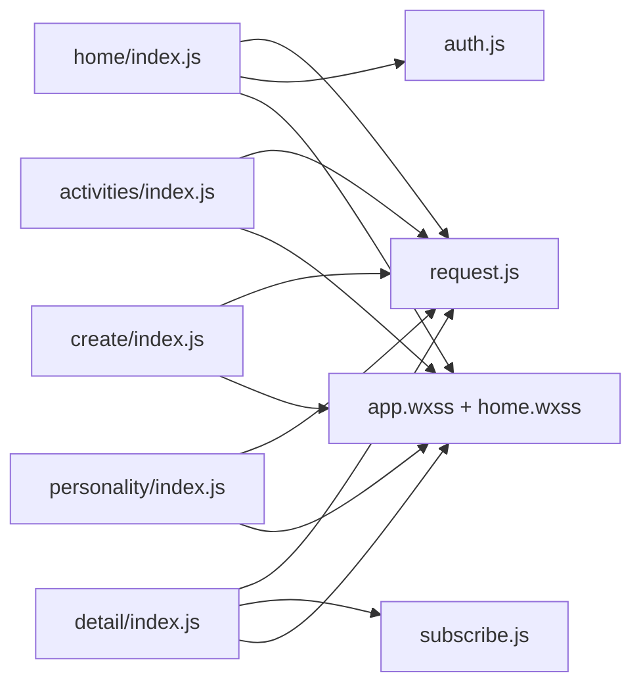

# 前端架构设计

<cite>
**本文引用的文件**
- [frontend/app.js](file://frontend/app.js)
- [frontend/app.json](file://frontend/app.json)
- [frontend/utils/request.js](file://frontend/utils/request.js)
- [frontend/utils/auth.js](file://frontend/utils/auth.js)
- [frontend/utils/subscribe.js](file://frontend/utils/subscribe.js)
- [frontend/pages/home/index.js](file://frontend/pages/home/index.js)
- [frontend/pages/home/index.json](file://frontend/pages/home/index.json)
- [frontend/pages/home/index.wxml](file://frontend/pages/home/index.wxml)
- [frontend/pages/activities/index.js](file://frontend/pages/activities/index.js)
- [frontend/pages/activities/index.wxml](file://frontend/pages/activities/index.wxml)
- [frontend/pages/create/index.js](file://frontend/pages/create/index.js)
- [frontend/pages/create/index.wxml](file://frontend/pages/create/index.wxml)
- [frontend/pages/detail/index.js](file://frontend/pages/detail/index.js)
- [frontend/pages/personality/index.js](file://frontend/pages/personality/index.js)
- [frontend/data/ongoing.js](file://frontend/data/ongoing.js)
- [frontend/utils/activity-insights.js](file://frontend/utils/activity-insights.js)
- [frontend/app.wxss](file://frontend/app.wxss)
</cite>

## 目录
1. [引言](#引言)
2. [项目结构](#项目结构)
3. [核心组件](#核心组件)
4. [架构总览](#架构总览)
5. [详细组件分析](#详细组件分析)
6. [依赖分析](#依赖分析)
7. [性能考虑](#性能考虑)
8. [故障排查指南](#故障排查指南)
9. [结论](#结论)
10. [附录](#附录)

## 引言
本文件面向PlayMiniPro微信小程序前端，系统性梳理其架构设计与实现要点，覆盖页面组件化结构、工具模块化组织、资源文件管理策略；解释小程序生命周期管理、页面路由机制与状态管理模式；阐述组件化开发模式（页面组件、公共组件、工具组件）的设计原则；详解数据流管理（本地存储、网络请求、状态同步）；说明工具模块（HTTP请求封装、用户认证管理、微信消息订阅）；解释样式管理策略（WXSS组织、响应式设计、主题定制）；并提供页面导航流程图与组件交互示例，帮助开发者快速理解整体架构。

## 项目结构
前端采用微信小程序标准目录结构，以“页面-工具-资源”分层组织：
- 页面层：pages/* 下按功能划分页面，如 home、activities、create、detail、personality 等
- 工具层：utils/* 提供通用工具函数，如请求封装、认证、订阅
- 资源层：img、app.wxss、各页面 wxss/wxml/json 组织样式与视图
- 应用入口：app.js、app.json 定义全局状态、窗口样式、权限与页面清单

图表来源
- [frontend/app.js:1-46](file://frontend/app.js#L1-L46)
- [frontend/app.json:1-30](file://frontend/app.json#L1-L30)
- [frontend/utils/request.js:1-107](file://frontend/utils/request.js#L1-L107)
- [frontend/utils/auth.js:1-56](file://frontend/utils/auth.js#L1-L56)
- [frontend/utils/subscribe.js:1-31](file://frontend/utils/subscribe.js#L1-L31)
- [frontend/utils/activity-insights.js:1-418](file://frontend/utils/activity-insights.js#L1-L418)
- [frontend/pages/home/index.js:1-219](file://frontend/pages/home/index.js#L1-L219)
- [frontend/pages/activities/index.js:1-206](file://frontend/pages/activities/index.js#L1-L206)
- [frontend/pages/create/index.js:1-370](file://frontend/pages/create/index.js#L1-L370)
- [frontend/pages/detail/index.js:1-291](file://frontend/pages/detail/index.js#L1-L291)
- [frontend/pages/personality/index.js:1-128](file://frontend/pages/personality/index.js#L1-L128)
- [frontend/app.wxss:1-125](file://frontend/app.wxss#L1-L125)

章节来源
- [frontend/app.js:1-46](file://frontend/app.js#L1-L46)
- [frontend/app.json:1-30](file://frontend/app.json#L1-L30)

## 核心组件
- 应用级状态与生命周期
  - 全局数据：品牌名、用户信息、令牌
  - 生命周期：onLaunch 初始化登录态同步
  - 登录态同步：读取本地存储，设置全局状态
  - 登录/登出：统一封装，更新全局与本地存储
- 页面路由与导航
  - app.json 配置页面清单与窗口样式
  - 页面内使用 navigateTo/redirectTo/switchTab 等进行跳转
- 数据流与状态管理
  - 本地存储：token、user、profile、订阅授权记录
  - 请求层：统一拦截鉴权、错误处理与自动登出
  - 页面状态：Page.data + setData 驱动视图渲染

章节来源
- [frontend/app.js:1-46](file://frontend/app.js#L1-L46)
- [frontend/app.json:1-30](file://frontend/app.json#L1-L30)

## 架构总览
前端采用“页面-工具-资源”三层架构：
- 页面层负责业务视图与交互，调用工具层完成网络与认证
- 工具层提供可复用能力：HTTP请求、微信登录、订阅消息
- 资源层提供样式与静态资源，统一主题与视觉规范

图表来源
- [frontend/utils/request.js:50-80](file://frontend/utils/request.js#L50-L80)
- [frontend/utils/auth.js:3-48](file://frontend/utils/auth.js#L3-L48)
- [frontend/utils/subscribe.js:3-27](file://frontend/utils/subscribe.js#L3-L27)
- [frontend/pages/home/index.js:14-53](file://frontend/pages/home/index.js#L14-L53)

## 详细组件分析

### 页面组件化结构
- 首页 home
  - 功能：未登录弹窗、静默登录、活动列表、快捷入口
  - 关键逻辑：onShow 中根据登录态决定是否弹出授权框；加载进行中的活动；消费邀请路径
  - 视图：WXML 使用模板与循环渲染活动卡片
- 活动档案 activities
  - 功能：按身份/状态/时间/关键词筛选归档活动；点击进入详情
  - 关键逻辑：applyFilters 进行多维过滤与排序；格式化时间与金额
- 发起/编辑活动 create
  - 功能：活动类型规则驱动（强制线下、地点必填）、时间/人数/方式/地点/备注
  - 关键逻辑：提交前校验；构建payload；成功后跳转详情
- 活动详情 detail
  - 功能：展示活动信息、成员列表、加入/拒绝、取消、账单入口；定时刷新成员
  - 关键逻辑：定时器刷新；鉴权过期提示与跳转
- 人格档案 personality
  - 功能：加载并映射人格报告；雷达图、财务周期切换；海报入口

章节来源
- [frontend/pages/home/index.js:1-219](file://frontend/pages/home/index.js#L1-L219)
- [frontend/pages/home/index.wxml:1-122](file://frontend/pages/home/index.wxml#L1-L122)
- [frontend/pages/activities/index.js:1-206](file://frontend/pages/activities/index.js#L1-L206)
- [frontend/pages/activities/index.wxml:1-83](file://frontend/pages/activities/index.wxml#L1-L83)
- [frontend/pages/create/index.js:1-370](file://frontend/pages/create/index.js#L1-L370)
- [frontend/pages/create/index.wxml:1-145](file://frontend/pages/create/index.wxml#L1-L145)
- [frontend/pages/detail/index.js:1-291](file://frontend/pages/detail/index.js#L1-L291)
- [frontend/pages/personality/index.js:1-128](file://frontend/pages/personality/index.js#L1-L128)

### 工具模块化组织
- HTTP请求封装 request
  - 环境配置：本地/生产环境基地址映射；支持自定义基地址
  - 请求拦截：自动附加Authorization头；统一错误处理；401/403自动清除鉴权状态
  - 导出方法：request、环境查询/设置、鉴权状态判断
- 微信登录 auth
  - 流程：wx.login 获取临时code；调用后端换取token与用户信息；写入本地存储与全局状态
  - 参数：支持传入昵称、头像、手机号码code
- 订阅消息 subscribe
  - 流程：首次进入拉起订阅消息授权；记录授权结果与提示标记
  - 安全兜底：无 wx.requestSubscribeMessage 或模板为空时跳过

章节来源
- [frontend/utils/request.js:1-107](file://frontend/utils/request.js#L1-L107)
- [frontend/utils/auth.js:1-56](file://frontend/utils/auth.js#L1-L56)
- [frontend/utils/subscribe.js:1-31](file://frontend/utils/subscribe.js#L1-L31)

### 样式管理策略
- 全局样式 app.wxss
  - 渐变背景、字体族、卡片圆角与阴影、按钮与栅格等通用样式
- 页面样式
  - 通过类名组合实现主题一致性（圆角、阴影、渐变色块）
  - 使用 rpx 单位保证多设备适配
- 主题定制
  - 通过颜色变量与渐变组合实现主色调与卡片风格统一
  - 可扩展：新增页面样式时复用现有类名体系

章节来源
- [frontend/app.wxss:1-125](file://frontend/app.wxss#L1-L125)

### 数据流管理
- 本地存储
  - token：鉴权令牌
  - user：用户信息
  - profile：昵称与头像快照，用于静默登录
  - subscribeTemplateIds：订阅模板ID
  - subscribePermissionPrompted/Result/Error：订阅授权状态
  - pendingInvitePath：被邀请时的待处理跳转路径
- 网络请求
  - request 封装统一错误处理与鉴权头；401/403触发自动登出
  - 页面在异常时提示并引导重新登录
- 状态同步
  - App.syncLoginState 在应用启动时同步全局状态
  - 页面 onShow/onLoad 根据登录态决定是否弹出授权或跳转

图表来源
- [frontend/pages/home/index.js:14-53](file://frontend/pages/home/index.js#L14-L53)
- [frontend/app.js:14-31](file://frontend/app.js#L14-L31)
- [frontend/utils/auth.js:3-48](file://frontend/utils/auth.js#L3-L48)
- [frontend/utils/request.js:50-80](file://frontend/utils/request.js#L50-L80)

### 页面导航流程图

图表来源
- [frontend/pages/home/index.js:134-168](file://frontend/pages/home/index.js#L134-L168)
- [frontend/pages/activities/index.js:103-108](file://frontend/pages/activities/index.js#L103-L108)
- [frontend/pages/create/index.js:266-282](file://frontend/pages/create/index.js#L266-L282)
- [frontend/pages/detail/index.js:213-217](file://frontend/pages/detail/index.js#L213-L217)
- [frontend/pages/personality/index.js:61-65](file://frontend/pages/personality/index.js#L61-L65)

## 依赖分析
- 页面对工具的依赖
  - home/activities/create/detail/personality 均依赖 request.js
  - home/activities/create/detail 依赖 auth.js
  - detail 依赖 subscribe.js
- 工具间的耦合
  - request.js 依赖 App.logout 清理全局状态
  - auth.js 依赖 request.js 发起登录请求
- 资源依赖
  - 页面样式依赖 app.wxss 与各自 wxss
  - 图片资源位于 img 目录，WXML 中按路径引用

图表来源
- [frontend/pages/home/index.js:1-219](file://frontend/pages/home/index.js#L1-L219)
- [frontend/pages/activities/index.js:1-206](file://frontend/pages/activities/index.js#L1-L206)
- [frontend/pages/create/index.js:1-370](file://frontend/pages/create/index.js#L1-L370)
- [frontend/pages/detail/index.js:1-291](file://frontend/pages/detail/index.js#L1-L291)
- [frontend/pages/personality/index.js:1-128](file://frontend/pages/personality/index.js#L1-L128)
- [frontend/utils/request.js:1-107](file://frontend/utils/request.js#L1-L107)
- [frontend/utils/auth.js:1-56](file://frontend/utils/auth.js#L1-L56)
- [frontend/utils/subscribe.js:1-31](file://frontend/utils/subscribe.js#L1-L31)
- [frontend/app.wxss:1-125](file://frontend/app.wxss#L1-L125)

章节来源
- [frontend/utils/request.js:82-91](file://frontend/utils/request.js#L82-L91)
- [frontend/utils/auth.js:1-56](file://frontend/utils/auth.js#L1-L56)

## 性能考虑
- 按需加载
  - app.json 开启 lazyCodeLoading 为 requiredComponents，减少首屏代码量
- 列表渲染优化
  - 使用 wx:for + wx:key 提升渲染性能
- 定时刷新
  - detail 页面仅在可见时启动定时器，隐藏/卸载时停止，避免后台消耗
- 网络请求
  - 统一鉴权头与错误处理，减少重复逻辑
  - 对于频繁刷新的成员列表，建议结合后端增量更新或长连接（当前为定时轮询）

## 故障排查指南
- 登录态异常
  - 现象：接口返回401/403或提示“登录已过期”
  - 处理：request.js 自动清除本地存储与全局状态；引导重新登录
- 静默登录失败
  - 现象：缓存profile存在但登录失败
  - 处理：首页 onShow 中捕获异常并显示授权弹窗
- 订阅消息授权
  - 现象：首次进入未弹出订阅授权或失败
  - 处理：subscribe.js 已记录提示标记与错误信息；可引导用户手动开启
- 发起活动校验失败
  - 现象：提交时报错
  - 处理：create 页面对必填项与规则进行校验；错误信息友好提示

章节来源
- [frontend/utils/request.js:68-95](file://frontend/utils/request.js#L68-L95)
- [frontend/pages/home/index.js:181-195](file://frontend/pages/home/index.js#L181-L195)
- [frontend/utils/subscribe.js:3-27](file://frontend/utils/subscribe.js#L3-L27)
- [frontend/pages/create/index.js:219-282](file://frontend/pages/create/index.js#L219-L282)

## 结论
PlayMiniPro前端以清晰的分层架构与模块化工具实现业务闭环：页面层专注交互与视图，工具层提供统一的网络与认证能力，资源层保障一致的视觉体验。通过本地存储与请求拦截实现稳定的鉴权与状态同步；通过页面生命周期与导航策略确保用户体验流畅。建议后续在详情页引入事件总线或轻量状态库以进一步解耦页面间通信，并探索后端推送替代定时轮询以降低前端刷新成本。

## 附录
- 页面清单与窗口样式
  - app.json 中声明页面、导航栏与背景样式、权限与懒加载策略
- 页面标题
  - 各页面 json 中设置导航栏标题文本
- 示例：人格报告生成
  - activity-insights.js 提供种子数据与报告映射，便于前端联调与展示

章节来源
- [frontend/app.json:1-30](file://frontend/app.json#L1-L30)
- [frontend/pages/home/index.json:1-3](file://frontend/pages/home/index.json#L1-L3)
- [frontend/utils/activity-insights.js:1-418](file://frontend/utils/activity-insights.js#L1-L418)