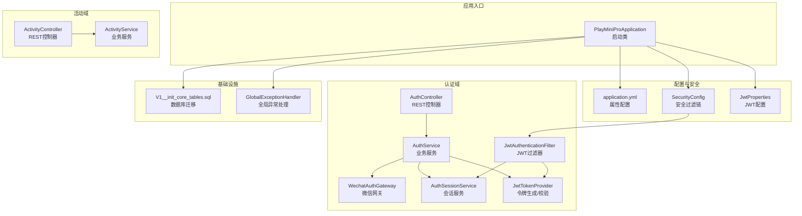
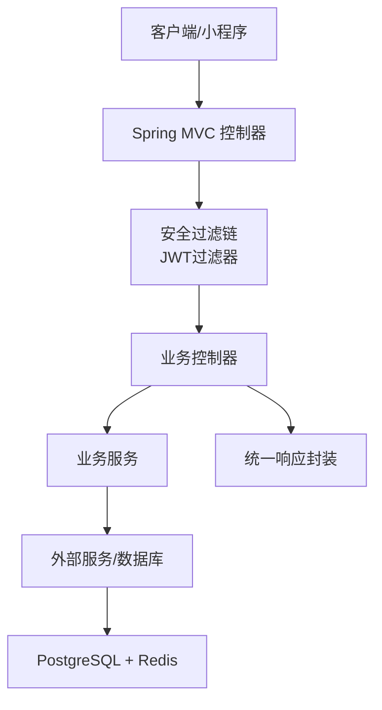
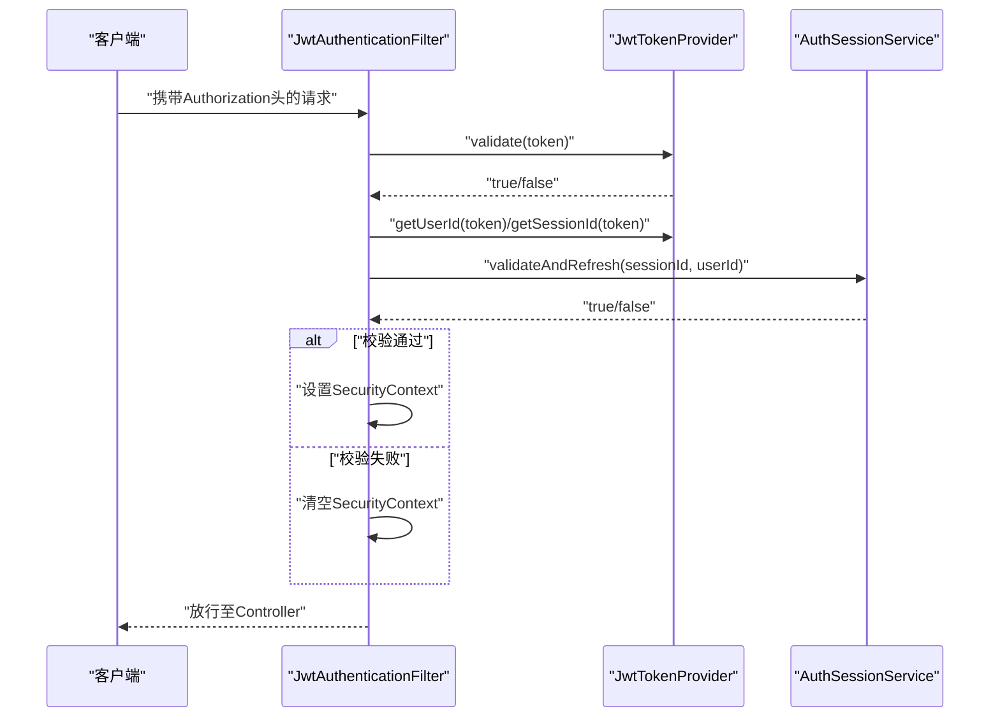
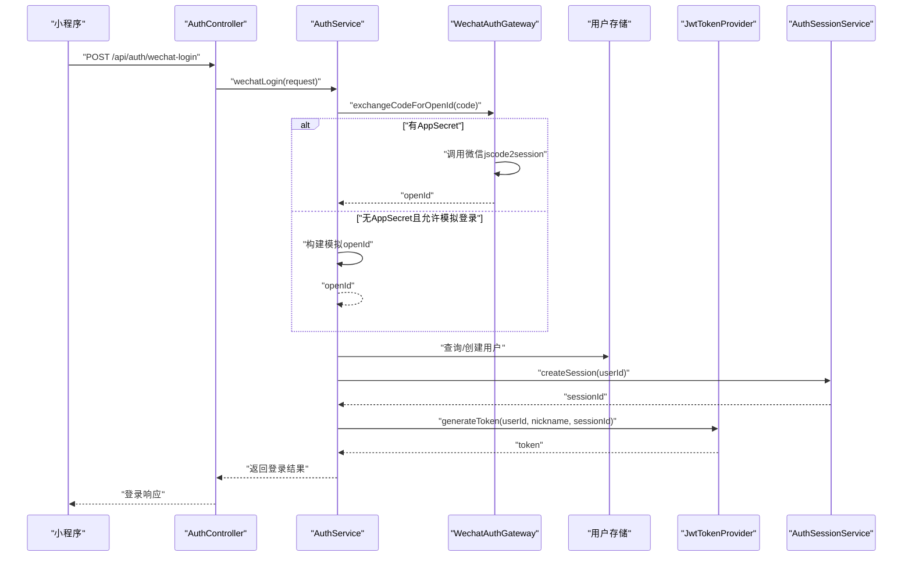
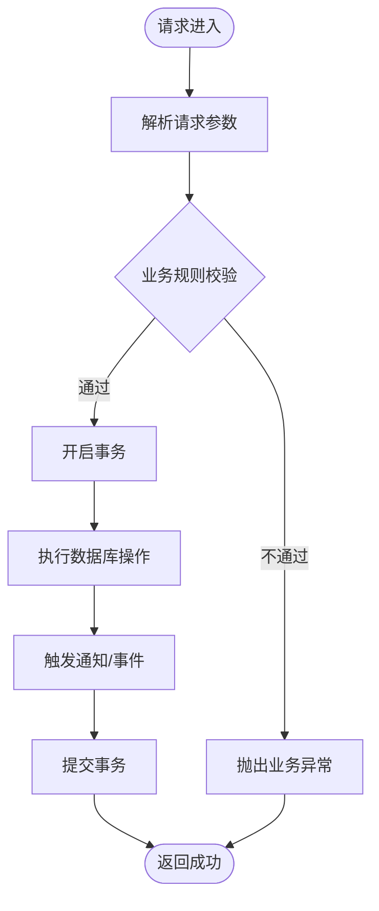
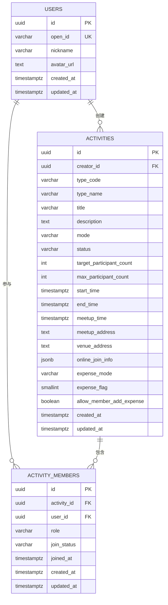
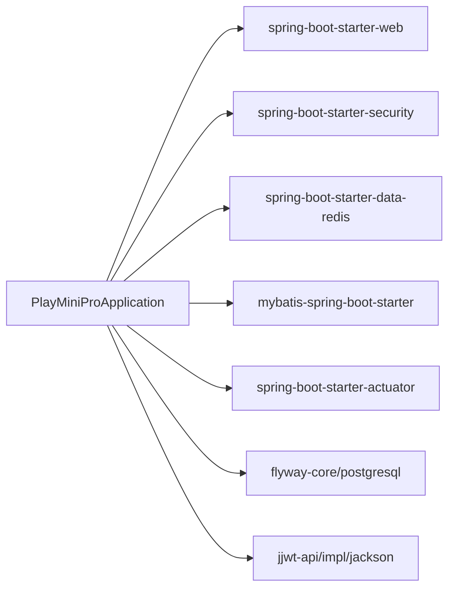

# 后端架构设计

<cite>
**本文引用的文件**
- [PlayMiniProApplication.java](file://backend/src/main/java/com/playminipro/PlayMiniProApplication.java)
- [application.yml](file://backend/src/main/resources/application.yml)
- [pom.xml](file://backend/pom.xml)
- [SecurityConfig.java](file://backend/src/main/java/com/playminipro/common/config/SecurityConfig.java)
- [JwtProperties.java](file://backend/src/main/java/com/playminipro/common/config/JwtProperties.java)
- [JwtAuthenticationFilter.java](file://backend/src/main/java/com/playminipro/common/security/JwtAuthenticationFilter.java)
- [JwtTokenProvider.java](file://backend/src/main/java/com/playminipro/common/security/JwtTokenProvider.java)
- [AuthController.java](file://backend/src/main/java/com/playminipro/auth/controller/AuthController.java)
- [ActivityController.java](file://backend/src/main/java/com/playminipro/activity/controller/ActivityController.java)
- [GlobalExceptionHandler.java](file://backend/src/main/java/com/playminipro/common/exception/GlobalExceptionHandler.java)
- [AuthService.java](file://backend/src/main/java/com/playminipro/auth/service/AuthService.java)
- [WechatAuthGateway.java](file://backend/src/main/java/com/playminipro/auth/service/WechatAuthGateway.java)
- [ActivityService.java](file://backend/src/main/java/com/playminipro/activity/service/ActivityService.java)
- [AuthSessionService.java](file://backend/src/main/java/com/playminipro/common/security/AuthSessionService.java)
- [V1__init_core_tables.sql](file://backend/src/main/resources/db/migration/V1__init_core_tables.sql)
</cite>

## 目录
1. [引言](#引言)
2. [项目结构](#项目结构)
3. [核心组件](#核心组件)
4. [架构总览](#架构总览)
5. [详细组件分析](#详细组件分析)
6. [依赖关系分析](#依赖关系分析)
7. [性能考虑](#性能考虑)
8. [故障排查指南](#故障排查指南)
9. [结论](#结论)
10. [附录](#附录)

## 引言
本文件面向PlayMiniPro后端，系统基于Spring Boot 3.3.10构建单体应用，采用分层架构（Controller-Service-Mapper-Entity），并遵循MVC设计模式。系统通过Spring Security实现无状态JWT认证，结合微信小程序授权流程完成登录与会话管理；同时集成MyBatis进行数据持久化，Flyway进行数据库迁移，Actuator提供运行时监控。本文将从架构设计、组件职责、数据流、安全策略到配置管理等方面进行全面解析，并辅以图示帮助开发者快速理解系统设计。

## 项目结构
后端采用按功能域分包的组织方式：auth模块负责认证与用户管理，activity模块负责活动相关业务，common模块提供通用配置、异常处理与安全工具。入口类启用MyBatis Mapper扫描、定时任务与配置属性绑定，统一在application.yml中集中管理配置与外部密钥导入。

**图示来源**
- [PlayMiniProApplication.java:11-14](file://backend/src/main/java/com/playminipro/PlayMiniProApplication.java#L11-L14)
- [application.yml:1-53](file://backend/src/main/resources/application.yml#L1-L53)
- [SecurityConfig.java:26-41](file://backend/src/main/java/com/playminipro/common/config/SecurityConfig.java#L26-L41)
- [JwtProperties.java:5-27](file://backend/src/main/java/com/playminipro/common/config/JwtProperties.java#L5-L27)
- [JwtAuthenticationFilter.java:16-27](file://backend/src/main/java/com/playminipro/common/security/JwtAuthenticationFilter.java#L16-L27)
- [JwtTokenProvider.java:13-24](file://backend/src/main/java/com/playminipro/common/security/JwtTokenProvider.java#L13-L24)
- [AuthController.java:13-26](file://backend/src/main/java/com/playminipro/auth/controller/AuthController.java#L13-L26)
- [AuthService.java:20-39](file://backend/src/main/java/com/playminipro/auth/service/AuthService.java#L20-L39)
- [WechatAuthGateway.java:16-37](file://backend/src/main/java/com/playminipro/auth/service/WechatAuthGateway.java#L16-L37)
- [ActivityController.java:27-43](file://backend/src/main/java/com/playminipro/activity/controller/ActivityController.java#L27-L43)
- [ActivityService.java:20-39](file://backend/src/main/java/com/playminipro/activity/service/ActivityService.java#L20-L39)
- [AuthSessionService.java:10-23](file://backend/src/main/java/com/playminipro/common/security/AuthSessionService.java#L10-L23)
- [V1__init_core_tables.sql:1-58](file://backend/src/main/resources/db/migration/V1__init_core_tables.sql#L1-L58)
- [GlobalExceptionHandler.java:11-41](file://backend/src/main/java/com/playminipro/common/exception/GlobalExceptionHandler.java#L11-L41)

**章节来源**
- [PlayMiniProApplication.java:11-14](file://backend/src/main/java/com/playminipro/PlayMiniProApplication.java#L11-L14)
- [application.yml:1-53](file://backend/src/main/resources/application.yml#L1-L53)

## 核心组件
- 应用启动类：启用Mapper扫描、调度与配置属性绑定，作为Spring容器启动入口。
- 安全配置：禁用CSRF与表单登录，开启跨域，设置无状态会话策略，定义公开端点与受保护端点，注册JWT过滤器。
- JWT体系：配置属性读取、令牌生成与校验、过滤器解析与验证、会话服务基于Redis维护会话有效期。
- 认证流程：AuthController接收微信登录请求，AuthService协调微信网关与用户持久化，生成JWT与会话。
- 活动域：ActivityController暴露REST接口，ActivityService实现业务规则与事务控制。
- 全局异常：统一捕获业务异常、参数校验异常与未预期异常，返回标准化响应。

**章节来源**
- [SecurityConfig.java:26-41](file://backend/src/main/java/com/playminipro/common/config/SecurityConfig.java#L26-L41)
- [JwtProperties.java:5-27](file://backend/src/main/java/com/playminipro/common/config/JwtProperties.java#L5-L27)
- [JwtAuthenticationFilter.java:16-56](file://backend/src/main/java/com/playminipro/common/security/JwtAuthenticationFilter.java#L16-L56)
- [JwtTokenProvider.java:13-60](file://backend/src/main/java/com/playminipro/common/security/JwtTokenProvider.java#L13-L60)
- [AuthController.java:13-26](file://backend/src/main/java/com/playminipro/auth/controller/AuthController.java#L13-L26)
- [AuthService.java:20-101](file://backend/src/main/java/com/playminipro/auth/service/AuthService.java#L20-L101)
- [WechatAuthGateway.java:16-171](file://backend/src/main/java/com/playminipro/auth/service/WechatAuthGateway.java#L16-L171)
- [ActivityController.java:27-112](file://backend/src/main/java/com/playminipro/activity/controller/ActivityController.java#L27-L112)
- [ActivityService.java:20-232](file://backend/src/main/java/com/playminipro/activity/service/ActivityService.java#L20-L232)
- [GlobalExceptionHandler.java:11-41](file://backend/src/main/java/com/playminipro/common/exception/GlobalExceptionHandler.java#L11-L41)

## 架构总览
系统采用单体架构，按功能域划分模块，通过依赖注入实现松耦合。请求自HTTP进入，经由Spring MVC映射到Controller，再调用Service执行业务逻辑，必要时访问数据层或外部服务，最终返回标准化响应。安全层在过滤器链中完成JWT解析与会话校验，确保后续Controller仅处理已认证请求。

**图示来源**
- [ActivityController.java:27-112](file://backend/src/main/java/com/playminipro/activity/controller/ActivityController.java#L27-L112)
- [AuthController.java:13-26](file://backend/src/main/java/com/playminipro/auth/controller/AuthController.java#L13-L26)
- [SecurityConfig.java:26-41](file://backend/src/main/java/com/playminipro/common/config/SecurityConfig.java#L26-L41)
- [JwtAuthenticationFilter.java:16-56](file://backend/src/main/java/com/playminipro/common/security/JwtAuthenticationFilter.java#L16-L56)

## 详细组件分析

### 安全架构与JWT认证
- 过滤器链：禁用CSRF与表单登录，设置无状态会话，开放健康检查与认证端点，其余请求均需认证。
- JWT过滤器：从Authorization头提取Bearer Token，校验有效性并解析用户ID与会话ID；通过会话服务校验Redis中的会话有效性并刷新TTL；成功则写入SecurityContext。
- 令牌提供者：根据配置属性生成签名密钥，支持生成与解析JWT，携带用户ID、昵称与会话ID等声明。
- 会话服务：使用Redis存储sessionId->userId映射，过期时间与JWT一致，提供创建与校验刷新能力。

**图示来源**
- [JwtAuthenticationFilter.java:29-55](file://backend/src/main/java/com/playminipro/common/security/JwtAuthenticationFilter.java#L29-L55)
- [JwtTokenProvider.java:40-59](file://backend/src/main/java/com/playminipro/common/security/JwtTokenProvider.java#L40-L59)
- [AuthSessionService.java:31-44](file://backend/src/main/java/com/playminipro/common/security/AuthSessionService.java#L31-L44)

**章节来源**
- [SecurityConfig.java:26-41](file://backend/src/main/java/com/playminipro/common/config/SecurityConfig.java#L26-L41)
- [JwtAuthenticationFilter.java:16-56](file://backend/src/main/java/com/playminipro/common/security/JwtAuthenticationFilter.java#L16-L56)
- [JwtTokenProvider.java:13-60](file://backend/src/main/java/com/playminipro/common/security/JwtTokenProvider.java#L13-L60)
- [AuthSessionService.java:10-53](file://backend/src/main/java/com/playminipro/common/security/AuthSessionService.java#L10-L53)

### 微信授权与登录流程
- AuthController接收微信登录请求，调用AuthService完成登录。
- AuthService通过WechatAuthGateway交换code为openId，若未配置AppSecret且允许模拟登录，则生成模拟openId。
- 用户资料可选手机号授权，通过微信接口获取加密手机号并解密。
- 成功后创建Redis会话，生成JWT返回给前端。

**图示来源**
- [AuthController.java:23-26](file://backend/src/main/java/com/playminipro/auth/controller/AuthController.java#L23-L26)
- [AuthService.java:41-76](file://backend/src/main/java/com/playminipro/auth/service/AuthService.java#L41-L76)
- [WechatAuthGateway.java:39-72](file://backend/src/main/java/com/playminipro/auth/service/WechatAuthGateway.java#L39-L72)
- [JwtTokenProvider.java:26-38](file://backend/src/main/java/com/playminipro/common/security/JwtTokenProvider.java#L26-L38)
- [AuthSessionService.java:25-29](file://backend/src/main/java/com/playminipro/common/security/AuthSessionService.java#L25-L29)

**章节来源**
- [AuthController.java:13-26](file://backend/src/main/java/com/playminipro/auth/controller/AuthController.java#L13-L26)
- [AuthService.java:20-101](file://backend/src/main/java/com/playminipro/auth/service/AuthService.java#L20-L101)
- [WechatAuthGateway.java:16-171](file://backend/src/main/java/com/playminipro/auth/service/WechatAuthGateway.java#L16-L171)

### 活动域业务流程
- ActivityController提供活动创建、更新、取消、加入、退出、详情查询、账单汇总与完结等接口。
- ActivityService实现业务规则校验（如人数上限、线下活动地址必填、类型规则等），并处理事务。
- 使用JSONB字段存储线上加入信息，通过ObjectMapper序列化/反序列化。

**图示来源**
- [ActivityController.java:45-112](file://backend/src/main/java/com/playminipro/activity/controller/ActivityController.java#L45-L112)
- [ActivityService.java:100-115](file://backend/src/main/java/com/playminipro/activity/service/ActivityService.java#L100-L115)
- [ActivityService.java:183-206](file://backend/src/main/java/com/playminipro/activity/service/ActivityService.java#L183-L206)

**章节来源**
- [ActivityController.java:27-112](file://backend/src/main/java/com/playminipro/activity/controller/ActivityController.java#L27-L112)
- [ActivityService.java:20-232](file://backend/src/main/java/com/playminipro/activity/service/ActivityService.java#L20-L232)

### 数据模型与持久化
- 核心表：users、activities、activity_members，包含UUID主键、外键约束、索引与CHECK约束保证数据一致性。
- MyBatis配置：下划线转驼峰映射，禁用二级缓存，配合实体类完成ORM。
- Flyway迁移：初始化核心表结构，后续版本通过新增SQL脚本演进。

**图示来源**
- [V1__init_core_tables.sql:3-58](file://backend/src/main/resources/db/migration/V1__init_core_tables.sql#L3-L58)

**章节来源**
- [V1__init_core_tables.sql:1-58](file://backend/src/main/resources/db/migration/V1__init_core_tables.sql#L1-L58)

### 配置管理与运行时更新
- 属性配置：application.yml集中管理端口、数据源、Redis、Jackson时区、Flyway、Actuator、JWT与微信配置。
- 环境变量：通过占位符注入数据库、Redis、JWT与微信参数，便于不同环境切换。
- 运行时配置：支持从本地密钥文件加载敏感配置，避免硬编码。

**章节来源**
- [application.yml:1-53](file://backend/src/main/resources/application.yml#L1-L53)

## 依赖关系分析
- Spring Boot 3.3.10 + Java 21，引入Web、Security、Redis、MyBatis、Flyway、Actuator等Starter。
- JWT依赖：jjwt-api/impl/jackson。
- Maven聚合依赖清晰，版本由父POM统一管理。

**图示来源**
- [pom.xml:26-91](file://backend/pom.xml#L26-L91)

**章节来源**
- [pom.xml:1-102](file://backend/pom.xml#L1-L102)

## 性能考虑
- 无状态认证：JWT与Redis会话配合，避免服务端会话存储开销，适合水平扩展。
- 连接池与超时：Redis连接超时配置合理，建议结合压测调整。
- 缓存策略：MyBatis二级缓存关闭，减少复杂场景下的缓存一致性成本。
- 数据库索引：对常用查询字段建立索引，降低活动列表与成员查询延迟。
- 外部调用：微信接口调用增加重试与熔断策略可进一步提升稳定性。

## 故障排查指南
- 统一异常处理：业务异常、参数校验异常与未预期异常分别映射到标准错误码与消息。
- 常见问题定位：
  - 认证失败：检查Authorization头格式、JWT是否过期、会话是否仍有效。
  - 微信授权失败：确认AppId/AppSecret配置、模拟登录开关、微信接口返回码。
  - 参数校验失败：查看字段名与错误提示，修正请求体。
  - 业务规则异常：核对活动规则（人数、线下地址、类型限制）。

**章节来源**
- [GlobalExceptionHandler.java:11-41](file://backend/src/main/java/com/playminipro/common/exception/GlobalExceptionHandler.java#L11-L41)

## 结论
PlayMiniPro后端以Spring Boot为基础，采用清晰的分层架构与MVC模式，结合JWT无状态认证与微信授权流程，实现了从登录到活动管理的完整业务闭环。通过Flyway与MyBatis保障数据库演进与数据访问效率，Actuator提供可观测性。整体设计简洁、边界明确，具备良好的可维护性与扩展性。

## 附录
- 启动类注解要点：Mapper扫描、定时任务启用、配置属性绑定。
- 安全策略要点：无状态会话、跨域配置、公开端点与受保护端点划分。
- 配置项要点：数据库、Redis、JWT、微信参数与日志级别。

**章节来源**
- [PlayMiniProApplication.java:11-14](file://backend/src/main/java/com/playminipro/PlayMiniProApplication.java#L11-L14)
- [SecurityConfig.java:26-55](file://backend/src/main/java/com/playminipro/common/config/SecurityConfig.java#L26-L55)
- [application.yml:1-53](file://backend/src/main/resources/application.yml#L1-L53)