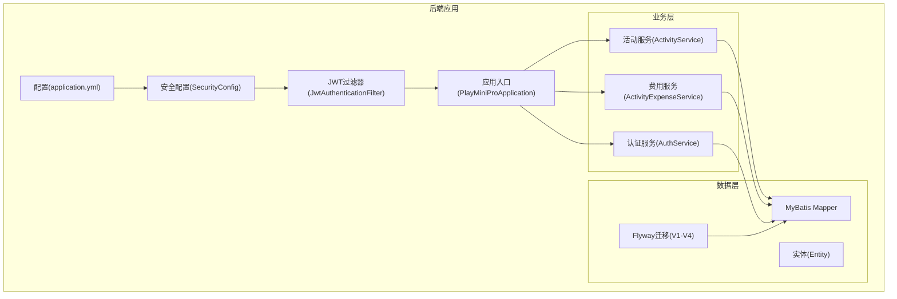
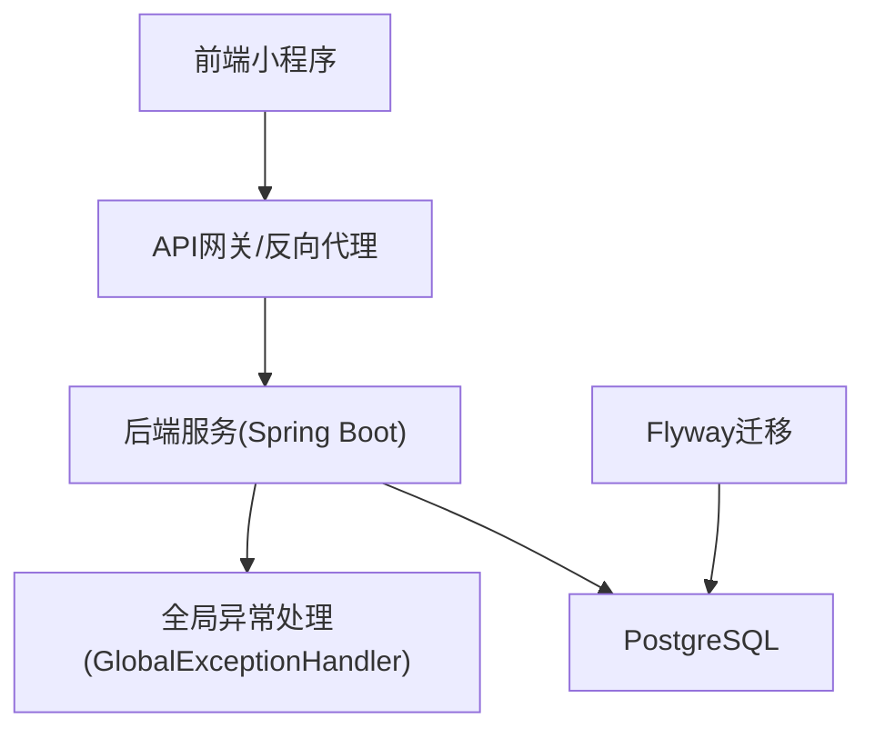
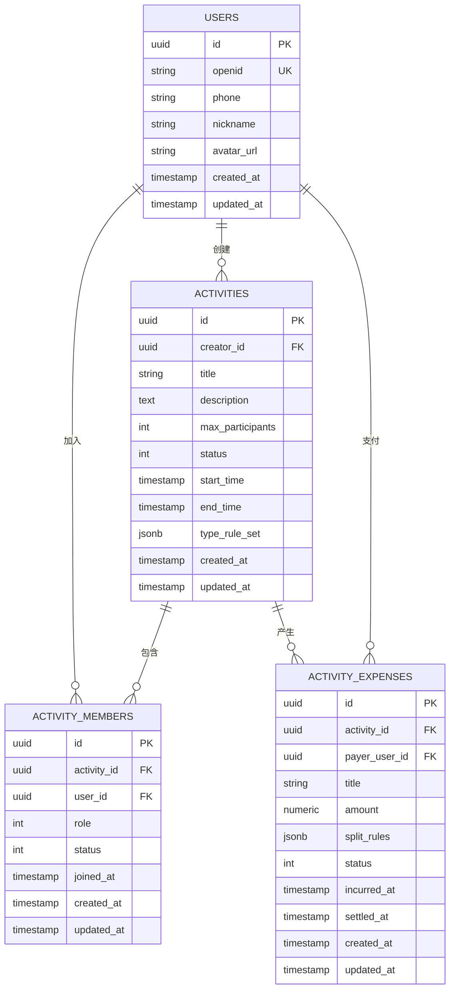
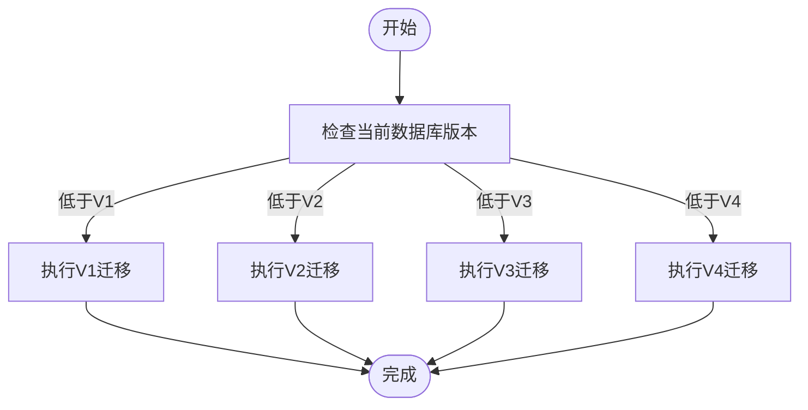
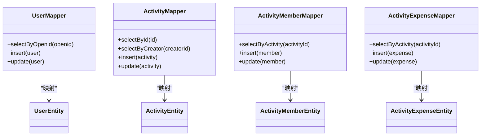
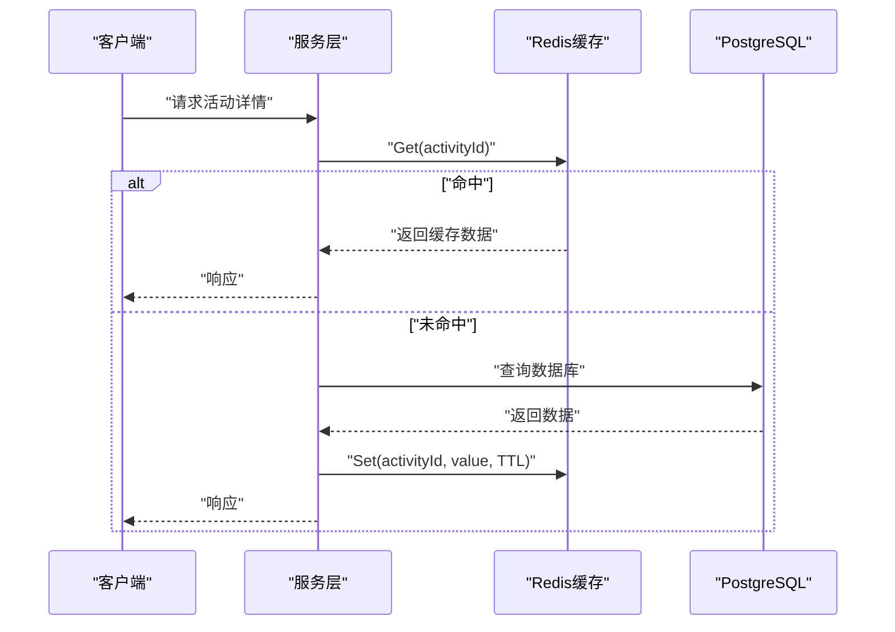
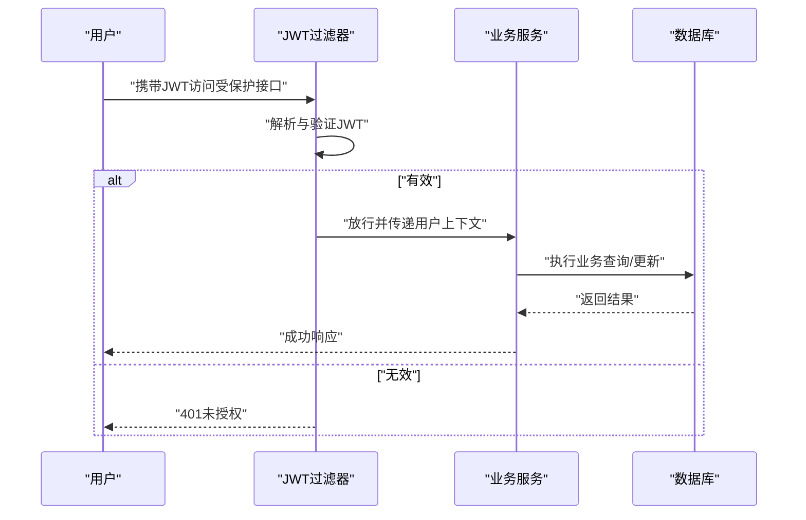
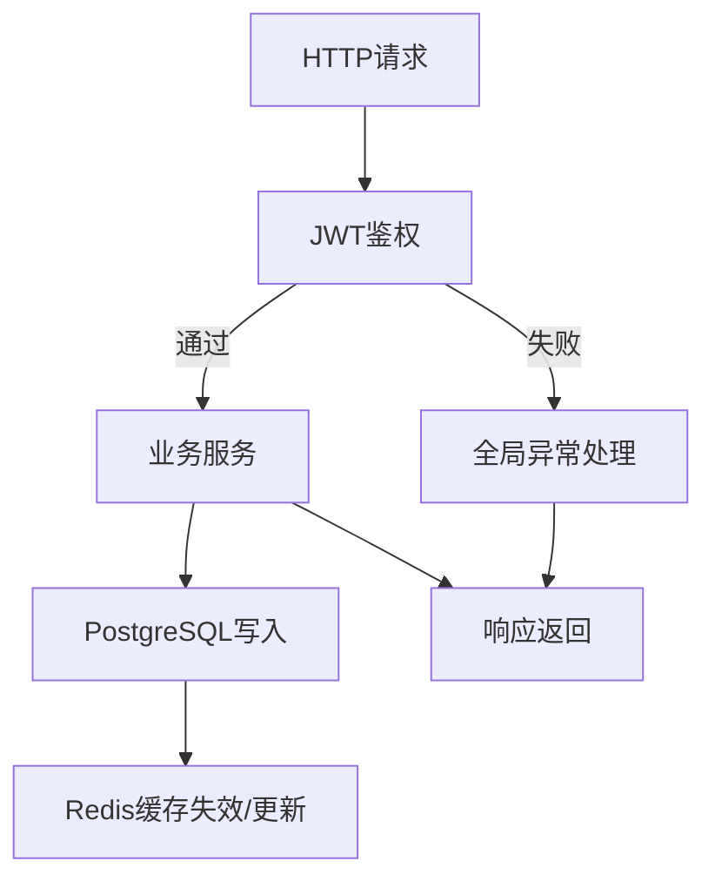
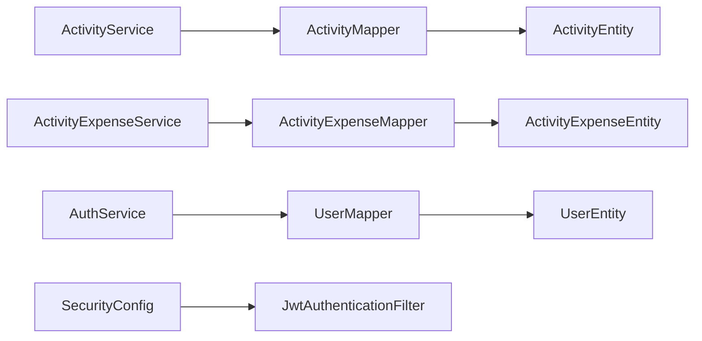

# 数据架构设计

<cite>
**本文引用的文件**
- [V1__init_core_tables.sql](file://backend/src/main/resources/db/migration/V1__init_core_tables.sql)
- [V2__add_user_phone_number.sql](file://backend/src/main/resources/db/migration/V2__add_user_phone_number.sql)
- [V3__add_activity_expenses.sql](file://backend/src/main/resources/db/migration/V3__add_activity_expenses.sql)
- [V4__add_activity_notification_events.sql](file://backend/src/main/resources/db/migration/V4__add_activity_notification_events.sql)
- [05-PostgreSQL建表.sql](file://doc/05-PostgreSQL建表.sql)
- [04-数据库设计文档.md](file://doc/04-数据库设计文档.md)
- [ActivityEntity.java](file://backend/src/main/java/com/playminipro/activity/entity/ActivityEntity.java)
- [ActivityMemberEntity.java](file://backend/src/main/java/com/playminipro/activity/entity/ActivityMemberEntity.java)
- [ActivityExpenseEntity.java](file://backend/src/main/java/com/playminipro/activity/entity/ActivityExpenseEntity.java)
- [UserEntity.java](file://backend/src/main/java/com/playminipro/auth/entity/UserEntity.java)
- [ActivityMapper.java](file://backend/src/main/java/com/playminipro/activity/mapper/ActivityMapper.java)
- [ActivityMemberMapper.java](file://backend/src/main/java/com/playminipro/activity/mapper/ActivityMemberMapper.java)
- [ActivityExpenseMapper.java](file://backend/src/main/java/com/playminipro/activity/mapper/ActivityExpenseMapper.java)
- [UserMapper.java](file://backend/src/main/java/com/playminipro/auth/mapper/UserMapper.java)
- [ActivityExpenseService.java](file://backend/src/main/java/com/playminipro/activity/service/ActivityExpenseService.java)
- [ActivityService.java](file://backend/src/main/java/com/playminipro/activity/service/ActivityService.java)
- [AuthService.java](file://backend/src/main/java/com/playminipro/auth/service/AuthService.java)
- [application.yml](file://backend/src/main/resources/application.yml)
- [SecurityConfig.java](file://backend/src/main/java/com/playminipro/common/config/SecurityConfig.java)
- [JwtAuthenticationFilter.java](file://backend/src/main/java/com/playminipro/common/security/JwtAuthenticationFilter.java)
- [JwtTokenProvider.java](file://backend/src/main/java/com/playminipro/common/security/JwtTokenProvider.java)
- [GlobalExceptionHandler.java](file://backend/src/main/java/com/playminipro/common/exception/GlobalExceptionHandler.java)
- [docker-compose.yml](file://backend/docker-compose.yml)
- [docker-compose.prod.yml](file://deploy/docker-compose.prod.yml)
</cite>

## 目录
1. [引言](#引言)
2. [项目结构](#项目结构)
3. [核心组件](#核心组件)
4. [架构总览](#架构总览)
5. [详细组件分析](#详细组件分析)
6. [依赖分析](#依赖分析)
7. [性能考虑](#性能考虑)
8. [故障排查指南](#故障排查指南)
9. [结论](#结论)
10. [附录](#附录)

## 引言
本设计文档面向PlayMiniPro的数据架构，系统性阐述基于PostgreSQL的关系型数据库设计、数据模型（用户、活动、成员、费用）及其业务关联；说明数据库迁移策略（Flyway版本管理）、数据访问层（MyBatis映射与SQL注入防护）、缓存架构（Redis策略与一致性）、数据安全（敏感数据保护、访问控制、审计）以及ER图与数据流图，帮助开发者全面理解整体数据设计与实现。

## 项目结构
后端采用Spring Boot + MyBatis + Flyway的典型分层架构：应用配置位于resources/application.yml；数据库迁移脚本位于resources/db/migration；实体与Mapper位于activity与auth包；服务层封装业务逻辑；安全配置通过SecurityConfig与JWT过滤器实现。

**图表来源**
- [application.yml](file://backend/src/main/resources/application.yml)
- [SecurityConfig.java](file://backend/src/main/java/com/playminipro/common/config/SecurityConfig.java)
- [JwtAuthenticationFilter.java](file://backend/src/main/java/com/playminipro/common/security/JwtAuthenticationFilter.java)
- [ActivityService.java](file://backend/src/main/java/com/playminipro/activity/service/ActivityService.java)
- [ActivityExpenseService.java](file://backend/src/main/java/com/playminipro/activity/service/ActivityExpenseService.java)
- [AuthService.java](file://backend/src/main/java/com/playminipro/auth/service/AuthService.java)
- [V1__init_core_tables.sql](file://backend/src/main/resources/db/migration/V1__init_core_tables.sql)

**章节来源**
- [application.yml](file://backend/src/main/resources/application.yml)
- [docker-compose.yml](file://backend/docker-compose.yml)
- [docker-compose.prod.yml](file://deploy/docker-compose.prod.yml)

## 核心组件
- 用户实体(UserEntity)：承载用户基础信息与微信授权标识，支持手机号扩展。
- 活动实体(ActivityEntity)：记录活动基本信息、状态、时间与规则集。
- 成员实体(ActivityMemberEntity)：记录用户参与活动的状态与角色。
- 费用实体(ActivityExpenseEntity)：记录活动费用明细、分摊与结算状态。

这些实体通过主键、外键与业务字段形成清晰的业务模型，支撑活动创建、报名、记账与结算等流程。

**章节来源**
- [UserEntity.java](file://backend/src/main/java/com/playminipro/auth/entity/UserEntity.java)
- [ActivityEntity.java](file://backend/src/main/java/com/playminipro/activity/entity/ActivityEntity.java)
- [ActivityMemberEntity.java](file://backend/src/main/java/com/playminipro/activity/entity/ActivityMemberEntity.java)
- [ActivityExpenseEntity.java](file://backend/src/main/java/com/playminipro/activity/entity/ActivityExpenseEntity.java)

## 架构总览
下图展示数据架构的关键交互：前端通过JWT鉴权调用后端REST接口；后端服务经MyBatis访问PostgreSQL；Flyway确保数据库结构演进；异常处理统一返回；容器编排支持开发与生产环境。

**图表来源**
- [application.yml](file://backend/src/main/resources/application.yml)
- [GlobalExceptionHandler.java](file://backend/src/main/java/com/playminipro/common/exception/GlobalExceptionHandler.java)
- [V1__init_core_tables.sql](file://backend/src/main/resources/db/migration/V1__init_core_tables.sql)

## 详细组件分析

### 关系型数据库设计与ER图
基于迁移脚本与实体定义，核心表包括：users、activities、activity_members、activity_expenses。ER关系如下：

**图表来源**
- [V1__init_core_tables.sql](file://backend/src/main/resources/db/migration/V1__init_core_tables.sql)
- [V2__add_user_phone_number.sql](file://backend/src/main/resources/db/migration/V2__add_user_phone_number.sql)
- [V3__add_activity_expenses.sql](file://backend/src/main/resources/db/migration/V3__add_activity_expenses.sql)
- [V4__add_activity_notification_events.sql](file://backend/src/main/resources/db/migration/V4__add_activity_notification_events.sql)
- [UserEntity.java](file://backend/src/main/java/com/playminipro/auth/entity/UserEntity.java)
- [ActivityEntity.java](file://backend/src/main/java/com/playminipro/activity/entity/ActivityEntity.java)
- [ActivityMemberEntity.java](file://backend/src/main/java/com/playminipro/activity/entity/ActivityMemberEntity.java)
- [ActivityExpenseEntity.java](file://backend/src/main/java/com/playminipro/activity/entity/ActivityExpenseEntity.java)

**章节来源**
- [V1__init_core_tables.sql](file://backend/src/main/resources/db/migration/V1__init_core_tables.sql)
- [V2__add_user_phone_number.sql](file://backend/src/main/resources/db/migration/V2__add_user_phone_number.sql)
- [V3__add_activity_expenses.sql](file://backend/src/main/resources/db/migration/V3__add_activity_expenses.sql)
- [V4__add_activity_notification_events.sql](file://backend/src/main/resources/db/migration/V4__add_activity_notification_events.sql)
- [05-PostgreSQL建表.sql](file://doc/05-PostgreSQL建表.sql)
- [04-数据库设计文档.md](file://doc/04-数据库设计文档.md)

### 数据库迁移策略（Flyway）
- 版本命名规范：V1/V2/V3/V4，按功能模块逐步演进。
- 迁移内容：
  - V1：初始化核心表（users、activities、activity_members、activity_expenses）及索引。
  - V2：为users表增加phone字段。
  - V3：为activity_expenses表增加费用明细与分摊规则。
  - V4：新增通知事件表（用于活动相关事件通知）。
- 演进策略：每次变更以独立迁移脚本提交，避免回滚复杂度；生产环境通过Flyway自动执行。

**图表来源**
- [V1__init_core_tables.sql](file://backend/src/main/resources/db/migration/V1__init_core_tables.sql)
- [V2__add_user_phone_number.sql](file://backend/src/main/resources/db/migration/V2__add_user_phone_number.sql)
- [V3__add_activity_expenses.sql](file://backend/src/main/resources/db/migration/V3__add_activity_expenses.sql)
- [V4__add_activity_notification_events.sql](file://backend/src/main/resources/db/migration/V4__add_activity_notification_events.sql)

**章节来源**
- [V1__init_core_tables.sql](file://backend/src/main/resources/db/migration/V1__init_core_tables.sql)
- [V2__add_user_phone_number.sql](file://backend/src/main/resources/db/migration/V2__add_user_phone_number.sql)
- [V3__add_activity_expenses.sql](file://backend/src/main/resources/db/migration/V3__add_activity_expenses.sql)
- [V4__add_activity_notification_events.sql](file://backend/src/main/resources/db/migration/V4__add_activity_notification_events.sql)

### 数据访问层设计（MyBatis）
- Mapper接口职责：声明SQL操作（查询、插入、更新、删除），由XML或注解实现。
- 实体映射：实体类字段与表列一一对应，JSONB字段通过Java对象映射。
- SQL注入防护：使用参数化查询与预编译语句，避免字符串拼接；服务层对输入进行校验。
- 查询优化策略：
  - 为高频查询字段建立索引（如openid、activity_id、user_id）。
  - 使用分页查询与LIMIT限制结果集。
  - 避免SELECT *，仅选择必要列。
  - 对复杂统计查询使用物化视图或定期汇总表。

**图表来源**
- [UserMapper.java](file://backend/src/main/java/com/playminipro/auth/mapper/UserMapper.java)
- [ActivityMapper.java](file://backend/src/main/java/com/playminipro/activity/mapper/ActivityMapper.java)
- [ActivityMemberMapper.java](file://backend/src/main/java/com/playminipro/activity/mapper/ActivityMemberMapper.java)
- [ActivityExpenseMapper.java](file://backend/src/main/java/com/playminipro/activity/mapper/ActivityExpenseMapper.java)
- [UserEntity.java](file://backend/src/main/java/com/playminipro/auth/entity/UserEntity.java)
- [ActivityEntity.java](file://backend/src/main/java/com/playminipro/activity/entity/ActivityEntity.java)
- [ActivityMemberEntity.java](file://backend/src/main/java/com/playminipro/activity/entity/ActivityMemberEntity.java)
- [ActivityExpenseEntity.java](file://backend/src/main/java/com/playminipro/activity/entity/ActivityExpenseEntity.java)

**章节来源**
- [UserMapper.java](file://backend/src/main/java/com/playminipro/auth/mapper/UserMapper.java)
- [ActivityMapper.java](file://backend/src/main/java/com/playminipro/activity/mapper/ActivityMapper.java)
- [ActivityMemberMapper.java](file://backend/src/main/java/com/playminipro/activity/mapper/ActivityMemberMapper.java)
- [ActivityExpenseMapper.java](file://backend/src/main/java/com/playminipro/activity/mapper/ActivityExpenseMapper.java)

### 缓存架构设计（Redis）
- 缓存策略：
  - 热点数据：活动详情、用户会话信息、近期活动列表。
  - 失效策略：TTL设置与LRU淘汰；写多读少场景采用“先写数据库再删缓存”。
- 热点管理：对高并发读取的活动详情与成员列表设置短TTL，结合本地缓存降低穿透。
- 一致性保证：写操作先更新数据库，再删除缓存；读取时若缓存未命中则回源数据库并写入缓存。

[此图为概念性流程示意，不直接映射具体源码文件]

### 数据安全设计
- 敏感数据保护：
  - 手机号字段在数据库中存储，需遵循最小化原则；传输层强制HTTPS。
  - 微信授权信息仅保存必要字段（如openid），避免存储明文敏感数据。
- 访问控制：
  - 基于JWT的无状态认证，过滤器拦截所有受保护路径。
  - 角色与权限在业务层校验（如活动创建者仅可修改自身活动）。
- 审计日志：
  - 记录关键操作（登录、创建活动、记账、结算）的时间、用户、IP与结果。
  - 生产环境输出到集中式日志系统，保留合规周期。

**图表来源**
- [JwtAuthenticationFilter.java](file://backend/src/main/java/com/playminipro/common/security/JwtAuthenticationFilter.java)
- [SecurityConfig.java](file://backend/src/main/java/com/playminipro/common/config/SecurityConfig.java)
- [JwtTokenProvider.java](file://backend/src/main/java/com/playminipro/common/security/JwtTokenProvider.java)

**章节来源**
- [SecurityConfig.java](file://backend/src/main/java/com/playminipro/common/config/SecurityConfig.java)
- [JwtAuthenticationFilter.java](file://backend/src/main/java/com/playminipro/common/security/JwtAuthenticationFilter.java)
- [JwtTokenProvider.java](file://backend/src/main/java/com/playminipro/common/security/JwtTokenProvider.java)
- [GlobalExceptionHandler.java](file://backend/src/main/java/com/playminipro/common/exception/GlobalExceptionHandler.java)

### 数据流图
以下数据流图展示从请求到落库与缓存更新的完整链路，体现安全、持久化与缓存的一致性。

[此图为概念性数据流示意，不直接映射具体源码文件]

## 依赖分析
- 组件耦合：
  - 服务层依赖Mapper接口，Mapper依赖实体与数据库连接。
  - 安全层贯穿所有业务接口，确保统一鉴权。
- 外部依赖：
  - PostgreSQL作为主存储，Flyway负责结构演进。
  - Redis用于缓存与会话存储（概念性说明）。
- 可能的循环依赖：
  - 通过接口抽象避免实体间直接互相引用，降低循环风险。

**图表来源**
- [ActivityService.java](file://backend/src/main/java/com/playminipro/activity/service/ActivityService.java)
- [ActivityExpenseService.java](file://backend/src/main/java/com/playminipro/activity/service/ActivityExpenseService.java)
- [AuthService.java](file://backend/src/main/java/com/playminipro/auth/service/AuthService.java)
- [ActivityMapper.java](file://backend/src/main/java/com/playminipro/activity/mapper/ActivityMapper.java)
- [ActivityExpenseMapper.java](file://backend/src/main/java/com/playminipro/activity/mapper/ActivityExpenseMapper.java)
- [UserMapper.java](file://backend/src/main/java/com/playminipro/auth/mapper/UserMapper.java)
- [SecurityConfig.java](file://backend/src/main/java/com/playminipro/common/config/SecurityConfig.java)
- [JwtAuthenticationFilter.java](file://backend/src/main/java/com/playminipro/common/security/JwtAuthenticationFilter.java)

**章节来源**
- [ActivityService.java](file://backend/src/main/java/com/playminipro/activity/service/ActivityService.java)
- [ActivityExpenseService.java](file://backend/src/main/java/com/playminipro/activity/service/ActivityExpenseService.java)
- [AuthService.java](file://backend/src/main/java/com/playminipro/auth/service/AuthService.java)
- [ActivityMapper.java](file://backend/src/main/java/com/playminipro/activity/mapper/ActivityMapper.java)
- [ActivityExpenseMapper.java](file://backend/src/main/java/com/playminipro/activity/mapper/ActivityExpenseMapper.java)
- [UserMapper.java](file://backend/src/main/java/com/playminipro/auth/mapper/UserMapper.java)
- [SecurityConfig.java](file://backend/src/main/java/com/playminipro/common/config/SecurityConfig.java)
- [JwtAuthenticationFilter.java](file://backend/src/main/java/com/playminipro/common/security/JwtAuthenticationFilter.java)

## 性能考虑
- 数据库层面：
  - 为常用查询字段建立索引；避免全表扫描。
  - 使用批量插入与事务合并减少往返开销。
  - 对大字段（如JSONB）合理拆分或延迟加载。
- 缓存层面：
  - 合理设置TTL与容量上限，避免缓存雪崩。
  - 对热点数据采用多级缓存（本地+分布式）。
- 应用层面：
  - 控制单次查询结果集大小，使用分页。
  - 对复杂报表使用异步任务生成并落盘，前端轮询或推送。

[本节为通用性能建议，不直接分析具体文件]

## 故障排查指南
- 数据库连接问题：
  - 检查application.yml中的数据库连接参数与凭据。
  - 查看Flyway执行状态与错误日志。
- 鉴权失败：
  - 核对JWT签名密钥与过期时间；确认过滤器是否生效。
- 缓存异常：
  - 检查Redis连通性与TTL设置；观察缓存命中率。
- 全局异常：
  - 通过全局异常处理器定位业务异常类型与堆栈。

**章节来源**
- [application.yml](file://backend/src/main/resources/application.yml)
- [GlobalExceptionHandler.java](file://backend/src/main/java/com/playminipro/common/exception/GlobalExceptionHandler.java)

## 结论
PlayMiniPro的数据架构以PostgreSQL为核心，配合Flyway实现可控的结构演进；MyBatis提供清晰的数据访问层；JWT保障访问安全；Redis提升热点数据读取性能。通过合理的索引、分页与缓存策略，系统在可维护性与性能之间取得平衡。建议持续完善监控与审计能力，并在生产环境加强备份与灾备演练。

## 附录
- 开发与生产环境编排参考：
  - 开发环境：docker-compose.yml
  - 生产环境：docker-compose.prod.yml

**章节来源**
- [docker-compose.yml](file://backend/docker-compose.yml)
- [docker-compose.prod.yml](file://deploy/docker-compose.prod.yml)