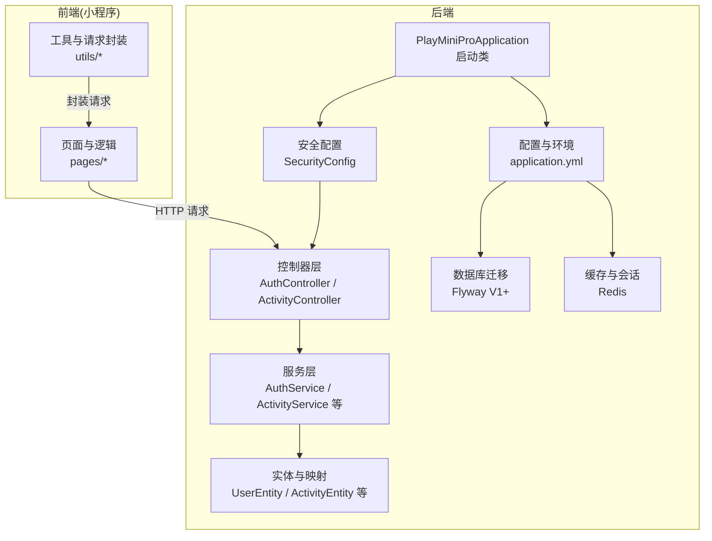
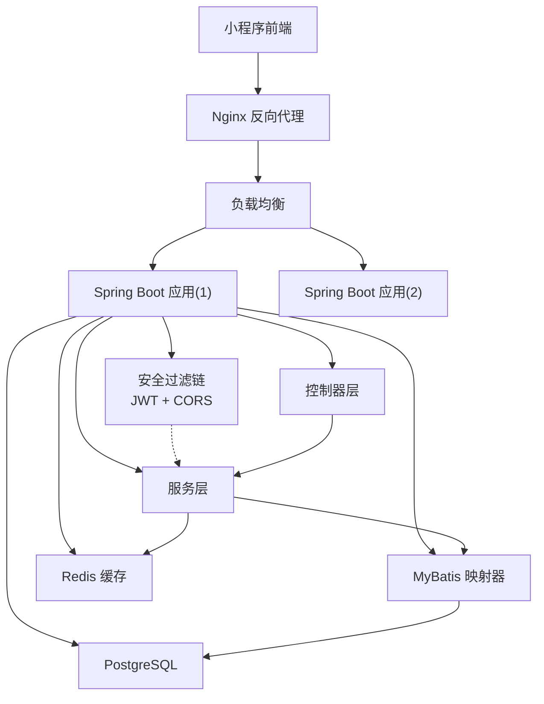
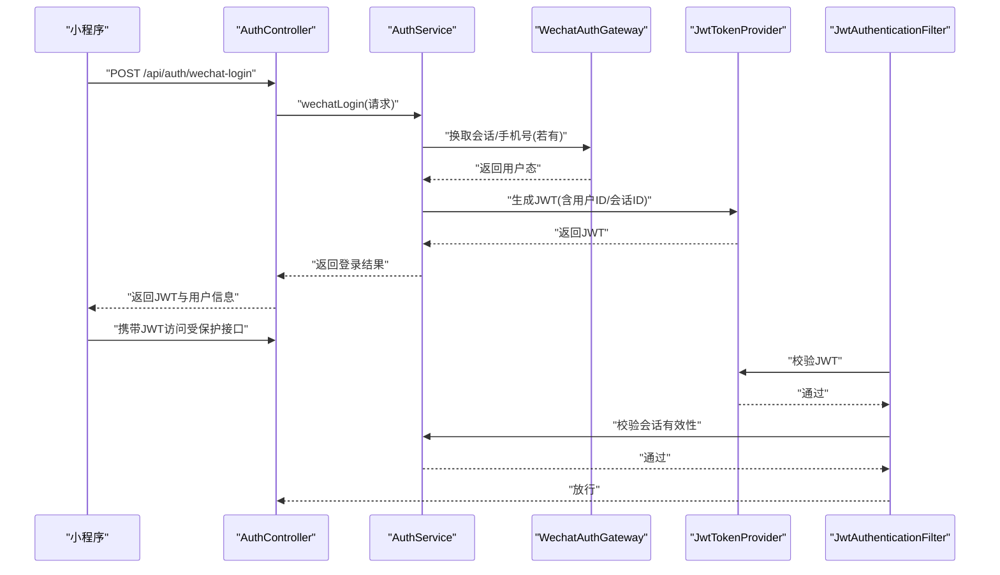
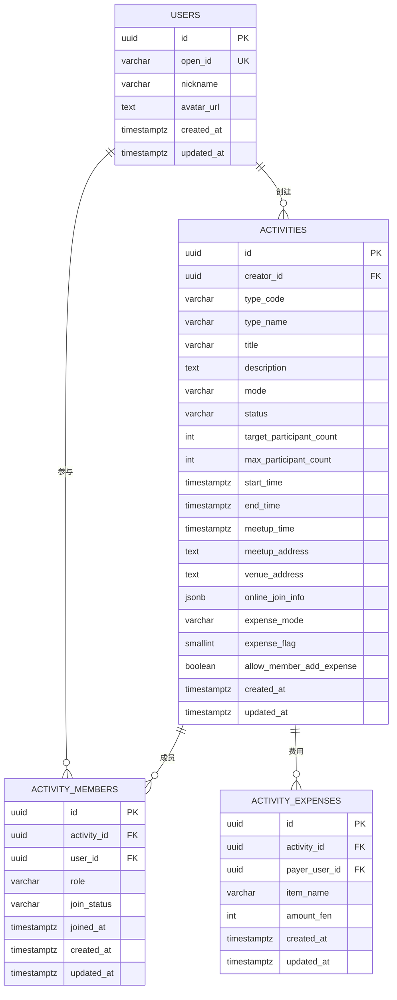
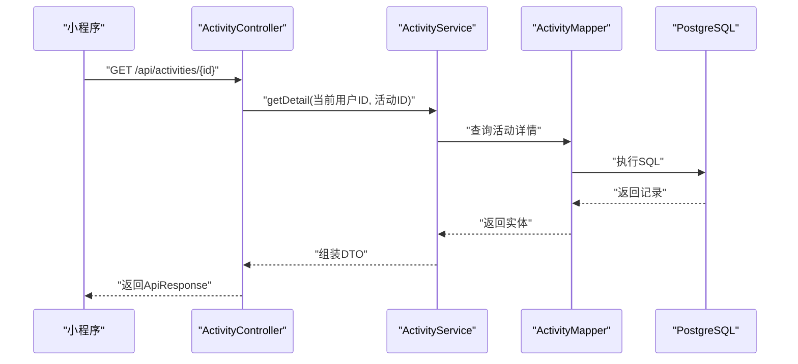
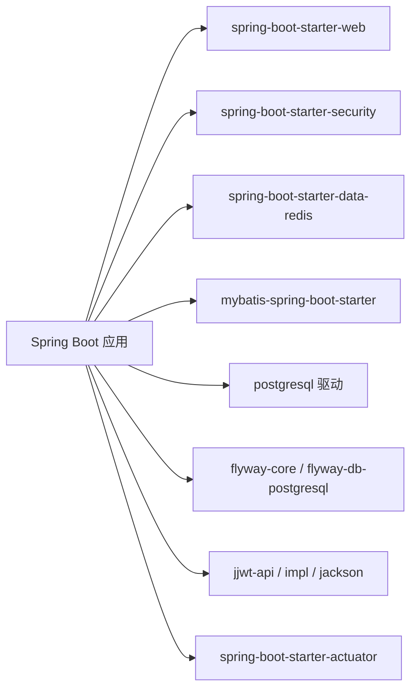

# 架构设计

<cite>
**本文引用的文件**
- [PlayMiniProApplication.java](file://backend/src/main/java/com/playminipro/PlayMiniProApplication.java)
- [application.yml](file://backend/src/main/resources/application.yml)
- [pom.xml](file://backend/pom.xml)
- [Dockerfile](file://backend/Dockerfile)
- [docker-compose.yml](file://backend/docker-compose.yml)
- [SecurityConfig.java](file://backend/src/main/java/com/playminipro/common/config/SecurityConfig.java)
- [JwtAuthenticationFilter.java](file://backend/src/main/java/com/playminipro/common/security/JwtAuthenticationFilter.java)
- [JwtTokenProvider.java](file://backend/src/main/java/com/playminipro/common/security/JwtTokenProvider.java)
- [AuthController.java](file://backend/src/main/java/com/playminipro/auth/controller/AuthController.java)
- [ActivityController.java](file://backend/src/main/java/com/playminipro/activity/controller/ActivityController.java)
- [V1__init_core_tables.sql](file://backend/src/main/resources/db/migration/V1__init_core_tables.sql)
- [UserEntity.java](file://backend/src/main/java/com/playminipro/auth/entity/UserEntity.java)
- [ActivityEntity.java](file://backend/src/main/java/com/playminipro/activity/entity/ActivityEntity.java)
- [ActivityExpenseEntity.java](file://backend/src/main/java/com/playminipro/activity/entity/ActivityExpenseEntity.java)
- [ActivityMemberEntity.java](file://backend/src/main/java/com/playminipro/activity/entity/ActivityMemberEntity.java)
</cite>

## 目录
1. [引言](#引言)
2. [项目结构](#项目结构)
3. [核心组件](#核心组件)
4. [架构总览](#架构总览)
5. [详细组件分析](#详细组件分析)
6. [依赖关系分析](#依赖关系分析)
7. [性能考量](#性能考量)
8. [故障排查指南](#故障排查指南)
9. [结论](#结论)
10. [附录](#附录)

## 引言
本架构设计文档面向PlayMiniPro项目，系统性阐述基于Spring Boot的后端与微信小程序前端的整体设计。后端采用分层架构（Controller-Service-Mapper-Entity）与MVC模式，结合依赖注入实现模块解耦；安全体系以JWT认证为核心，配合微信授权流程与权限控制策略；数据层以PostgreSQL为主库，Redis提供缓存能力，并通过Flyway进行数据库迁移；部署采用Docker容器化与docker-compose编排，辅以Nginx反向代理与负载均衡配置。本文同时给出系统边界、组件交互与数据流向图示，以及架构决策的技术考量与权衡。

## 项目结构
后端采用标准Spring Boot多模块风格，按功能域划分包结构：auth（认证）、activity（活动）、common（通用配置/异常/响应/安全）、根启动类与资源文件（配置、迁移脚本）。前端为微信小程序工程，采用页面与工具函数分离的组织方式。

图表来源
- [PlayMiniProApplication.java:11-20](file://backend/src/main/java/com/playminipro/PlayMiniProApplication.java#L11-L20)
- [application.yml:1-53](file://backend/src/main/resources/application.yml#L1-L53)
- [AuthController.java:1-27](file://backend/src/main/java/com/playminipro/auth/controller/AuthController.java#L1-L27)
- [ActivityController.java:1-112](file://backend/src/main/java/com/playminipro/activity/controller/ActivityController.java#L1-L112)

章节来源
- [PlayMiniProApplication.java:11-20](file://backend/src/main/java/com/playminipro/PlayMiniProApplication.java#L11-L20)
- [application.yml:1-53](file://backend/src/main/resources/application.yml#L1-L53)

## 核心组件
- 启动类与扫描：启用Spring Boot、MyBatis Mapper扫描、调度与配置属性加载，统一管理应用生命周期。
- 安全与认证：基于Spring Security的无状态过滤链，JWT解析与校验，会话有效性验证。
- 控制器层：REST接口暴露，统一返回包装，参数校验，鉴权上下文注入。
- 服务层：业务编排与领域逻辑处理，事务与幂等控制由框架与数据库约束保障。
- 数据访问层：MyBatis映射器与实体模型，Flyway迁移脚本驱动Schema演进。
- 配置与环境：数据库、Redis、JWT、微信小程序参数集中管理，支持本地密钥文件覆盖。

章节来源
- [PlayMiniProApplication.java:11-20](file://backend/src/main/java/com/playminipro/PlayMiniProApplication.java#L11-L20)
- [SecurityConfig.java:17-55](file://backend/src/main/java/com/playminipro/common/config/SecurityConfig.java#L17-L55)
- [JwtAuthenticationFilter.java:16-56](file://backend/src/main/java/com/playminipro/common/security/JwtAuthenticationFilter.java#L16-L56)
- [JwtTokenProvider.java:13-60](file://backend/src/main/java/com/playminipro/common/security/JwtTokenProvider.java#L13-L60)
- [AuthController.java:13-27](file://backend/src/main/java/com/playminipro/auth/controller/AuthController.java#L13-L27)
- [ActivityController.java:27-112](file://backend/src/main/java/com/playminipro/activity/controller/ActivityController.java#L27-L112)
- [application.yml:42-49](file://backend/src/main/resources/application.yml#L42-L49)

## 架构总览
后端采用分层架构与MVC模式，依赖注入贯穿各层。安全层在过滤器中完成JWT校验与会话校验，业务层通过控制器暴露REST接口，数据层通过MyBatis访问PostgreSQL并通过Flyway迁移。Redis用于缓存与会话相关能力。前端小程序通过HTTP调用后端接口，遵循统一的鉴权与响应格式。

图表来源
- [docker-compose.yml:1-36](file://backend/docker-compose.yml#L1-L36)
- [SecurityConfig.java:26-41](file://backend/src/main/java/com/playminipro/common/config/SecurityConfig.java#L26-L41)
- [JwtAuthenticationFilter.java:29-55](file://backend/src/main/java/com/playminipro/common/security/JwtAuthenticationFilter.java#L29-L55)
- [ActivityController.java:27-112](file://backend/src/main/java/com/playminipro/activity/controller/ActivityController.java#L27-L112)

## 详细组件分析

### 安全架构与认证流程
- JWT令牌生成：包含用户标识、昵称、会话ID、签发时间与过期时间，使用对称密钥签名。
- 过滤链配置：禁用CSRF与表单登录，开启CORS，设置会话策略为无状态，开放特定路径，其余请求均需认证。
- 请求拦截：从Authorization头提取Bearer Token，校验签名与有效期，解析用户ID与会话ID，校验会话有效性后写入安全上下文。
- 微信授权：前端通过code换取会话，后端AuthService协调WechatAuthGateway完成登录态建立与用户信息落库或更新。

图表来源
- [AuthController.java:23-26](file://backend/src/main/java/com/playminipro/auth/controller/AuthController.java#L23-L26)
- [JwtTokenProvider.java:26-38](file://backend/src/main/java/com/playminipro/common/security/JwtTokenProvider.java#L26-L38)
- [JwtAuthenticationFilter.java:33-52](file://backend/src/main/java/com/playminipro/common/security/JwtAuthenticationFilter.java#L33-L52)
- [SecurityConfig.java:34-38](file://backend/src/main/java/com/playminipro/common/config/SecurityConfig.java#L34-L38)

章节来源
- [SecurityConfig.java:17-55](file://backend/src/main/java/com/playminipro/common/config/SecurityConfig.java#L17-L55)
- [JwtAuthenticationFilter.java:16-56](file://backend/src/main/java/com/playminipro/common/security/JwtAuthenticationFilter.java#L16-L56)
- [JwtTokenProvider.java:13-60](file://backend/src/main/java/com/playminipro/common/security/JwtTokenProvider.java#L13-L60)
- [AuthController.java:13-27](file://backend/src/main/java/com/playminipro/auth/controller/AuthController.java#L13-L27)

### 数据架构与迁移
- 主库：PostgreSQL，UUID主键、JSONB在线加入信息、时区字段、索引与约束保障一致性与查询效率。
- 缓存：Redis用于会话校验与短期热点数据缓存，超时配置与持久化策略在配置中体现。
- 迁移：Flyway启用，SQL脚本位于classpath:db/migration，版本化演进核心表结构。

图表来源
- [V1__init_core_tables.sql:3-58](file://backend/src/main/resources/db/migration/V1__init_core_tables.sql#L3-L58)
- [UserEntity.java:5-76](file://backend/src/main/java/com/playminipro/auth/entity/UserEntity.java#L5-L76)
- [ActivityEntity.java:5-91](file://backend/src/main/java/com/playminipro/activity/entity/ActivityEntity.java#L5-L91)
- [ActivityMemberEntity.java:3-25](file://backend/src/main/java/com/playminipro/activity/entity/ActivityMemberEntity.java#L3-L25)
- [ActivityExpenseEntity.java:5-35](file://backend/src/main/java/com/playminipro/activity/entity/ActivityExpenseEntity.java#L5-L35)

章节来源
- [application.yml:14-22](file://backend/src/main/resources/application.yml#L14-L22)
- [application.yml:20-22](file://backend/src/main/resources/application.yml#L20-L22)
- [V1__init_core_tables.sql:1-58](file://backend/src/main/resources/db/migration/V1__init_core_tables.sql#L1-L58)

### 控制器与服务交互
- 控制器层：统一@RequestMapping与ApiResponse包装，参数校验与鉴权上下文注入，路由到具体服务。
- 服务层：业务编排、领域规则与跨表操作，必要时与缓存交互。
- 数据访问层：MyBatis映射器与实体模型，Flyway迁移脚本驱动Schema演进。

图表来源
- [ActivityController.java:79-82](file://backend/src/main/java/com/playminipro/activity/controller/ActivityController.java#L79-L82)
- [ActivityEntity.java:5-91](file://backend/src/main/java/com/playminipro/activity/entity/ActivityEntity.java#L5-L91)

章节来源
- [ActivityController.java:27-112](file://backend/src/main/java/com/playminipro/activity/controller/ActivityController.java#L27-L112)

### 微服务与单体应用的权衡
- 单体优势：开发与部署简单、内聚性强、事务一致性好、运维成本低；适合中小规模团队与早期产品迭代。
- 微服务考虑：当业务域扩展、团队拆分、性能瓶颈出现时，可按领域拆分服务，引入API网关、消息队列与分布式事务；当前项目仍处于单体阶段，保持高内聚低耦合即可满足需求。

## 依赖关系分析
- 技术栈：Spring Boot 3、Spring Security、MyBatis、PostgreSQL、Redis、Flyway、jjwt。
- 关键依赖：web、security、actuator、redis、mybatis、postgresql、flyway。
- 运行时依赖：容器镜像基于JRE 21，暴露8080端口，健康检查通过Actuator暴露。

图表来源
- [pom.xml:26-91](file://backend/pom.xml#L26-L91)

章节来源
- [pom.xml:1-102](file://backend/pom.xml#L1-L102)

## 性能考量
- 无状态设计：JWT无状态、Redis会话校验，避免服务端会话存储开销。
- 缓存策略：热点数据与会话信息放入Redis，合理设置TTL与过期策略，降低数据库压力。
- 数据库优化：核心字段建立索引（如活动创建者+状态、开始时间、成员用户+状态），使用JSONB存储半结构化数据。
- 并发与限流：可在网关层增加限流与熔断策略，防止突发流量击穿。
- 监控与可观测：启用Actuator健康与信息端点，结合日志与指标监控整体运行状况。

## 故障排查指南
- 认证失败：检查Authorization头是否为Bearer Token，确认JWT未过期且签名有效；核对会话ID在AuthSessionService中的有效性。
- 数据库连接：确认DB_URL、用户名与密码配置正确，PostgreSQL容器健康检查通过；Flyway迁移是否成功。
- Redis连通：确认主机、端口与密码配置，Redis容器健康检查通过。
- 接口异常：查看全局异常处理器输出，定位业务异常与参数校验错误；检查控制器返回包装是否正确。

章节来源
- [JwtAuthenticationFilter.java:33-52](file://backend/src/main/java/com/playminipro/common/security/JwtAuthenticationFilter.java#L33-L52)
- [application.yml:9-19](file://backend/src/main/resources/application.yml#L9-L19)
- [docker-compose.yml:14-18](file://backend/docker-compose.yml#L14-L18)
- [docker-compose.yml:28-32](file://backend/docker-compose.yml#L28-L32)

## 结论
PlayMiniPro后端以Spring Boot为核心，构建了清晰的分层架构与MVC模式，结合JWT认证与微信授权流程，实现了前后端分离与统一鉴权。数据层采用PostgreSQL与Redis，配合Flyway迁移，具备良好的可演进性与可维护性。部署方面通过Docker与docker-compose实现快速编排，具备扩展至生产环境的基础条件。当前阶段以单体应用为主，后续可根据业务增长逐步演进为微服务架构。

## 附录
- 系统边界：后端仅负责业务与数据处理，前端负责UI与交互，二者通过HTTP协议通信。
- 组件交互：控制器接收请求，服务层编排业务，数据层访问数据库与缓存，安全过滤器贯穿请求生命周期。
- 数据流向：前端发起请求，经Nginx反向代理与负载均衡到达后端实例，安全过滤器校验JWT与会话，控制器调用服务，服务通过映射器访问数据库，最终返回统一响应。