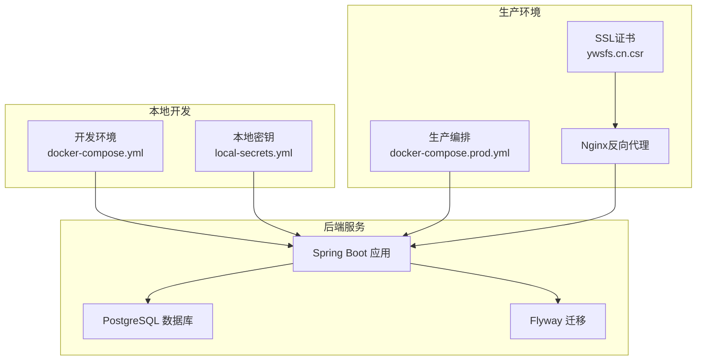
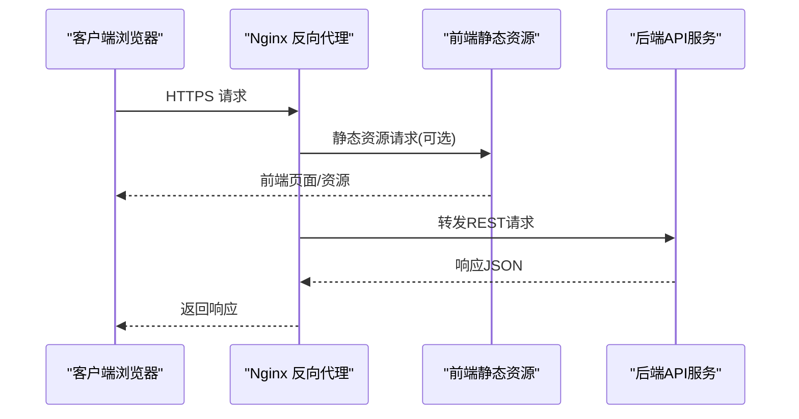
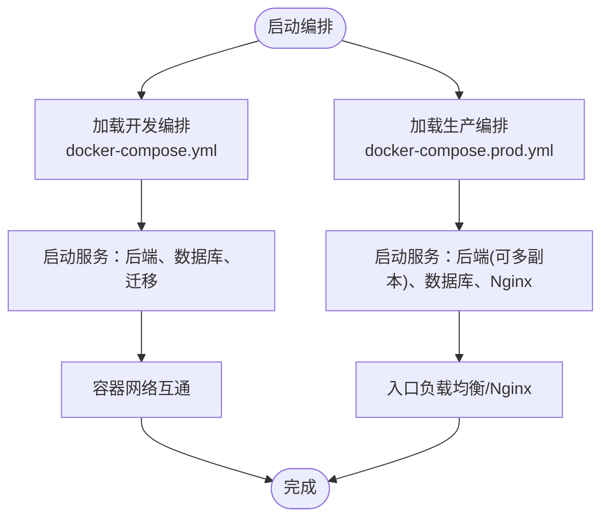

# 部署架构设计

<cite>
**本文引用的文件**
- [backend/docker-compose.yml](file://backend/docker-compose.yml)
- [deploy/docker-compose.prod.yml](file://deploy/docker-compose.prod.yml)
- [backend/Dockerfile](file://backend/Dockerfile)
- [backend/src/main/resources/application.yml](file://backend/src/main/resources/application.yml)
- [deploy_bundle/backend/docker-compose.yml](file://deploy_bundle/backend/docker-compose.yml)
- [deploy_bundle/backend/Dockerfile](file://deploy_bundle/backend/Dockerfile)
- [deploy_bundle/backend/src/main/resources/application.yml](file://deploy_bundle/backend/src/main/resources/application.yml)
- [doc/08-部署发布指南.md](file://doc/08-部署发布指南.md)
- [doc/09-开发调试部署运维接手指南.md](file://doc/09-开发调试部署运维接手指南.md)
- [服务器资源/服务器配置信息.md](file://服务器资源/服务器配置信息.md)
- [服务器资源/ywsfs.cn_nginx/ywsfs.cn.csr](file://服务器资源/ywsfs.cn_nginx/ywsfs.cn.csr)
</cite>

## 目录
1. [简介](#简介)
2. [项目结构](#项目结构)
3. [核心组件](#核心组件)
4. [架构总览](#架构总览)
5. [详细组件分析](#详细组件分析)
6. [依赖关系分析](#依赖关系分析)
7. [性能考虑](#性能考虑)
8. [故障排查指南](#故障排查指南)
9. [结论](#结论)
10. [附录](#附录)

## 简介
本文件面向PlayMiniPro项目的部署与运维团队，系统化阐述基于Docker容器化的部署架构设计，涵盖容器编排策略、服务发现与负载均衡、开发与生产环境差异化配置、Nginx反向代理、微服务拆分与通信、CI/CD流水线、高可用性设计以及部署拓扑与配置要点。文档以仓库中现有的部署相关文件为基础进行分析，并结合运维实践给出可操作的建议。

## 项目结构
PlayMiniPro采用前后端分离与容器化部署的组织方式，核心部署资产分布在以下位置：
- 后端应用：位于backend目录，包含Dockerfile、docker-compose.yml及Spring Boot配置application.yml
- 生产部署编排：位于deploy目录，提供docker-compose.prod.yml用于生产环境
- 打包部署包：deploy_bundle目录包含完整的打包产物（含后端、前端、部署脚本）
- 文档：doc目录包含部署发布指南与运维接手指南
- 服务器资源：包含Nginx证书等运维资料

图表来源
- [backend/docker-compose.yml](file://backend/docker-compose.yml)
- [deploy/docker-compose.prod.yml](file://deploy/docker-compose.prod.yml)
- [backend/src/main/resources/application.yml](file://backend/src/main/resources/application.yml)

章节来源
- [backend/docker-compose.yml](file://backend/docker-compose.yml)
- [deploy/docker-compose.prod.yml](file://deploy/docker-compose.prod.yml)
- [backend/src/main/resources/application.yml](file://backend/src/main/resources/application.yml)

## 核心组件
- 容器镜像构建：后端提供Dockerfile，定义Java运行时、JAR复制与启动命令
- 编排与服务编排：开发环境使用backend/docker-compose.yml；生产环境使用deploy/docker-compose.prod.yml
- 配置管理：application.yml集中管理数据库连接、安全配置、微信登录参数等
- 反向代理：通过Nginx提供HTTPS终止与静态资源服务（前端资源在打包部署包中）
- 数据持久化：PostgreSQL配合Flyway迁移脚本初始化与演进数据库结构

章节来源
- [backend/Dockerfile](file://backend/Dockerfile)
- [backend/docker-compose.yml](file://backend/docker-compose.yml)
- [backend/src/main/resources/application.yml](file://backend/src/main/resources/application.yml)
- [deploy/docker-compose.prod.yml](file://deploy/docker-compose.prod.yml)

## 架构总览
下图展示从客户端到后端服务的典型访问路径，以及生产环境的外部依赖（Nginx、证书）：

图表来源
- [deploy/docker-compose.prod.yml](file://deploy/docker-compose.prod.yml)
- [服务器资源/服务器配置信息.md](file://服务器资源/服务器配置信息.md)

## 详细组件分析

### 容器编排与服务发现
- 开发环境编排：backend/docker-compose.yml定义后端服务、数据库与Flyway迁移服务，通过网络共享实现服务发现
- 生产环境编排：deploy/docker-compose.prod.yml提供生产级编排模板，建议在此基础上扩展服务副本、健康检查与持久卷
- 服务发现：容器网络内通过服务名访问，无需硬编码IP；生产环境可结合负载均衡器或反向代理实现入口层

图表来源
- [backend/docker-compose.yml](file://backend/docker-compose.yml)
- [deploy/docker-compose.prod.yml](file://deploy/docker-compose.prod.yml)

章节来源
- [backend/docker-compose.yml](file://backend/docker-compose.yml)
- [deploy/docker-compose.prod.yml](file://deploy/docker-compose.prod.yml)

### 配置管理与环境差异
- 开发与生产差异：通过不同compose文件与环境变量实现差异化配置（如数据库地址、端口、日志级别）
- 密钥与敏感信息：建议使用独立的secrets文件或环境变量注入，避免硬编码
- 配置分离：application.yml集中管理数据库、安全与第三方集成参数，便于版本控制与审计

章节来源
- [backend/src/main/resources/application.yml](file://backend/src/main/resources/application.yml)
- [deploy_bundle/backend/src/main/resources/application.yml](file://deploy_bundle/backend/src/main/resources/application.yml)

### Nginx反向代理配置
- HTTPS终止：使用ywsfs.cn.csr证书在Nginx中配置TLS，确保传输安全
- 静态资源：可将前端打包后的静态资源交由Nginx提供，减轻后端压力
- 请求转发：将API请求转发至后端服务，支持路径前缀与跨域处理
- 日志与监控：建议开启访问与错误日志，结合外部监控系统

章节来源
- [服务器资源/服务器配置信息.md](file://服务器资源/服务器配置信息.md)
- [服务器资源/ywsfs.cn_nginx/ywsfs.cn.csr](file://服务器资源/ywsfs.cn_nginx/ywsfs.cn.csr)

### 微服务部署模式
- 当前形态：后端为单体Spring Boot应用，未见独立微服务拆分
- 拆分建议：按业务域（认证、活动、账单）逐步拆分为独立服务，每个服务独立Dockerfile与compose编排
- 容器间通信：通过服务名与内部网络访问；引入API网关或反向代理统一入口
- 监控告警：为每个服务配置健康检查、指标导出与告警规则

（本节为概念性建议，不直接分析具体文件）

### CI/CD流水线设计
- 自动化构建：在CI中执行Maven打包生成JAR，随后构建Docker镜像并推送制品库
- 测试集成：在构建阶段集成单元测试与集成测试，失败则阻断发布
- 部署策略：蓝绿/金丝雀发布，结合健康检查与回滚机制
- 配置注入：通过环境变量与配置映射注入生产配置，避免硬编码

（本节为概念性建议，不直接分析具体文件）

### 高可用性设计
- 多实例部署：后端服务在生产编排中可设置多个副本，结合反向代理实现负载均衡
- 故障转移：启用健康检查与自动重启，异常实例自动替换
- 数据备份：定期备份PostgreSQL数据，结合只读副本提升可用性
- 存储与持久化：为数据库卷配置持久化存储与快照策略

（本节为概念性建议，不直接分析具体文件）

## 依赖关系分析
后端应用与数据库、迁移脚本之间的依赖关系如下：

图表来源
- [backend/src/main/resources/application.yml](file://backend/src/main/resources/application.yml)

章节来源
- [backend/src/main/resources/application.yml](file://backend/src/main/resources/application.yml)

## 性能考虑
- JVM调优：根据容器CPU/内存限制设置JVM参数，避免过度分配导致GC压力
- 连接池：合理配置数据库连接池大小，避免连接泄漏
- 缓存：引入Redis缓存热点数据，降低数据库压力
- 静态资源：前端静态资源由Nginx提供，减少后端I/O
- 监控：采集应用指标与慢查询，持续优化

（本节为通用指导，不直接分析具体文件）

## 故障排查指南
- 容器无法启动：检查Dockerfile构建日志与compose服务状态，确认端口占用与依赖服务可达
- 数据库连接失败：核对application.yml中的数据库连接参数与网络连通性
- Nginx访问异常：检查证书有效性、监听端口与转发规则
- 配置泄露风险：避免将密钥写入镜像或版本库，使用环境变量或密钥管理服务

章节来源
- [backend/Dockerfile](file://backend/Dockerfile)
- [backend/src/main/resources/application.yml](file://backend/src/main/resources/application.yml)
- [doc/08-部署发布指南.md](file://doc/08-部署发布指南.md)

## 结论
PlayMiniPro当前采用单体后端与容器化部署的架构，具备清晰的开发与生产编排文件。建议在现有基础上完善生产级配置（多副本、健康检查、持久化与备份）、引入Nginx作为入口与静态资源服务、规划微服务拆分与CI/CD流程，并加强监控与告警体系，以满足生产环境的稳定性与可维护性要求。

## 附录
- 部署参考文档：doc/08-部署发布指南.md与doc/09-开发调试部署运维接手指南.md
- 服务器与证书：服务器配置信息与ywsfs.cn.csr证书

章节来源
- [doc/08-部署发布指南.md](file://doc/08-部署发布指南.md)
- [doc/09-开发调试部署运维接手指南.md](file://doc/09-开发调试部署运维接手指南.md)
- [服务器资源/服务器配置信息.md](file://服务器资源/服务器配置信息.md)
- [服务器资源/ywsfs.cn_nginx/ywsfs.cn.csr](file://服务器资源/ywsfs.cn_nginx/ywsfs.cn.csr)