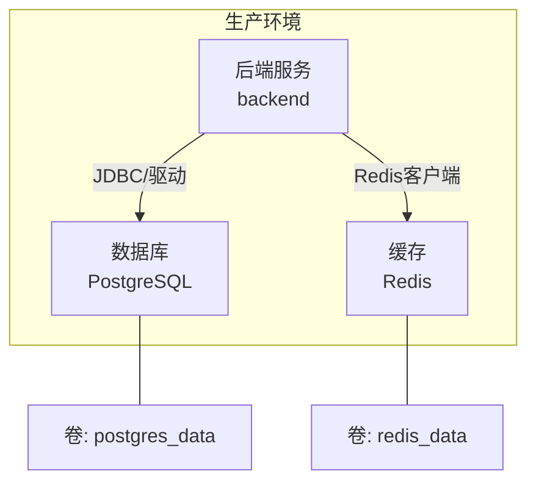
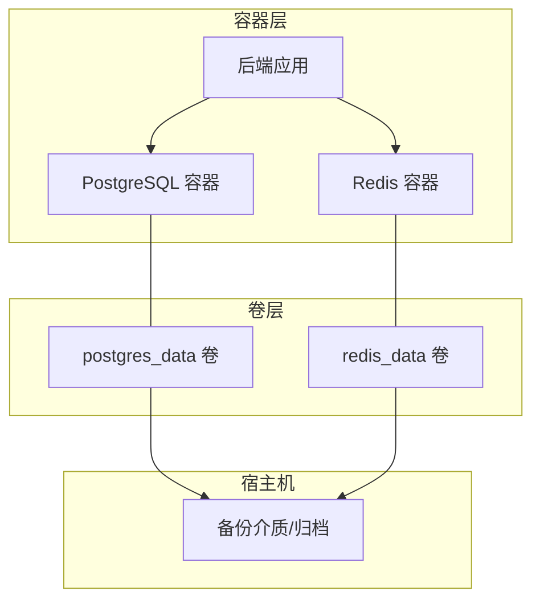
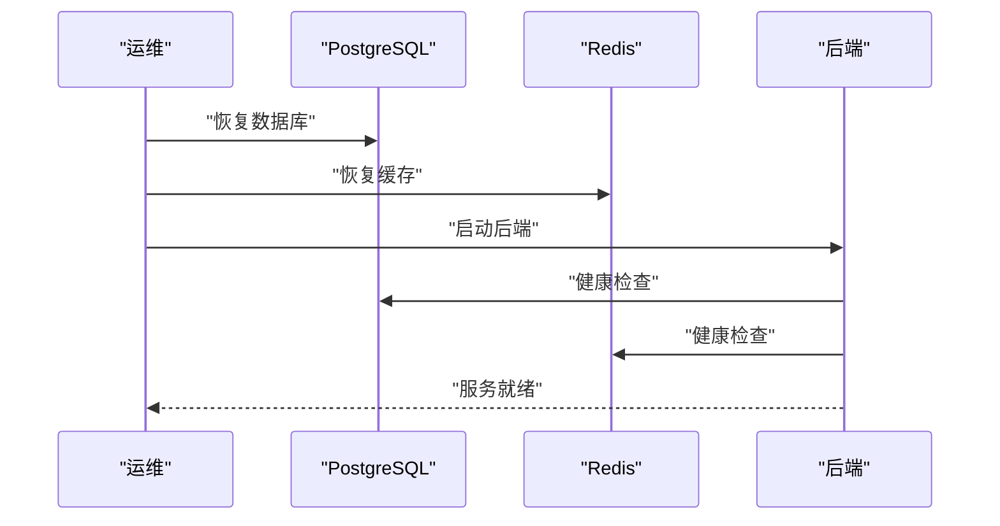
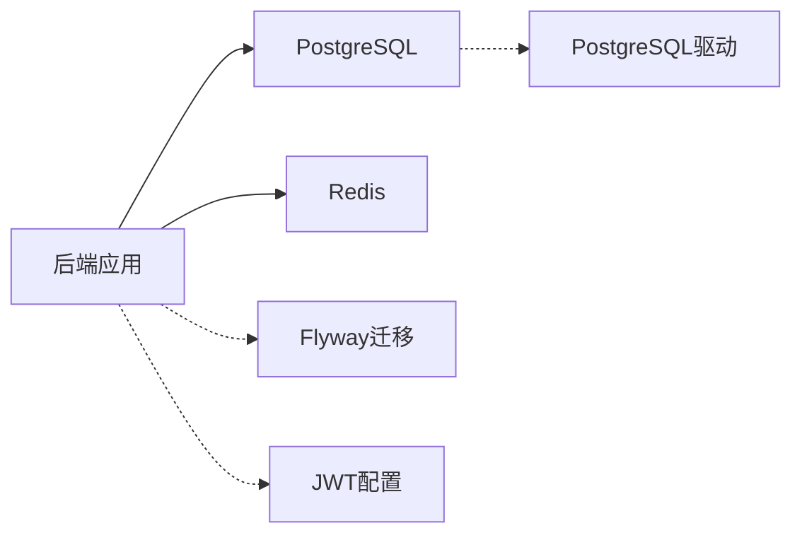

# 备份与恢复

<cite>
**本文引用的文件**
- [docker-compose.prod.yml（部署）](file://deploy/docker-compose.prod.yml)
- [docker-compose.prod.yml（部署后端打包）](file://deploy_backend_bundle/deploy/docker-compose.prod.yml)
- [docker-compose.prod.yml（部署打包）](file://deploy_bundle/deploy/docker-compose.prod.yml)
- [application.yml（后端）](file://backend/src/main/resources/application.yml)
- [application.yml（部署打包后端）](file://deploy_bundle/backend/src/main/resources/application.yml)
- [README（部署）](file://deploy/README.md)
- [README（部署后端打包）](file://deploy_backend_bundle/deploy/README.md)
- [README（部署打包）](file://deploy_bundle/deploy/README.md)
- [08-部署发布指南.md](file://doc/08-部署发布指南.md)
- [V1__init_core_tables.sql](file://backend/src/main/resources/db/migration/V1__init_core_tables.sql)
- [V2__add_user_phone_number.sql](file://backend/src/main/resources/db/migration/V2__add_user_phone_number.sql)
- [V3__add_activity_expenses.sql](file://backend/src/main/resources/db/migration/V3__add_activity_expenses.sql)
- [V4__add_activity_notification_events.sql](file://backend/src/main/resources/db/migration/V4__add_activity_notification_events.sql)
- [05-PostgreSQL建表.sql](file://doc/05-PostgreSQL建表.sql)
- [pom.xml（后端）](file://backend/pom.xml)
- [pom.xml（部署打包后端）](file://deploy_backend_bundle/backend/pom.xml)
- [docker-compose.yml（本地开发）](file://backend/docker-compose.yml)
- [docker-compose.yml（部署打包本地开发）](file://deploy_bundle/backend/docker-compose.yml)
</cite>

## 目录
1. [简介](#简介)
2. [项目结构](#项目结构)
3. [核心组件](#核心组件)
4. [架构总览](#架构总览)
5. [详细组件分析](#详细组件分析)
6. [依赖关系分析](#依赖关系分析)
7. [性能考量](#性能考量)
8. [故障排查指南](#故障排查指南)
9. [结论](#结论)
10. [附录](#附录)

## 简介
本指南面向PlayMiniPro生产环境，围绕数据库（PostgreSQL）与缓存（Redis）两类核心数据资产，系统化给出备份与恢复策略：包括全量/增量备份思路、Redis持久化配置要点、自动化备份脚本与定时任务建议、灾难恢复流程、验证与演练最佳实践，以及备份存储安全与合规要求。文档严格基于仓库中现有配置与部署文件进行分析与提炼，避免超出代码事实的假设。

## 项目结构
- 生产部署采用Docker Compose编排，包含后端、PostgreSQL与Redis三类服务，并通过卷实现数据持久化。
- 应用配置文件定义了数据库连接、Redis连接、Flyway迁移等关键参数。
- 数据库迁移脚本位于classpath路径下，由Spring Boot与Flyway管理。

图表来源
- [docker-compose.prod.yml（部署）:1-61](file://deploy/docker-compose.prod.yml#L1-L61)
- [docker-compose.prod.yml（部署后端打包）:1-61](file://deploy_backend_bundle/deploy/docker-compose.prod.yml#L1-L61)
- [docker-compose.prod.yml（部署打包）:1-61](file://deploy_bundle/deploy/docker-compose.prod.yml#L1-L61)

章节来源
- [docker-compose.prod.yml（部署）:1-61](file://deploy/docker-compose.prod.yml#L1-L61)
- [docker-compose.prod.yml（部署后端打包）:1-61](file://deploy_backend_bundle/deploy/docker-compose.prod.yml#L1-L61)
- [docker-compose.prod.yml（部署打包）:1-61](file://deploy_bundle/deploy/docker-compose.prod.yml#L1-L61)
- [application.yml（后端）:1-53](file://backend/src/main/resources/application.yml#L1-L53)
- [application.yml（部署打包后端）:1-53](file://deploy_bundle/backend/src/main/resources/application.yml#L1-L53)

## 核心组件
- PostgreSQL
  - 使用官方镜像，启用健康检查；数据持久化通过卷映射至宿主机。
  - 连接参数由环境变量注入，应用侧以JDBC方式访问。
- Redis
  - 使用官方镜像，开启AOF持久化；数据持久化通过卷映射至宿主机。
  - 应用侧通过Spring Data Redis连接。
- 后端
  - Spring Boot应用，集成Flyway自动迁移；Actuator暴露运行状态。
  - 通过环境变量注入数据库与Redis连接参数。

章节来源
- [docker-compose.prod.yml（部署）:2-30](file://deploy/docker-compose.prod.yml#L2-L30)
- [docker-compose.prod.yml（部署后端打包）:2-30](file://deploy_backend_bundle/deploy/docker-compose.prod.yml#L2-L30)
- [docker-compose.prod.yml（部署打包）:2-30](file://deploy_bundle/deploy/docker-compose.prod.yml#L2-L30)
- [application.yml（后端）:9-19](file://backend/src/main/resources/application.yml#L9-L19)
- [application.yml（部署打包后端）:9-19](file://deploy_bundle/backend/src/main/resources/application.yml#L9-L19)

## 架构总览
下图展示生产环境中的数据流与持久化位置，便于制定备份策略与恢复流程。

图表来源
- [docker-compose.prod.yml（部署）:11-25](file://deploy/docker-compose.prod.yml#L11-L25)
- [docker-compose.prod.yml（部署后端打包）:11-25](file://deploy_backend_bundle/deploy/docker-compose.prod.yml#L11-L25)
- [docker-compose.prod.yml（部署打包）:11-25](file://deploy_bundle/deploy/docker-compose.prod.yml#L11-L25)

## 详细组件分析

### PostgreSQL 备份与恢复策略
- 全量备份
  - 建议使用逻辑备份（如pg_dump），在业务低峰期执行，确保一致性快照。
  - 备份目标应包含schema与数据，保留序列、索引、约束与触发器。
- 增量备份
  - 建议结合WAL归档与时间点恢复（PITR）。需在数据库侧启用归档日志，并准备归档目录与归档命令。
  - 若无法启用WAL归档，可退而求其次采用周期性全量备份，配合应用侧“只读窗口”或停机窗口进行恢复验证。
- 恢复流程
  - 恢复前评估目标实例版本兼容性与依赖扩展（如uuid-ossp、pgcrypto等）。
  - 恢复顺序：先恢复数据库，再启动后端；后端启动依赖健康检查条件，确保数据库可用后再继续。
- 验证与演练
  - 定期对备份集进行恢复演练，验证数据完整性与业务可用性。
  - 结合Flyway迁移脚本，验证迁移后schema与数据一致性。
- 合规与安全
  - 备份文件加密存储；限制访问权限；记录备份元数据（时间戳、大小、校验值）。
  - 与审计与数据保护政策保持一致。

章节来源
- [docker-compose.prod.yml（部署）:11-17](file://deploy/docker-compose.prod.yml#L11-L17)
- [docker-compose.prod.yml（部署后端打包）:11-17](file://deploy_backend_bundle/deploy/docker-compose.prod.yml#L11-L17)
- [docker-compose.prod.yml（部署打包）:11-17](file://deploy_bundle/deploy/docker-compose.prod.yml#L11-L17)
- [application.yml（后端）:9-13](file://backend/src/main/resources/application.yml#L9-L13)
- [application.yml（部署打包后端）:9-13](file://deploy_bundle/backend/src/main/resources/application.yml#L9-L13)
- [V1__init_core_tables.sql:1-200](file://backend/src/main/resources/db/migration/V1__init_core_tables.sql#L1-L200)
- [V2__add_user_phone_number.sql:1-200](file://backend/src/main/resources/db/migration/V2__add_user_phone_number.sql#L1-L200)
- [V3__add_activity_expenses.sql:1-200](file://backend/src/main/resources/db/migration/V3__add_activity_expenses.sql#L1-L200)
- [V4__add_activity_notification_events.sql:1-200](file://backend/src/main/resources/db/migration/V4__add_activity_notification_events.sql#L1-L200)
- [05-PostgreSQL建表.sql:198-228](file://doc/05-PostgreSQL建表.sql#L198-L228)

### Redis 数据持久化与备份
- 持久化配置
  - 当前配置启用了AOF（appendonly yes），具备较好的数据安全性；建议同时关注重写策略与磁盘空间。
- 备份方法
  - 建议定期执行SAVE或BGSAVE，将RDB快照与AOF文件纳入备份范围。
  - 对于高可用场景，可考虑主从复制与哨兵/集群模式，配合备份策略形成多层保护。
- 恢复流程
  - 恢复时优先加载RDB快照，再合并AOF增量；确保文件权限与路径正确。
  - 恢复后验证键空间与过期策略一致性。
- 验证与演练
  - 定期对AOF/RDB进行恢复演练，验证键值完整性与服务可用性。
- 合规与安全
  - 备份文件加密；最小权限访问；记录备份元数据与变更轨迹。

章节来源
- [docker-compose.prod.yml（部署）:23-25](file://deploy/docker-compose.prod.yml#L23-L25)
- [docker-compose.prod.yml（部署后端打包）:23-25](file://deploy_backend_bundle/deploy/docker-compose.prod.yml#L23-L25)
- [docker-compose.prod.yml（部署打包）:23-25](file://deploy_bundle/deploy/docker-compose.prod.yml#L23-L25)

### 自动化备份脚本与定时任务
- 建议
  - 编写统一的备份脚本，封装PostgreSQL与Redis的备份命令与归档流程。
  - 使用系统级定时任务（如cron）或容器内调度器（如cron容器），按策略执行备份。
  - 备份脚本应包含：执行、校验、告警、清理过期备份等环节。
- 注意事项
  - 为避免影响业务，选择低峰时段执行。
  - 对备份文件进行压缩与加密，传输与存储均应满足安全要求。
  - 记录备份日志与元数据，便于追踪与审计。

章节来源
- [docker-compose.prod.yml（部署）:11-25](file://deploy/docker-compose.prod.yml#L11-L25)
- [docker-compose.prod.yml（部署后端打包）:11-25](file://deploy_backend_bundle/deploy/docker-compose.prod.yml#L11-L25)
- [docker-compose.prod.yml（部署打包）:11-25](file://deploy_bundle/deploy/docker-compose.prod.yml#L11-L25)

### 灾难恢复流程（DR）
- 准备阶段
  - 明确RTO/RPO目标；准备恢复环境（网络、主机、容器编排）。
  - 维护可验证的备份清单与恢复手册。
- 恢复步骤
  - 恢复顺序：先恢复PostgreSQL，再恢复Redis，最后启动后端。
  - 启动后端时，容器依赖数据库与缓存健康检查，确保服务可用后再对外提供。
- 业务连续性
  - 通过反向代理（如Nginx）实现服务切换与流量引导。
  - 在演练中模拟网络分区、节点故障等场景，验证切换与回切流程。
- 回归验证
  - 执行端到端功能测试，核对关键业务数据与接口响应。

图表来源
- [docker-compose.prod.yml（部署）:38-42](file://deploy/docker-compose.prod.yml#L38-L42)
- [docker-compose.prod.yml（部署后端打包）:38-42](file://deploy_backend_bundle/deploy/docker-compose.prod.yml#L38-L42)
- [docker-compose.prod.yml（部署打包）:38-42](file://deploy_bundle/deploy/docker-compose.prod.yml#L38-L42)

章节来源
- [docker-compose.prod.yml（部署）:38-57](file://deploy/docker-compose.prod.yml#L38-L57)
- [docker-compose.prod.yml（部署后端打包）:38-57](file://deploy_backend_bundle/deploy/docker-compose.prod.yml#L38-L57)
- [docker-compose.prod.yml（部署打包）:38-57](file://deploy_bundle/deploy/docker-compose.prod.yml#L38-L57)

### 备份验证、恢复测试与故障演练
- 验证清单
  - 备份文件完整性校验（校验和/哈希）。
  - 恢复演练覆盖：全量恢复、增量恢复（若启用）、PITR（若启用）。
  - 业务回归：关键接口与数据一致性核对。
- 演练频率
  - 至少每季度进行一次完整演练；重大变更前后增加专项演练。
- 文档化
  - 记录每次演练的时间、结果、问题与改进项。

章节来源
- [application.yml（后端）:20-22](file://backend/src/main/resources/application.yml#L20-L22)
- [application.yml（部署打包后端）:20-22](file://deploy_bundle/backend/src/main/resources/application.yml#L20-L22)

### 备份存储的安全策略与合规要求
- 存储安全
  - 备份文件加密存储；限制访问权限；定期轮换密钥。
  - 分离热备与冷备，冷备异地存放。
- 合规要求
  - 符合组织数据保护政策与审计要求；记录备份与恢复操作日志。
  - 对敏感数据（如用户手机号）进行脱敏或单独处理。

章节来源
- [08-部署发布指南.md:112-122](file://doc/08-部署发布指南.md#L112-L122)

## 依赖关系分析
- 组件耦合
  - 后端对数据库与缓存存在强依赖；容器编排中通过健康检查保证启动顺序。
- 外部依赖
  - PostgreSQL驱动与Flyway迁移；Redis客户端；JDBC连接池。
- 风险点
  - 卷未做独立备份会导致单点故障；WAL归档缺失会限制PITR能力。

图表来源
- [pom.xml（后端）:60-64](file://backend/pom.xml#L60-L64)
- [pom.xml（后端）:53-59](file://backend/pom.xml#L53-L59)
- [application.yml（后端）:42-49](file://backend/src/main/resources/application.yml#L42-L49)

章节来源
- [pom.xml（后端）:34-69](file://backend/pom.xml#L34-L69)
- [pom.xml（部署打包后端）:34-69](file://deploy_backend_bundle/backend/pom.xml#L34-L69)
- [application.yml（后端）:42-49](file://backend/src/main/resources/application.yml#L42-L49)

## 性能考量
- 备份窗口与业务影响
  - 选择低峰时段执行备份；对数据库可考虑只读窗口或逻辑备份降低锁竞争。
- I/O与网络
  - 备份路径与存储带宽应满足吞吐需求；对大库建议分批导出与并行归档。
- 恢复效率
  - RDB快照恢复更快；AOF重放更精确；结合两者可平衡恢复速度与精度。

## 故障排查指南
- 健康检查失败
  - 检查数据库与Redis健康检查命令是否可达；确认容器日志与端口映射。
- 连接异常
  - 校验应用侧数据库与Redis连接参数（主机、端口、密码）是否与环境变量一致。
- 迁移失败
  - 检查Flyway迁移脚本与数据库版本；确认扩展（如uuid-ossp）已安装。
- 恢复失败
  - 核对备份文件完整性与格式；确认恢复顺序与依赖服务健康。

章节来源
- [docker-compose.prod.yml（部署）:13-17](file://deploy/docker-compose.prod.yml#L13-L17)
- [docker-compose.prod.yml（部署后端打包）:13-17](file://deploy_backend_bundle/deploy/docker-compose.prod.yml#L13-L17)
- [docker-compose.prod.yml（部署打包）:13-17](file://deploy_bundle/deploy/docker-compose.prod.yml#L13-L17)
- [application.yml（后端）:9-19](file://backend/src/main/resources/application.yml#L9-L19)
- [application.yml（部署打包后端）:9-19](file://deploy_bundle/backend/src/main/resources/application.yml#L9-L19)

## 结论
本指南基于仓库现有配置，给出了面向生产环境的备份与恢复策略：以PostgreSQL全量备份与WAL归档（PITR）为核心，辅以Redis AOF/RDB备份；通过自动化脚本与定时任务实现标准化；以演练与验证确保业务连续性；并提出安全与合规要求。建议在现有基础上补充WAL归档配置与定期恢复演练，持续完善备份体系。

## 附录
- 关键配置定位
  - PostgreSQL卷与健康检查：[docker-compose.prod.yml（部署）:11-17](file://deploy/docker-compose.prod.yml#L11-L17)
  - Redis卷与AOF：[docker-compose.prod.yml（部署）:23-25](file://deploy/docker-compose.prod.yml#L23-L25)
  - 数据源与Redis配置：[application.yml（后端）:9-19](file://backend/src/main/resources/application.yml#L9-L19)
  - Flyway迁移启用：[application.yml（后端）:20-22](file://backend/src/main/resources/application.yml#L20-L22)
  - 部署与发布流程参考：[README（部署）:1-15](file://deploy/README.md#L1-L15)，[08-部署发布指南.md:1-122](file://doc/08-部署发布指南.md#L1-L122)