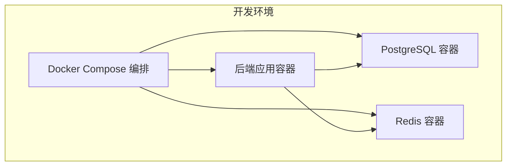
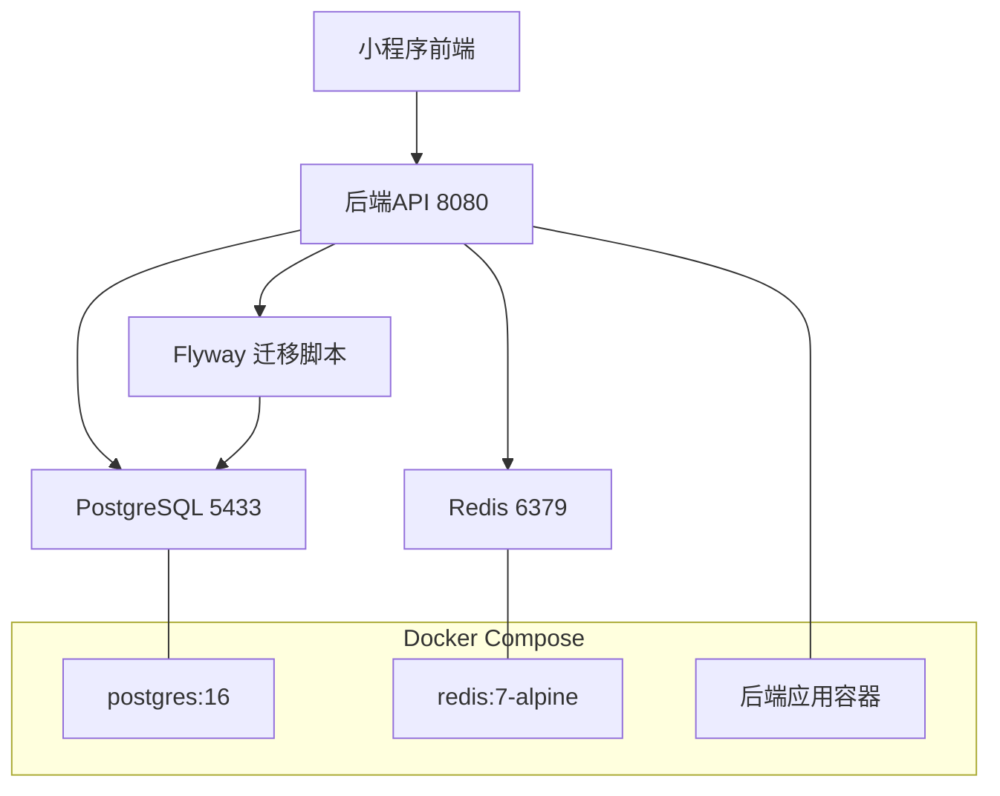
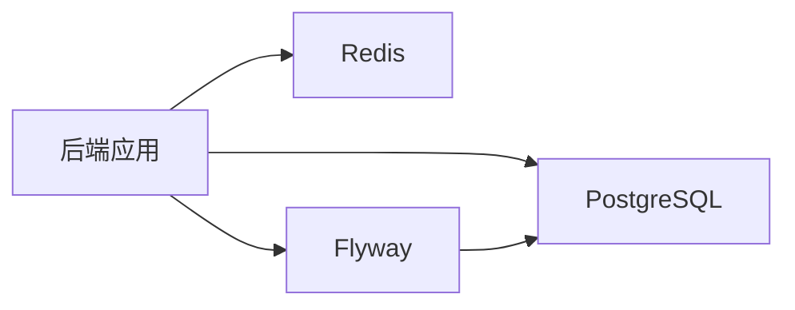

# 开发环境部署

<cite>
**本文引用的文件**
- [backend/docker-compose.yml](file://backend/docker-compose.yml)
- [backend/src/main/resources/application.yml](file://backend/src/main/resources/application.yml)
- [backend/Dockerfile](file://backend/Dockerfile)
- [backend/pom.xml](file://backend/pom.xml)
- [backend/local-secrets.yml](file://backend/local-secrets.yml)
- [backend/README.md](file://backend/README.md)
- [backend/src/main/resources/db/migration/V1__init_core_tables.sql](file://backend/src/main/resources/db/migration/V1__init_core_tables.sql)
- [backend/src/main/resources/db/migration/V2__add_user_phone_number.sql](file://backend/src/main/resources/db/migration/V2__add_user_phone_number.sql)
- [backend/src/main/resources/db/migration/V3__add_activity_expenses.sql](file://backend/src/main/resources/db/migration/V3__add_activity_expenses.sql)
- [backend/src/main/resources/db/migration/V4__add_activity_notification_events.sql](file://backend/src/main/resources/db/migration/V4__add_activity_notification_events.sql)
- [backend/src/main/java/com/playminipro/PlayMiniProApplication.java](file://backend/src/main/java/com/playminipro/PlayMiniProApplication.java)
- [backend/src/main/java/com/playminipro/common/config/JwtProperties.java](file://backend/src/main/java/com/playminipro/common/config/JwtProperties.java)
- [backend/src/main/java/com/playminipro/common/config/SecurityConfig.java](file://backend/src/main/java/com/playminipro/common/config/SecurityConfig.java)
</cite>

## 目录
1. [简介](#简介)
2. [项目结构](#项目结构)
3. [核心组件](#核心组件)
4. [架构总览](#架构总览)
5. [详细组件分析](#详细组件分析)
6. [依赖关系分析](#依赖关系分析)
7. [性能考虑](#性能考虑)
8. [故障排查指南](#故障排查指南)
9. [结论](#结论)
10. [附录](#附录)

## 简介
本指南面向PlayMiniPro后端开发团队，提供从零搭建本地开发环境的完整步骤，涵盖Docker Compose编排、PostgreSQL与Redis服务启动、环境变量与密钥配置、数据库初始化（Flyway迁移）、健康检查、端口映射与数据卷挂载，以及启动命令与验证步骤。同时给出常见问题排查方案，帮助开发者快速搭建并稳定运行开发环境。

## 项目结构
后端工程采用Spring Boot 3 + Java 21技术栈，使用MyBatis进行数据访问，数据库版本管理通过Flyway实现。开发环境通过Docker Compose编排，包含PostgreSQL、Redis两个依赖服务，以及后端应用容器。

图表来源
- [backend/docker-compose.yml:1-36](file://backend/docker-compose.yml#L1-L36)
- [backend/Dockerfile:1-8](file://backend/Dockerfile#L1-L8)

章节来源
- [backend/README.md:21-33](file://backend/README.md#L21-L33)
- [backend/docker-compose.yml:1-36](file://backend/docker-compose.yml#L1-L36)

## 核心组件
- 应用服务
  - 端口：8080
  - 健康检查端点：/actuator/health
  - 依赖：PostgreSQL（JDBC）、Redis（连接与会话存储）
- 数据库服务（PostgreSQL）
  - 默认端口：5433（宿主机映射）
  - 默认库名：play_minipro
  - 默认用户：play
  - 默认密码：play1234
  - 健康检查：pg_isready
- 缓存服务（Redis）
  - 默认端口：6379（宿主机映射）
  - 健康检查：redis-cli ping
- 配置与密钥
  - application.yml：应用配置、数据源、Redis、Flyway、Actuator、JWT、微信参数
  - local-secrets.yml：本地微信密钥与开关（可选）

章节来源
- [backend/src/main/resources/application.yml:1-53](file://backend/src/main/resources/application.yml#L1-L53)
- [backend/docker-compose.yml:1-36](file://backend/docker-compose.yml#L1-L36)
- [backend/local-secrets.yml:1-4](file://backend/local-secrets.yml#L1-L4)

## 架构总览
下图展示开发环境的容器交互与数据流：前端小程序通过后端API进行鉴权与业务操作；后端应用读取配置，连接PostgreSQL与Redis；Flyway在应用启动时自动执行数据库迁移脚本。

图表来源
- [backend/docker-compose.yml:1-36](file://backend/docker-compose.yml#L1-L36)
- [backend/src/main/resources/application.yml:1-53](file://backend/src/main/resources/application.yml#L1-L53)
- [backend/src/main/resources/db/migration/V1__init_core_tables.sql:1-58](file://backend/src/main/resources/db/migration/V1__init_core_tables.sql#L1-L58)

## 详细组件分析

### PostgreSQL（数据库）配置
- 容器镜像与端口映射
  - 镜像：postgres:16
  - 映射：5433:5432
- 环境变量
  - POSTGRES_DB、POSTGRES_USER、POSTGRES_PASSWORD、TZ
- 健康检查
  - 使用pg_isready检测数据库可用性
- 数据卷
  - 挂载postgres_data，持久化数据
- 初始化脚本
  - Flyway自动执行V1-V4迁移脚本，创建核心表与索引

章节来源
- [backend/docker-compose.yml:2-18](file://backend/docker-compose.yml#L2-L18)
- [backend/src/main/resources/application.yml:10-22](file://backend/src/main/resources/application.yml#L10-L22)
- [backend/src/main/resources/db/migration/V1__init_core_tables.sql:1-58](file://backend/src/main/resources/db/migration/V1__init_core_tables.sql#L1-L58)
- [backend/src/main/resources/db/migration/V2__add_user_phone_number.sql:1-2](file://backend/src/main/resources/db/migration/V2__add_user_phone_number.sql#L1-L2)
- [backend/src/main/resources/db/migration/V3__add_activity_expenses.sql:1-12](file://backend/src/main/resources/db/migration/V3__add_activity_expenses.sql#L1-L12)
- [backend/src/main/resources/db/migration/V4__add_activity_notification_events.sql:1-21](file://backend/src/main/resources/db/migration/V4__add_activity_notification_events.sql#L1-L21)

### Redis（缓存）配置
- 容器镜像与端口映射
  - 镜像：redis:7-alpine
  - 映射：6379:6379
- 健康检查
  - 使用redis-cli ping检测
- 数据卷
  - 挂载redis_data，持久化AOF

章节来源
- [backend/docker-compose.yml:20-32](file://backend/docker-compose.yml#L20-L32)
- [backend/src/main/resources/application.yml:15-19](file://backend/src/main/resources/application.yml#L15-L19)

### 后端应用容器
- 基础镜像与入口
  - JRE 21基础镜像，暴露8080端口，入口为java -jar
- 依赖与功能
  - Web、Security、Actuator、Redis、MyBatis、Flyway、JWT
- 启动方式
  - 本地开发：mvn spring-boot:run
  - 容器化：构建后以JAR运行

章节来源
- [backend/Dockerfile:1-8](file://backend/Dockerfile#L1-L8)
- [backend/pom.xml:26-91](file://backend/pom.xml#L26-L91)
- [backend/README.md:29-33](file://backend/README.md#L29-L33)

### 配置与密钥
- application.yml
  - server.port=8080
  - 数据源：DB_URL、DB_USERNAME、DB_PASSWORD
  - Redis：REDIS_HOST、REDIS_PORT、REDIS_PASSWORD、timeout
  - Actuator：/actuator/health与/actuator/info
  - Flyway：classpath:db/migration
  - JWT：JWT_SECRET、JWT_EXPIRE_SECONDS
  - 微信：WECHAT_MINI_APP_ID、WECHAT_MINI_APP_SECRET、WECHAT_MOCK_LOGIN_ENABLED
- local-secrets.yml
  - 本地微信密钥与mock开关（可选）

章节来源
- [backend/src/main/resources/application.yml:1-53](file://backend/src/main/resources/application.yml#L1-L53)
- [backend/local-secrets.yml:1-4](file://backend/local-secrets.yml#L1-L4)

### 安全与鉴权
- 安全策略
  - 无状态会话（STATELESS）
  - 允许健康检查与登录接口匿名访问
  - 其余接口均需Bearer Token
- JWT配置
  - 通过app.jwt前缀的属性注入
- CORS
  - 允许任意来源、头与方法

章节来源
- [backend/src/main/java/com/playminipro/common/config/SecurityConfig.java:1-55](file://backend/src/main/java/com/playminipro/common/config/SecurityConfig.java#L1-L55)
- [backend/src/main/java/com/playminipro/common/config/JwtProperties.java:1-27](file://backend/src/main/java/com/playminipro/common/config/JwtProperties.java#L1-L27)
- [backend/src/main/java/com/playminipro/PlayMiniProApplication.java:1-20](file://backend/src/main/java/com/playminipro/PlayMiniProApplication.java#L1-L20)

## 依赖关系分析
- 组件耦合
  - 后端应用强依赖PostgreSQL与Redis
  - Flyway依赖数据库，负责初始化与版本演进
- 外部依赖
  - Spring Boot生态（Web、Security、Actuator、Data Redis、Validation）
  - MyBatis与PostgreSQL驱动
  - JWT库与Flyway

图表来源
- [backend/pom.xml:26-91](file://backend/pom.xml#L26-L91)
- [backend/src/main/resources/application.yml:10-22](file://backend/src/main/resources/application.yml#L10-L22)

章节来源
- [backend/pom.xml:26-91](file://backend/pom.xml#L26-L91)

## 性能考虑
- 数据库连接池与查询优化
  - 使用MyBatis与合理SQL，避免N+1查询
- 缓存策略
  - 利用Redis存储会话与热点数据，降低数据库压力
- 健康检查与重启策略
  - Compose中健康检查可配合重启策略提升可用性（生产环境建议启用）

## 故障排查指南
- 数据库连接失败
  - 确认PostgreSQL容器已健康运行（Compose健康检查）
  - 校验DB_URL、DB_USERNAME、DB_PASSWORD与容器内实际值一致
  - 确认端口5433未被占用
- 端口冲突
  - 修改docker-compose.yml中的宿主机端口映射或释放冲突端口
- Redis连接失败
  - 确认Redis容器健康，检查REDIS_HOST与REDIS_PORT
- JWT或鉴权异常
  - 校验JWT_SECRET与前端一致
  - 确认Authorization头格式正确（Bearer <token>）
- Actuator健康检查失败
  - 访问/actuator/health查看详细信息
  - 检查数据库与Redis连通性
- 微信登录mock与真实登录切换
  - 通过WECHAT_MINI_APP_SECRET与WECHAT_MOCK_LOGIN_ENABLED控制
  - 本地可直接使用mock登录生成openId进行联调

章节来源
- [backend/docker-compose.yml:14-18](file://backend/docker-compose.yml#L14-L18)
- [backend/docker-compose.yml:28-32](file://backend/docker-compose.yml#L28-L32)
- [backend/src/main/resources/application.yml:33-45](file://backend/src/main/resources/application.yml#L33-L45)
- [backend/README.md:53-79](file://backend/README.md#L53-L79)

## 结论
通过Docker Compose一键启动PostgreSQL与Redis，结合Spring Boot应用的Flyway自动迁移与Actuator健康检查，开发者可在本地快速搭建稳定且可验证的后端开发环境。遵循本文档的环境变量、端口与数据卷配置，配合常见问题排查步骤，可显著缩短环境准备时间并提高联调效率。

## 附录

### 本地开发环境搭建步骤
- 步骤1：启动依赖服务
  - 在backend目录执行：docker compose up -d
- 步骤2：启动后端应用
  - 在backend目录执行：mvn spring-boot:run
- 步骤3：验证服务
  - 访问：/actuator/health
  - 访问：/api/auth/wechat-login（支持mock登录）
- 步骤4：数据库初始化
  - Flyway自动执行V1-V4迁移脚本，创建核心表与索引

章节来源
- [backend/README.md:21-33](file://backend/README.md#L21-L33)
- [backend/src/main/resources/application.yml:20-22](file://backend/src/main/resources/application.yml#L20-L22)

### 环境变量与默认值
- 数据库
  - DB_URL：jdbc:postgresql://localhost:5433/play_minipro
  - DB_USERNAME：play
  - DB_PASSWORD：play1234
- Redis
  - REDIS_HOST：localhost
  - REDIS_PORT：6379
  - REDIS_PASSWORD：空
- JWT
  - JWT_SECRET：play-minipro-dev-secret-play-minipro-dev-secret-2026
  - JWT_EXPIRE_SECONDS：604800
- 微信
  - WECHAT_MINI_APP_ID：wxb8fd5841e5f0a83d
  - WECHAT_MINI_APP_SECRET：空
  - WECHAT_MOCK_LOGIN_ENABLED：true

章节来源
- [backend/src/main/resources/application.yml:10-49](file://backend/src/main/resources/application.yml#L10-L49)

### 端口与数据卷
- 端口映射
  - PostgreSQL：5433:5432
  - Redis：6379:6379
  - 后端应用：8080（容器内）
- 数据卷
  - postgres_data：PostgreSQL数据
  - redis_data：Redis数据

章节来源
- [backend/docker-compose.yml:10-13](file://backend/docker-compose.yml#L10-L13)
- [backend/docker-compose.yml:24-27](file://backend/docker-compose.yml#L24-L27)
- [backend/docker-compose.yml:34-36](file://backend/docker-compose.yml#L34-L36)

### 数据库迁移脚本概览
- V1：初始化核心表（users、activities、activity_members）
- V2：新增用户手机号字段
- V3：新增活动费用表activity_expenses
- V4：新增活动通知事件表activity_notification_events

章节来源
- [backend/src/main/resources/db/migration/V1__init_core_tables.sql:1-58](file://backend/src/main/resources/db/migration/V1__init_core_tables.sql#L1-L58)
- [backend/src/main/resources/db/migration/V2__add_user_phone_number.sql:1-2](file://backend/src/main/resources/db/migration/V2__add_user_phone_number.sql#L1-L2)
- [backend/src/main/resources/db/migration/V3__add_activity_expenses.sql:1-12](file://backend/src/main/resources/db/migration/V3__add_activity_expenses.sql#L1-L12)
- [backend/src/main/resources/db/migration/V4__add_activity_notification_events.sql:1-21](file://backend/src/main/resources/db/migration/V4__add_activity_notification_events.sql#L1-L21)