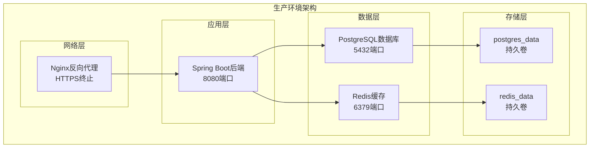
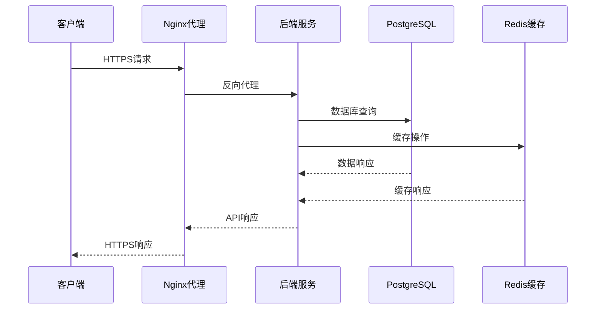
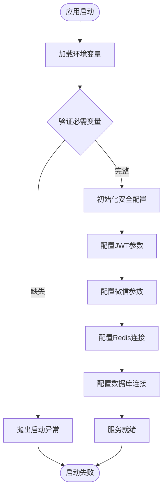
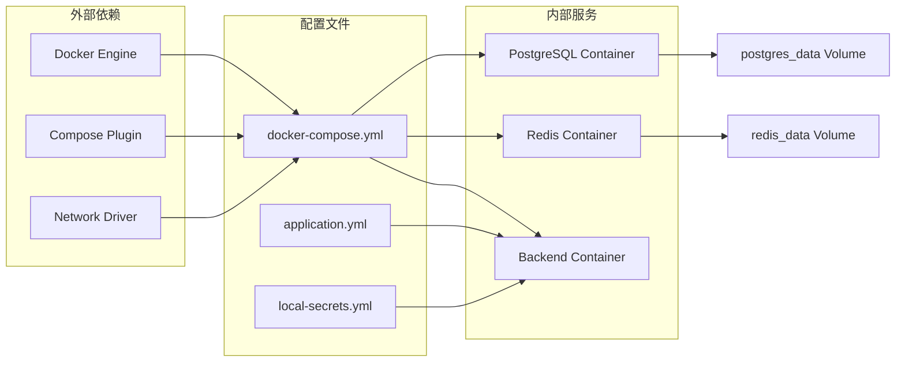
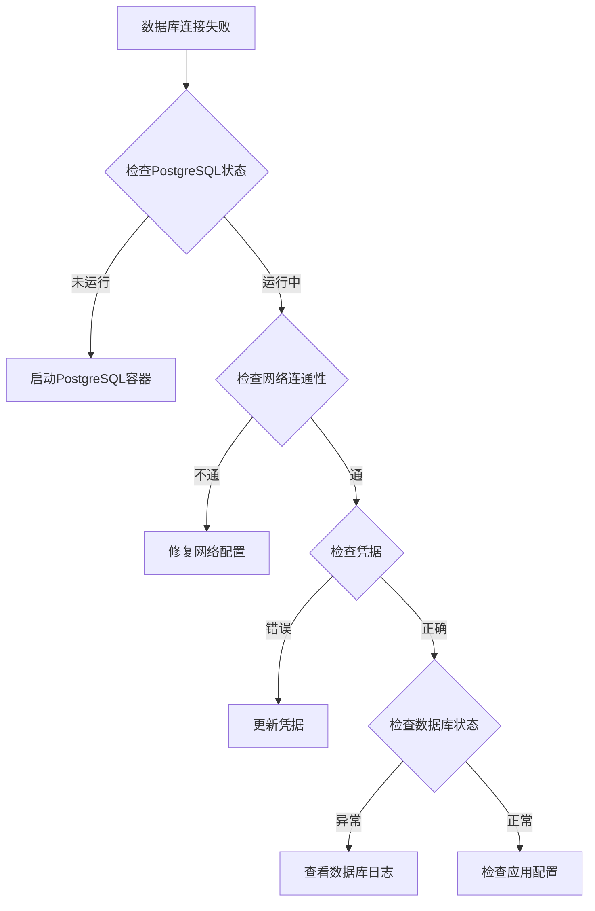
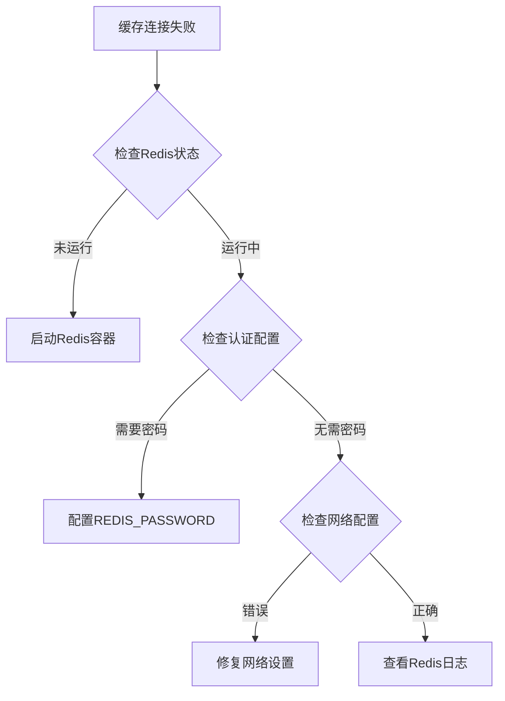
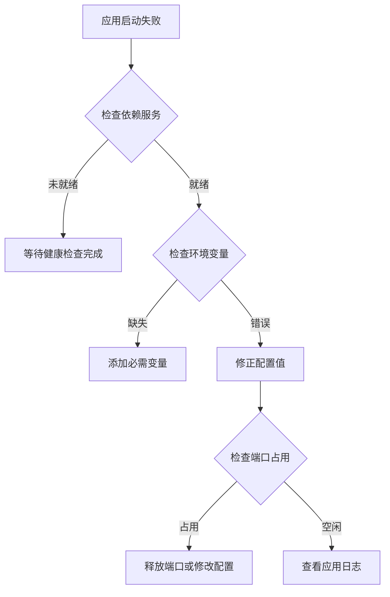

# Docker Compose生产配置

<cite>
**本文档引用的文件**
- [docker-compose.prod.yml](file://deploy/docker-compose.prod.yml)
- [docker-compose.prod.yml](file://deploy_backend_bundle/deploy/docker-compose.prod.yml)
- [docker-compose.prod.yml](file://deploy_bundle/deploy/docker-compose.prod.yml)
- [application.yml](file://backend/src/main/resources/application.yml)
- [Dockerfile](file://backend/Dockerfile)
- [JwtProperties.java](file://backend/src/main/java/com/playminipro/common/config/JwtProperties.java)
- [WechatProperties.java](file://backend/src/main/java/com/playminipro/common/config/WechatProperties.java)
- [SecurityConfig.java](file://backend/src/main/java/com/playminipro/common/config/SecurityConfig.java)
- [local-secrets.yml](file://backend/local-secrets.yml)
- [README.md](file://deploy/README.md)
</cite>

## 目录
1. [简介](#简介)
2. [项目结构](#项目结构)
3. [核心组件](#核心组件)
4. [架构概览](#架构概览)
5. [详细组件分析](#详细组件分析)
6. [依赖关系分析](#依赖关系分析)
7. [性能考虑](#性能考虑)
8. [故障排除指南](#故障排除指南)
9. [结论](#结论)

## 简介

本文件提供了Play Mini Pro项目的Docker Compose生产环境配置详细文档。该配置实现了完整的容器化部署，包括PostgreSQL数据库服务、Redis缓存服务和Spring Boot后端服务的协调运行。

系统采用三容器架构：PostgreSQL负责数据持久化，Redis提供高性能缓存支持，Spring Boot应用通过REST API提供业务逻辑。所有服务均配置了健康检查机制，确保服务可用性。

## 项目结构

项目采用模块化组织方式，包含以下关键目录：

```mermaid
graph TB
subgraph "项目根目录"
A[backend/] -- 后端服务代码
B[deploy/] -- 生产部署配置
C[deploy_bundle/] -- 打包部署版本
D[frontend/] -- 前端小程序代码
E[doc/] -- 项目文档
F[服务器资源/] -- 服务器证书等
end
subgraph "部署配置"
G[docker-compose.prod.yml] -- 生产环境编排
H[README.md] -- 部署说明
I[.env.example] -- 环境变量模板
end
A --> G
B --> G
C --> G
```

**图表来源**
- [docker-compose.prod.yml:1-61](file://deploy/docker-compose.prod.yml#L1-L61)
- [README.md:1-15](file://deploy/README.md#L1-L15)

**章节来源**
- [docker-compose.prod.yml:1-61](file://deploy/docker-compose.prod.yml#L1-L61)
- [README.md:1-15](file://deploy/README.md#L1-L15)

## 核心组件

### PostgreSQL数据库服务

PostgreSQL服务使用官方16版本镜像，配置了完整的生产环境参数：

- **镜像选择**: `postgres:16` - 最新稳定版本
- **容器名称**: `laizheng-postgres`
- **重启策略**: `unless-stopped` - 异常退出时自动重启
- **存储管理**: 使用命名卷 `postgres_data` 进行数据持久化
- **时区设置**: `Asia/Shanghai` - 中国标准时间

**健康检查配置**:
- 检查命令: `pg_isready -U ${POSTGRES_USER:-play} -d ${POSTGRES_DB:-play_minipro}`
- 检查间隔: 10秒
- 超时时间: 5秒
- 重试次数: 10次

### Redis缓存服务

Redis服务配置了持久化和性能优化参数：

- **镜像选择**: `redis:7-alpine` - 轻量级Alpine Linux版本
- **容器名称**: `laizheng-redis`
- **持久化模式**: `appendonly yes` - AOF持久化确保数据安全
- **存储管理**: 使用命名卷 `redis_data` 进行数据持久化
- **重启策略**: `unless-stopped`

**健康检查配置**:
- 检查命令: `redis-cli ping`
- 检查间隔: 10秒
- 超时时间: 5秒
- 重试次数: 10次

### Spring Boot后端服务

后端服务基于Eclipse Temurin 21 JRE，提供REST API服务：

- **基础镜像**: `eclipse-temurin:21-jre` - 官方推荐的JRE镜像
- **工作目录**: `/app`
- **暴露端口**: `8080`
- **容器名称**: `laizheng-backend`
- **重启策略**: `unless-stopped`

**启动配置**:
- 应用入口: `java -jar /app/app.jar`
- 依赖服务: PostgreSQL和Redis（健康检查通过后启动）

**章节来源**
- [docker-compose.prod.yml:2-61](file://deploy/docker-compose.prod.yml#L2-L61)
- [Dockerfile:1-8](file://backend/Dockerfile#L1-L8)

## 架构概览

系统采用微服务架构，三个核心服务协同工作：



**图表来源**
- [docker-compose.prod.yml:2-61](file://deploy/docker-compose.prod.yml#L2-L61)

### 服务间通信



**图表来源**
- [docker-compose.prod.yml:38-42](file://deploy/docker-compose.prod.yml#L38-L42)

## 详细组件分析

### PostgreSQL数据库配置

#### 环境变量配置

| 环境变量 | 默认值 | 用途 | 安全性 |
|---------|--------|------|--------|
| POSTGRES_DB | play_minipro | 数据库名称 | 中性 |
| POSTGRES_USER | play | 用户名 | 中性 |
| POSTGRES_PASSWORD | 必填 | 密码 | 高风险 |
| TZ | Asia/Shanghai | 时区设置 | 中性 |

#### 卷挂载策略

- **路径映射**: `/var/lib/postgresql/data` → `postgres_data`
- **持久化保证**: 容器删除后数据不丢失
- **备份友好**: 卷结构便于外部备份

#### 性能优化

- **连接池**: 由应用程序管理
- **索引优化**: 通过Flyway迁移脚本维护
- **查询优化**: MyBatis映射器优化

**章节来源**
- [docker-compose.prod.yml:6-17](file://deploy/docker-compose.prod.yml#L6-L17)
- [application.yml:9-13](file://backend/src/main/resources/application.yml#L9-L13)

### Redis缓存配置

#### 环境变量配置

| 环境变量 | 默认值 | 用途 | 安全性 |
|---------|--------|------|--------|
| REDIS_PASSWORD | 空字符串 | 认证密码 | 高风险 |
| REDIS_HOST | redis | 主机地址 | 中性 |
| REDIS_PORT | 6379 | 端口号 | 中性 |

#### 持久化配置

- **AOF持久化**: `appendonly yes` - 追加文件模式
- **数据安全**: 高可靠性数据保护
- **性能权衡**: 持久化开销与数据安全平衡

#### 缓存策略

- **超时设置**: 3秒连接超时
- **密码认证**: 可选密码保护
- **内存管理**: Redis自动内存回收

**章节来源**
- [docker-compose.prod.yml:19-30](file://deploy/docker-compose.prod.yml#L19-L30)
- [application.yml:14-19](file://backend/src/main/resources/application.yml#L14-L19)

### Spring Boot后端配置

#### 应用程序配置

```mermaid
classDiagram
class ApplicationConfig {
+server.port : 8080
+spring.datasource.url : jdbc : postgresql : //...
+spring.redis.host : redis
+spring.redis.port : 6379
+app.jwt.secret : ${JWT_SECRET}
+app.wechat.app-id : ${WECHAT_MINI_APP_ID}
}
class JwtProperties {
+String secret
+long expireSeconds
}
class WechatProperties {
+String appId
+String appSecret
+boolean mockLoginEnabled
}
ApplicationConfig --> JwtProperties
ApplicationConfig --> WechatProperties
```

**图表来源**
- [application.yml:1-53](file://backend/src/main/resources/application.yml#L1-L53)
- [JwtProperties.java:1-27](file://backend/src/main/java/com/playminipro/common/config/JwtProperties.java#L1-L27)
- [WechatProperties.java:1-37](file://backend/src/main/java/com/playminipro/common/config/WechatProperties.java#L1-L37)

#### 环境变量配置

| 环境变量 | 默认值 | 用途 | 安全性 |
|---------|--------|------|--------|
| DB_URL | jdbc:postgresql://postgres:5432/... | 数据库连接URL | 高风险 |
| DB_USERNAME | play | 数据库用户名 | 中性 |
| DB_PASSWORD | 必填 | 数据库密码 | 高风险 |
| JWT_SECRET | 必填 | JWT签名密钥 | 极高风险 |
| JWT_EXPIRE_SECONDS | 604800 | JWT过期时间(秒) | 中性 |
| WECHAT_MINI_APP_ID | wxb8fd5841e5f0a83d | 微信小程序ID | 中性 |
| WECHAT_MINI_APP_SECRET | 必填 | 微信小程序密钥 | 极高风险 |
| WECHAT_MOCK_LOGIN_ENABLED | false | 模拟登录开关 | 中性 |

#### 安全配置



**图表来源**
- [SecurityConfig.java:26-41](file://backend/src/main/java/com/playminipro/common/config/SecurityConfig.java#L26-L41)

**章节来源**
- [docker-compose.prod.yml:43-55](file://deploy/docker-compose.prod.yml#L43-L55)
- [application.yml:42-49](file://backend/src/main/resources/application.yml#L42-L49)
- [SecurityConfig.java:1-55](file://backend/src/main/java/com/playminipro/common/config/SecurityConfig.java#L1-L55)

## 依赖关系分析

### 服务启动顺序控制

```mermaid
gantt
title 服务启动顺序
dateFormat X
axisFormat %s
section 基础服务
PostgreSQL :done, 0, 10
Redis :done, 0, 10
section 应用服务
Backend :crit, 10, 15
section 健康检查
HealthCheck :crit, 0, 25
```



**启动流程**:
1. **PostgreSQL启动** - 数据库初始化
2. **Redis启动** - 缓存服务就绪  
3. **后端服务启动** - 等待数据库和缓存健康
4. **健康检查** - 确认服务可用性

### 依赖关系图



**图表来源**
- [docker-compose.prod.yml:1-61](file://deploy/docker-compose.prod.yml#L1-L61)

**章节来源**
- [docker-compose.prod.yml:38-42](file://deploy/docker-compose.prod.yml#L38-L42)

## 性能考虑

### 容器性能优化

1. **镜像优化**
   - 使用Alpine Linux基础镜像减少体积
   - 多阶段构建优化最终镜像大小
   - JRE精简配置提高启动速度

2. **资源管理**
   - CPU和内存限制可根据实际需求调整
   - 网络带宽限制防止资源争用
   - 存储I/O优化使用SSD存储

3. **连接池配置**
   - 数据库连接池大小适配并发需求
   - Redis连接池合理配置
   - 连接超时时间优化

### 应用性能调优

1. **JVM参数优化**
   ```bash
   -XX:+UseG1GC
   -XX:MaxHeapSize=512m
   -XX:+UseStringDeduplication
   ```

2. **数据库优化**
   - Flyway自动迁移确保数据库结构一致
   - 连接池配置优化查询性能
   - 索引策略定期评估

3. **缓存策略**
   - Redis持久化配置平衡性能和安全
   - 缓存失效策略避免内存泄漏
   - 缓存预热提升用户体验

## 故障排除指南

### 常见问题诊断

#### 数据库连接问题



#### 缓存连接问题



#### 应用启动问题



### 日志分析

1. **容器日志**
   ```bash
   docker compose logs postgres
   docker compose logs redis
   docker compose logs backend
   ```

2. **应用日志**
   - Spring Boot日志级别: `INFO`
   - 数据库连接日志
   - 缓存操作日志

3. **健康检查日志**
   - PostgreSQL: `pg_isready`输出
   - Redis: `redis-cli ping`响应
   - 应用: HTTP 200响应

**章节来源**
- [docker-compose.prod.yml:13-17](file://deploy/docker-compose.prod.yml#L13-L17)
- [docker-compose.prod.yml:26-30](file://deploy/docker-compose.prod.yml#L26-L30)

## 结论

本Docker Compose生产配置提供了完整的容器化部署解决方案，具有以下特点：

### 优势特性

1. **生产就绪**: 包含健康检查、持久化存储、重启策略
2. **安全配置**: 环境变量隔离敏感信息，支持SSL/TLS
3. **可扩展性**: 模块化设计便于功能扩展
4. **可观测性**: 完整的日志记录和监控支持

### 最佳实践建议

1. **安全加固**
   - 使用强密码替换默认凭据
   - 配置防火墙规则限制访问
   - 启用HTTPS和TLS加密

2. **性能优化**
   - 根据实际负载调整容器资源限制
   - 优化数据库和Redis配置参数
   - 实施监控和告警机制

3. **运维管理**
   - 建立CI/CD自动化部署流程
   - 制定备份和恢复策略
   - 定期安全审计和漏洞扫描

该配置为Play Mini Pro项目提供了稳定可靠的生产环境基础，支持业务的持续发展和扩展需求。