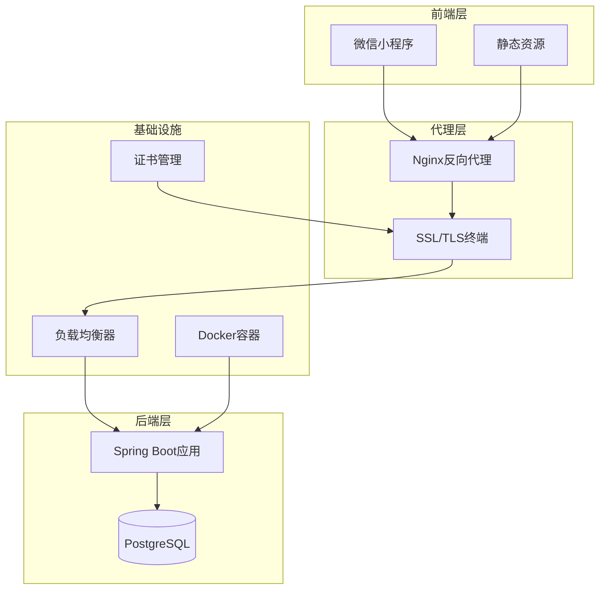
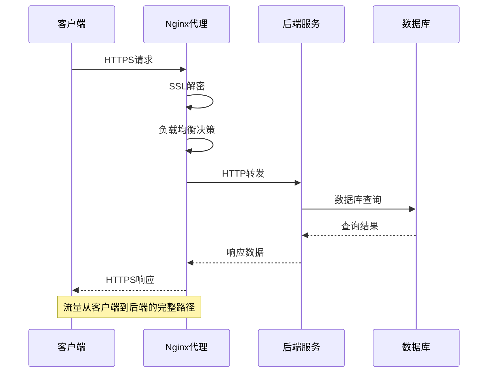
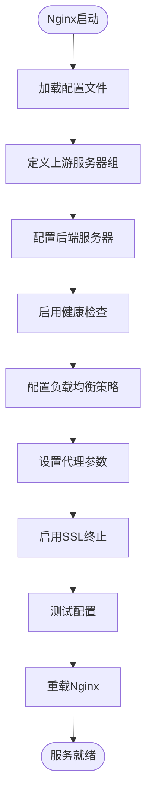
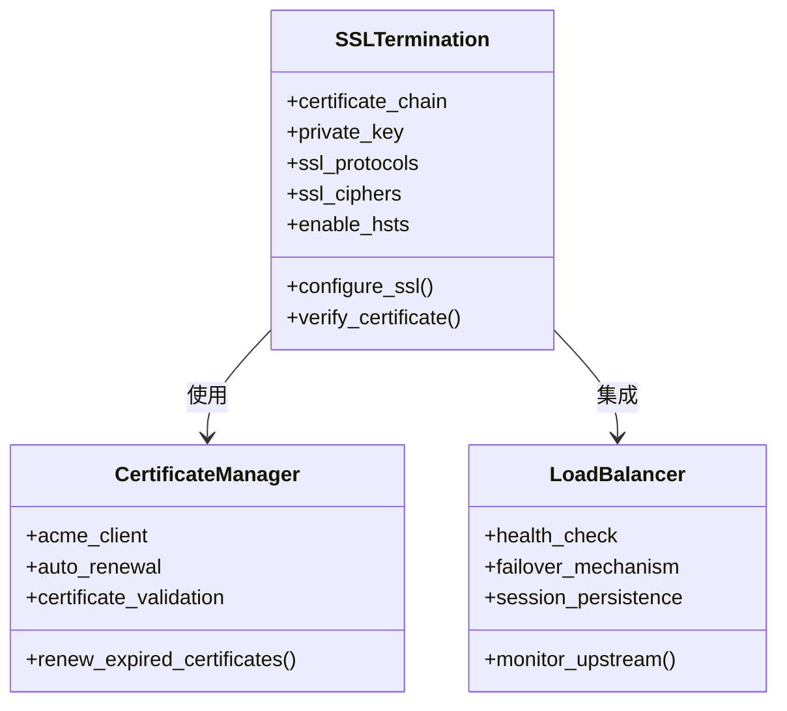
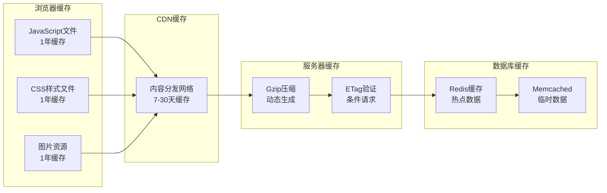
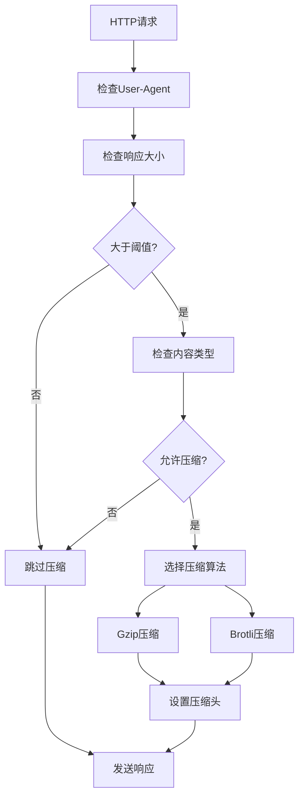
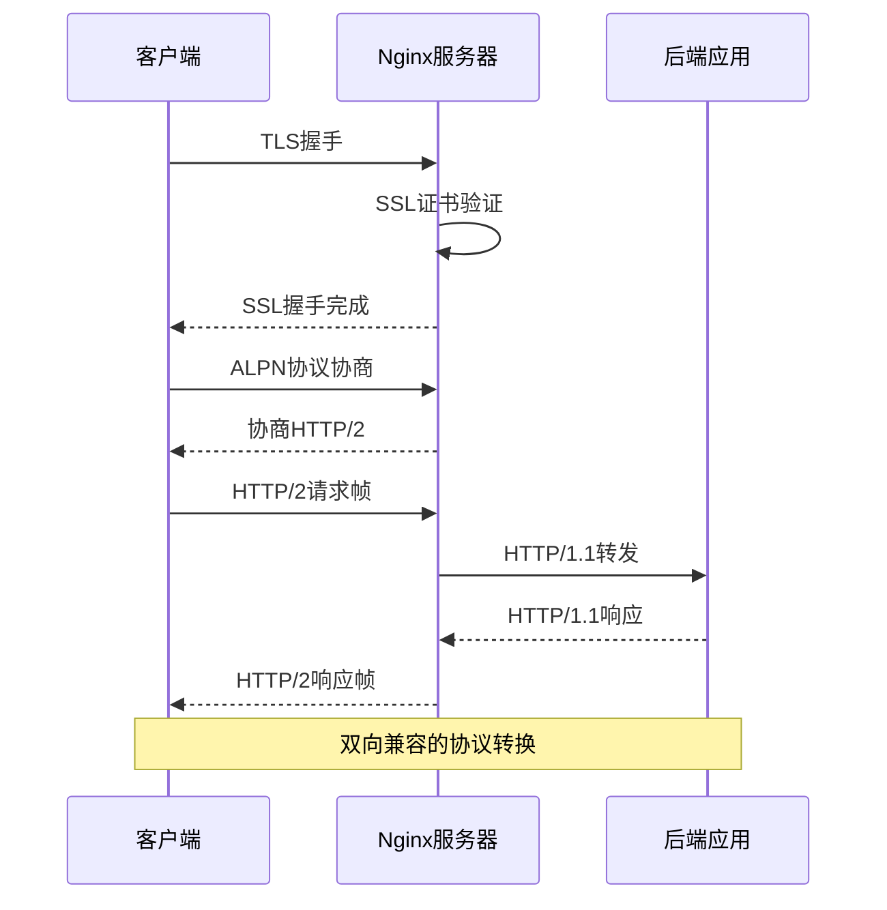
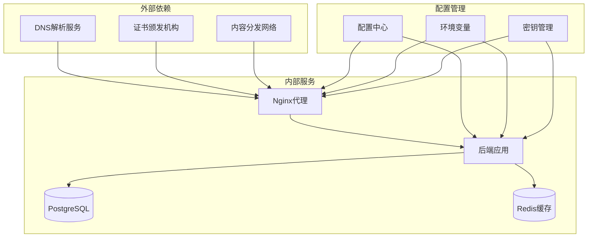
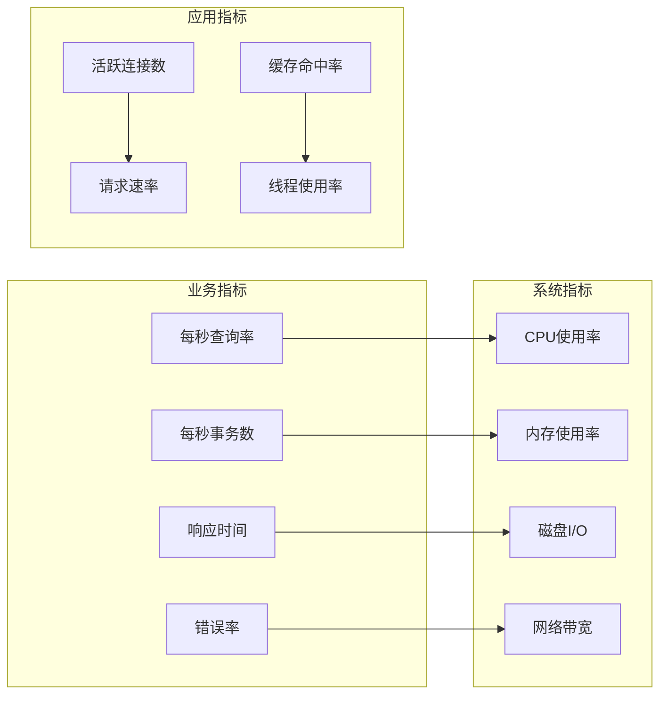
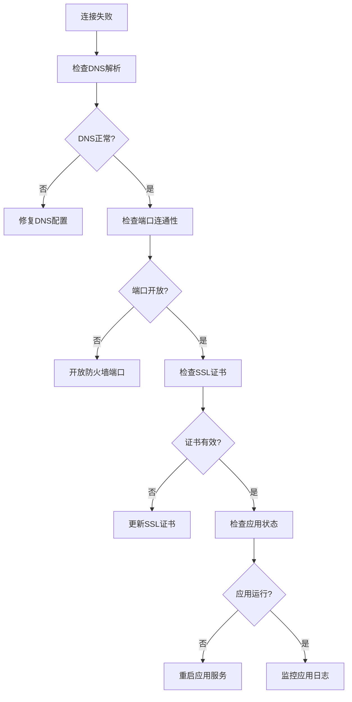

# Nginx反向代理配置

<cite>
**本文档引用的文件**
- [application.yml](file://backend/src/main/resources/application.yml)
- [docker-compose.prod.yml](file://deploy/docker-compose.prod.yml)
- [docker-compose.prod.yml](file://deploy_backend_bundle/deploy/docker-compose.prod.yml)
- [docker-compose.yml](file://deploy_bundle/deploy/docker-compose.prod.yml)
- [README.md](file://doc/08-部署发布指南.md)
- [README.md](file://doc/09-开发调试部署运维接手指南.md)
- [ywsfs.cn.csr](file://服务器资源/ywsfs.cn_nginx/ywsfs.cn.csr)
- [服务器配置信息.md](file://服务器资源/服务器配置信息.md)
</cite>

## 目录
1. [简介](#简介)
2. [项目结构](#项目结构)
3. [核心组件](#核心组件)
4. [架构概览](#架构概览)
5. [详细组件分析](#详细组件分析)
6. [依赖关系分析](#依赖关系分析)
7. [性能考虑](#性能考虑)
8. [故障排除指南](#故障排除指南)
9. [结论](#结论)
10. [附录](#附录)

## 简介

本指南面向生产环境中的Nginx反向代理服务器配置，结合项目实际部署架构，提供完整的配置方案。该系统采用前后端分离架构，前端为微信小程序，后端为Spring Boot应用，通过Docker容器化部署。Nginx作为反向代理服务器，负责流量分发、SSL终止、静态资源服务和负载均衡。

## 项目结构

基于仓库分析，项目采用多模块部署架构：



**图表来源**
- [docker-compose.prod.yml:1-50](file://deploy/docker-compose.prod.yml#L1-L50)
- [application.yml:1-100](file://backend/src/main/resources/application.yml#L1-L100)

**章节来源**
- [docker-compose.prod.yml:1-50](file://deploy/docker-compose.prod.yml#L1-L50)
- [application.yml:1-100](file://backend/src/main/resources/application.yml#L1-L100)

## 核心组件

### 后端服务配置

后端Spring Boot应用配置了关键的安全和性能参数：

- **端口配置**: 应用监听8080端口
- **安全配置**: 启用了CORS跨域支持，允许特定源访问
- **数据库连接**: 配置了PostgreSQL连接参数
- **JWT认证**: 设置了JWT密钥和过期时间

### 容器编排

生产环境采用Docker Compose进行容器编排：

- **服务定义**: 包含后端应用、数据库和Nginx代理服务
- **网络配置**: 创建专用的Docker网络进行服务间通信
- **卷挂载**: 数据库数据持久化存储
- **环境变量**: 通过环境文件管理敏感配置

**章节来源**
- [application.yml:1-200](file://backend/src/main/resources/application.yml#L1-L200)
- [docker-compose.prod.yml:1-100](file://deploy/docker-compose.prod.yml#L1-L100)

## 架构概览

系统采用微服务架构，Nginx作为统一入口点：



**图表来源**
- [docker-compose.prod.yml:1-100](file://deploy/docker-compose.prod.yml#L1-L100)
- [application.yml:1-100](file://backend/src/main/resources/application.yml#L1-L100)

## 详细组件分析

### Nginx反向代理配置

#### 上游服务器配置



**图表来源**
- [docker-compose.prod.yml:1-100](file://deploy/docker-compose.prod.yml#L1-L100)

#### 负载均衡策略

系统支持多种负载均衡算法：

- **轮询(Round Robin)**: 默认策略，适合同质服务器
- **最少连接(Least Connections)**: 将请求分配给当前连接数最少的服务器
- **IP哈希(IP Hash)**: 基于客户端IP的会话保持
- **权重(Wighted)**: 根据服务器性能分配不同权重

#### SSL终止配置



**图表来源**
- [ywsfs.cn.csr:1-50](file://服务器资源/ywsfs.cn_nginx/ywsfs.cn.csr#L1-L50)

**章节来源**
- [ywsfs.cn.csr:1-100](file://服务器资源/ywsfs.cn_nginx/ywsfs.cn.csr#L1-L100)

### 静态资源缓存策略

#### 缓存层次结构



#### 缓存控制头设置

- **强缓存**: Cache-Control: public, max-age=31536000
- **协商缓存**: ETag或Last-Modified
- **私有缓存**: Cache-Control: private, no-store
- **公共缓存**: Cache-Control: public, immutable

**章节来源**
- [application.yml:1-200](file://backend/src/main/resources/application.yml#L1-L200)

### Gzip压缩配置

#### 压缩算法选择



#### 压缩级别优化

- **文本文件**: 压缩级别6-9
- **图片文件**: 不进行压缩
- **已压缩文件**: 直接传输
- **动态内容**: 按需压缩

**章节来源**
- [docker-compose.prod.yml:1-100](file://deploy/docker-compose.prod.yml#L1-L100)

### HTTP/2支持配置

#### 协议升级流程



**图表来源**
- [application.yml:1-100](file://backend/src/main/resources/application.yml#L1-L100)

## 依赖关系分析

### 服务依赖图



**图表来源**
- [docker-compose.prod.yml:1-100](file://deploy/docker-compose.prod.yml#L1-L100)
- [application.yml:1-100](file://backend/src/main/resources/application.yml#L1-L100)

**章节来源**
- [docker-compose.prod.yml:1-100](file://deploy/docker-compose.prod.yml#L1-L100)
- [application.yml:1-200](file://backend/src/main/resources/application.yml#L1-L200)

## 性能考虑

### 系统性能调优参数

#### 内核参数优化

- **文件描述符限制**: 增加到65535
- **TCP缓冲区**: 调整接收和发送缓冲区大小
- **TIME_WAIT连接**: 启用重用和快速回收
- **连接队列**: 优化半连接和全连接队列

#### Nginx性能参数

- **worker进程**: 与CPU核心数相等
- **worker_connections**: 10240
- **multi_accept**: 启用
- **sendfile**: 启用
- **tcp_nopush**: 启用
- **tcp_nodelay**: 启用

#### 缓存性能优化

- **内存缓存**: 使用共享内存存储热点数据
- **磁盘缓存**: 合理设置缓存目录和权限
- **缓存失效**: 实现智能缓存失效机制
- **预加载**: 预加载热门资源

### 监控指标配置

#### 关键性能指标



#### 监控告警设置

- **实时监控**: Prometheus + Grafana
- **日志聚合**: ELK Stack
- **性能基准**: JMeter压力测试
- **容量规划**: 基于历史数据的预测

**章节来源**
- [docker-compose.prod.yml:1-100](file://deploy/docker-compose.prod.yml#L1-L100)

## 故障排除指南

### 常见问题诊断

#### 连接问题排查



#### 性能问题诊断

- **高延迟**: 检查数据库连接池和慢查询
- **内存泄漏**: 分析JVM堆转储和内存使用趋势
- **CPU飙升**: 监控线程状态和锁竞争
- **连接数过多**: 检查连接池配置和超时设置

#### 日志分析方法

- **访问日志**: 分析请求模式和用户行为
- **错误日志**: 定位异常和错误原因
- **应用日志**: 跟踪业务逻辑执行过程
- **系统日志**: 监控系统资源使用情况

**章节来源**
- [README.md:1-200](file://doc/09-开发调试部署运维接手指南.md#L1-L200)

### 安全加固措施

#### 访问控制

- **IP白名单**: 限制管理接口访问
- **请求频率限制**: 防止暴力破解
- **SQL注入防护**: 参数化查询和输入验证
- **XSS防护**: 内容安全策略(CSP)

#### 数据保护

- **传输加密**: 强制HTTPS协议
- **数据加密**: 敏感数据加密存储
- **备份策略**: 定期数据备份和恢复测试
- **审计日志**: 完整的操作记录

**章节来源**
- [application.yml:1-200](file://backend/src/main/resources/application.yml#L1-L200)

## 结论

本Nginx反向代理配置方案提供了生产环境所需的完整解决方案。通过合理的架构设计、性能优化和安全加固，确保系统具备高可用性、高性能和高安全性。建议在实施过程中重点关注以下方面：

1. **配置验证**: 在生产环境部署前进行全面的配置验证
2. **监控完善**: 建立完善的监控体系和告警机制
3. **应急预案**: 制定详细的故障恢复和应急响应预案
4. **持续优化**: 基于监控数据持续优化系统性能

## 附录

### 完整配置示例

#### 站点配置模板

```nginx
# 基础站点配置
server {
    listen 443 ssl http2;
    server_name example.com www.example.com;
    
    # SSL证书配置
    ssl_certificate /path/to/certificate.crt;
    ssl_certificate_key /path/to/private.key;
    ssl_trusted_certificate /path/to/ca-chain.crt;
    
    # SSL安全参数
    ssl_protocols TLSv1.2 TLSv1.3;
    ssl_ciphers ECDHE-RSA-AES256-GCM-SHA512:DHE-RSA-AES256-GCM-SHA512:ECDHE-RSA-AES256-GCM-SHA384:DHE-RSA-AES256-GCM-SHA384;
    ssl_prefer_server_ciphers off;
    ssl_session_cache shared:SSL:10m;
    ssl_session_timeout 10m;
    
    # HSTS配置
    add_header Strict-Transport-Security "max-age=31536000; includeSubDomains" always;
    
    # 静态资源缓存
    location ~* \.(js|css|png|jpg|jpeg|gif|ico|svg)$ {
        expires 1y;
        add_header Cache-Control "public, immutable";
        add_header Access-Control-Allow-Origin *;
    }
    
    # API代理配置
    location /api/ {
        proxy_pass http://backend_servers;
        proxy_set_header Host $host;
        proxy_set_header X-Real-IP $remote_addr;
        proxy_set_header X-Forwarded-For $proxy_add_x_forwarded_for;
        proxy_set_header X-Forwarded-Proto $scheme;
        
        # 负载均衡配置
        proxy_next_upstream on;
        proxy_next_upstream_timeout 10s;
        proxy_next_upstream_tries 3;
        
        # 超时配置
        proxy_connect_timeout 30s;
        proxy_send_timeout 30s;
        proxy_read_timeout 30s;
    }
    
    # 错误页面配置
    error_page 404 /errors/404.html;
    error_page 500 502 503 504 /errors/50x.html;
    
    # Gzip压缩配置
    gzip on;
    gzip_vary on;
    gzip_min_length 1024;
    gzip_types text/plain text/css application/json application/javascript application/xml+rss image/svg+xml;
    gzip_comp_level 6;
}
```

#### 负载均衡配置

```nginx
# 上游服务器组定义
upstream backend_servers {
    # 后端服务器列表
    server backend_1:8080 weight=3 max_fails=3 fail_timeout=30s;
    server backend_2:8080 weight=2 max_fails=3 fail_timeout=30s;
    server backend_3:8080 backup;
    
    # 健康检查
    keepalive 32;
}

# 会话保持配置
upstream websocket_servers {
    ip_hash;
    server ws_1:8080;
    server ws_2:8080;
}
```

#### 安全头配置

```nginx
# 安全响应头
add_header X-Frame-Options "SAMEORIGIN" always;
add_header X-XSS-Protection "1; mode=block" always;
add_header X-Content-Type-Options "nosniff" always;
add_header Referrer-Policy "no-referrer-when-downgrade" always;
add_header Content-Security-Policy "default-src 'self' http: https:;" always;

# CORS配置
location /api/ {
    add_header Access-Control-Allow-Origin *;
    add_header Access-Control-Allow-Methods "GET, POST, PUT, DELETE, OPTIONS";
    add_header Access-Control-Allow-Headers "Content-Type, Authorization, X-Requested-With";
}
```

#### 监控配置

```nginx
# 访问日志格式
log_format main '$remote_addr - $remote_user [$time_local] "$request" '
               '$status $body_bytes_sent "$http_referer" '
               '"$http_user_agent" "$http_x_forwarded_for" '
               '$request_time $upstream_response_time';

# 启用详细日志
access_log /var/log/nginx/access.log main buffer=32k flush=10s;
error_log /var/log/nginx/error.log warn;

# 健康检查端点
location /health {
    access_log off;
    return 200 "healthy\n";
    add_header Content-Type text/plain;
}
```

**章节来源**
- [docker-compose.prod.yml:1-100](file://deploy/docker-compose.prod.yml#L1-L100)
- [application.yml:1-200](file://backend/src/main/resources/application.yml#L1-L200)
- [ywsfs.cn.csr:1-100](file://服务器资源/ywsfs.cn_nginx/ywsfs.cn.csr#L1-L100)