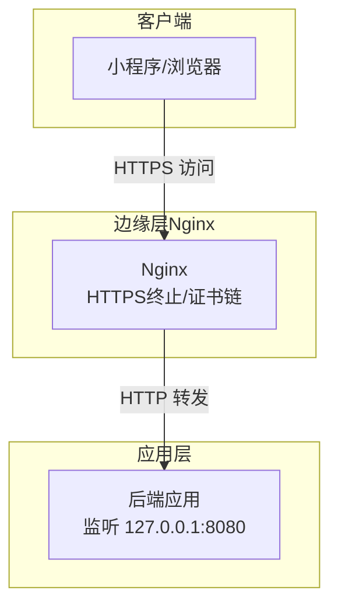
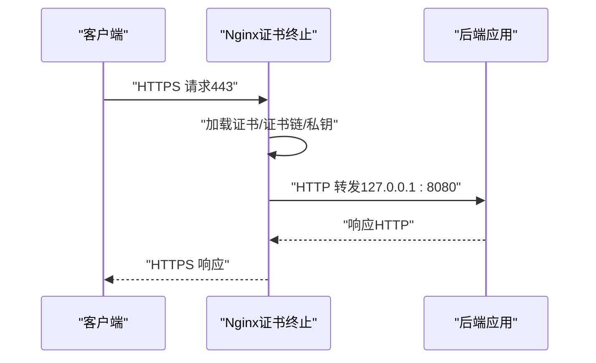
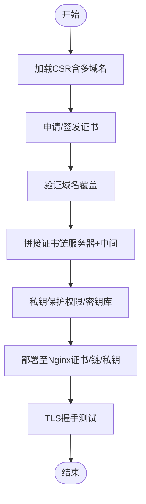
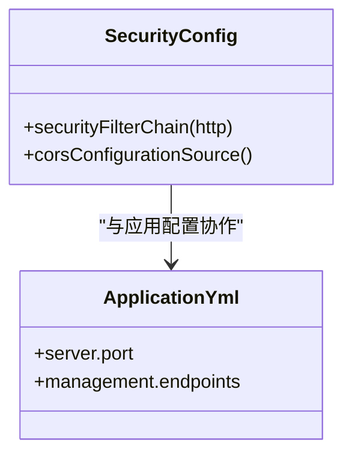
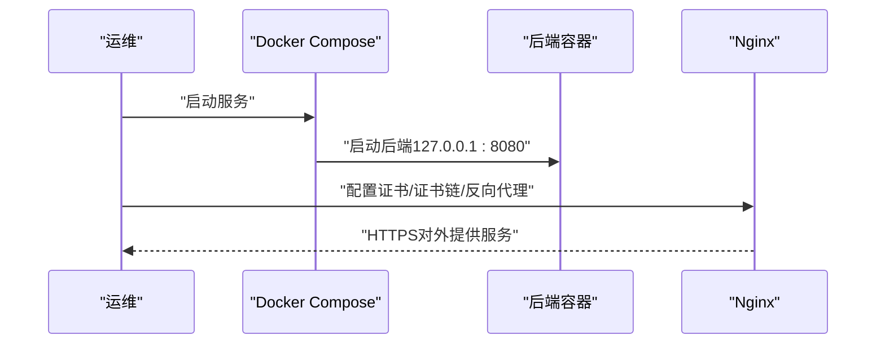
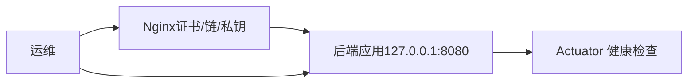

# SSL证书管理

<cite>
**本文引用的文件**
- [application.yml](file://backend/src/main/resources/application.yml)
- [docker-compose.prod.yml](file://deploy/docker-compose.prod.yml)
- [SecurityConfig.java](file://backend/src/main/java/com/playminipro/common/config/SecurityConfig.java)
- [ywsfs.cn.csr](file://服务器资源/ywsfs.cn_nginx/ywsfs.cn.csr)
- [play-minipro-backend-deploy.tar.gz.b64](file://play-minipro-backend-deploy.tar.gz.b64)
- [部署发布指南.md](file://doc/08-部署发布指南.md)
- [deploy/README.md](file://deploy/README.md)
</cite>

## 目录
1. [引言](#引言)
2. [项目结构](#项目结构)
3. [核心组件](#核心组件)
4. [架构总览](#架构总览)
5. [详细组件分析](#详细组件分析)
6. [依赖关系分析](#依赖关系分析)
7. [性能考虑](#性能考虑)
8. [故障排除指南](#故障排除指南)
9. [结论](#结论)
10. [附录](#附录)

## 引言
本指南面向生产环境的SSL/TLS证书全生命周期管理，结合仓库中的实际部署与配置，系统讲解证书申请、安装、维护与自动化续期策略，并覆盖Let's Encrypt免费证书与商业证书的差异与适用场景。同时，提供CSR生成、证书签发、私钥保护、证书链配置、格式转换、多域名证书、验证方法以及故障排除与性能优化建议。

## 项目结构
本项目采用前后端分离与容器化部署，后端服务通过Nginx反向代理对外提供HTTPS访问。后端应用未内置内嵌Web服务器的SSL配置，生产环境的TLS终止点位于Nginx层，后端仅监听本地端口。

图表来源
- [deploy/README.md:10-15](file://deploy/README.md#L10-L15)
- [docker-compose.prod.yml:56-58](file://deploy/docker-compose.prod.yml#L56-L58)

章节来源
- [deploy/README.md:10-15](file://deploy/README.md#L10-L15)
- [docker-compose.prod.yml:32-58](file://deploy/docker-compose.prod.yml#L32-L58)

## 核心组件
- Nginx反向代理与TLS终止：负责证书加载、证书链拼接、加密套件与协议配置、以及将请求转发至后端。
- 后端应用：基于Spring Boot，默认监听本地端口，不直接处理TLS；通过Nginx实现安全访问。
- 安全配置：Spring Security启用无状态JWT认证，配合HTTPS保障传输安全。
- 部署编排：Docker Compose将后端、数据库、缓存等服务编排运行，Nginx作为独立外部入口。

章节来源
- [application.yml:1-53](file://backend/src/main/resources/application.yml#L1-L53)
- [SecurityConfig.java:26-41](file://backend/src/main/java/com/playminipro/common/config/SecurityConfig.java#L26-L41)
- [docker-compose.prod.yml:32-58](file://deploy/docker-compose.prod.yml#L32-L58)

## 架构总览
下图展示生产环境的TLS路径与组件交互，强调证书在Nginx层完成终止，后端仅处理内部HTTP流量。

图表来源
- [deploy/README.md:14-15](file://deploy/README.md#L14-L15)
- [docker-compose.prod.yml:56-58](file://deploy/docker-compose.prod.yml#L56-L58)

## 详细组件分析

### 组件A：Nginx证书与证书链配置
- 证书来源：仓库中包含已签发证书文件与CSR文件，表明已有证书链与CSR材料。
- 证书链拼接：需将服务器证书与中间证书按正确顺序拼接为单一PEM文件，供Nginx加载。
- 私钥保护：私钥文件应放置于受控目录，权限限制为仅Nginx用户可读。
- 多域名支持：CSR中包含多域名条目，可在证书颁发后验证域名覆盖范围。
- 自动化续期：结合定时任务或计划任务自动检测证书到期并触发续期脚本。

图表来源
- [ywsfs.cn.csr:1-18](file://服务器资源/ywsfs.cn_nginx/ywsfs.cn.csr#L1-L18)
- [play-minipro-backend-deploy.tar.gz.b64:1-354](file://play-minipro-backend-deploy.tar.gz.b64#L1-L354)

章节来源
- [ywsfs.cn.csr:1-18](file://服务器资源/ywsfs.cn_nginx/ywsfs.cn.csr#L1-L18)
- [play-minipro-backend-deploy.tar.gz.b64:1-354](file://play-minipro-backend-deploy.tar.gz.b64#L1-L354)

### 组件B：后端应用安全配置与HTTPS集成
- Spring Security配置为无状态JWT认证，适合与Nginx终止TLS配合使用。
- CORS允许跨域访问，便于小程序前端直连后端接口。
- Actuator健康检查端点暴露，便于Nginx探活与运维监控。

图表来源
- [SecurityConfig.java:26-55](file://backend/src/main/java/com/playminipro/common/config/SecurityConfig.java#L26-L55)
- [application.yml:33-41](file://backend/src/main/resources/application.yml#L33-L41)

章节来源
- [SecurityConfig.java:26-55](file://backend/src/main/java/com/playminipro/common/config/SecurityConfig.java#L26-L55)
- [application.yml:33-41](file://backend/src/main/resources/application.yml#L33-L41)

### 组件C：部署编排与Nginx前置
- Docker Compose将后端容器映射到本地8080端口，Nginx作为外部入口统一提供HTTPS。
- 部署文档明确要求在后端前放置Nginx以实现HTTPS与域名访问。

图表来源
- [docker-compose.prod.yml:32-58](file://deploy/docker-compose.prod.yml#L32-L58)
- [deploy/README.md:14-15](file://deploy/README.md#L14-L15)

章节来源
- [docker-compose.prod.yml:32-58](file://deploy/docker-compose.prod.yml#L32-L58)
- [deploy/README.md:14-15](file://deploy/README.md#L14-L15)

## 依赖关系分析
- 后端应用不直接处理TLS，依赖Nginx完成证书终止与加密。
- Nginx依赖证书文件、证书链与私钥文件，需确保路径正确与权限安全。
- 应用侧通过Actuator健康检查端点被Nginx探活，保证高可用。

图表来源
- [docker-compose.prod.yml:56-58](file://deploy/docker-compose.prod.yml#L56-L58)
- [application.yml:33-41](file://backend/src/main/resources/application.yml#L33-L41)

章节来源
- [docker-compose.prod.yml:56-58](file://deploy/docker-compose.prod.yml#L56-L58)
- [application.yml:33-41](file://backend/src/main/resources/application.yml#L33-L41)

## 性能考虑
- 证书链长度：尽量减少中间证书层级，降低握手耗时。
- 密钥算法：优先使用RSA 2048位或更高、或ECDSA P-256，兼顾兼容性与性能。
- 协议与套件：启用TLS 1.2/1.3，禁用过时套件；开启OCSP Stapling提升验证效率。
- 缓存与会话：合理配置会话复用与缓存，减少重复握手成本。
- Nginx优化：启用gzip压缩、合理超时与连接数限制，避免资源争用。

## 故障排除指南
- 证书过期或即将过期
  - 使用定时任务检测证书有效期，提前续期。
  - 若证书链缺失，浏览器将显示证书链错误；需重新拼接并部署。
- 私钥不匹配
  - 确认私钥与CSR一致，且权限仅Nginx可读。
- 域名不匹配
  - 检查证书主题与SAN列表是否覆盖所有域名。
- TLS握手失败
  - 检查协议与套件配置、OCSP Stapling状态、证书链完整性。
- 后端无法访问
  - 使用Nginx探活检查后端健康端点，确认容器与网络连通性。

章节来源
- [deploy/README.md:14-15](file://deploy/README.md#L14-L15)
- [application.yml:33-41](file://backend/src/main/resources/application.yml#L33-L41)

## 结论
本项目生产环境的TLS由Nginx统一终止，后端应用专注于业务逻辑与无状态认证。通过规范化的证书申请、安装、维护与自动化续期流程，可确保服务在安全与稳定前提下持续运行。建议结合Let's Encrypt与商业证书的特性选择合适的证书类型，并完善监控与告警体系，以实现高效运维与快速故障恢复。

## 附录

### A. Let's Encrypt与商业证书对比与适用场景
- Let's Encrypt
  - 优点：免费、自动化、广泛支持、短期有效期（约90天）。
  - 适用：开发测试、中小规模生产、自动化运维能力强的团队。
  - 注意：需配置自动化续期与监控。
- 商业证书
  - 优点：长期有效期、企业级支持、更长链与附加保障。
  - 适用：金融、医疗等合规要求高的行业，或对SLA有更高要求的场景。
  - 注意：成本较高，审批周期较长。

### B. 证书配置步骤（CSR生成、签发、私钥保护、证书链）
- CSR生成
  - 使用私钥生成CSR，确保包含所需域名（含多域名）。
- 证书签发
  - 提交CSR至CA（Let's Encrypt或商业CA），获取证书与中间证书。
- 私钥保护
  - 私钥权限仅限Nginx用户读取，置于受控目录，定期轮换。
- 证书链配置
  - 将服务器证书与中间证书按正确顺序拼接为单一PEM文件，供Nginx加载。

章节来源
- [ywsfs.cn.csr:1-18](file://服务器资源/ywsfs.cn_nginx/ywsfs.cn.csr#L1-L18)
- [play-minipro-backend-deploy.tar.gz.b64:1-354](file://play-minipro-backend-deploy.tar.gz.b64#L1-L354)

### C. 自动化证书续期与监控告警
- 续期策略
  - 使用acme-client或certbot自动化续期，结合计划任务在到期前7-10天触发。
  - 续期后自动重载Nginx并发送通知。
- 监控告警
  - 监测证书剩余有效期阈值（如小于30天）。
  - 监控Nginx证书加载状态与握手成功率。
  - 告警渠道：邮件、IM或运维平台。

### D. 证书格式转换与多域名配置
- 格式转换
  - PEM↔DER：使用openssl工具转换，注意保持私钥与证书匹配。
- 多域名配置
  - 在CSR中添加SAN条目，确保签发时包含所有域名。
  - 验证证书主题与SAN列表覆盖范围。

章节来源
- [ywsfs.cn.csr:1-18](file://服务器资源/ywsfs.cn_nginx/ywsfs.cn.csr#L1-L18)

### E. 证书验证方法
- 在线验证
  - 使用浏览器或在线工具检查证书链、域名匹配与有效期。
- 本地验证
  - 使用openssl s_client连接目标域名，检查证书链与协议支持。
- 运维验证
  - 通过Nginx日志与后端健康检查端点确认服务可用性。

章节来源
- [deploy/README.md:160-173](file://doc/08-部署发布指南.md#L160-L173)