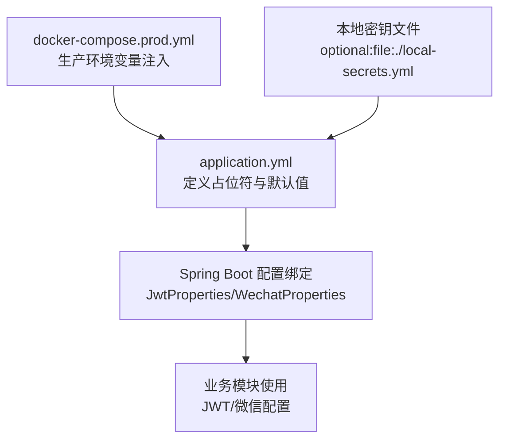
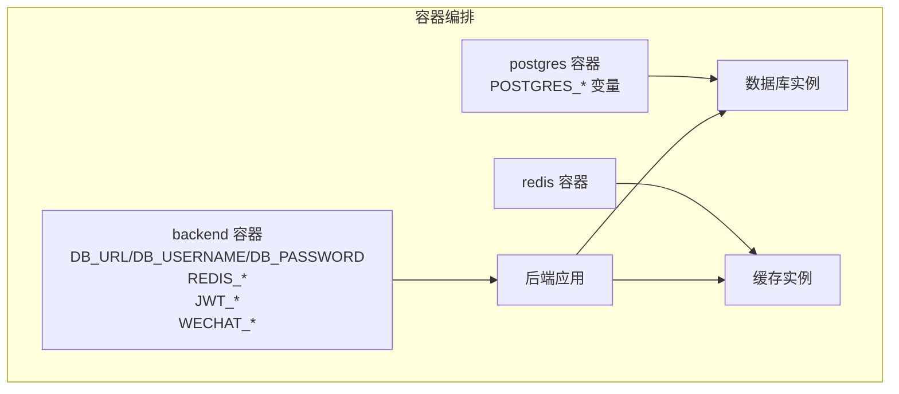
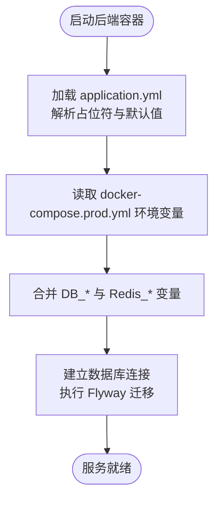
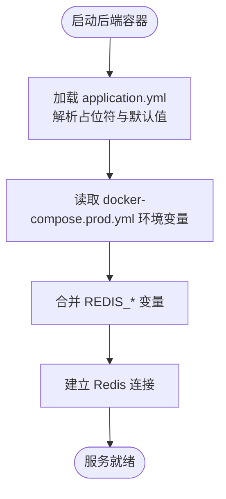
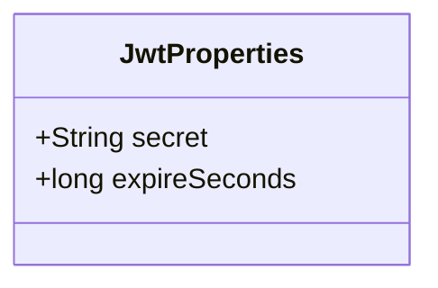
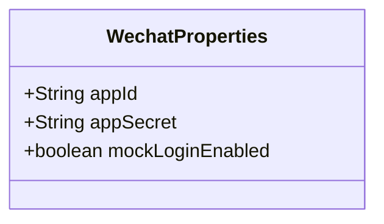
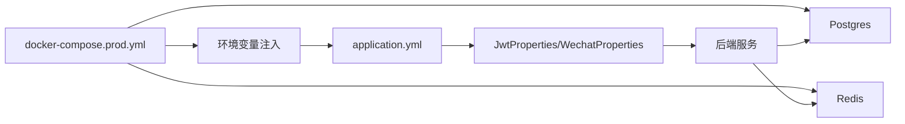

# 环境变量配置

<cite>
**本文引用的文件**
- [application.yml](file://backend/src/main/resources/application.yml)
- [JwtProperties.java](file://backend/src/main/java/com/playminipro/common/config/JwtProperties.java)
- [WechatProperties.java](file://backend/src/main/java/com/playminipro/common/config/WechatProperties.java)
- [docker-compose.prod.yml](file://deploy/docker-compose.prod.yml)
</cite>

## 目录
1. [简介](#简介)
2. [项目结构](#项目结构)
3. [核心组件](#核心组件)
4. [架构总览](#架构总览)
5. [详细组件分析](#详细组件分析)
6. [依赖分析](#依赖分析)
7. [性能考虑](#性能考虑)
8. [故障排查指南](#故障排查指南)
9. [结论](#结论)
10. [附录](#附录)

## 简介
本指南面向生产环境，系统性梳理后端服务所需的全部环境变量，覆盖数据库连接、Redis、JWT 密钥与微信小程序应用配置，并给出敏感信息安全存储与管理策略（密钥轮换、访问控制）、多环境最佳实践（开发/测试/生产）、以及配置验证与故障诊断方法。为避免泄露，本文不直接展示具体值，仅通过“文件路径+行号”定位配置项。

## 项目结构
后端采用 Spring Boot，环境变量主要通过以下位置定义与加载：
- 应用主配置：application.yml 中以占位符形式声明变量，并可从本地密钥文件加载敏感值
- 生产编排：docker-compose.prod.yml 将数据库、缓存与后端服务的环境变量集中注入
- 配置类：JwtProperties 与 WechatProperties 将 YAML 前缀映射到 Java 对象，供业务模块读取

图表来源
- [application.yml:1-53](file://backend/src/main/resources/application.yml#L1-L53)
- [docker-compose.prod.yml:1-61](file://deploy/docker-compose.prod.yml#L1-L61)

章节来源
- [application.yml:1-53](file://backend/src/main/resources/application.yml#L1-L53)
- [docker-compose.prod.yml:1-61](file://deploy/docker-compose.prod.yml#L1-L61)

## 核心组件
本节按功能域列出所需环境变量及配置要点：

- 数据库（PostgreSQL）
  - DB_URL：数据库连接串（默认指向本地开发库）
  - DB_USERNAME：数据库用户名（默认值）
  - DB_PASSWORD：数据库密码（必填，生产必须由外部注入）
  - Flyway：迁移启用与脚本位置（默认开启，classpath:db/migration）

- 缓存（Redis）
  - REDIS_HOST：Redis 主机（默认 localhost）
  - REDIS_PORT：Redis 端口（默认 6379）
  - REDIS_PASSWORD：Redis 访问密码（可选空串）

- 应用安全（JWT）
  - JWT_SECRET：签名密钥（必填，生产必须强随机且定期轮换）
  - JWT_EXPIRE_SECONDS：过期秒数（默认 604800，即 7 天）

- 微信小程序（登录与网关）
  - WECHAT_MINI_APP_ID：小程序 App ID（默认值，生产需替换）
  - WECHAT_MINI_APP_SECRET：小程序 App Secret（必填，生产必须由外部注入）
  - WECHAT_MOCK_LOGIN_ENABLED：是否启用模拟登录（默认 true，生产建议 false）

- 运维与日志
  - management.endpoints.web.exposure.include：暴露健康与信息端点
  - logging.level.com.playminipro：应用日志级别

章节来源
- [application.yml:4-53](file://backend/src/main/resources/application.yml#L4-L53)
- [docker-compose.prod.yml:43-55](file://deploy/docker-compose.prod.yml#L43-L55)

## 架构总览
下图展示生产环境变量在容器编排中的注入路径与作用范围。

图表来源
- [docker-compose.prod.yml:1-61](file://deploy/docker-compose.prod.yml#L1-L61)

## 详细组件分析

### 数据库连接配置
- 占位符与默认值：application.yml 中定义了 DB_URL、DB_USERNAME、DB_PASSWORD 的占位符与默认值
- 生产注入：docker-compose.prod.yml 将 DB_URL、DB_USERNAME、DB_PASSWORD 注入后端容器
- 迁移：Flyway 默认启用，迁移脚本位于 classpath:db/migration

图表来源
- [application.yml:9-22](file://backend/src/main/resources/application.yml#L9-L22)
- [docker-compose.prod.yml:43-49](file://deploy/docker-compose.prod.yml#L43-L49)

章节来源
- [application.yml:9-22](file://backend/src/main/resources/application.yml#L9-L22)
- [docker-compose.prod.yml:43-49](file://deploy/docker-compose.prod.yml#L43-L49)

### Redis 缓存配置
- 占位符与默认值：application.yml 中定义了 REDIS_HOST、REDIS_PORT、REDIS_PASSWORD 的占位符与默认值
- 生产注入：docker-compose.prod.yml 将 REDIS_HOST、REDIS_PORT、REDIS_PASSWORD 注入后端容器

图表来源
- [application.yml:14-19](file://backend/src/main/resources/application.yml#L14-L19)
- [docker-compose.prod.yml:47-49](file://deploy/docker-compose.prod.yml#L47-L49)

章节来源
- [application.yml:14-19](file://backend/src/main/resources/application.yml#L14-L19)
- [docker-compose.prod.yml:47-49](file://deploy/docker-compose.prod.yml#L47-L49)

### JWT 密钥配置
- 占位符与默认值：application.yml 中定义了 app.jwt.secret 与 app.jwt.expire-seconds 的占位符与默认值
- 配置类绑定：JwtProperties 将前缀 app.jwt 绑定到 Java 字段
- 生产要求：JWT_SECRET 必须强随机、长度足够；建议定期轮换并在滚动升级时平滑切换

图表来源
- [JwtProperties.java:1-27](file://backend/src/main/java/com/playminipro/common/config/JwtProperties.java#L1-L27)
- [application.yml:42-45](file://backend/src/main/resources/application.yml#L42-L45)

章节来源
- [JwtProperties.java:1-27](file://backend/src/main/java/com/playminipro/common/config/JwtProperties.java#L1-L27)
- [application.yml:42-45](file://backend/src/main/resources/application.yml#L42-L45)

### 微信小程序应用配置
- 占位符与默认值：application.yml 中定义了 app.wechat.app-id、app.wechat.app-secret、app.wechat.mock-login-enabled 的占位符与默认值
- 配置类绑定：WechatProperties 将前缀 app.wechat 绑定到 Java 字段
- 生产要求：WECHAT_MINI_APP_ID 与 WECHAT_MINI_APP_SECRET 必须由外部注入；mock 登录仅限测试环境

图表来源
- [WechatProperties.java:1-37](file://backend/src/main/java/com/playminipro/common/config/WechatProperties.java#L1-L37)
- [application.yml:46-49](file://backend/src/main/resources/application.yml#L46-L49)

章节来源
- [WechatProperties.java:1-37](file://backend/src/main/java/com/playminipro/common/config/WechatProperties.java#L1-L37)
- [application.yml:46-49](file://backend/src/main/resources/application.yml#L46-L49)

## 依赖分析
- 后端容器依赖数据库与缓存健康状态
- 数据库与缓存的环境变量来自 docker-compose.prod.yml
- 应用配置通过 application.yml 与可选的本地密钥文件共同决定最终运行态

图表来源
- [docker-compose.prod.yml:1-61](file://deploy/docker-compose.prod.yml#L1-L61)
- [application.yml:1-53](file://backend/src/main/resources/application.yml#L1-L53)

章节来源
- [docker-compose.prod.yml:1-61](file://deploy/docker-compose.prod.yml#L1-L61)
- [application.yml:1-53](file://backend/src/main/resources/application.yml#L1-L53)

## 性能考虑
- 连接池与超时：数据库与缓存连接应结合业务峰值合理配置连接数与超时，避免阻塞
- 日志级别：生产环境建议提升至 info 或 warn，减少不必要的开销
- 健康检查：容器层面已内置健康检查，确保依赖服务可用后再启动后端

## 故障排查指南
- 数据库连接失败
  - 检查 DB_URL、DB_USERNAME、DB_PASSWORD 是否正确注入
  - 查看 Postgres 容器健康状态与日志
  - 确认 Flyway 迁移是否成功执行

- Redis 连接失败
  - 检查 REDIS_HOST、REDIS_PORT、REDIS_PASSWORD 是否正确注入
  - 查看 Redis 容器健康状态与日志

- JWT 签名异常
  - 确认 JWT_SECRET 是否被注入且未被修改
  - 如进行密钥轮换，请确保新旧密钥并行支持过渡期

- 微信登录异常
  - 确认 WECHAT_MINI_APP_ID 与 WECHAT_MINI_APP_SECRET 已注入
  - 检查 mock 登录开关是否符合预期

- 配置验证
  - 使用管理端点查看应用配置快照（如可用）
  - 在启动日志中确认各配置前缀已被正确绑定

章节来源
- [application.yml:33-53](file://backend/src/main/resources/application.yml#L33-L53)
- [docker-compose.prod.yml:13-17](file://deploy/docker-compose.prod.yml#L13-L17)
- [docker-compose.prod.yml:26-30](file://deploy/docker-compose.prod.yml#L26-L30)

## 结论
通过在 docker-compose.prod.yml 中集中注入环境变量，在 application.yml 中以占位符与默认值统一声明，并借助 JwtProperties 与 WechatProperties 将其绑定到业务对象，实现了生产环境的标准化配置。配合严格的密钥管理与轮换策略、最小权限访问控制与健康检查，可显著提升系统的安全性与稳定性。

## 附录

### 不同部署场景的最佳实践
- 开发环境
  - 使用默认占位符与本地密钥文件（local-secrets.yml）加载敏感值
  - 允许 mock 登录，便于联调
- 测试环境
  - 注入独立的测试数据库与缓存实例
  - 关闭或限制 mock 登录，使用真实第三方网关
- 生产环境
  - 所有敏感变量必须由外部注入（密钥管理服务或编排平台）
  - 禁用 mock 登录，启用严格访问控制与审计日志

### 敏感信息的安全存储与管理
- 密钥轮换
  - 生成新密钥并滚动更新，确保新旧密钥并行支持过渡期
  - 更新后端配置并进行灰度发布，观察日志与监控指标
- 访问控制
  - 限制对环境变量与密钥文件的读写权限
  - 使用最小权限原则，仅授予必要人员与流程访问

### 加密存储、动态加载与热更新
- 加密存储
  - 将密钥保存于密钥管理服务（如 KMS、Vault），以密文形式注入容器
- 动态加载
  - 通过 Spring Boot 的配置绑定与外部化配置能力，按需加载
- 热更新
  - 对于非敏感配置（如日志级别、开关），可通过管理端点或配置中心实现热更新
  - 对于敏感配置（如密钥、数据库凭据），建议通过滚动重启生效