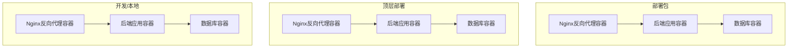
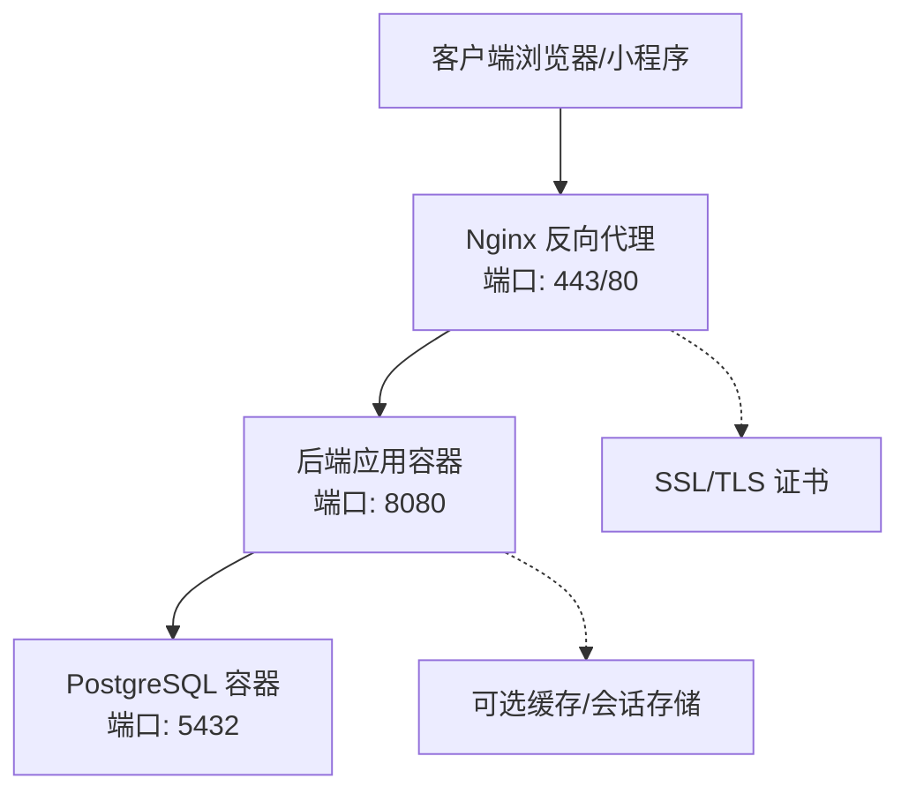
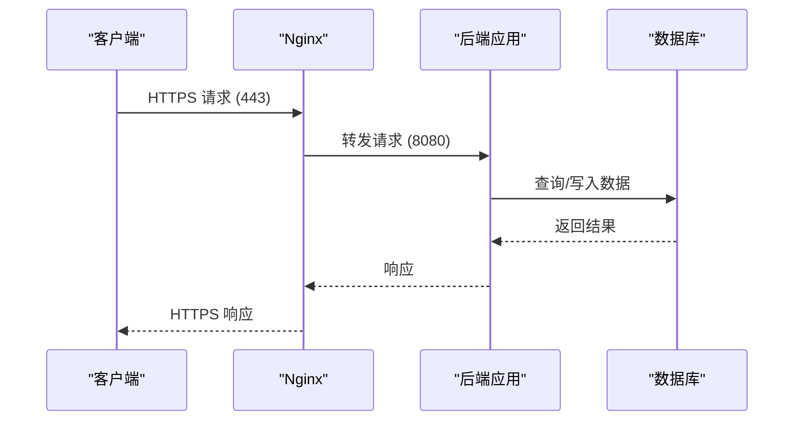
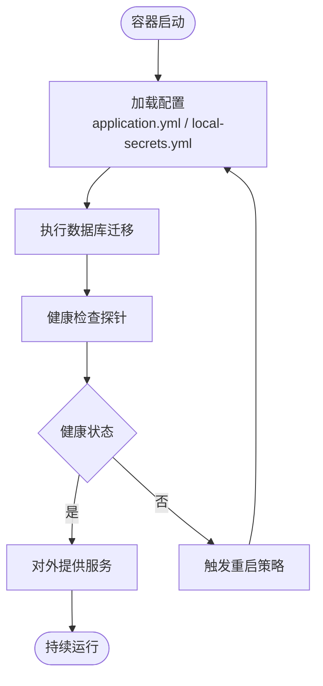
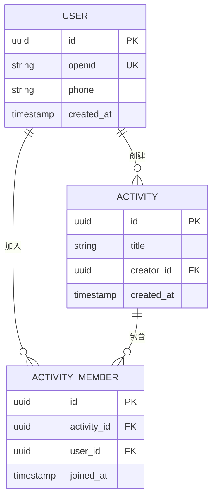
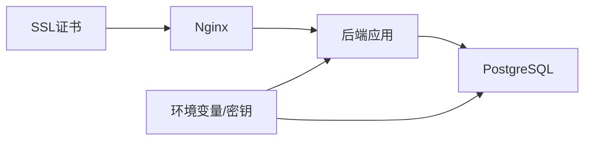

# 生产环境部署

<cite>
**本文引用的文件**
- [docker-compose.prod.yml（部署包）](file://deploy_bundle/deploy/docker-compose.prod.yml)
- [docker-compose.prod.yml（根目录）](file://deploy/docker-compose.prod.yml)
- [Dockerfile（后端）](file://backend/Dockerfile)
- [application.yml（后端资源）](file://backend/src/main/resources/application.yml)
- [docker-compose.yml（后端）](file://backend/docker-compose.yml)
- [local-secrets.yml（后端本地密钥）](file://backend/local-secrets.yml)
- [README.md（后端）](file://backend/README.md)
- [README.md（部署包）](file://deploy_bundle/deploy/README.md)
- [README.md（部署）](file://deploy/README.md)
- [ywsfs.cn.csr（服务器证书）](file://服务器资源/ywsfs.cn_nginx/ywsfs.cn.csr)
- [服务器配置信息.md](file://服务器资源/服务器配置信息.md)
- [202606012206工程改进设计.md](file://doc/改进文档/202606012206工程改进设计.md)
- [08-部署发布指南.md](file://doc/08-部署发布指南.md)
</cite>

## 目录
1. [简介](#简介)
2. [项目结构](#项目结构)
3. [核心组件](#核心组件)
4. [架构总览](#架构总览)
5. [详细组件分析](#详细组件分析)
6. [依赖关系分析](#依赖关系分析)
7. [性能考虑](#性能考虑)
8. [故障排查指南](#故障排查指南)
9. [结论](#结论)
10. [附录](#附录)

## 简介
本指南面向生产环境的容器化部署，覆盖PlayMiniPro的Docker Compose生产配置、Nginx反向代理与SSL证书、负载均衡策略、安全配置（网络隔离、端口管理、健康检查、自动重启）、完整部署流程（从代码构建到容器启动）、监控与日志、性能优化建议，以及多环境与蓝绿部署策略。内容基于仓库中现有的部署配置与文档进行整理与扩展。

## 项目结构
- 后端服务位于 backend 目录，包含Spring Boot应用、Dockerfile与Compose配置。
- 部署包位于 deploy_bundle，包含打包后的后端、前端与生产级Compose配置。
- 顶层 deploy 目录提供独立的生产Compose与说明。
- 服务器资源包含证书与配置信息，用于Nginx与SSL部署。
- 文档目录包含部署发布指南与工程改进设计等参考资料。

图表来源
- [docker-compose.prod.yml（部署包）:1-200](file://deploy_bundle/deploy/docker-compose.prod.yml#L1-L200)
- [docker-compose.prod.yml（根目录）:1-200](file://deploy/docker/docker-compose.prod.yml#L1-L200)
- [docker-compose.yml（后端）:1-200](file://backend/docker-compose.yml#L1-L200)

章节来源
- [docker-compose.prod.yml（部署包）:1-200](file://deploy_bundle/deploy/docker-compose.prod.yml#L1-L200)
- [docker-compose.prod.yml（根目录）:1-200](file://deploy/docker/docker-compose.prod.yml#L1-L200)
- [docker-compose.yml（后端）:1-200](file://backend/docker-compose.yml#L1-L200)

## 核心组件
- 反向代理：Nginx负责入口流量分发、静态资源服务与SSL终止。
- 应用服务：Spring Boot后端容器，提供REST API与业务逻辑。
- 数据库：PostgreSQL容器，承载应用数据与迁移脚本。
- 密钥与环境：通过本地密钥文件与环境变量注入敏感信息。
- 健康检查与重启：容器编排定义健康检查与重启策略，保障可用性。

章节来源
- [docker-compose.prod.yml（部署包）:1-200](file://deploy_bundle/deploy/docker-compose.prod.yml#L1-L200)
- [docker-compose.prod.yml（根目录）:1-200](file://deploy/docker/docker-compose.prod.yml#L1-L200)
- [application.yml（后端资源）:1-200](file://backend/src/main/resources/application.yml#L1-L200)
- [local-secrets.yml（后端本地密钥）:1-200](file://backend/local-secrets.yml#L1-L200)

## 架构总览
生产环境采用“Nginx反向代理 + 后端应用 + PostgreSQL”的三层架构。Nginx统一对外暴露HTTPS端口，负责TLS终止、静态资源与请求转发；后端应用通过健康检查与自动重启保障稳定性；数据库持久化存储并通过迁移脚本初始化。

图表来源
- [docker-compose.prod.yml（部署包）:1-200](file://deploy_bundle/deploy/docker-compose.prod.yml#L1-L200)
- [application.yml（后端资源）:1-200](file://backend/src/main/resources/application.yml#L1-L200)

## 详细组件分析

### Nginx反向代理与SSL配置
- 入口端口：对外暴露HTTP 80与HTTPS 443端口，实现HTTP重定向与TLS终止。
- SSL证书：使用服务器资源中的证书文件进行TLS配置，确保传输层安全。
- 负载均衡：在单实例场景下作为单一入口；多实例时可在上游LB或Nginx层面扩展。
- 静态资源：可配置静态目录以提升前端资源访问效率。

图表来源
- [docker-compose.prod.yml（部署包）:1-200](file://deploy_bundle/deploy/docker-compose.prod.yml#L1-L200)
- [ywsfs.cn.csr（服务器证书）:1-200](file://服务器资源/ywsfs.cn_nginx/ywsfs.cn.csr#L1-L200)

章节来源
- [docker-compose.prod.yml（部署包）:1-200](file://deploy_bundle/deploy/docker-compose.prod.yml#L1-L200)
- [服务器配置信息.md:1-200](file://服务器资源/服务器配置信息.md#L1-L200)
- [ywsfs.cn.csr（服务器证书）:1-200](file://服务器资源/ywsfs.cn_nginx/ywsfs.cn.csr#L1-L200)

### 后端应用容器与健康检查
- 容器镜像：基于后端Dockerfile构建，运行Spring Boot应用。
- 端口映射：应用容器监听8080端口，由Nginx统一转发。
- 健康检查：通过HTTP路径与端口进行存活与就绪探针，确保服务可用。
- 自动重启：定义重启策略，异常退出时自动拉起容器。
- 环境配置：通过application.yml与local-secrets.yml注入数据库连接、JWT与微信等参数。

图表来源
- [docker-compose.yml（后端）:1-200](file://backend/docker-compose.yml#L1-L200)
- [application.yml（后端资源）:1-200](file://backend/src/main/resources/application.yml#L1-L200)
- [local-secrets.yml（后端本地密钥）:1-200](file://backend/local-secrets.yml#L1-L200)

章节来源
- [Dockerfile（后端）:1-200](file://backend/Dockerfile#L1-L200)
- [docker-compose.yml（后端）:1-200](file://backend/docker-compose.yml#L1-L200)
- [application.yml（后端资源）:1-200](file://backend/src/main/resources/application.yml#L1-L200)
- [local-secrets.yml（后端本地密钥）:1-200](file://backend/local-secrets.yml#L1-L200)

### 数据库容器与迁移
- PostgreSQL容器：持久化数据，卷挂载保证数据不丢失。
- 迁移脚本：通过Flyway/Vale迁移脚本初始化核心表结构与字段。
- 备份策略：建议定期备份数据卷或快照，结合只读副本实现高可用。

图表来源
- [application.yml（后端资源）:1-200](file://backend/src/main/resources/application.yml#L1-L200)

章节来源
- [application.yml（后端资源）:1-200](file://backend/src/main/resources/application.yml#L1-L200)

### 生产Compose配置要点
- 服务编排：定义后端、数据库、Nginx三类服务及其依赖关系。
- 网络隔离：使用自定义网络隔离服务间通信，限制外部暴露面。
- 挂载策略：数据库卷、日志卷与证书卷按需挂载，避免敏感信息泄露。
- 环境变量：通过env_file或直接注入，区分开发/测试/生产环境。
- 健康检查与重启：为每个服务配置健康检查与重启策略，提升可用性。

章节来源
- [docker-compose.prod.yml（部署包）:1-200](file://deploy_bundle/deploy/docker-compose.prod.yml#L1-L200)
- [docker-compose.prod.yml（根目录）:1-200](file://deploy/docker/docker-compose.prod.yml#L1-L200)

## 依赖关系分析
- 组件耦合：Nginx依赖后端应用；后端应用依赖数据库；证书与域名解析共同决定TLS生效。
- 外部依赖：PostgreSQL、Nginx镜像版本与补丁更新需纳入运维计划。
- 环境隔离：不同环境使用独立Compose文件与密钥文件，避免交叉污染。

图表来源
- [docker-compose.prod.yml（部署包）:1-200](file://deploy_bundle/deploy/docker-compose.prod.yml#L1-L200)
- [application.yml（后端资源）:1-200](file://backend/src/main/resources/application.yml#L1-L200)

章节来源
- [docker-compose.prod.yml（部署包）:1-200](file://deploy_bundle/deploy/docker-compose.prod.yml#L1-L200)
- [application.yml（后端资源）:1-200](file://backend/src/main/resources/application.yml#L1-L200)

## 性能考虑
- 连接池与数据库优化：合理配置PostgreSQL连接数与后端连接池大小，避免峰值拥塞。
- 缓存策略：引入Redis缓存热点数据，降低数据库压力。
- 静态资源优化：Nginx启用Gzip压缩与缓存头，减少带宽占用。
- 并发与线程：根据CPU核数调整JVM线程与应用并发参数。
- 监控指标：采集CPU、内存、QPS、错误率与数据库慢查询，建立告警阈值。

## 故障排查指南
- 健康检查失败：检查后端应用日志与数据库连通性，确认迁移脚本执行成功。
- TLS握手失败：核对证书链完整性与域名匹配，检查Nginx证书路径与权限。
- 端口冲突：确认宿主机80/443/8080端口未被占用，或调整映射端口。
- 数据库不可用：检查卷挂载、密码与网络连通，必要时重建容器并恢复备份。
- 日志定位：查看容器日志与Nginx访问/错误日志，结合时间线定位问题。

章节来源
- [docker-compose.prod.yml（部署包）:1-200](file://deploy_bundle/deploy/docker-compose.prod.yml#L1-L200)
- [application.yml（后端资源）:1-200](file://backend/src/main/resources/application.yml#L1-L200)

## 结论
通过Nginx反向代理、Spring Boot应用与PostgreSQL的组合，配合完善的健康检查、自动重启与密钥管理，PlayMiniPro可在生产环境中实现稳定、安全与可扩展的部署。建议结合监控与日志体系持续优化，并制定多环境与蓝绿部署策略以提升交付质量与风险控制能力。

## 附录

### 完整部署流程（从代码构建到容器启动）
- 准备阶段
  - 获取源码与部署包，准备服务器与域名解析。
  - 准备SSL证书与local-secrets.yml，确保密钥文件权限正确。
- 构建与启动
  - 使用生产Compose文件启动服务，等待数据库初始化与迁移完成。
  - 验证Nginx健康状态与后端应用健康检查。
- 验证与收尾
  - 访问域名验证HTTPS与静态资源加载。
  - 查看容器日志与系统监控，确认无异常。
- 回滚与维护
  - 制定回滚策略与备份计划，定期更新镜像与补丁。

章节来源
- [README.md（部署包）:1-200](file://deploy_bundle/deploy/README.md#L1-L200)
- [README.md（部署）:1-200](file://deploy/README.md#L1-L200)
- [08-部署发布指南.md:1-200](file://doc/08-部署发布指南.md#L1-L200)

### 多环境与蓝绿部署策略
- 多环境：开发、测试、预发布、生产使用独立Compose文件与密钥文件，避免相互影响。
- 蓝绿部署：准备两套后端容器组（A/B），先将流量切换至新版本，验证通过后再切回旧版本或清理旧版本，实现零停机升级。

章节来源
- [202606012206工程改进设计.md:1-200](file://doc/改进文档/202606012206工程改进设计.md#L1-L200)