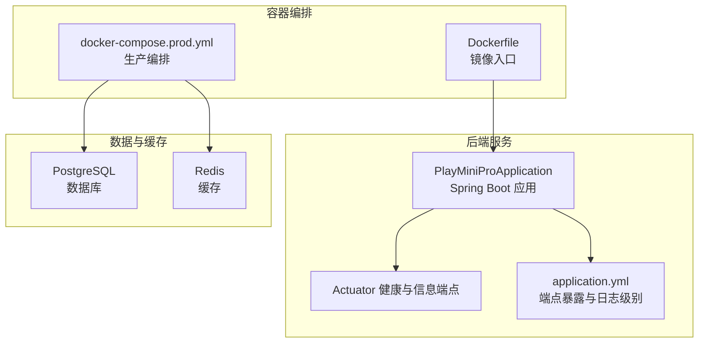
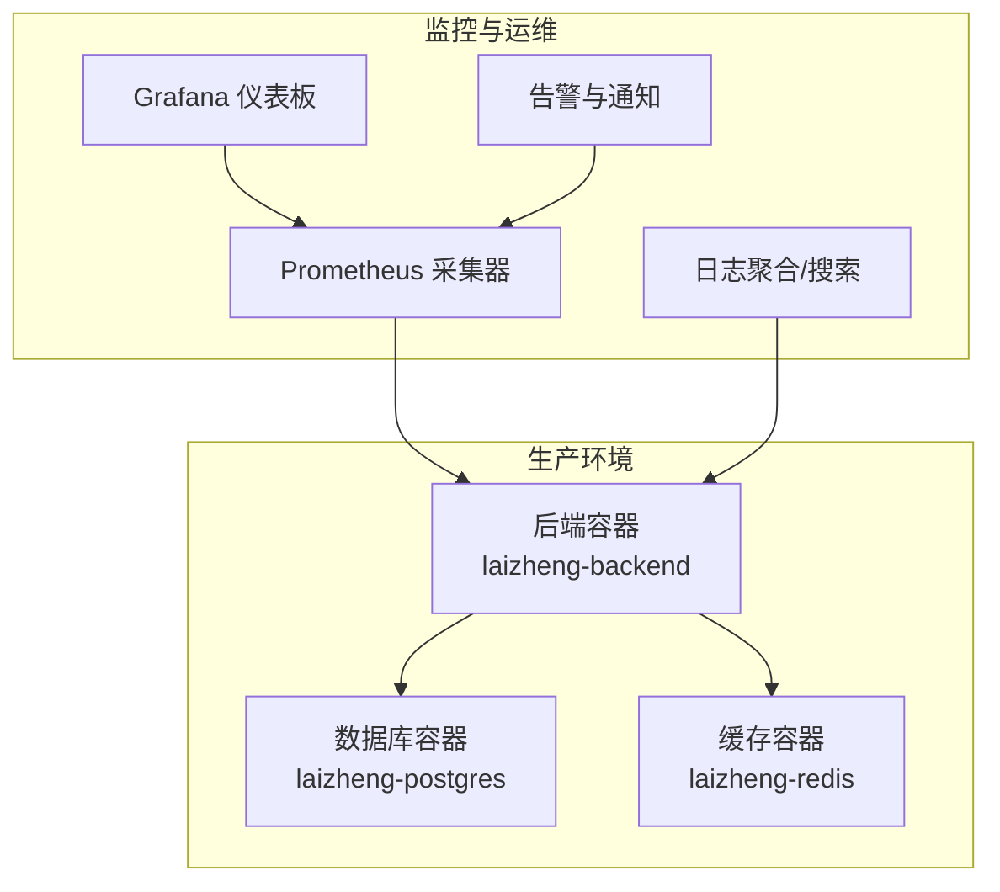
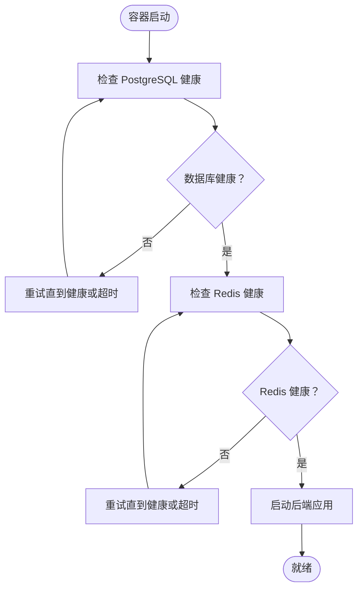
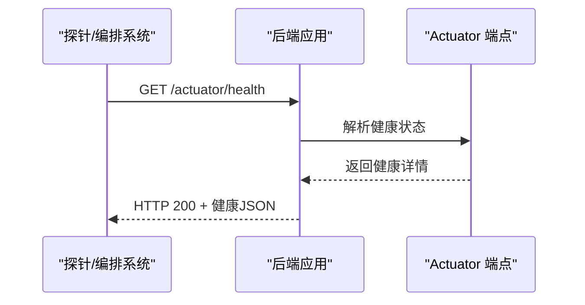
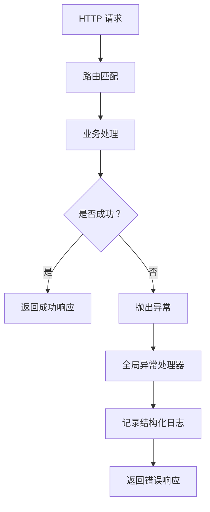
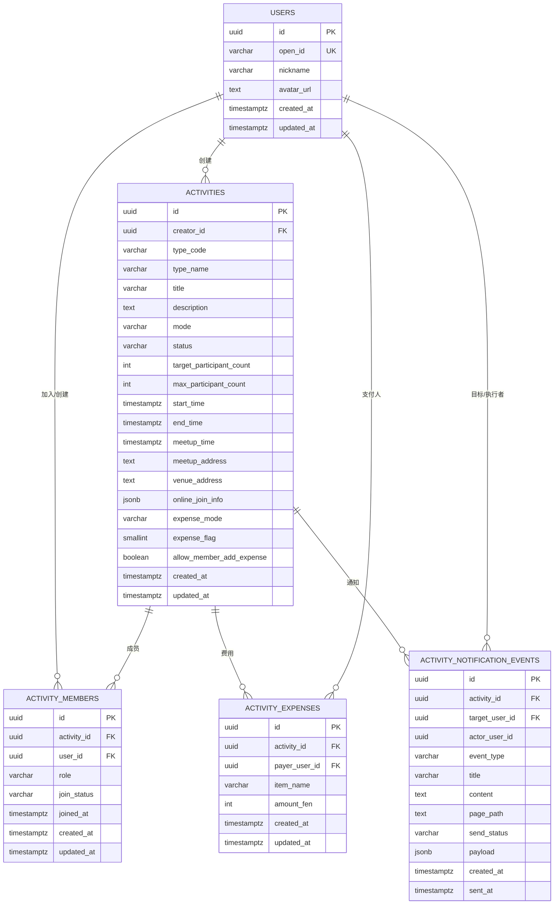
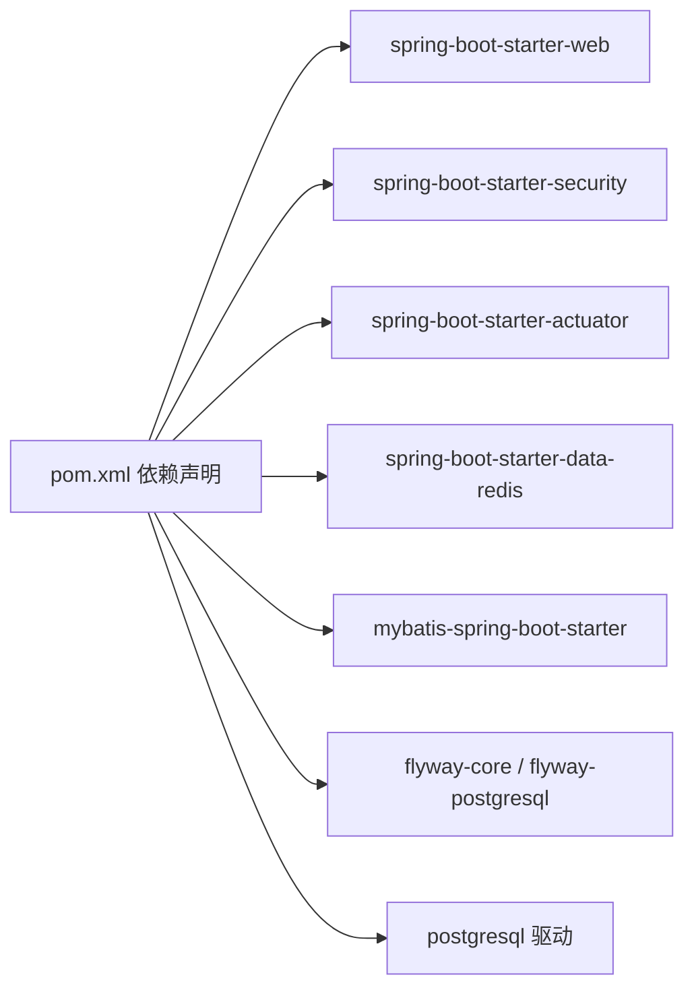

# 监控与日志

<cite>
**本文引用的文件**
- [application.yml](file://backend/src/main/resources/application.yml)
- [Dockerfile](file://backend/Dockerfile)
- [docker-compose.yml](file://backend/docker-compose.yml)
- [docker-compose.prod.yml（部署）](file://deploy/docker-compose.prod.yml)
- [docker-compose.prod.yml（打包部署）](file://deploy_backend_bundle/deploy/docker-compose.prod.yml)
- [PlayMiniProApplication.java](file://backend/src/main/java/com/playminipro/PlayMiniProApplication.java)
- [pom.xml](file://backend/pom.xml)
- [JwtProperties.java](file://backend/src/main/java/com/playminipro/common/config/JwtProperties.java)
- [WechatProperties.java](file://backend/src/main/java/com/playminipro/common/config/WechatProperties.java)
- [GlobalExceptionHandler.java](file://backend/src/main/java/com/playminipro/common/exception/GlobalExceptionHandler.java)
- [SecurityConfig.java](file://backend/src/main/java/com/playminipro/common/config/SecurityConfig.java)
- [V1__init_core_tables.sql](file://backend/src/main/resources/db/migration/V1__init_core_tables.sql)
- [V2__add_user_phone_number.sql](file://backend/src/main/resources/db/migration/V2__add_user_phone_number.sql)
- [V3__add_activity_expenses.sql](file://backend/src/main/resources/db/migration/V3__add_activity_expenses.sql)
- [V4__add_activity_notification_events.sql](file://backend/src/main/resources/db/migration/V4__add_activity_notification_events.sql)
- [local-secrets.yml](file://backend/local-secrets.yml)
</cite>

## 目录
1. [简介](#简介)
2. [项目结构](#项目结构)
3. [核心组件](#核心组件)
4. [架构总览](#架构总览)
5. [详细组件分析](#详细组件分析)
6. [依赖分析](#依赖分析)
7. [性能考虑](#性能考虑)
8. [故障排查指南](#故障排查指南)
9. [结论](#结论)
10. [附录](#附录)

## 简介
本指南面向生产环境，围绕“容器健康检查、应用性能监控、业务指标追踪、日志收集与聚合、Prometheus/Grafana 集成、告警与通知、故障响应流程、日志轮转与存储优化、合规性要求”等主题，结合仓库现有配置与代码，给出可操作的监控与日志管理方案。当前项目已具备基础的 Spring Boot Actuator 健康检查能力，并通过 Docker Compose 提供容器编排与健康检查；后续可在现有基础上扩展 Prometheus 指标导出、Grafana 仪表板、日志聚合与搜索、告警规则与通知通道。

## 项目结构
后端采用 Spring Boot 3 + MyBatis，使用 Actuator 暴露健康与应用信息，容器层通过 Dockerfile 和 docker-compose 编排 PostgreSQL 与 Redis，并在生产编排中启用健康检查与重启策略。数据库迁移脚本位于 resources/db/migration，包含用户、活动、成员、费用与通知事件等核心表。

**图表来源**
- [PlayMiniProApplication.java:11-19](file://backend/src/main/java/com/playminipro/PlayMiniProApplication.java#L11-L19)
- [application.yml:33-40](file://backend/src/main/resources/application.yml#L33-L40)
- [docker-compose.prod.yml（部署）:32-57](file://deploy/docker-compose.prod.yml#L32-L57)
- [Dockerfile:1-8](file://backend/Dockerfile#L1-L8)

**章节来源**
- [PlayMiniProApplication.java:11-19](file://backend/src/main/java/com/playminipro/PlayMiniProApplication.java#L11-L19)
- [application.yml:1-53](file://backend/src/main/resources/application.yml#L1-L53)
- [docker-compose.prod.yml（部署）:1-61](file://deploy/docker-compose.prod.yml#L1-L61)
- [Dockerfile:1-8](file://backend/Dockerfile#L1-L8)

## 核心组件
- 容器与运行时
  - 后端镜像基于 Eclipse Temurin 21 JRE，暴露 8080 端口，启动方式为直接运行 jar 包。
  - 生产编排中对 PostgreSQL 与 Redis 设置了健康检查与重启策略，后端服务依赖数据库与缓存健康状态。
- 健康检查与端点
  - Actuator 默认开启 health 与 info 端点，显示详情策略为总是展示，便于外部探针与编排系统读取。
- 数据与缓存
  - PostgreSQL 使用 Flyway 迁移，Redis 作为缓存与会话存储（当前未显式启用 Session Store，但具备连接能力）。
- 日志
  - application.yml 中设置了包级日志级别，便于生产环境统一控制日志输出。

**章节来源**
- [Dockerfile:1-8](file://backend/Dockerfile#L1-L8)
- [docker-compose.prod.yml（部署）:13-17](file://deploy/docker-compose.prod.yml#L13-L17)
- [docker-compose.prod.yml（部署）:26-30](file://deploy/docker-compose.prod.yml#L26-L30)
- [docker-compose.prod.yml（部署）:38-42](file://deploy/docker-compose.prod.yml#L38-L42)
- [application.yml:33-40](file://backend/src/main/resources/application.yml#L33-L40)
- [application.yml:51-53](file://backend/src/main/resources/application.yml#L51-L53)

## 架构总览
下图展示了生产环境的容器与服务交互：后端应用依赖数据库与缓存健康，Actuator 对外暴露健康与信息端点，容器编排负责健康检查与重启策略。

[此图为概念性架构示意，不直接映射具体源码文件，故不提供图表来源]

## 详细组件分析

### 容器健康检查与编排
- PostgreSQL 健康检查：通过命令行工具检测数据库可用性，间隔与超时参数已配置。
- Redis 健康检查：通过 ping 命令检测实例可用性，间隔与超时参数已配置。
- 后端服务依赖：后端容器启动前需等待数据库与缓存均达到健康状态，避免冷启动失败。
- 端口绑定：生产环境将后端容器端口绑定到本地回环地址，仅允许本地访问，建议配合反向代理或 Ingress 控制入站流量。

**图表来源**
- [docker-compose.prod.yml（部署）:13-17](file://deploy/docker-compose.prod.yml#L13-L17)
- [docker-compose.prod.yml（部署）:26-30](file://deploy/docker-compose.prod.yml#L26-L30)
- [docker-compose.prod.yml（部署）:38-42](file://deploy/docker-compose.prod.yml#L38-L42)

**章节来源**
- [docker-compose.prod.yml（部署）:1-61](file://deploy/docker-compose.prod.yml#L1-L61)
- [docker-compose.prod.yml（打包部署）:1-61](file://deploy_backend_bundle/deploy/docker-compose.prod.yml#L1-L61)

### 应用健康与端点
- Actuator 端点：health 与 info 已在配置中显式暴露，且健康详情始终展示，便于外部系统拉取。
- 安全策略：安全配置中放行了 /actuator/health 与 /error 的访问，便于探针与错误页面访问。
- 建议：在生产环境中，建议限制对 /actuator/* 的访问范围，仅允许内网或受控网络访问。

**图表来源**
- [application.yml:33-40](file://backend/src/main/resources/application.yml#L33-L40)
- [SecurityConfig.java:34-38](file://backend/src/main/java/com/playminipro/common/config/SecurityConfig.java#L34-L38)

**章节来源**
- [application.yml:33-40](file://backend/src/main/resources/application.yml#L33-L40)
- [SecurityConfig.java:17-55](file://backend/src/main/java/com/playminipro/common/config/SecurityConfig.java#L17-L55)

### 日志与异常处理
- 日志级别：通过 application.yml 设置包级日志级别，便于在生产环境统一控制日志输出。
- 全局异常处理：统一捕获业务异常、参数校验异常与通用异常，返回标准化的响应结构，有助于日志聚合与问题定位。
- 建议：引入结构化日志（如 JSON），并在日志中包含 traceId、请求路径、用户标识等上下文字段，便于跨服务关联与检索。

**图表来源**
- [GlobalExceptionHandler.java:14-40](file://backend/src/main/java/com/playminipro/common/exception/GlobalExceptionHandler.java#L14-L40)
- [application.yml:51-53](file://backend/src/main/resources/application.yml#L51-L53)

**章节来源**
- [GlobalExceptionHandler.java:1-41](file://backend/src/main/java/com/playminipro/common/exception/GlobalExceptionHandler.java#L1-L41)
- [application.yml:51-53](file://backend/src/main/resources/application.yml#L51-L53)

### 数据库与缓存健康
- PostgreSQL：通过健康检查命令验证连接可用性；Flyway 自动迁移确保数据库结构一致。
- Redis：持久化配置为 AOF，健康检查通过 ping 判断实例可用性。
- 建议：在生产中为数据库与缓存增加慢查询与连接数监控，结合日志分析热点 SQL 与连接池瓶颈。

**图表来源**
- [V1__init_core_tables.sql:1-58](file://backend/src/main/resources/db/migration/V1__init_core_tables.sql#L1-L58)
- [V2__add_user_phone_number.sql:1-2](file://backend/src/main/resources/db/migration/V2__add_user_phone_number.sql#L1-L2)
- [V3__add_activity_expenses.sql:1-12](file://backend/src/main/resources/db/migration/V3__add_activity_expenses.sql#L1-L12)
- [V4__add_activity_notification_events.sql:1-21](file://backend/src/main/resources/db/migration/V4__add_activity_notification_events.sql#L1-L21)

**章节来源**
- [V1__init_core_tables.sql:1-58](file://backend/src/main/resources/db/migration/V1__init_core_tables.sql#L1-L58)
- [V2__add_user_phone_number.sql:1-2](file://backend/src/main/resources/db/migration/V2__add_user_phone_number.sql#L1-L2)
- [V3__add_activity_expenses.sql:1-12](file://backend/src/main/resources/db/migration/V3__add_activity_expenses.sql#L1-L12)
- [V4__add_activity_notification_events.sql:1-21](file://backend/src/main/resources/db/migration/V4__add_activity_notification_events.sql#L1-L21)

### 配置与密钥
- JWT 与微信配置：通过配置类绑定 application.yml 中的 app.jwt 与 app.wechat 前缀，支持从环境变量注入。
- 本地密钥：local-secrets.yml 用于本地开发时覆盖敏感配置，生产环境应通过编排或密钥管理服务注入。

**章节来源**
- [JwtProperties.java:1-27](file://backend/src/main/java/com/playminipro/common/config/JwtProperties.java#L1-L27)
- [WechatProperties.java:1-37](file://backend/src/main/java/com/playminipro/common/config/WechatProperties.java#L1-L37)
- [application.yml:42-49](file://backend/src/main/resources/application.yml#L42-L49)
- [local-secrets.yml:1-4](file://backend/local-secrets.yml#L1-L4)

## 依赖分析
- Actuator 依赖：项目已引入 spring-boot-starter-actuator，用于暴露健康与信息端点。
- Web 与安全：spring-boot-starter-web 与 spring-boot-starter-security 提供 Web 层与安全框架。
- 数据访问：MyBatis Spring Boot Starter、Flyway、PostgreSQL 驱动与 Redis Starter。
- 依赖版本：父 POM 指定 Spring Boot 版本为 3.3.10，Java 版本为 21。

**图表来源**
- [pom.xml:26-91](file://backend/pom.xml#L26-L91)

**章节来源**
- [pom.xml:1-102](file://backend/pom.xml#L1-L102)

## 性能考虑
- Actuator 端点：默认暴露 health 与 info，建议仅在受控网络访问，避免泄露内部细节。
- 日志级别：生产环境建议将包级日志级别调整为 warn 或 error，减少 IO 压力；在问题定位时临时提升。
- 数据库与缓存：结合慢查询日志与连接池指标，识别热点 SQL 与连接瓶颈；为高频查询添加索引与分区。
- 容器资源：为数据库与缓存设置合理的内存与 CPU 限制，避免争抢导致抖动。
- 依赖链路：减少不必要的跨服务调用，合并请求，使用缓存降低数据库压力。

[本节为通用性能建议，不直接分析具体源码文件，故不提供章节来源]

## 故障排查指南
- 健康检查失败
  - 检查数据库与缓存健康检查命令是否可执行，确认容器间网络连通性。
  - 查看后端容器日志，定位启动阶段异常。
- Actuator 访问受限
  - 确认安全配置是否放行 /actuator/health 与 /error。
  - 如需远程访问，建议通过反向代理或 VPN 限定访问来源。
- 异常处理
  - 全局异常处理器统一返回标准化错误，结合日志中的 traceId 快速定位问题。
- 数据库迁移
  - Flyway 自动迁移，若失败需检查迁移脚本与权限；必要时手动回滚并修复。

**章节来源**
- [docker-compose.prod.yml（部署）:13-17](file://deploy/docker-compose.prod.yml#L13-L17)
- [docker-compose.prod.yml（部署）:26-30](file://deploy/docker-compose.prod.yml#L26-L30)
- [SecurityConfig.java:34-38](file://backend/src/main/java/com/playminipro/common/config/SecurityConfig.java#L34-L38)
- [GlobalExceptionHandler.java:14-40](file://backend/src/main/java/com/playminipro/common/exception/GlobalExceptionHandler.java#L14-L40)

## 结论
当前项目已具备容器健康检查与基础的健康端点能力，生产编排中启用了数据库与缓存健康检查及重启策略。建议在此基础上补充 Prometheus 指标导出、Grafana 仪表板、结构化日志与聚合、告警规则与通知通道，形成闭环的监控与日志管理体系。同时，持续优化数据库与缓存性能、完善日志轮转与合规性策略，保障生产系统的稳定性与可维护性。

[本节为总结性内容，不直接分析具体源码文件，故不提供章节来源]

## 附录

### Prometheus 与 Grafana 集成建议
- 指标导出
  - 使用 Micrometer 与 Actuator 暴露 JVM、业务与自定义指标；在生产中启用 HTTP 探针抓取。
- 仪表板
  - 基于容器、JVM、数据库与应用层面的关键指标构建仪表板，包含健康状态、吞吐量、延迟、错误率与资源使用。
- 告警规则
  - 健康检查失败、CPU/内存/磁盘/连接数阈值、错误率突增、响应时间超限等。
- 通知渠道
  - 邮件、IM、电话等多通道告警，区分严重程度与恢复通知。

[本节为概念性建议，不直接分析具体源码文件，故不提供章节来源]

### 日志轮转、存储优化与合规
- 轮转策略：按大小与时间轮转，保留周期根据合规要求设定。
- 存储优化：压缩归档、分层存储（热/温/冷）、生命周期管理。
- 合规要求：脱敏敏感字段、最小化日志保留、审计日志单独存储与访问控制。

[本节为通用指导，不直接分析具体源码文件，故不提供章节来源]