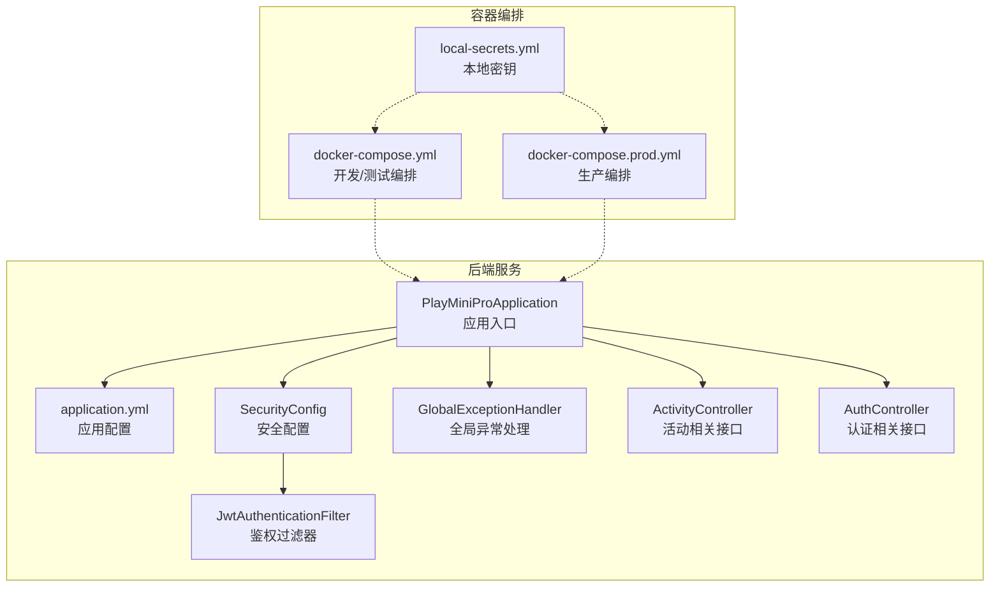
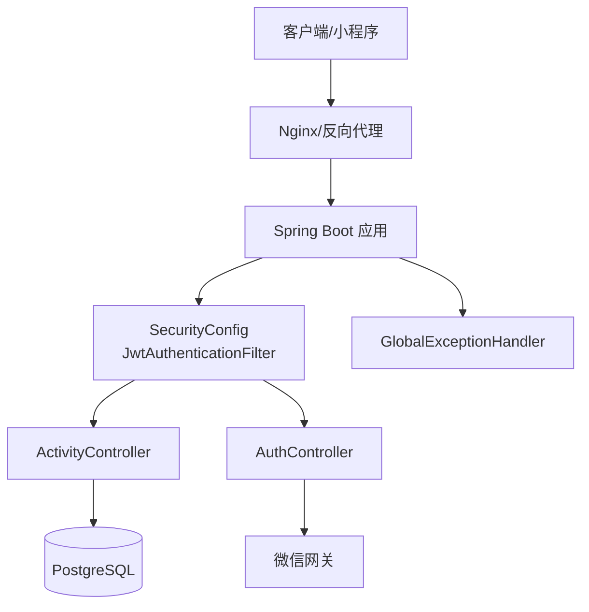
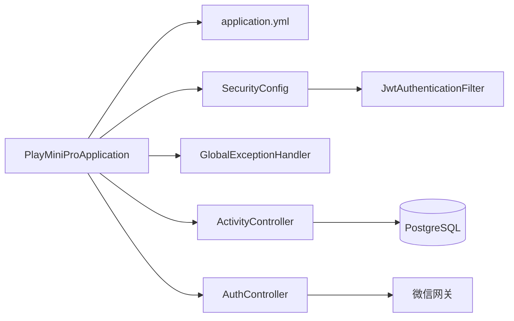

# 监控与日志

<cite>
**本文引用的文件**
- [application.yml](file://backend/src/main/resources/application.yml)
- [docker-compose.yml](file://backend/docker-compose.yml)
- [pom.xml](file://backend/pom.xml)
- [PlayMiniProApplication.java](file://backend/src/main/java/com/playminipro/PlayMiniProApplication.java)
- [GlobalExceptionHandler.java](file://backend/src/main/java/com/playminipro/common/exception/GlobalExceptionHandler.java)
- [SecurityConfig.java](file://backend/src/main/java/com/playminipro/common/config/SecurityConfig.java)
- [JwtAuthenticationFilter.java](file://backend/src/main/java/com/playminipro/common/security/JwtAuthenticationFilter.java)
- [ActivityController.java](file://backend/src/main/java/com/playminipro/activity/controller/ActivityController.java)
- [AuthController.java](file://backend/src/main/java/com/playminipro/auth/controller/AuthController.java)
- [docker-compose.prod.yml](file://deploy/docker-compose.prod.yml)
- [local-secrets.yml](file://backend/local-secrets.yml)
</cite>

## 目录
1. [简介](#简介)
2. [项目结构](#项目结构)
3. [核心组件](#核心组件)
4. [架构总览](#架构总览)
5. [详细组件分析](#详细组件分析)
6. [依赖分析](#依赖分析)
7. [性能考虑](#性能考虑)
8. [故障排查指南](#故障排查指南)
9. [结论](#结论)
10. [附录](#附录)

## 简介
本指南面向PlayMiniPro后端服务的监控与日志体系，目标是帮助运维与开发团队建立完善的可观测性能力，覆盖以下方面：
- 应用监控：Spring Boot Actuator端点、健康检查、指标收集与告警机制
- 日志系统：日志级别配置、日志格式标准化、日志轮转与集中化收集
- Prometheus与Grafana集成：指标采集、仪表板与告警联动
- 常见监控指标解读与异常处理流程
- 日志分析与故障排查方法论

当前仓库未内置Actuator、Prometheus、Grafana或集中式日志栈（如ELK/EFK）的具体配置。本指南在不改变现有实现的前提下，提供可落地的扩展方案与最佳实践。

## 项目结构
后端采用Spring Boot标准目录结构，核心配置位于resources目录下的application.yml；容器编排通过docker-compose.yml与生产环境compose文件进行管理；业务控制器分布在activity与auth包中，异常统一由全局处理器处理。

**图表来源**
- [PlayMiniProApplication.java](file://backend/src/main/java/com/playminipro/PlayMiniProApplication.java)
- [application.yml](file://backend/src/main/resources/application.yml)
- [SecurityConfig.java](file://backend/src/main/java/com/playminipro/common/config/SecurityConfig.java)
- [JwtAuthenticationFilter.java](file://backend/src/main/java/com/playminipro/common/security/JwtAuthenticationFilter.java)
- [GlobalExceptionHandler.java](file://backend/src/main/java/com/playminipro/common/exception/GlobalExceptionHandler.java)
- [ActivityController.java](file://backend/src/main/java/com/playminipro/activity/controller/ActivityController.java)
- [AuthController.java](file://backend/src/main/java/com/playminipro/auth/controller/AuthController.java)
- [docker-compose.yml](file://backend/docker-compose.yml)
- [docker-compose.prod.yml](file://deploy/docker-compose.prod.yml)
- [local-secrets.yml](file://backend/local-secrets.yml)

**章节来源**
- [PlayMiniProApplication.java](file://backend/src/main/java/com/playminipro/PlayMiniProApplication.java)
- [application.yml](file://backend/src/main/resources/application.yml)
- [docker-compose.yml](file://backend/docker-compose.yml)
- [docker-compose.prod.yml](file://deploy/docker-compose.prod.yml)
- [local-secrets.yml](file://backend/local-secrets.yml)

## 核心组件
- 应用入口与启动：负责加载配置、初始化上下文与组件扫描
- 安全与鉴权：基于JWT的过滤器链，拦截请求并校验令牌
- 全局异常处理：统一捕获业务异常与系统异常，输出标准化响应
- 控制器层：对外暴露REST接口，承载业务逻辑调用与数据传输对象封装
- 配置与编排：application.yml集中管理运行参数；docker-compose定义服务拓扑与环境变量

**章节来源**
- [PlayMiniProApplication.java](file://backend/src/main/java/com/playminipro/PlayMiniProApplication.java)
- [SecurityConfig.java](file://backend/src/main/java/com/playminipro/common/config/SecurityConfig.java)
- [JwtAuthenticationFilter.java](file://backend/src/main/java/com/playminipro/common/security/JwtAuthenticationFilter.java)
- [GlobalExceptionHandler.java](file://backend/src/main/java/com/playminipro/common/exception/GlobalExceptionHandler.java)
- [ActivityController.java](file://backend/src/main/java/com/playminipro/activity/controller/ActivityController.java)
- [AuthController.java](file://backend/src/main/java/com/playminipro/auth/controller/AuthController.java)

## 架构总览
下图展示从客户端到后端服务、再到数据库与外部微信网关的整体调用路径与监控关注点。

**图表来源**
- [ActivityController.java](file://backend/src/main/java/com/playminipro/activity/controller/ActivityController.java)
- [AuthController.java](file://backend/src/main/java/com/playminipro/auth/controller/AuthController.java)
- [SecurityConfig.java](file://backend/src/main/java/com/playminipro/common/config/SecurityConfig.java)
- [JwtAuthenticationFilter.java](file://backend/src/main/java/com/playminipro/common/security/JwtAuthenticationFilter.java)
- [GlobalExceptionHandler.java](file://backend/src/main/java/com/playminipro/common/exception/GlobalExceptionHandler.java)

## 详细组件分析

### Spring Boot Actuator与健康检查
- Actuator端点：建议启用health、info、metrics、env、loggers等端点，便于运行时诊断与自动化运维
- 健康检查：结合数据库连通性、外部依赖（如微信网关）可用性，定义自定义健康指示器
- 指标收集：默认暴露JVM、内存、线程、HTTP请求等指标，可扩展业务指标
- 安全与访问控制：限制敏感端点访问范围，仅允许内部或受信网络访问

实施要点
- 在配置文件中启用所需端点，并设置端点暴露策略
- 自定义健康指示器以覆盖数据库与外部服务的可用性
- 对外仅开放必要端口，避免泄露内部细节

**章节来源**
- [application.yml](file://backend/src/main/resources/application.yml)

### 指标与告警机制
- 指标类型：HTTP请求速率、延迟分位数、错误率、JVM堆与GC、数据库连接池状态、业务指标（如活动创建次数）
- 采集方式：Prometheus抓取Actuator暴露的/metrics端点
- 告警规则：基于阈值与趋势的规则，结合Grafana告警通道推送通知

实施要点
- 在Prometheus配置中添加job，指向应用的/metrics端点
- 设定合理的告警阈值与静默窗口，避免误报
- 将告警与运维平台（如钉钉、企业微信）集成

**章节来源**
- [application.yml](file://backend/src/main/resources/application.yml)

### 日志系统搭建
- 日志级别：按环境区分，开发/dev：DEBUG；测试/test：INFO；生产/prod：WARN及以上
- 日志格式：统一JSON格式，包含时间戳、级别、线程名、类名、消息与上下文字段
- 日志轮转：基于大小与时间的滚动策略，保留周期与压缩
- 集中式收集：通过Filebeat/Fluent Bit将日志发送至ELK/EFK或云日志服务

实施要点
- 在配置文件中设置root日志级别与输出位置
- 使用logback或log4j2的RollingFileAppender实现轮转
- 为容器场景配置stdout/stderr输出，配合Docker日志驱动

**章节来源**
- [application.yml](file://backend/src/main/resources/application.yml)

### Prometheus与Grafana集成
- Prometheus：配置job抓取/metrics端点，设置scrape_interval与超时
- Grafana：导入通用模板或自定义面板，展示请求QPS、P95/P99延迟、错误率、JVM指标
- 告警：在Prometheus Alertmanager中定义规则，触发Grafana告警通道

实施要点
- 在compose中新增prometheus与grafana服务
- 为关键业务接口设置SLI/SLO，驱动告警策略

**章节来源**
- [docker-compose.yml](file://backend/docker-compose.yml)
- [docker-compose.prod.yml](file://deploy/docker-compose.prod.yml)

### 异常处理与可观测性
- 全局异常处理：统一包装异常响应，记录关键上下文（用户ID、请求ID、参数摘要）
- 结合追踪：为每个请求生成traceId，贯穿日志与指标，便于问题定位
- 失败重试与降级：对下游依赖（如微信登录）设置超时与熔断策略

实施要点
- 在全局异常处理器中输出结构化日志
- 为关键路径埋点，统计失败原因分布

**章节来源**
- [GlobalExceptionHandler.java](file://backend/src/main/java/com/playminipro/common/exception/GlobalExceptionHandler.java)

### 安全与鉴权的可观测性
- JWT过滤器：记录认证成功/失败次数、耗时分布
- 接口保护：对敏感端点增加访问审计与限流

实施要点
- 统计认证失败事件，识别暴力破解或异常流量
- 对高频接口设置速率限制，防止滥用

**章节来源**
- [SecurityConfig.java](file://backend/src/main/java/com/playminipro/common/config/SecurityConfig.java)
- [JwtAuthenticationFilter.java](file://backend/src/main/java/com/playminipro/common/security/JwtAuthenticationFilter.java)

### 控制器层的可观测性
- 接口维度：统计各端点的QPS、错误率、P95/P99延迟
- 参数与业务维度：记录关键参数摘要（如活动ID、用户ID），避免泄露敏感信息

实施要点
- 在控制器层埋点或使用AOP切面统一采集
- 对外部调用（如微信登录）记录调用耗时与返回码

**章节来源**
- [ActivityController.java](file://backend/src/main/java/com/playminipro/activity/controller/ActivityController.java)
- [AuthController.java](file://backend/src/main/java/com/playminipro/auth/controller/AuthController.java)

## 依赖分析
后端服务主要依赖关系如下：

**图表来源**
- [PlayMiniProApplication.java](file://backend/src/main/java/com/playminipro/PlayMiniProApplication.java)
- [application.yml](file://backend/src/main/resources/application.yml)
- [SecurityConfig.java](file://backend/src/main/java/com/playminipro/common/config/SecurityConfig.java)
- [JwtAuthenticationFilter.java](file://backend/src/main/java/com/playminipro/common/security/JwtAuthenticationFilter.java)
- [GlobalExceptionHandler.java](file://backend/src/main/java/com/playminipro/common/exception/GlobalExceptionHandler.java)
- [ActivityController.java](file://backend/src/main/java/com/playminipro/activity/controller/ActivityController.java)
- [AuthController.java](file://backend/src/main/java/com/playminipro/auth/controller/AuthController.java)

**章节来源**
- [PlayMiniProApplication.java](file://backend/src/main/java/com/playminipro/PlayMiniProApplication.java)
- [application.yml](file://backend/src/main/resources/application.yml)

## 性能考虑
- 启动与冷启动：优化依赖注入与懒加载，减少启动时间
- 连接池：合理配置数据库连接池大小与超时，避免阻塞
- 缓存：对热点查询结果进行缓存，降低数据库压力
- GC与内存：监控堆使用与GC频率，调整JVM参数
- I/O与序列化：减少不必要的对象拷贝与大对象传输

[本节为通用指导，无需列出章节来源]

## 故障排查指南
- 快速定位
  - 查看应用日志：确认异常堆栈与关键上下文
  - 检查健康检查端点：确认数据库与外部依赖可用
  - 抓取指标：观察错误率、延迟与连接池使用率
- 常见问题
  - 认证失败：检查JWT签名、过期时间与白名单
  - 数据库不可用：核对连接串、网络策略与实例状态
  - 外部接口超时：评估限流与熔断策略
- 处理流程
  - 发现异常 -> 定位接口与时间段 -> 分析日志与指标 -> 回滚/修复 -> 验证恢复 -> 输出复盘报告

**章节来源**
- [GlobalExceptionHandler.java](file://backend/src/main/java/com/playminipro/common/exception/GlobalExceptionHandler.java)
- [application.yml](file://backend/src/main/resources/application.yml)

## 结论
通过在现有Spring Boot应用中引入Actuator、Prometheus与Grafana，并完善日志与异常处理体系，可以显著提升PlayMiniPro后端服务的可观测性与稳定性。建议优先完成以下工作：
- 在配置中启用Actuator端点与健康检查
- 新增Prometheus与Grafana服务，配置抓取与仪表板
- 规范日志格式与轮转策略，接入集中化日志收集
- 建立基于指标的告警规则与演练流程

[本节为总结性内容，无需列出章节来源]

## 附录
- 配置文件位置与用途
  - application.yml：应用运行参数、日志与Actuator配置
  - docker-compose.yml：开发/测试环境服务编排
  - docker-compose.prod.yml：生产环境服务编排
  - local-secrets.yml：本地密钥与敏感参数
- 参考实现文件路径
  - 应用入口：[PlayMiniProApplication.java](file://backend/src/main/java/com/playminipro/PlayMiniProApplication.java)
  - 安全配置：[SecurityConfig.java](file://backend/src/main/java/com/playminipro/common/config/SecurityConfig.java)
  - 鉴权过滤器：[JwtAuthenticationFilter.java](file://backend/src/main/java/com/playminipro/common/security/JwtAuthenticationFilter.java)
  - 全局异常处理：[GlobalExceptionHandler.java](file://backend/src/main/java/com/playminipro/common/exception/GlobalExceptionHandler.java)
  - 控制器示例：[ActivityController.java](file://backend/src/main/java/com/playminipro/activity/controller/ActivityController.java)，[AuthController.java](file://backend/src/main/java/com/playminipro/auth/controller/AuthController.java)

**章节来源**
- [application.yml](file://backend/src/main/resources/application.yml)
- [docker-compose.yml](file://backend/docker-compose.yml)
- [docker-compose.prod.yml](file://deploy/docker-compose.prod.yml)
- [local-secrets.yml](file://backend/local-secrets.yml)
- [PlayMiniProApplication.java](file://backend/src/main/java/com/playminipro/PlayMiniProApplication.java)
- [SecurityConfig.java](file://backend/src/main/java/com/playminipro/common/config/SecurityConfig.java)
- [JwtAuthenticationFilter.java](file://backend/src/main/java/com/playminipro/common/security/JwtAuthenticationFilter.java)
- [GlobalExceptionHandler.java](file://backend/src/main/java/com/playminipro/common/exception/GlobalExceptionHandler.java)
- [ActivityController.java](file://backend/src/main/java/com/playminipro/activity/controller/ActivityController.java)
- [AuthController.java](file://backend/src/main/java/com/playminipro/auth/controller/AuthController.java)