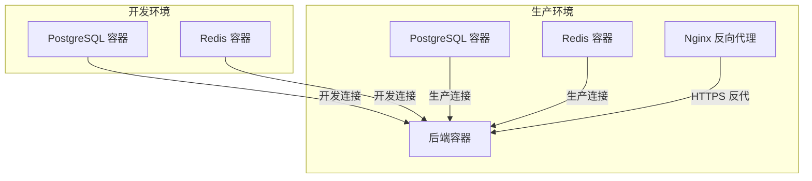
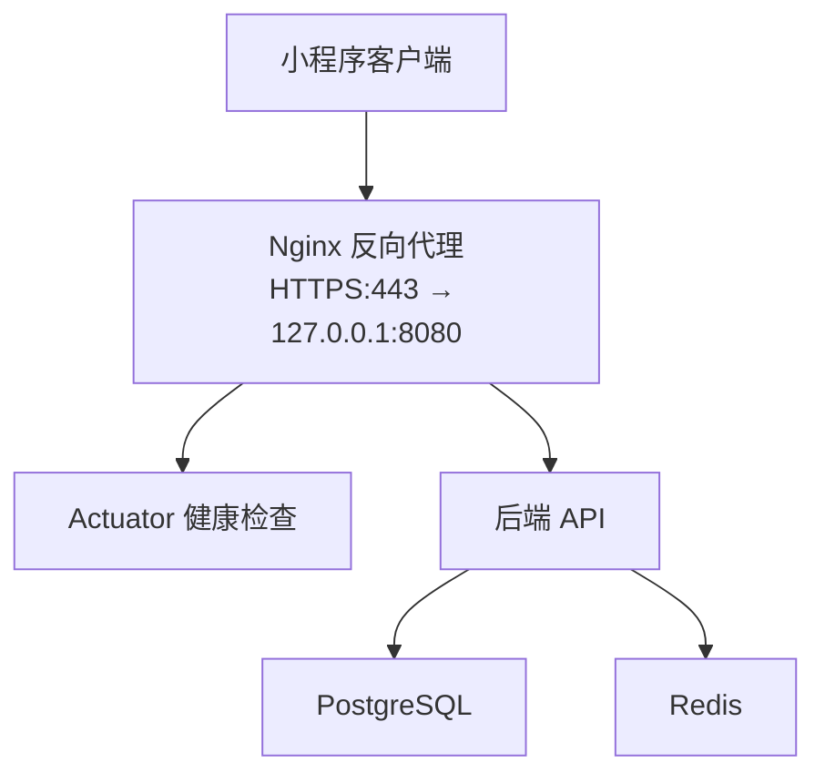
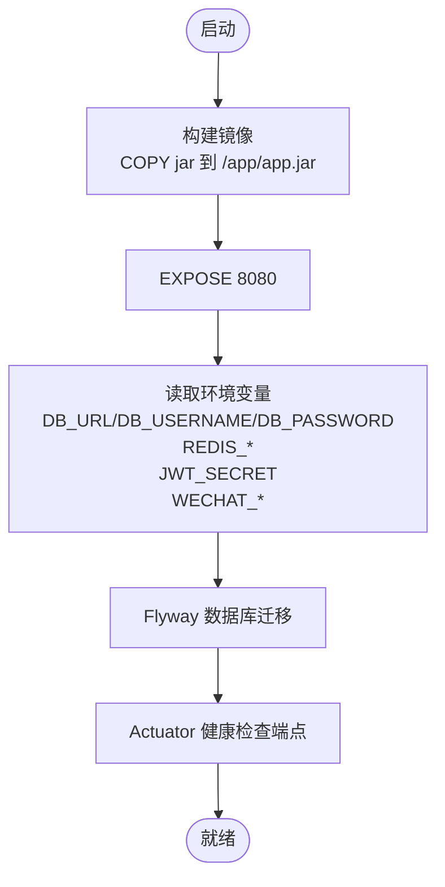
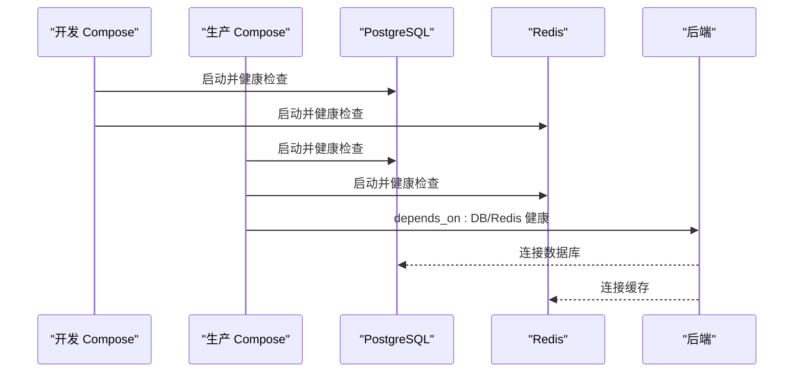
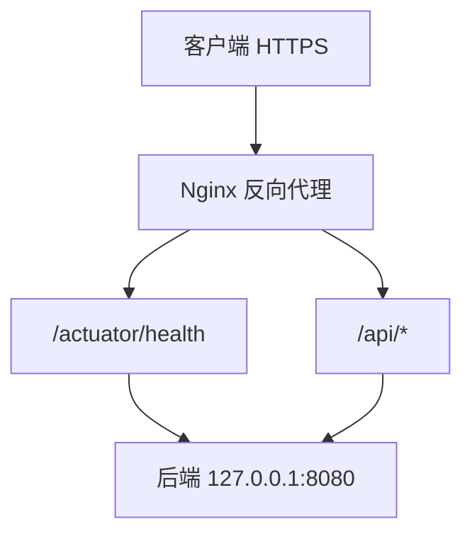
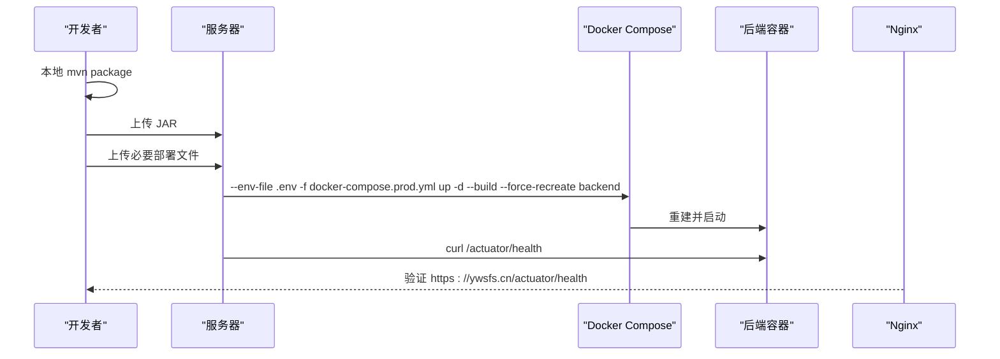
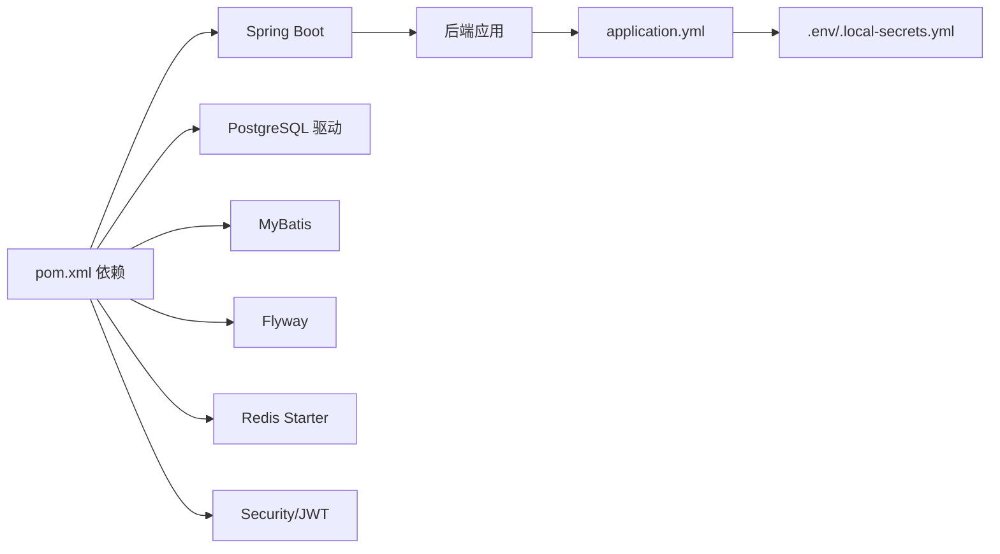

# 部署运维

<cite>
**本文引用的文件**
- [Dockerfile（后端）](file://backend/Dockerfile)
- [docker-compose.yml（开发）](file://backend/docker-compose.yml)
- [docker-compose.prod.yml（生产）](file://deploy/docker-compose.prod.yml)
- [docker-compose.prod.yml（打包包-生产）](file://deploy_bundle/deploy/docker-compose.prod.yml)
- [application.yml（后端配置）](file://backend/src/main/resources/application.yml)
- [application.yml（打包包-后端配置）](file://deploy_bundle/backend/src/main/resources/application.yml)
- [pom.xml（后端依赖）](file://backend/pom.xml)
- [pom.xml（打包包-后端依赖）](file://deploy_bundle/backend/pom.xml)
- [local-secrets.yml（本地密钥）](file://backend/local-secrets.yml)
- [local-secrets.yml（打包包-本地密钥）](file://deploy_bundle/backend/local-secrets.yml)
- [.gitignore（仓库级忽略）](file://.gitignore)
- [.gitignore（打包包-忽略）](file://deploy_bundle/.gitignore)
- [部署发布指南.md](file://doc/08-部署发布指南.md)
- [部署说明（deploy）](file://deploy/README.md)
- [部署说明（deploy_bundle）](file://deploy_bundle/deploy/README.md)
- [ywsfs.cn.csr（证书请求）](file://服务器资源/ywsfs.cn_nginx/ywsfs.cn.csr)
- [play-minipro-backend-deploy.tar.gz.b64（部署包证书）](file://play-minipro-backend-deploy.tar.gz.b64)
</cite>

## 目录
1. [简介](#简介)
2. [项目结构](#项目结构)
3. [核心组件](#核心组件)
4. [架构总览](#架构总览)
5. [详细组件分析](#详细组件分析)
6. [依赖关系分析](#依赖关系分析)
7. [性能考虑](#性能考虑)
8. [故障排查指南](#故障排查指南)
9. [结论](#结论)
10. [附录](#附录)

## 简介
本指南面向运维工程师，系统化说明 PlayMiniPro 项目的开发与生产环境部署、容器化与反向代理、SSL 证书管理、负载均衡、CI/CD 自动化、监控与日志、备份恢复与高可用、环境变量与密钥管理、安全加固、性能调优与扩展策略，并配套运维工具使用方法，确保生产环境稳定可靠。

## 项目结构
- 后端采用 Spring Boot + PostgreSQL + Redis 架构，通过 Docker Compose 编排。
- 开发环境使用本地 Compose 文件快速拉起数据库与缓存；生产环境使用独立的 Compose 文件与 .env 环境变量。
- 前端为微信小程序，通过 Nginx 反代访问后端 API 与 Actuator 接口。
- 仓库级忽略规则防止敏感产物与密钥被提交。

图表来源
- [docker-compose.yml（开发）:1-36](file://backend/docker-compose.yml#L1-L36)
- [docker-compose.prod.yml（生产）:1-61](file://deploy/docker-compose.prod.yml#L1-L61)

章节来源
- [docker-compose.yml（开发）:1-36](file://backend/docker-compose.yml#L1-L36)
- [docker-compose.prod.yml（生产）:1-61](file://deploy/docker-compose.prod.yml#L1-L61)
- [.gitignore（仓库级忽略）:1-2](file://.gitignore#L1-L2)

## 核心组件
- 后端服务
  - Spring Boot 应用，暴露 Actuator 健康检查端点，支持数据库迁移与 Redis 缓存。
  - 关键配置项：数据库连接、Redis 连接、JWT 密钥、微信小程序参数、日志级别。
- 数据库
  - PostgreSQL 16，Flyway 自动迁移，健康检查基于 pg_isready。
- 缓存
  - Redis 7 Alpine，启用 AOF 持久化，健康检查基于 redis-cli ping。
- 反向代理
  - Nginx 将 https://ywsfs.cn/api/* 与 /actuator/* 反代至后端 127.0.0.1:8080。
- 证书
  - 提供 ywsfs.cn 的 CSR 与部署包中的证书链，用于 HTTPS 终端加密。

章节来源
- [application.yml（后端配置）:1-53](file://backend/src/main/resources/application.yml#L1-L53)
- [docker-compose.yml（开发）:1-36](file://backend/docker-compose.yml#L1-L36)
- [docker-compose.prod.yml（生产）:1-61](file://deploy/docker-compose.prod.yml#L1-L61)
- [部署发布指南.md:16-19](file://doc/08-部署发布指南.md#L16-L19)
- [ywsfs.cn.csr（证书请求）:1-18](file://服务器资源/ywsfs.cn_nginx/ywsfs.cn.csr#L1-L18)
- [play-minipro-backend-deploy.tar.gz.b64（部署包证书）:1-354](file://play-minipro-backend-deploy.tar.gz.b64#L1-L354)

## 架构总览
后端通过 Docker Compose 在生产环境编排数据库与缓存，再由 Nginx 提供 HTTPS 访问入口。应用内部通过 Actuator 暴露健康检查，便于外部监控与负载均衡探活。

图表来源
- [部署发布指南.md:16-19](file://doc/08-部署发布指南.md#L16-L19)
- [docker-compose.prod.yml（生产）:32-57](file://deploy/docker-compose.prod.yml#L32-L57)

## 详细组件分析

### 后端容器化与配置
- 基础镜像与入口
  - 使用 Eclipse Temurin 21 JRE 运行时，工作目录 /app，暴露 8080 端口，入口为 java -jar /app/app.jar。
- 配置加载
  - 通过 application.yml 加载环境变量，支持本地密钥文件 local-secrets.yml 注入。
  - Actuator 暴露 health 与 info 端点，便于健康检查。
- 依赖与功能
  - Web、Security、Actuator、MyBatis、Flyway、PostgreSQL 驱动、Redis、JWT 等。

图表来源
- [Dockerfile（后端）:1-8](file://backend/Dockerfile#L1-L8)
- [application.yml（后端配置）:1-53](file://backend/src/main/resources/application.yml#L1-L53)
- [pom.xml（后端依赖）:26-92](file://backend/pom.xml#L26-L92)

章节来源
- [Dockerfile（后端）:1-8](file://backend/Dockerfile#L1-L8)
- [application.yml（后端配置）:1-53](file://backend/src/main/resources/application.yml#L1-L53)
- [pom.xml（后端依赖）:26-92](file://backend/pom.xml#L26-L92)

### 数据库与缓存编排
- 开发环境
  - PostgreSQL 映射本地 5433:5432，健康检查基于 pg_isready。
  - Redis 启用 AOF，映射 6379:6379，健康检查基于 redis-cli ping。
- 生产环境
  - 通过 docker-compose.prod.yml 统一编排，挂载卷持久化数据，健康检查同上。
  - 后端容器依赖数据库与缓存健康后再启动。

图表来源
- [docker-compose.yml（开发）:1-36](file://backend/docker-compose.yml#L1-L36)
- [docker-compose.prod.yml（生产）:32-57](file://deploy/docker-compose.prod.yml#L32-L57)

章节来源
- [docker-compose.yml（开发）:1-36](file://backend/docker-compose.yml#L1-L36)
- [docker-compose.prod.yml（生产）:1-61](file://deploy/docker-compose.prod.yml#L1-L61)

### 反向代理与 SSL 证书
- Nginx 配置
  - 将 https://ywsfs.cn/api/* 与 /actuator/* 反代至 127.0.0.1:8080。
- 证书
  - 提供 ywsfs.cn 的 CSR，部署包内包含证书链，用于 HTTPS 终端加密。

图表来源
- [部署发布指南.md:16-19](file://doc/08-部署发布指南.md#L16-L19)
- [ywsfs.cn.csr（证书请求）:1-18](file://服务器资源/ywsfs.cn_nginx/ywsfs.cn.csr#L1-L18)
- [play-minipro-backend-deploy.tar.gz.b64（部署包证书）:1-354](file://play-minipro-backend-deploy.tar.gz.b64#L1-L354)

章节来源
- [部署发布指南.md:16-19](file://doc/08-部署发布指南.md#L16-L19)
- [ywsfs.cn.csr（证书请求）:1-18](file://服务器资源/ywsfs.cn_nginx/ywsfs.cn.csr#L1-L18)
- [play-minipro-backend-deploy.tar.gz.b64（部署包证书）:1-354](file://play-minipro-backend-deploy.tar.gz.b64#L1-L354)

### CI/CD 与自动化部署
- 发布流程（后端）
  - 本地 mvn package 生成 JAR。
  - 上传 JAR 至服务器指定路径。
  - 服务器使用 docker compose 指定 .env 与生产 Compose 文件重建并重启后端容器。
  - 通过 curl 验证 /actuator/health。
- 发布流程（前端）
  - 使用微信开发者工具上传体验版/正式版，确保接口域名固定为 https://ywsfs.cn。
- 推荐顺序
  - 后端变更 → 本地打包 → 上传 JAR → 服务器重建后端 → 验证健康 → 前端变更 → 上传体验版 → 真机验证。

图表来源
- [部署发布指南.md:32-174](file://doc/08-部署发布指南.md#L32-L174)

章节来源
- [部署发布指南.md:32-174](file://doc/08-部署发布指南.md#L32-L174)

### 监控与日志
- 健康检查
  - Actuator 暴露 health 端点，Nginx 反代 /actuator/*，可直接通过 https://ywsfs.cn/actuator/health 检查后端健康。
- 日志
  - application.yml 中设置日志级别为 info，便于生产观察。
- 建议
  - 结合 Prometheus/Grafana 对后端指标采集与可视化，结合 Nginx 访问日志与数据库慢查询日志进行综合分析。

章节来源
- [application.yml（后端配置）:33-40](file://backend/src/main/resources/application.yml#L33-L40)
- [部署发布指南.md:150-158](file://doc/08-部署发布指南.md#L150-L158)

### 备份恢复与高可用
- 数据备份
  - PostgreSQL 与 Redis 使用卷持久化，定期导出数据库快照与备份 Redis dump 文件。
- 恢复策略
  - 快照恢复到新实例，重建后端容器并验证健康。
- 高可用
  - 前端通过 Nginx 单点接入，建议在 Nginx 层引入多实例与健康检查，实现后端层高可用。

章节来源
- [docker-compose.prod.yml（生产）:11-12](file://deploy/docker-compose.prod.yml#L11-L12)
- [docker-compose.prod.yml（生产）:24-25](file://deploy/docker-compose.prod.yml#L24-L25)

### 环境变量与密钥管理
- 关键变量（生产）
  - POSTGRES_DB、POSTGRES_USER、POSTGRES_PASSWORD、JWT_SECRET、WECHAT_MINI_APP_ID、WECHAT_MINI_APP_SECRET、WECHAT_MOCK_LOGIN_ENABLED 等。
- 本地密钥
  - local-secrets.yml 用于本地覆盖微信 AppSecret 与模拟登录开关。
- 安全建议
  - 不将 .env 与 local-secrets.yml 提交到仓库；使用 .gitignore 规避泄露。

章节来源
- [docker-compose.prod.yml（生产）:6-55](file://deploy/docker-compose.prod.yml#L6-L55)
- [application.yml（后端配置）:8-49](file://backend/src/main/resources/application.yml#L8-L49)
- [local-secrets.yml（本地密钥）:1-4](file://backend/local-secrets.yml#L1-L4)
- [.gitignore（仓库级忽略）:1-2](file://.gitignore#L1-L2)

### 性能调优与容量规划
- JVM 与应用
  - 使用较新的 JDK 21 运行时，合理设置 JVM 参数与线程池大小。
- 数据库
  - 合理设置连接池大小、索引与查询优化，开启慢查询日志。
- 缓存
  - 合理设置 Redis 内存上限与淘汰策略，避免 OOM。
- 扩展策略
  - 前端通过 Nginx 负载多后端实例；数据库与缓存可横向扩展或引入读写分离。

章节来源
- [pom.xml（后端依赖）:20-24](file://backend/pom.xml#L20-L24)

### 运维工具使用
- Docker Compose
  - 开发：使用 backend/docker-compose.yml 快速启动数据库与缓存。
  - 生产：使用 deploy/docker-compose.prod.yml 并配合 .env 环境变量。
- Kubernetes
  - 可将现有 Compose 编排转换为 Deployment/Service/ConfigMap/Secret 等资源，实现更细粒度的扩缩容与滚动升级。
- Prometheus/Grafana
  - 部署 Prometheus 抓取后端指标，Grafana 可视化；结合 Nginx 指标完善整体监控。

章节来源
- [docker-compose.yml（开发）:1-36](file://backend/docker-compose.yml#L1-L36)
- [docker-compose.prod.yml（生产）:1-61](file://deploy/docker-compose.prod.yml#L1-L61)
- [部署说明（deploy）:1-15](file://deploy/README.md#L1-L15)
- [部署说明（deploy_bundle）:1-15](file://deploy_bundle/deploy/README.md#L1-L15)

## 依赖关系分析
后端依赖 Spring Boot 生态与数据库/缓存中间件，通过 Compose 实现强耦合的一体化编排；生产环境通过 .env 注入敏感配置，避免硬编码。

图表来源
- [pom.xml（后端依赖）:26-92](file://backend/pom.xml#L26-L92)
- [application.yml（后端配置）:1-53](file://backend/src/main/resources/application.yml#L1-L53)

章节来源
- [pom.xml（后端依赖）:26-92](file://backend/pom.xml#L26-L92)
- [application.yml（后端配置）:1-53](file://backend/src/main/resources/application.yml#L1-L53)

## 性能考虑
- JVM 与线程池：根据并发与 GC 行为调整堆大小与 GC 参数。
- 数据库：建立必要索引、限制复杂查询、使用连接池上限。
- 缓存：合理设置过期策略与内存上限，避免热点 Key。
- 网络：Nginx 层限流与超时配置，后端设置合理的超时与重试策略。

## 故障排查指南
- 上传了新 JAR 但逻辑未更新
  - 未加 --build 导致镜像未重建，需重新执行带 --build 的 docker compose 命令。
- 登录失败
  - 检查小程序合法域名、后端 AppSecret、Mock 登录开关与前端接口域名。
- 健康检查正常但接口异常
  - 查看后端日志与数据库连接状态，确认 Redis 可用性。

章节来源
- [部署发布指南.md:261-289](file://doc/08-部署发布指南.md#L261-L289)

## 结论
通过 Docker Compose 实现开发与生产的统一编排，结合 Nginx 反代与 HTTPS 证书，形成从容器、网络到监控与日志的完整运维闭环。建议在现有基础上引入 Prometheus/Grafana、Kubernetes 资源编排与更完善的 CI/CD 流水线，持续提升稳定性与可扩展性。

## 附录
- 常用命令
  - 本地打包：在 backend 目录执行 mvn package。
  - 上传 JAR：使用 scp 指定私钥上传至服务器目标路径。
  - 登录服务器：使用 ssh 指定私钥登录。
  - 重建后端：在 deploy 目录执行 docker compose 指定 .env 与生产 Compose 文件并加 --build。
  - 健康检查：curl https://ywsfs.cn/actuator/health。

章节来源
- [部署发布指南.md:290-324](file://doc/08-部署发布指南.md#L290-L324)