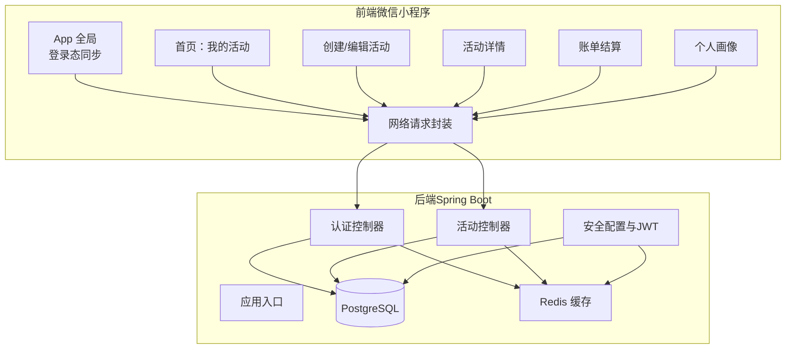
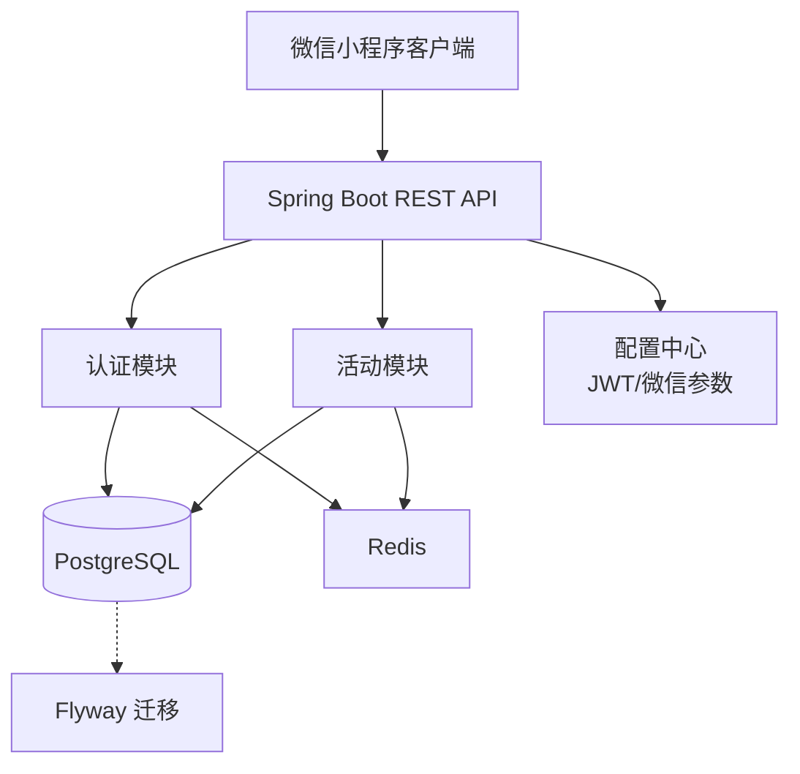
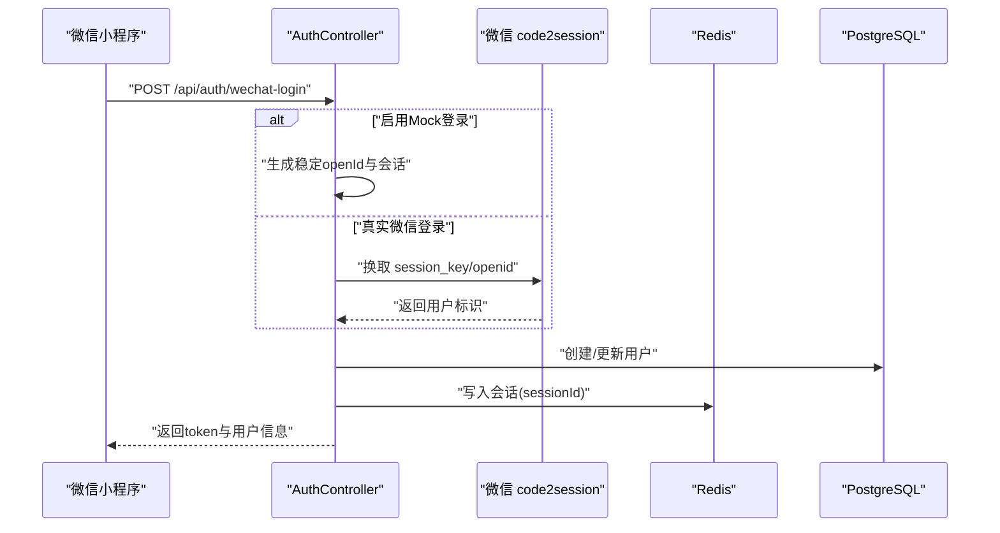
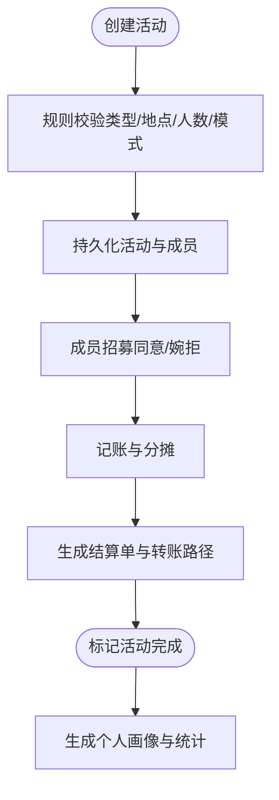
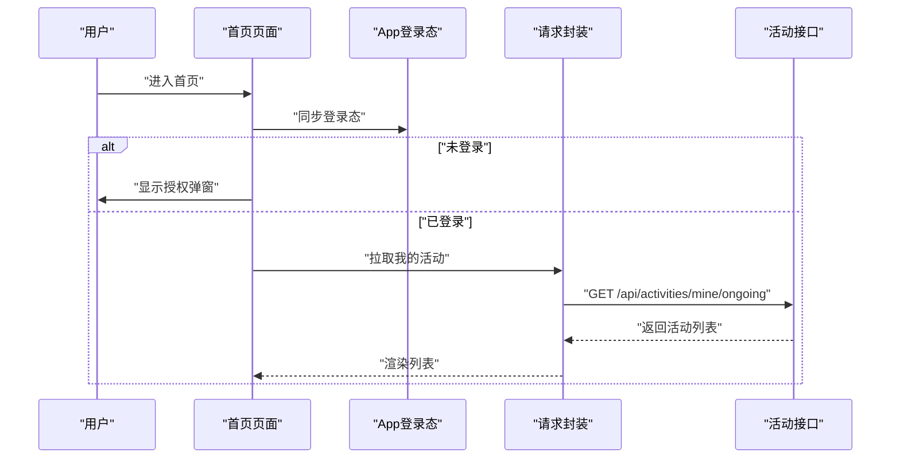
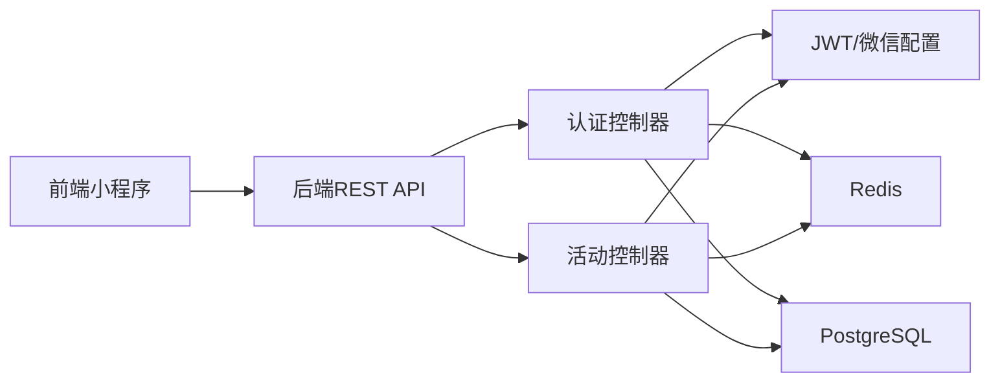

# 项目概述

<cite>
**本文引用的文件**
- [PlayMiniProApplication.java](file://backend/src/main/java/com/playminipro/PlayMiniProApplication.java)
- [application.yml](file://backend/src/main/resources/application.yml)
- [AuthController.java](file://backend/src/main/java/com/playminipro/auth/controller/AuthController.java)
- [ActivityController.java](file://backend/src/main/java/com/playminipro/activity/controller/ActivityController.java)
- [app.js](file://frontend/app.js)
- [app.json](file://frontend/app.json)
- [index.js（首页）](file://frontend/pages/home/index.js)
- [index.js（创建活动）](file://frontend/pages/create/index.js)
- [request.js](file://frontend/utils/request.js)
- [JwtProperties.java](file://backend/src/main/java/com/playminipro/common/config/JwtProperties.java)
- [WechatProperties.java](file://backend/src/main/java/com/playminipro/common/config/WechatProperties.java)
- [06-后端接口详细文档.md](file://doc/06-后端接口详细文档.md)
- [04-数据库设计文档.md](file://doc/04-数据库设计文档.md)
- [backend README.md](file://backend/README.md)
</cite>

## 目录
1. [简介](#简介)
2. [项目结构](#项目结构)
3. [核心组件](#核心组件)
4. [架构总览](#架构总览)
5. [详细组件分析](#详细组件分析)
6. [依赖分析](#依赖分析)
7. [性能考虑](#性能考虑)
8. [故障排查指南](#故障排查指南)
9. [结论](#结论)
10. [附录](#附录)

## 简介
PlayMiniPro 是一个面向微信小程序的“朋友组局”社交活动管理平台，旨在帮助用户轻松组织和参与各类线下/线上社交活动。平台围绕“活动创建—成员招募—费用结算—个人画像”的完整闭环展开，提供从活动发起、分享传播、成员回执、费用分摊与结算到个人社交画像的全链路体验。  
项目在微信小程序生态中定位为轻量、易用、可扩展的社交活动工具，通过简洁的交互与稳定的后端能力，降低朋友组局的沟通成本与执行成本。

## 项目结构
项目采用前后端分离架构，后端基于 Spring Boot，前端为原生微信小程序，数据库采用 PostgreSQL，缓存使用 Redis，迁移工具为 Flyway。  
- 后端模块划分清晰：认证模块、活动模块、公共配置与安全、异常处理、响应封装等。
- 前端页面覆盖首页、创建/编辑活动、活动详情、归档列表、账单结算、个人画像等核心场景。
- 文档体系完善，涵盖接口文档、数据库设计、部署指南等。

图表来源
- [app.js:1-46](file://frontend/app.js#L1-L46)
- [app.json:1-30](file://frontend/app.json#L1-L30)
- [index.js（首页）:1-219](file://frontend/pages/home/index.js#L1-L219)
- [index.js（创建活动）:1-370](file://frontend/pages/create/index.js#L1-L370)
- [request.js:1-107](file://frontend/utils/request.js#L1-L107)
- [PlayMiniProApplication.java:1-20](file://backend/src/main/java/com/playminipro/PlayMiniProApplication.java#L1-L20)
- [AuthController.java:1-27](file://backend/src/main/java/com/playminipro/auth/controller/AuthController.java#L1-L27)
- [ActivityController.java:1-112](file://backend/src/main/java/com/playminipro/activity/controller/ActivityController.java#L1-L112)
- [application.yml:1-53](file://backend/src/main/resources/application.yml#L1-L53)

章节来源
- [app.json:1-30](file://frontend/app.json#L1-L30)
- [application.yml:1-53](file://backend/src/main/resources/application.yml#L1-L53)

## 核心组件
- 应用入口与配置
  - 后端应用入口启用扫描 Mapper、定时任务与配置属性，集中管理 JWT 与微信小程序参数。
  - 前端 App 初始化全局数据，提供登录态同步与登出清理。
- 认证与会话
  - 提供微信一键登录接口，支持本地 Mock 登录与真实微信登录切换；登录成功后写入 Redis 并签发 JWT，接口访问时同时校验 JWT 与 Redis 会话。
- 活动管理
  - 支持创建、编辑、取消、详情、成员招募、费用汇总与记账、完成结算等全流程接口。
- 前端页面与交互
  - 首页展示我的进行中活动，支持静默登录、授权弹窗、跳转详情与创建。
  - 创建页提供活动类型、模式、费用模式、人数、时间地点等规则化表单，提交即创建并跳转详情。
  - 请求封装统一处理鉴权头、错误码与登录态失效提示。

章节来源
- [PlayMiniProApplication.java:1-20](file://backend/src/main/java/com/playminipro/PlayMiniProApplication.java#L1-L20)
- [app.js:1-46](file://frontend/app.js#L1-L46)
- [AuthController.java:1-27](file://backend/src/main/java/com/playminipro/auth/controller/AuthController.java#L1-L27)
- [ActivityController.java:1-112](file://backend/src/main/java/com/playminipro/activity/controller/ActivityController.java#L1-L112)
- [index.js（首页）:1-219](file://frontend/pages/home/index.js#L1-L219)
- [index.js（创建活动）:1-370](file://frontend/pages/create/index.js#L1-L370)
- [request.js:1-107](file://frontend/utils/request.js#L1-L107)

## 架构总览
系统采用“小程序前端 + Spring Boot 后端 + PostgreSQL + Redis + Flyway”的技术栈组合，强调：
- 易联调：后端提供 Mock 登录与健康检查，前端可直连本地或生产后端。
- 易扩展：模块化控制器与服务层，DTO/Entity/Mapper 分层清晰。
- 易运维：Flyway 自动迁移、配置集中化、日志与监控暴露。

图表来源
- [application.yml:1-53](file://backend/src/main/resources/application.yml#L1-L53)
- [06-后端接口详细文档.md:1-200](file://doc/06-后端接口详细文档.md#L1-L200)
- [backend README.md:1-91](file://backend/README.md#L1-L91)

## 详细组件分析

### 认证与登录流程
- 前端通过 wx.login 获取 code，调用后端登录接口，携带昵称与头像。
- 后端根据配置决定走 Mock 登录或真实微信 code2session 流程，创建/更新用户并签发业务 token。
- 登录成功后，后端将会话写入 Redis，并将 sessionId 写入 JWT；后续接口访问时同时校验 JWT 与 Redis 会话，支持自动续期。

图表来源
- [AuthController.java:1-27](file://backend/src/main/java/com/playminipro/auth/controller/AuthController.java#L1-L27)
- [backend README.md:53-80](file://backend/README.md#L53-L80)

章节来源
- [AuthController.java:1-27](file://backend/src/main/java/com/playminipro/auth/controller/AuthController.java#L1-L27)
- [backend README.md:53-80](file://backend/README.md#L53-L80)

### 活动生命周期与费用结算流程
- 活动创建：前端提交表单，后端校验规则（如类型强制线下、地点必填等），持久化活动与初始成员。
- 成员招募：活动详情页展示回执统计，成员可同意/婉拒，系统记录邀请事件与回执状态。
- 费用记账与结算：支持添加费用、分摊明细、生成结算单与最少转账路径，完成后标记活动结束。
- 个人画像：聚合用户创建/参与/AA/请客等维度，形成社交画像与排行榜快照。

图表来源
- [ActivityController.java:1-112](file://backend/src/main/java/com/playminipro/activity/controller/ActivityController.java#L1-L112)
- [06-后端接口详细文档.md:108-200](file://doc/06-后端接口详细文档.md#L108-L200)
- [04-数据库设计文档.md:415-537](file://doc/04-数据库设计文档.md#L415-L537)

章节来源
- [ActivityController.java:1-112](file://backend/src/main/java/com/playminipro/activity/controller/ActivityController.java#L1-L112)
- [06-后端接口详细文档.md:108-200](file://doc/06-后端接口详细文档.md#L108-L200)
- [04-数据库设计文档.md:415-537](file://doc/04-数据库设计文档.md#L415-L537)

### 前端页面与交互
- 首页：展示我的进行中活动，支持静默登录、授权弹窗、跳转详情与创建。
- 创建页：提供活动类型、模式、费用模式、人数、时间地点等规则化表单，提交即创建并跳转详情。
- 请求封装：统一封装请求、鉴权头、错误处理与登录态失效提示，支持本地/生产环境切换。

图表来源
- [index.js（首页）:1-219](file://frontend/pages/home/index.js#L1-L219)
- [request.js:1-107](file://frontend/utils/request.js#L1-L107)

章节来源
- [index.js（首页）:1-219](file://frontend/pages/home/index.js#L1-L219)
- [index.js（创建活动）:1-370](file://frontend/pages/create/index.js#L1-L370)
- [request.js:1-107](file://frontend/utils/request.js#L1-L107)

## 依赖分析
- 外部依赖
  - 数据库：PostgreSQL（Flyway 迁移）
  - 缓存：Redis（会话存储与登录态控制）
  - 安全：JWT + Spring Security（鉴权过滤器）
  - 微信：小程序登录（code2session）、Mock 登录开关
- 内部耦合
  - 控制器依赖服务层，服务层依赖 Mapper/Entity 与配置属性。
  - 前端通过统一请求封装与后端 API 对接，避免跨页面重复逻辑。

图表来源
- [JwtProperties.java:1-27](file://backend/src/main/java/com/playminipro/common/config/JwtProperties.java#L1-L27)
- [WechatProperties.java:1-37](file://backend/src/main/java/com/playminipro/common/config/WechatProperties.java#L1-L37)
- [application.yml:1-53](file://backend/src/main/resources/application.yml#L1-L53)

章节来源
- [JwtProperties.java:1-27](file://backend/src/main/java/com/playminipro/common/config/JwtProperties.java#L1-L27)
- [WechatProperties.java:1-37](file://backend/src/main/java/com/playminipro/common/config/WechatProperties.java#L1-L37)
- [application.yml:1-53](file://backend/src/main/resources/application.yml#L1-L53)

## 性能考虑
- 数据库层面
  - 使用 Flyway 管理迁移，保证数据库演进一致性。
  - 针对高频查询建立索引（如用户 open_id、活动时间、类型等），减少全表扫描。
- 缓存层面
  - 登录态使用 Redis 存储，结合 JWT 校验，支持主动控制登录有效性与自动续期。
- 接口层面
  - 统一响应结构与错误码，前端可快速识别鉴权失效并触发重登。
- 前端层面
  - 首页短轮询或按需刷新，避免频繁无意义请求；创建页规则化表单减少后端无效调用。

## 故障排查指南
- 登录态失效
  - 现象：接口返回 401/403。
  - 处理：前端清除本地 token 与用户信息，引导重新授权登录。
- 后端未启动
  - 现象：前端提示“后端没启动，先开服务”。
  - 处理：启动 PostgreSQL 与 Redis，再启动后端服务。
- 微信登录配置
  - 现象：真实登录失败或 Mock 登录影响联调。
  - 处理：配置微信 AppId/AppSecret，或调整 Mock 登录开关。

章节来源
- [request.js:82-95](file://frontend/utils/request.js#L82-L95)
- [backend README.md:53-80](file://backend/README.md#L53-L80)

## 结论
PlayMiniPro 以“活动—成员—费用—画像”为主线，构建了微信小程序端的社交活动管理闭环。后端采用 Spring Boot + PostgreSQL + Redis + Flyway 的成熟技术栈，前端以页面与工具函数解耦的方式实现高内聚低耦合。项目具备良好的扩展性与可运维性，适合在微信生态中快速迭代与推广。

## 附录
- 开发者使用场景
  - 快速联调：本地启动 PostgreSQL/Redis，后端启动后即可通过 Mock 登录对接前端。
  - 功能扩展：新增活动类型/费用类别/画像指标时，优先完善规则与 DTO，再扩展接口与前端表单。
- 用户使用场景
  - 发起活动：填写表单并创建，分享给好友，实时查看回执与成员动态。
  - 参与活动：收到邀请后同意/婉拒，参与记账与结算，查看个人社交画像。