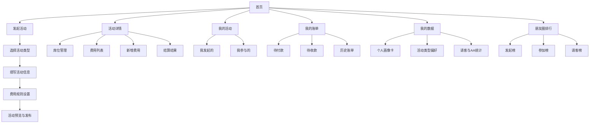

# 朋友组局微信小程序页面结构与页面文案

## 1. 文档目标

本文件用于补充产品设计文档中的两项关键输出：

1. 小程序完整页面结构图。
2. 各核心页面的文案与模块设计。

目标是让后续原型设计、UI 设计、前端开发能直接据此拆页面。

## 2. 页面结构总览

## 3. 全局导航设计

底部导航建议采用 4 个 Tab：

1. 首页
2. 发起
3. 我的活动
4. 我的账单

设计原则：

1. 首页负责查看近期活动和快捷入口。
2. 发起是核心动作，建议居中高亮。
3. 我的活动聚焦活动状态管理。
4. 我的账单承接费用与结算心智。

## 4. 页面列表与功能说明

### 4.1 首页

#### 页面目标

让用户快速进入高频操作，看到与自己相关的活动状态。

#### 模块结构

1. 顶部欢迎区。
2. 快速发起按钮。
3. 常用活动类型快捷入口。
4. 最近活动卡片。
5. 待开始活动。
6. 待结算账单提醒。
7. 推荐模板区。

#### 页面文案建议

顶部主标题：

一起把局组起来

副标题：

发活动、占座位、记费用、自动结算

快捷发起按钮：

1. 发起活动
2. 一键开个局

常用活动类型文案：

1. 游戏开黑
2. 聚餐
3. KTV
4. 露营
5. 烧烤
6. 自定义

活动卡片文案示例：

1. 今晚 8 点开黑，还差 2 人
2. 周六露营局，已满 5/5
3. 周五 KTV 局，待结算 268 元

空状态文案：

还没有活动，先组一个局吧

### 4.2 选择活动类型页

#### 页面目标

帮助用户快速找到最接近本次活动的类型，并触发系统自动判断逻辑。

#### 模块结构

1. 搜索框。
2. 热门活动类型。
3. 分类列表。
4. 自定义活动入口。

#### 页面文案建议

标题：

这次准备玩什么

搜索占位文案：

搜索活动类型，比如开黑、露营、聚餐

分组标题示例：

1. 热门局
2. 吃喝局
3. 户外局
4. 运动局
5. 娱乐局
6. 其他

自定义入口文案：

找不到合适的？自己定义一个活动

### 4.3 发起活动页

#### 页面目标

用尽量少的字段，完成一场活动的关键配置。

#### 模块结构

1. 活动基础信息。
2. 活动模式。
3. 人数设置。
4. 时间设置。
5. 地点设置。
6. 费用设置。
7. 发布按钮。

#### 页面文案建议

标题：

发起活动

字段文案建议：

1. 活动标题
   占位：给这场局起个名字
2. 活动简介
   占位：补充说明，比如带什么、怎么玩、注意事项
3. 活动模式
   选项：线上 / 线下
4. 目标人数
   占位：这次想约几个人
5. 人数上限
   占位：最多能来多少人
6. 开始时间
   占位：什么时候开始
7. 集合时间
   占位：几点集合，可不填
8. 集合地址
   占位：先在哪集合
9. 活动地址
   占位：最终活动地点在哪
10. 线上参与方式
   占位：平台、房间号、群号等
11. 是否涉及费用
   选项：不涉及 / 可能涉及 / 一定涉及
12. 费用模式
   选项：AA 制 / 我请客 / 指定某人请客

席位区文案：

1. 已占 3/5
2. 还差 2 人成局
3. 已满员，可候补

按钮文案：

1. 下一步
2. 预览活动
3. 发布活动

### 4.4 活动预览页

#### 页面目标

让发起人在发布前确认信息是否完整，减少发布后反复修改。

#### 模块结构

1. 活动信息总览。
2. 参与人数和席位展示。
3. 时间地点概览。
4. 费用规则概览。
5. 分享预览。

#### 页面文案建议

标题：

确认并发布

提示文案：

发出去之前，再看一眼信息是否准确

按钮文案：

1. 返回修改
2. 发布并邀请

### 4.5 活动详情页

#### 页面目标

这是核心页面，需要承载活动信息查看、加入占位、费用记录、结算入口。

#### 模块结构

1. 顶部活动信息卡。
2. 时间地点区。
3. 席位区。
4. 邀请反馈区。
5. 费用区。
6. 成员区。
7. 操作区。

#### 页面文案建议

状态标签：

1. 招募中
2. 已满员
3. 待开始
4. 进行中
5. 待结算
6. 已结清

人数文案：

1. 已加入 4/6
2. 还差 2 人
3. 候补 1 人

邀请反馈文案：

1. 已查看 9 人
2. 已同意 4 人
3. 已婉拒 2 人
4. 待回复 3 人
5. 2 人婉拒原因：时间不合适

时间文案：

1. 开始时间
2. 集合时间
3. 已改期，请留意最新时间

地址文案：

1. 集合地址
2. 活动地址
3. 去导航

费用区文案：

1. 当前已记录 3 笔费用
2. 总费用 650 元
3. 费用还在增加中，活动结束后自动结算

操作按钮：

1. 我要加入
2. 婉拒一下
3. 退出活动
4. 新增费用
5. 发起结算
6. 分享活动

### 4.5.1 婉拒弹窗

#### 页面目标

让用户可以低成本表达不参加，并让发起人获得有效反馈。

#### 模块结构

1. 快捷原因列表。
2. 自定义输入框。
3. 确认婉拒按钮。

#### 页面文案建议

标题：

这次先不入局

快捷原因：

1. 时间不合适
2. 地点太远
3. 对这个活动不感兴趣
4. 预算不方便
5. 临时有事
6. 下次一定

输入框占位：

也可以补充一句，让发起人更好安排

按钮文案：

1. 确认婉拒
2. 我再想想

### 4.6 费用列表页

#### 页面目标

集中查看活动中所有费用记录，并支持按类别、付款人筛选。

#### 模块结构

1. 费用汇总卡。
2. 分类筛选。
3. 费用明细列表。
4. 新增费用按钮。

#### 页面文案建议

标题：

活动费用

汇总文案：

1. 总费用
2. 我已垫付
3. 待确认费用

列表项文案示例：

1. 电竞酒店房费 500 元，A 支付
2. 烧烤食材 150 元，B 支付
3. 打车费 38 元，待确认

空状态文案：

还没有记录费用

### 4.7 新增费用页

#### 页面目标

支持成员或发起人快速补录一笔费用。

#### 模块结构

1. 费用名称。
2. 费用类型。
3. 金额。
4. 付款人。
5. 分摊对象。
6. 凭证上传。
7. 备注。
8. 提交按钮。

#### 页面文案建议

标题：

新增费用

字段文案：

1. 这笔钱花在了哪里
2. 选择费用类型
3. 金额
4. 这笔钱是谁付的
5. 这笔钱由谁分摊
6. 上传付款截图，可不传
7. 备注说明

按钮文案：

1. 保存费用
2. 提交并纳入结算

### 4.8 结算结果页

#### 页面目标

将系统计算出的收支结果明确、易懂地展示给每个用户。

#### 模块结构

1. 结算汇总区。
2. 每人应收应付列表。
3. 建议转账路径。
4. 已付款/已收款确认区。

#### 页面文案建议

标题：

本次结算结果

结算概览文案：

1. 活动总费用 650 元
2. 参与结算 4 人
3. 人均应承担 162.5 元

个人状态文案：

1. 你还需支付 162.5 元
2. 你应收回 337.5 元
3. 你已结清

转账建议文案：

1. 请转给 A 162.5 元
2. 请转给 B 12.5 元
3. 已完成转账？点这里确认

提示文案：

系统已按最少转账路径为你生成建议

### 4.9 我的活动页

#### 页面目标

帮助用户管理自己发起和参与的所有活动。

#### 模块结构

1. Tab 切换。
2. 活动卡片列表。
3. 状态筛选。

#### 页面文案建议

Tab 文案：

1. 我发起的
2. 我参与的
3. 进行中
4. 已结束
5. 待结算

活动卡片文案示例：

1. 周六露营局，待开始
2. 今晚开黑局，进行中
3. 周五聚餐，待结算

空状态文案：

你还没有相关活动

### 4.10 我的账单页

#### 页面目标

让用户集中查看自己在所有活动中的收支情况。

#### 模块结构

1. 总览卡片。
2. 待付款列表。
3. 待收款列表。
4. 历史账单列表。

#### 页面文案建议

标题：

我的账单

总览文案：

1. 待付款
2. 待收款
3. 本月已垫付

列表文案示例：

1. 周六露营局，还需支付 88 元
2. KTV 局，应收 120 元
3. 烧烤局，已结清

### 4.11 我的数据页

#### 页面目标

让用户直观看到自己在平台内的组局画像和社交行为统计。

#### 模块结构

1. 个人画像卡。
2. 发起与参与统计。
3. 活动类型偏好。
4. 请客与 AA 统计。
5. 金额统计。

#### 页面文案建议

标题：

我的数据

画像卡文案示例：

1. 你累计发起了 28 次局
2. 你累计参加了 43 次局
3. 你最常发起的是游戏开黑
4. 你请客了 6 次
5. 你参加过 19 次 AA 局

统计模块文案：

1. 发起次数
2. 参加次数
3. 请客次数
4. AA 次数
5. 线上局次数
6. 线下局次数
7. 累计垫付
8. 累计应收
9. 累计应付

### 4.12 朋友圈排行榜页

#### 页面目标

把熟人圈内的活动行为做成可查看、可分享的轻社交排行榜。

#### 模块结构

1. 榜单类型切换。
2. 时间范围切换。
3. 排行榜列表。
4. 我的当前排名。
5. 分享按钮。

#### 页面文案建议

标题：

朋友圈排行

榜单类型文案：

1. 发起王
2. 参加王
3. 请客王
4. AA 王
5. 开黑王
6. 聚会王

范围文案：

1. 近 30 天
2. 累计历史
3. 我的熟人圈

列表项文案示例：

1. 本月发起 12 次局
2. 累计请客 8 次
3. 最爱开黑，累计 15 次
4. 你当前排名第 3

空状态文案：

多参加几次局，这里就会有你的排名

## 5. 关键交互建议

### 5.1 发起流程交互原则

1. 默认只展示必要字段。
2. 选择活动类型后，动态展开相关字段。
3. 费用字段在选择涉及费用后再显示。
4. 地址字段仅在线下模式显示。

### 5.2 席位交互原则

1. 席位必须视觉上直观。
2. 头像空位应支持点击加入。
3. 已满后自动展示候补入口。

### 5.3 费用交互原则

1. 新增费用流程必须短。
2. 上传凭证不强制。
3. 分摊对象默认全员，可手动修改。

### 5.4 结算交互原则

1. 不展示复杂公式，直接展示结果。
2. 每个用户只看与自己有关的付款路径。
3. 所有明细可展开查看，增强信任感。

## 6. 页面优先级建议

### 6.1 MVP 必做页面

1. 首页
2. 选择活动类型页
3. 发起活动页
4. 活动预览页
5. 活动详情页
6. 费用列表页
7. 新增费用页
8. 结算结果页
9. 我的活动页
10. 我的账单页
11. 我的数据页
12. 朋友圈排行榜页

### 6.2 后续增强页面

1. 活动模板页
2. 候补管理页
3. 装备清单页
4. 投票页
5. 活动相册页

## 7. 文案风格建议

整体文案风格建议：

1. 口语化，但不轻浮。
2. 简洁直接，突出行动引导。
3. 费用和结算文案必须严谨、明确。
4. 活动发起场景可稍有社交氛围感。

推荐风格示例：

1. 发起活动：这次准备玩什么
2. 人数提醒：还差 2 人就成局
3. 费用提醒：活动中产生的费用可以随时补记
4. 结算提示：系统已为你算好每个人该付多少

不推荐风格：

1. 文案过于官方。
2. 账单描述模糊。
3. 按钮行为不明确。