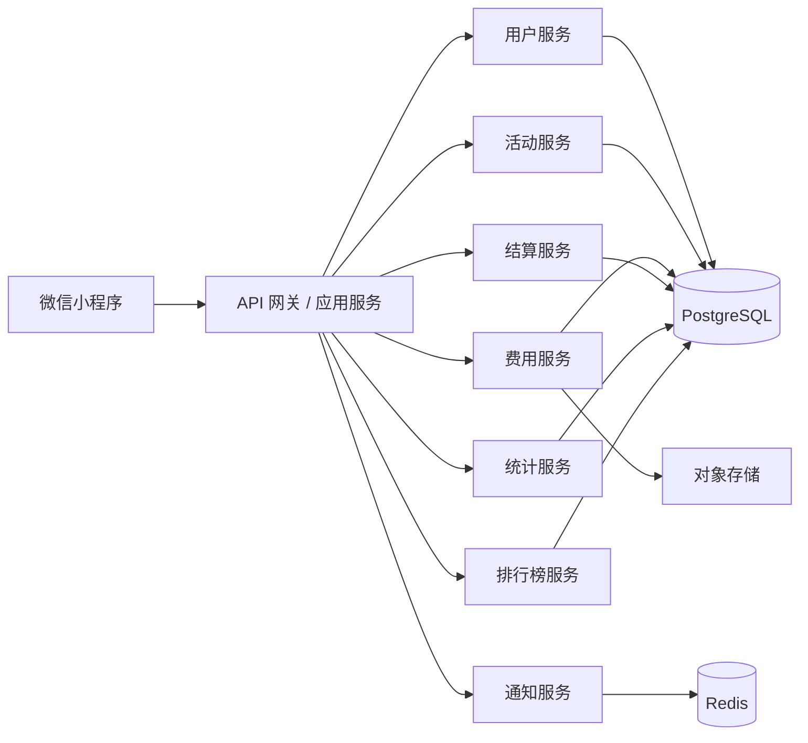

# 朋友组局微信小程序技术实现文档

## 1. 文档目标

本文件用于指导该微信小程序的技术落地，覆盖以下内容：

1. 技术架构建议。
2. 前端页面拆分。
3. 数据模型设计。
4. 核心业务流程。
5. 结算算法设计。
6. 开发优先级。

本文档面向产品、前端、后端三个角色协同使用。

## 2. 推荐技术方案

### 2.1 客户端

建议方案：

1. 微信原生小程序。
2. TypeScript。
3. 基于小程序原生组件开发页面。
4. 状态管理可采用页面局部状态 + 全局用户态。

如果希望后续同时兼容 H5，可考虑 Taro 或 uni-app，但如果目标明确是微信小程序首发，首版更建议原生小程序，开发链路更短。

### 2.2 服务端

建议采用标准前后端分离服务：

1. Java 21 + Spring Boot 3。
2. PostgreSQL。
3. Redis 用于缓存与临时状态。
4. 对象存储用于上传凭证截图。
5. 部署在已备案自有服务器，使用正式域名和 HTTPS。

若要快速 MVP，也可使用微信云开发，但考虑到后续有复杂结算、消息通知、权限控制，独立后端会更稳。数据库建议优先采用 PostgreSQL；Java 侧建议使用 Spring Boot 搭配 MyBatis 或 JPA，并使用 Flyway 管理数据库版本。

推荐后端组件：

1. Spring Web：提供 REST API。
2. Spring Validation：参数校验。
3. Spring Security + JWT：登录鉴权。
4. MyBatis 或 MyBatis-Plus：数据访问。
5. Flyway：数据库迁移管理。
6. Spring Data Redis：缓存和短期状态。
7. Spring Scheduler：统计刷新、排行榜快照等定时任务。
8. WebSocket，可选：实时通知和实时回执增强。

### 2.3 基础能力

1. 微信一键登录鉴权。
2. 订阅消息通知。
3. 地图地址选择与导航。
4. 图片上传。
5. 分享卡片。
6. 用户统计聚合。
7. 熟人圈排行榜计算。

## 3. 系统架构建议



说明：

1. 用户服务负责登录、资料、关系身份。
2. 活动服务负责活动创建、成员管理、状态流转。
3. 费用服务负责费用记录、审核、修改。
4. 结算服务负责结算计算与转账建议。
5. 通知服务负责订阅消息和站内消息。
6. 统计服务负责用户行为聚合与画像指标计算。
7. 排行榜服务负责按关系圈和时间范围生成榜单。

Java 分层建议：

1. Controller 层：承接 HTTP 请求。
2. Service 层：承接核心业务逻辑和事务控制。
3. Mapper/Repository 层：承接 PostgreSQL 访问。
4. Domain/DTO 层：承接请求对象、响应对象和领域模型。
5. Job 层：承接排行榜快照、统计聚合、清理任务。

## 4. 前端页面拆分

### 4.1 页面清单

建议前端页面如下：

1. pages/home/index
2. pages/create/category
3. pages/create/form
4. pages/create/preview
5. pages/activity/detail
6. pages/activity/members
7. pages/expense/list
8. pages/expense/create
9. pages/settlement/result
10. pages/my/activities
11. pages/my/bills
12. pages/my/stats
13. pages/ranking/index

### 4.2 页面职责

#### 首页

1. 拉取最近活动。
2. 拉取待开始与待结算摘要。
3. 展示快捷发起入口。

#### 发起活动流程页

1. 选择活动类型。
2. 根据类型动态展示表单。
3. 生成发布预览。

#### 活动详情页

1. 展示活动完整信息。
2. 支持加入、退出、分享。
3. 支持查看席位、邀请反馈、费用、结算状态。

#### 费用页

1. 展示费用列表。
2. 支持新增、编辑、删除费用。
3. 支持按状态或类型筛选。

#### 结算页

1. 展示总费用与参与结算人数。
2. 展示个人应收应付。
3. 展示建议转账路径。
4. 支持确认已付款/已收款。

#### 我的数据页

1. 拉取用户累计统计信息。
2. 展示发起、参与、请客、AA、金额等指标。
3. 展示活动类型偏好与画像标签。

#### 排行榜页

1. 拉取熟人圈排行数据。
2. 支持榜单类型和时间范围切换。
3. 展示用户当前排名与可分享结果。

## 5. 核心数据模型

### 5.1 users 用户表

字段建议：

1. id
2. open_id
3. union_id
4. nickname
5. avatar_url
6. gender
7. city
8. created_at
9. updated_at

说明：

1. open_id 用于微信小程序用户唯一识别。
2. union_id 在同主体多应用打通时更有价值。
3. 登录流程应基于微信 code 换取 open_id/session_key。

### 5.2 activities 活动表

字段建议：

1. id
2. creator_id
3. type_code
4. type_name
5. title
6. description
7. mode
8. status
9. target_participant_count
10. max_participant_count
11. start_time
12. end_time
13. meetup_time
14. meetup_address
15. meetup_latitude
16. meetup_longitude
17. venue_address
18. venue_latitude
19. venue_longitude
20. online_join_info
21. expense_mode
22. expense_flag
23. allow_member_add_expense
24. settlement_status
25. created_at
26. updated_at

说明：

1. 活动表只存活动主体信息。
2. 分享、查看、同意、婉拒等行为不建议直接塞进活动表。

### 5.3 activity_members 活动成员表

字段建议：

1. id
2. activity_id
3. user_id
4. role
5. join_status
6. seat_index
7. is_waiting_list
8. is_settlement_participant
9. joined_at
10. quit_at
11. created_at
12. updated_at

说明：

1. role 区分发起人、普通成员。
2. join_status 区分已加入、已退出、候补。
3. seat_index 用于席位排序。
4. 该表只记录真正入局的成员，不适合混放已查看或已婉拒状态。

### 5.3.1 invitation_links 分享邀请链接表

用于记录活动生成过哪些分享入口。

字段建议：

1. id
2. activity_id
3. created_by
4. share_channel
5. share_scene
6. share_token
7. expire_at
8. created_at

### 5.3.2 activity_invites 活动邀请表

这是邀请域主表，用来承载谁被邀请以及当前回执状态。

字段建议：

1. id
2. activity_id
3. invitation_link_id
4. inviter_user_id
5. invitee_user_id
6. source_type
7. current_status
8. first_viewed_at
9. responded_at
10. joined_at
11. declined_at
12. latest_decline_reason_code
13. latest_decline_reason_text
14. created_at
15. updated_at

说明：

1. current_status 建议枚举为 invited、viewed、accepted、declined、expired。
2. 一个人对同一活动原则上只保留一条主邀请记录，状态可更新。

### 5.3.3 invite_events 邀请事件流水表

为了支持行为审计、实时看板和状态回溯，建议把每一次动作都记录成事件流。

字段建议：

1. id
2. activity_id
3. invite_id
4. user_id
5. event_type
6. event_value
7. reason_code
8. reason_text
9. client_ip
10. user_agent
11. created_at

### 5.3.4 activity_view_logs 活动浏览记录表

用于记录哪些人点了进来。

字段建议：

1. id
2. activity_id
3. invitation_link_id
4. user_id
5. anonymous_open_id
6. viewed_at
7. source_type
8. created_at

### 5.3.5 activity_rsvp_stats 活动回执统计表

为了支持发起人实时查看数据，建议对活动回执状态做冗余聚合。

字段建议：

1. activity_id
2. invited_count
3. viewed_count
4. accepted_count
5. declined_count
6. pending_count
7. updated_at

### 5.4 expenses 费用表

字段建议：

1. id
2. activity_id
3. payer_user_id
4. category_code
5. name
6. amount
7. remark
8. receipt_urls
9. status
10. included_in_settlement
11. paid_at
12. created_by
13. created_at
14. updated_at

### 5.5 expense_shares 费用分摊表

每笔费用和哪些成员分摊，需要单独建表：

1. id
2. expense_id
3. user_id
4. share_amount
5. created_at

说明：

1. 当一笔费用默认全员分摊时，也建议落明细，避免结算时动态计算不一致。
2. 这样便于后续支持部分 AA 和特殊分摊规则。

### 5.6 settlements 结算单表

字段建议：

1. id
2. activity_id
3. initiated_by
4. total_amount
5. participant_count
6. status
7. created_at
8. updated_at

### 5.7 settlement_items 结算结果表

记录每个成员的结算结果：

1. id
2. settlement_id
3. user_id
4. paid_amount
5. should_bear_amount
6. net_amount
7. role_type
8. created_at

说明：

1. net_amount 大于 0 表示应付。
2. net_amount 小于 0 表示应收。
3. role_type 可标记 payer 或 receiver，便于页面展示。

### 5.8 settlement_transfers 转账建议表

字段建议：

1. id
2. settlement_id
3. from_user_id
4. to_user_id
5. amount
6. transfer_status
7. confirmed_at
8. created_at

### 5.9 user_stats 用户统计表

建议对高频查询的统计结果做冗余沉淀，而不是每次实时聚合。

字段建议：

1. id
2. user_id
3. total_created_count
4. total_joined_count
5. total_host_treat_count
6. total_aa_count
7. total_online_count
8. total_offline_count
9. total_paid_amount
10. total_receive_amount
11. total_pay_amount
12. top_created_activity_type
13. top_joined_activity_type
14. last_calculated_at
15. created_at
16. updated_at

### 5.10 user_type_stats 用户活动类型统计表

用于支撑“最常发起什么局”“最常参加什么局”等画像。

字段建议：

1. id
2. user_id
3. activity_type_code
4. created_count
5. joined_count
6. created_at
7. updated_at

### 5.11 user_relations 用户熟人关系表

排行榜要限制在熟人圈，建议维护一张轻关系表。

字段建议：

1. id
2. user_id
3. related_user_id
4. co_activity_count
5. last_activity_at
6. created_at
7. updated_at

说明：

1. 两个用户共同参与过活动即可累计 co_activity_count。
2. 可按 co_activity_count 设置是否进入熟人圈。

### 5.12 ranking_snapshots 排行榜快照表

若后续榜单访问频繁，建议预计算并缓存快照。

字段建议：

1. id
2. owner_user_id
3. ranking_type
4. time_range_type
5. ranked_user_id
6. score_value
7. rank_no
8. snapshot_date
9. created_at

## 6. 关键枚举设计

### 6.1 活动模式 mode

1. offline
2. online

### 6.2 活动状态 status

1. draft
2. recruiting
3. full
4. pending_start
5. in_progress
6. finished
7. pending_settlement
8. settled
9. cancelled

### 6.2.1 邀请状态 invite.current_status

1. invited
2. viewed
3. accepted
4. declined
5. expired

### 6.2.2 邀请事件类型 invite_events.event_type

1. viewed
2. accepted
3. declined
4. reopened
5. joined
6. quit

### 6.2.3 婉拒原因 decline_reason_code

1. time_conflict
2. too_far
3. budget_issue
4. not_interested
5. temporary_busy
6. too_many_people
7. next_time
8. custom

### 6.3 费用模式 expense_mode

1. none
2. aa
3. host_treat
4. designated_treat

### 6.4 费用状态 expense.status

1. pending
2. confirmed
3. rejected
4. deleted

### 6.5 转账状态 transfer_status

1. pending
2. paid
3. received
4. completed

### 6.6 排行榜类型 ranking_type

1. created_count
2. joined_count
3. host_treat_count
4. aa_count
5. gaming_count
6. offline_party_count

### 6.7 时间范围 time_range_type

1. last_30_days
2. all_time

## 7. 核心接口设计

### 7.1 用户相关

1. POST /api/auth/wechat-login
2. GET /api/users/me
3. PUT /api/users/me
4. GET /api/users/me/stats

说明：

1. POST /api/auth/wechat-login 接收小程序 wx.login 返回的 code。
2. 服务端调用微信接口换取 open_id、session_key，并建立业务登录态。

### 7.2 活动相关

1. POST /api/activities
2. GET /api/activities
3. GET /api/activities/:id
4. PUT /api/activities/:id
5. POST /api/activities/:id/join
6. POST /api/activities/:id/quit
7. POST /api/activities/:id/finish
8. POST /api/activities/:id/cancel
9. POST /api/activities/:id/share-links
10. GET /api/activities/:id/rsvp-stats
11. GET /api/activities/:id/invite-feedback

### 7.3 成员相关

1. GET /api/activities/:id/members
2. PUT /api/activities/:id/members/:memberId

### 7.3.1 邀请与回执相关

1. POST /api/activities/:id/view
2. POST /api/activities/:id/rsvp/accept
3. POST /api/activities/:id/rsvp/decline
4. POST /api/activities/:id/rsvp/reopen

说明：

1. /view 用于记录点进来行为。
2. /rsvp/decline 需支持 reason_code 和 reason_text。

### 7.4 费用相关

1. POST /api/activities/:id/expenses
2. GET /api/activities/:id/expenses
3. PUT /api/expenses/:expenseId
4. DELETE /api/expenses/:expenseId
5. POST /api/expenses/:expenseId/confirm
6. POST /api/expenses/:expenseId/reject

### 7.5 结算相关

1. POST /api/activities/:id/settlements
2. GET /api/activities/:id/settlements/latest
3. POST /api/settlements/:id/transfers/:transferId/pay
4. POST /api/settlements/:id/transfers/:transferId/receive

### 7.6 统计与排行榜相关

1. GET /api/users/me/stats/summary
2. GET /api/users/me/stats/activity-types
3. GET /api/rankings?type=created_count&range=last_30_days
4. GET /api/rankings/me?type=created_count&range=all_time

## 8. 核心业务流程设计

### 8.1 发起活动流程

1. 用户选择活动类型。
2. 服务端返回活动预设属性。
3. 前端根据预设动态展示表单。
4. 用户提交活动配置。
5. 服务端创建活动、初始化席位信息、生成默认状态。
6. 返回活动详情页。

### 8.2 参与活动流程

1. 用户通过分享卡片进入详情。
2. 服务端先记录浏览事件与查看状态。
3. 服务端判断活动状态、人数、权限。
4. 若用户点击同意入局，则更新邀请状态为 accepted。
5. 若可加入，则写入成员记录。
6. 若已满员且支持候补，则进入候补状态。
7. 若用户点击婉拒，则更新邀请状态并记录原因。
8. 同步更新发起人和参与人的统计聚合。

### 8.2.1 群分享与回执流程

1. 发起人发布活动后点击分享。
2. 系统生成 share_link 或 share_token。
3. 发起人转发到微信群或好友聊天。
4. 其他用户点击卡片进入活动页。
5. 系统记录 view 事件。
6. 用户可选择同意入局或婉拒。
7. 发起人活动详情页实时展示查看数、同意数、婉拒数和原因汇总。

### 8.3 记录费用流程

1. 成员提交费用名称、金额、付款人、分摊对象等字段。
2. 服务端校验提交人是否有权限。
3. 落库 expenses 与 expense_shares。
4. 若活动开启审核，费用状态为 pending。
5. 若无需审核，费用状态为 confirmed。
6. 若费用模式为请客或 AA，对应统计字段进入待刷新队列。

### 8.4 发起结算流程

1. 发起人确认活动结束。
2. 发起人勾选最终参与结算成员。
3. 系统读取已确认且纳入结算的费用。
4. 系统执行结算计算。
5. 生成 settlement、settlement_items、settlement_transfers。
6. 返回结算结果页。
7. 异步刷新用户统计与排行榜快照。

### 8.5 微信一键登录流程

1. 小程序调用 wx.login 获取临时 code。
2. 前端将 code 传给服务端接口。
3. 服务端请求微信 code2Session 接口。
4. 服务端拿到 open_id、session_key 后查询或创建用户。
5. 服务端生成业务 token 或 session 返回前端。
6. 前端持久化登录态，后续请求统一携带。

说明：

1. 排行榜、我的数据、发起活动、参与活动都依赖登录态。
2. 未登录只允许查看有限公开内容。

## 9. AA 结算算法设计

### 9.1 输入数据

算法输入应包括：

1. 结算成员列表。
2. 每笔已确认费用。
3. 每笔费用的付款人。
4. 每笔费用的分摊对象范围。

### 9.2 计算步骤

第一步，初始化每个成员：

1. paidAmount = 0
2. shouldBearAmount = 0

第二步，遍历费用列表：

1. 将该笔费用累加到付款人的 paidAmount。
2. 计算该费用在分摊对象中的平均值。
3. 将平均值累加到每个分摊成员的 shouldBearAmount。

第三步，计算净额：

$$
netAmount = shouldBearAmount - paidAmount
$$

第四步，拆分两组：

1. 应付组：netAmount > 0
2. 应收组：netAmount < 0

第五步，生成最少转账路径：

1. 将应收组按绝对值从大到小排序。
2. 将应付组按金额从大到小排序。
3. 双指针依次撮合。
4. 每撮合一笔，生成一条 transfer。
5. 直到所有金额归零。

### 9.3 伪代码示例

```ts
type Expense = {
  amount: number;
  payerUserId: string;
  shareUserIds: string[];
};

type MemberSettle = {
  userId: string;
  paidAmount: number;
  shouldBearAmount: number;
  netAmount: number;
};

function calculateSettlement(memberIds: string[], expenses: Expense[]) {
  const map = new Map<string, MemberSettle>();

  for (const userId of memberIds) {
    map.set(userId, {
      userId,
      paidAmount: 0,
      shouldBearAmount: 0,
      netAmount: 0,
    });
  }

  for (const expense of expenses) {
    const payer = map.get(expense.payerUserId);
    if (payer) payer.paidAmount += expense.amount;

    const avg = expense.amount / expense.shareUserIds.length;
    for (const userId of expense.shareUserIds) {
      const item = map.get(userId);
      if (item) item.shouldBearAmount += avg;
    }
  }

  for (const item of map.values()) {
    item.netAmount = Number((item.shouldBearAmount - item.paidAmount).toFixed(2));
  }

  const payers = [...map.values()]
    .filter((item) => item.netAmount > 0)
    .sort((a, b) => b.netAmount - a.netAmount);

  const receivers = [...map.values()]
    .filter((item) => item.netAmount < 0)
    .map((item) => ({ ...item, receiveAmount: Math.abs(item.netAmount) }))
    .sort((a, b) => b.receiveAmount - a.receiveAmount);

  const transfers = [];
  let i = 0;
  let j = 0;

  while (i < payers.length && j < receivers.length) {
    const payItem = payers[i];
    const receiveItem = receivers[j];
    const amount = Math.min(payItem.netAmount, receiveItem.receiveAmount);

    transfers.push({
      fromUserId: payItem.userId,
      toUserId: receiveItem.userId,
      amount: Number(amount.toFixed(2)),
    });

    payItem.netAmount = Number((payItem.netAmount - amount).toFixed(2));
    receiveItem.receiveAmount = Number((receiveItem.receiveAmount - amount).toFixed(2));

    if (payItem.netAmount === 0) i++;
    if (receiveItem.receiveAmount === 0) j++;
  }

  return {
    members: [...map.values()],
    transfers,
  };
}
```

### 9.4 特殊处理建议

1. 如果分摊对象数量为 0，费用不得进入结算。
2. 如果付款人不在结算成员中，需要先提示纠正或自动纳入结算。
3. 尾差统一在最后一条 transfer 中补差。
4. 所有金额统一按分存储，避免浮点误差。

## 10. 权限与校验设计

### 10.1 活动权限

1. 只有发起人可编辑活动核心信息。
2. 只有发起人可结束活动或发起结算。
3. 只有活动成员可新增费用。
4. 未参与成员不可查看完整账单。
5. 只有登录用户才可查看完整个人统计与熟人圈排行。
6. 婉拒原因明细默认只对发起人可见。

### 10.2 数据校验

1. 开始时间必须存在。
2. 线下活动必须填写活动地址。
3. 若费用模式不为 none，则至少允许费用记录功能。
4. 结算前活动状态必须为 finished。
5. 结算时费用状态必须为 confirmed 且 included_in_settlement = true。
6. 排行榜查询时必须校验当前用户身份和关系圈范围。
7. 同一用户对同一活动的回执状态只能有一个当前有效值。
8. 婉拒原因 code 必须落在预设枚举内，自定义文本单独存储。

## 11. 状态流转设计

### 11.1 活动状态流转

1. draft -> recruiting
2. recruiting -> full
3. recruiting/full -> pending_start
4. pending_start -> in_progress
5. in_progress -> finished
6. finished -> pending_settlement
7. pending_settlement -> settled
8. 任意可取消状态 -> cancelled

### 11.2 费用状态流转

1. pending -> confirmed
2. pending -> rejected
3. confirmed -> deleted

### 11.3 转账状态流转

1. pending -> paid
2. paid -> received
3. received -> completed

## 12. 消息通知设计

建议至少实现以下通知事件：

1. 活动创建成功。
2. 有新成员加入。
3. 活动开始前提醒。
4. 活动时间/地点变更。
5. 有新费用提交。
6. 结算已生成。
7. 有待支付账单。
8. 账单已结清。

## 13. 开发优先级建议

## 13. 统计口径建议

### 13.1 发起次数

统计口径建议：

1. 仅统计成功发布的活动。
2. 草稿不计入。
3. 已取消活动默认不计入，除非后续有业务需要。

### 13.2 参加次数

统计口径建议：

1. 仅统计成功加入且活动实际开始的活动。
2. 报名后退出的不计入。
3. 候补未转正的不计入。
4. 只点进来看过但未入局的不计入参加次数。

### 13.2.1 邀请反馈统计口径

1. viewed_count 统计至少点进来一次的用户。
2. accepted_count 统计当前状态为 accepted 且已进入成员池的用户。
3. declined_count 统计当前状态为 declined 的用户。
4. pending_count = invited_count - accepted_count - declined_count。
5. 同一用户重复进入活动，不重复累计 viewed_count。

### 13.3 请客次数

统计口径建议：

1. 活动费用模式为 host_treat 或 designated_treat。
2. 且该用户为最终承担人。
3. 活动已结束或已结清后计入。

### 13.4 AA 次数

统计口径建议：

1. 活动费用模式为 aa。
2. 用户在该活动中是结算成员。
3. 活动至少生成一次有效结算。

### 13.5 活动类型偏好

统计口径建议：

1. 分别统计用户发起维度和参与维度。
2. 若并列，可按最近时间优先。
3. 建议返回 Top 3，不只返回 Top 1。

## 14. 开发优先级建议

### 14.1 第一阶段：MVP

1. 微信登录。
2. 活动创建、编辑、详情。
3. 成员加入/退出。
4. 人数席位展示。
5. 费用新增与列表。
6. AA 结算。
7. 我的活动、我的账单。
8. 我的数据。
9. 朋友圈排行榜。

### 14.2 第二阶段：优化体验

1. 候补机制。
2. 成员记账审核。
3. 模板与快捷发起。
4. 通知订阅。
5. 账单确认状态。
6. 排行榜快照与缓存优化。

### 14.3 第三阶段：增强闭环

1. 微信支付能力。
2. 自动催款。
3. 退款与冲销模型。
4. 部分 AA / 部分请客。
5. 活动回顾与沉淀内容。

## 15. 风险与实现建议

### 14.1 主要技术风险

1. 结算逻辑复杂时，算法结果容易引发信任问题。
2. 活动中途加人、退人、部分分摊会提升模型复杂度。
3. 小程序首版页面多，若不控范围会拖慢上线。
4. 排行榜若范围定义不清，容易变成陌生人榜单或引发隐私疑虑。

### 15.2 实施建议

1. 金额统一按分存储和计算。
2. 结算结果持久化，避免页面重算不一致。
3. 首版优先保证“简单活动”和“标准 AA 活动”跑通。
4. 复杂规则通过字段预留，后续逐步开放。
5. 统计采用异步聚合，避免每次打开页面做重查询。
6. 排行榜仅基于熟人圈生成，默认不做全站公开。

## 16. 推荐开发顺序

建议按照以下顺序推进：

1. 明确产品字段和状态机。
2. 先做活动创建与详情。
3. 再做加入与席位。
4. 再做费用记录。
5. 最后做结算算法和账单页。
6. 在主流程稳定后补统计聚合与排行榜。

这样可以先把主流程跑通，再补最复杂的财务环节。

## 17. 技术结论

这个项目首版的技术核心，不在页面数量，而在三件事：

1. 活动模型是否能覆盖线上/线下和人数席位。
2. 费用模型是否支持多人垫付与部分分摊。
3. 结算算法是否稳定、透明、可解释。
4. 用户统计和排行榜是否在性能、口径和隐私之间取得平衡。
5. 邀请链路是否能完整记录转发、查看、同意、婉拒、原因和实时反馈。

只要这三个核心模型设计稳定，后续无论加模板、支付、催款、相册还是社交关系，扩展成本都会相对可控。